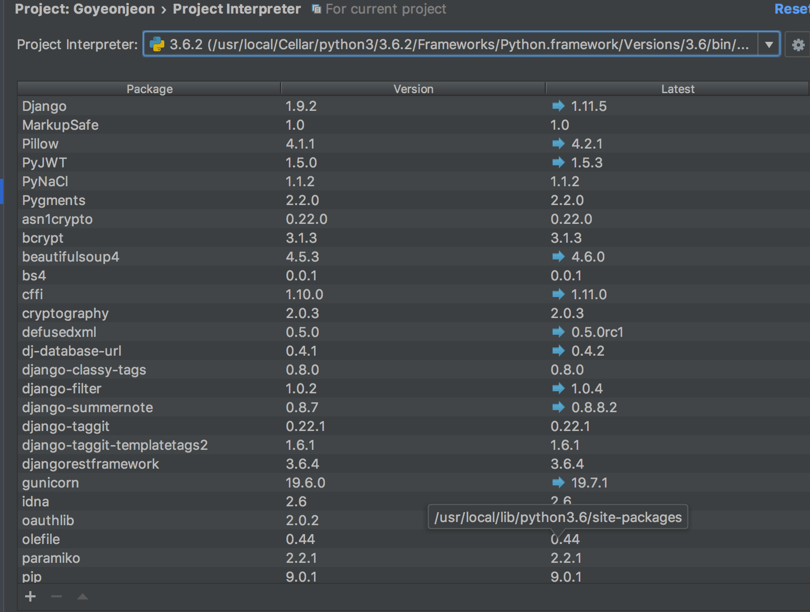
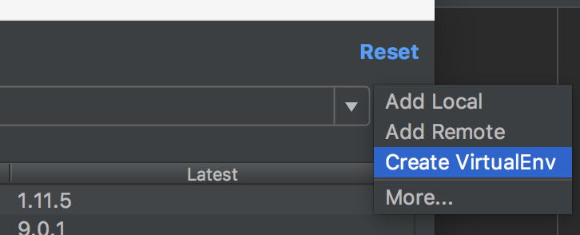
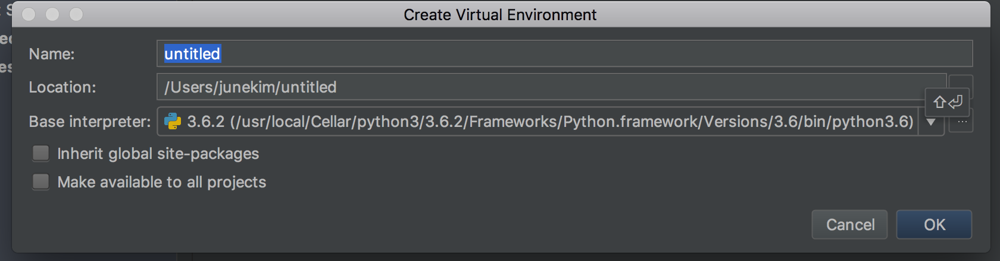
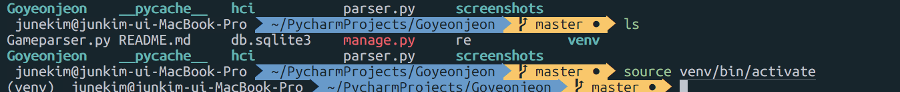

Django를 시작하는 초심자들 대부분이 [장고걸스튜토리얼](https://tutorial.djangogirls.org/ko/django_installation/)을 통해서 django를 접하게 됩니다.
쉽고, 빠르게 하나의 홈페이지를 빌드 할 수 있는 튜토리얼이고, 꾸준히 업데이트도 되는 만큼 장고 입문에 최선이죠 :)

장고걸스 튜토리얼을 보다보면, Django 설치 항목에 가자마자 *가상환경* 이라는 개념을 마주하게됩니다.
virtual environment, 줄여서 venv라고 자주 쓰는 이건 도대체 뭘까요?

## 가상환경 Virtual environment

일단, Django는 *Python* 이라는 프로그래밍 언어를 기반으로 만들어진 웹 프레임워크입니다.
Python은 일반적으로 `pip` 이라는 패키지 관리자를 가장 많이 사용합니다.
패키지라고도 하고, 의존성(dependency)라고도 해요.
`pip`을 사용해서 파이썬 패키지를 받으면, 누군가 작성해놓은 파이썬 코드를 사용해서 더 빠르게 원하는 목적을 달성할 수 있습니다.

예를 들어
```bash
pip3 install bs4
# 혹은 pip install bs4
```
이라는 명령어로, beautifulsoup 이라는 파이썬 크롤링 패키지를 받아,
웹사이트에서 정보를 쉽게 크롤링하는 코드를 짤 수 있습니다.

이렇게 패키지를 받다보면, 내 컴퓨터에 있는 python에는 bs4 를 비롯해 패키지가 하나, 둘 늘어나게 됩니다.

### 글로벌 환경에 package를 깔면서 생기는 문제

문제는 이제 python 과 관련된 프로젝트를 만들어 사용하면, 패키지가 이렇게 많이 깔린 상태로 사용하게 됩니다.
어떤 패키지는 이 프로젝트에는 필요가 없는데 말이죠!
제가 크롤링을 할 필요가 없는데 이 프로젝트에 굳이 `bs4`이 깔려있을 필요는 없으니까요.

보통, 파이썬 프로젝트를 깃헙에 올릴 때는
```bash
pip3 freeze > requirements.txt
# 혹은 pip freeze > requirements.txt
```
의 코드를 통해 `이 프로젝트를 구동시키기 위한 파이썬 패키지 목록들` 을 뽑아내어 올리곤 합니다.

```bash
# requirements 설치는 이렇게 해요.
pip3 install -r requirements.txt
# 혹은 pip install -r requirements.txt
```

이때, 글로벌 환경에서 requirements를 뽑아내면,
내가 올린 프로젝트에는 필요도 없는 패키지까지 목록에 들어가게 됩니다.

그러니 프로젝트에 특화된 패키지들만 뽑아야하겠죠.

### 그래서 등장한 가상환경

virtual environment는 이런 문제점을 해결해주는 역할을 합니다.
전체 컴퓨터의 환경과는 분리되는, 독자적인 python 환경을 만들어주죠.
처음 가상환경을 만들면, 가상환경 내부의 python은 global과 같은 python 인터프리터를 쓰고, package들은 없는 상태입니다.

아무리 내가 전체 컴퓨터에 `bs4`를 깔았어도 virtual environment 안에서는 깔리지 않습니다.
(물론 가상환경 내부에서 다시 깔면 쓸 수 있죠)

{: style="width:80%; display: block; margin:60px auto 0;"}*[덕지덕지 붙어있는 package들]*{: style="display:block;margin-top:10px;color:#828282;font-style:normal;text-align:center"}


### 그래서 어떻게 쓰는데?

terminal을 켜고 cd 명령어로 가상환경을 설정하고자하는 디렉토리로 들어갑니다.
그리고 다음과 같이 입력합니다.
```bash
python3 -m venv <가상환경이름>
# 예 : python3 -m venv junevenv
# 가상환경이름은 짧은 게 좋아요
```

이제 가상환경이 생겼습니다!

가상환경을 활성화시켜볼까요.
가상환경을 활성화 시킬 때는 가상환경에 설치된 패키지가,
비활성화 되어있는 경우는 글로벌 파이썬 패키지가 적용이 되겠지요.

```bash
. <가상환경이름>/bin/activate
# 혹은 source <가상환경이름>/bin/activate
# 꺽쇠 (<>)는 빼고 입력한다
```

그러면 터미널 맨 앞에 (가상환경이름) 이라고 뜨면서, 가상환경임을 알게 해줍니다.

> 가상환경에서는 python3 버전이라고 해서 python3 을 꼭 안붙여도 됩니다.
> 알아서 잘 참조하기때문에 python 명령어로도 같은 효과를 낼 수 있어요.

이제 가상환경 내에서 `pip` 커맨드로 원하는 걸 설치해보세요.


### Pycharm에서 가상환경 설치하기

Pycharm은 Jetbrains 라는 회사에서 만든 강력한 python ide 입니다.
python을 편하게 코딩하기 위한 많은 기능들이 구축되어있다는 뜻이죠.
그래서 굳이 CLI(Command Line Interface)로 할 필요 없이 클릭 몇번으로 가상환경을 설정할 수 있어요.
*OS X 기준입니다.*
1. 최상단 왼쪽의 Pycharm을 클릭한다.
2. Preference - Project Interpreter를 클릭한다.
3. {: style="width:80%; display: block; margin:60px auto 0;"}*[가상환경을 만들자]*{: style="display:block;margin-top:10px;color:#828282;font-style:normal;text-align:center"}
4. {: style="width:80%; display: block; margin:60px auto 0;"}*[가상환경의 이름을 정해주고, 현재 프로젝트로 디렉토리를 바꿔주세요.]*{: style="display:block;margin-top:10px;color:#828282;font-style:normal;text-align:center"}
5. 이제 apply를 눌러 적용해주세요. 이제 이 가상환경 설정으로 pycharm 프로젝트가 진행될거에요.
{: style="width:80%; display: block; margin:60px auto 0;"}*[디렉토리로 가서 가상환경을 활성화 시킬수도 있습니다.]*{: style="display:block;margin-top:10px;color:#828282;font-style:normal;text-align:center"}
