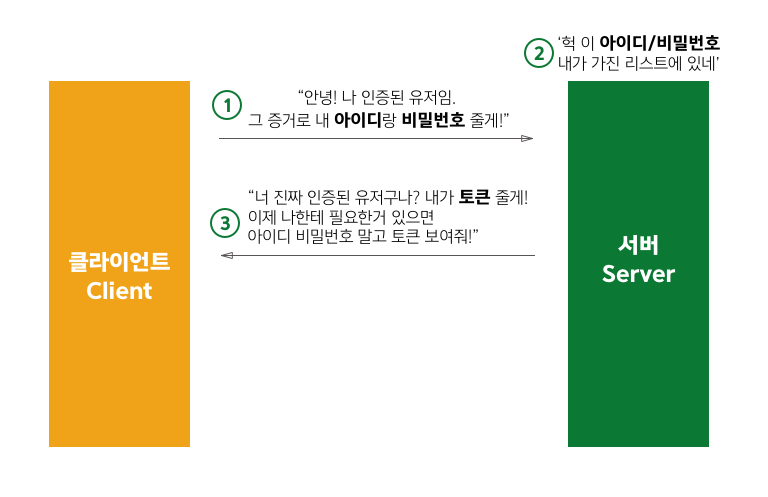

## 문제상황

Django로 인증시스템 구축을 테스트 중입니다.

내부 시스템이기때문에 회원가입 과정은 생략하고 로그인만 구현하면 됩니다.

이 과정에서 github 토큰과, email이 주어졌을 때 이 유저가 우리 시스템에 등록된 사람인지 판단하고

맞을 경우 (github 토큰이 아닌) `내 토큰`을 발행할 일이 생겼습니다.


## 그런데 토큰이 뭐야?

구글에 토큰을 쳐보면 다양한 [정의](http://www.terms.co.kr/token.htm)가 있습니다.  

여기서는 간단하게 말해봅니다.

인증된 토큰은 그 자체로 '하이 나는 이 시스템이 인정한 안전한 유저이고 이런 권한이 있음' 이라는 뜻입니다.

토큰이 있으면, 서버에 저장된 여러 정보를 달라고 수 있습니다.

그러니까 토큰을 아무에게나 주지는 않습니다. 서버에서는 클라이언트에게 로그인을 하고 네가 진짜 인증된 유저라면 줄거라고 합니다.

{: style="width:80%; display: block; margin:60px auto 0;"}*[클라이언트와 서버의 대화]*{: style="display:block;margin-top:10px;color:#828282;font-style:normal;text-align:center"}

토큰을 받게 되면, 다음부터는 매번 아이디와 비밀번호를 입력할 필요없이 `토큰이 유효한(valid) 상태인 한` 편리하게 서버에 요청을 할 수 있게 됩니다.

토큰이 유효하지 않은(invalid) 경우는 아래 경우가 있습니다.

1. 토큰이 내가 발행한 게 아닌 경우(incorrect)
2. 토큰이 만료된 경우 (expired)


서버는 토큰을 발행하고, 클라이언트가 토큰을 제출했을 때 토큰을 까서(decode) 유효성을 검사합니다.


## 그래서 뭐가 좋은데?

Velopert님의 [토큰 기반 인증에 대한 소개](https://velopert.com/2350) 글을 보면 토큰 기반 인증 시스템의 장점이 나와 있습니다.

간단하게 정리해보면

* 유저의 인증 정보를 서버나 세션에 담아두지 않는다
* 그래서 확장성이 좋다! (만약 서버나 세션에 인증정보가 저장된다면, 해당 서버에만 인증이 가도록 해야함)
* 선택적으로 권한을 부여하여 발급할 수 있다 (토큰에 유저가 할 수 있는 기능을 지정할 수 있음)
* 여러 플랫폼 / 도메인에서 사용할 수 있다 (Web, iOS, 안드로이드 ...)

## JWT 를 사용해보자

JWT는 Json Web Token의 줄임말로, 위에서 열심히 설명한 토큰의 실제적인 구현체입니다.

읽을 때는 JOT...으로 읽는다고 합니다만, 저는 제이더블유티라고 읽고 있습니다.

[jwt.io](https://jwt.io/) 에 있는 다음 그림을 보면 왜 `json` web token이라고 이름이 붙었는지 알 수 있습니다.

{: style="width:80%; display: block; margin:60px auto 0;"}*[json을 암호화한 너 jwt]*{: style="display:block;margin-top:10px;color:#828282;font-style:normal;text-align:center"}


위의 그림처럼, jwt는 `Header.Payload.Signature`가 암호화 되는 구조입니다.

### Header
헤더에는 다음 두개가 포함됩니다.

* Signature를 만들 때 어떤 해싱 알고리즘을 쓸 건지
* 이 토큰은 뭔지 (여기서는 무조건 jwt)

해싱 알고리즘은 임의의 문자열을 같은 길이로 매핑해주는 알고리즘입니다.
data가 조금만 달라져도 결과값은 완전히 다른 값이 나오도록 합니다.

이중 하나가 jwt에서 쓰는 HS256인데요,

HS256은 HMAC(Hash-based Message Authentication Code) + SHA(Secure Hash Algorithm)-256)
를 뜻합니다.

예시로 보지요.
헤더에는 다음과 같이 정보가 들어갑니다.

```json
{
  "alg": "HS256",
  "typ": "JWT"
}
```

### Payload

Payload에는 `Claim`이라고 불리는 데이터들이 포함됩니다.

아래와 같이 ClaimName과 ClaimValue가 짝을 이루어 하나의 Claim(데이터)을 이루고,
이게 모여서 ClaimSet이라고 부르죠.
```json
{
   "<ClaimName>" : "<ClaimValue>"  
}
```

ClaimName 은 정해진 것도 있고, 개발자가 임의로 정할 수도 있습니다.

미리 정해져있는 ClaimName 목록은 [링크](https://www.iana.org/assignments/jwt/jwt.xhtml) 에서 확인할 수 있습니다.

만약 만료시간(exp) 과 유저의 이메일을 토큰에 담고 싶다면, payload의 json 형태는 다음과 같이 되겠죠.

```json
{
  "exp" : "16562652",
  "email": "junee613@gmail.com"
}
```

여기서 `exp`는 정해진 ClaimName이고, email은 제가 임의로 지정한 ClaimName입니다.

### Signature

Signature는 앞서 쓴 Header, Payload, 비밀키인 secret, Header에서 지정한 해싱알고리즘을 사용해서
진짜 '서버가 발행한 토큰인지 검증(verify)' 하는데 사용하는 서명입니다.

Signature는

`<Header를Base64url로암호화한값> + "." + <Payload를Base64url로암호화한값> , <secret>`

을 Header에서 지정한 알고리즘에 넣어서 만듭니다.

서버는 Header와 Payload, secret을 가지고 뚝딱뚝딱 토큰을 만든 다음 client에 넘겨줍니다.

그리고 어떤 client가 토큰을 제출했을 때, 제출된 토큰의 header, payload, 그리고 서버가 가지고 있던 secret으로 signature를 만들어봅니다. 그리고 이 값을 토큰의 signature 부분과 비교하여 서버가 만든 토큰이 맞는지 확인하는거죠.


### PyJWT 사용하기

위에 나온 jwt의 세 부분을 직접 만들 필요는 없습니다. 파이썬 유저라면, [pyjwt](https://github.com/jpadilla/pyjwt)으로 쉽고 간편하게 jwt를 만들고 검증할 수 있어요.

pyjwt를 사용하기 위해서 먼저 `pip install PyJWT`으로 pyjwt을 설치합니다.

그리고 jwt를 임포트합니다.

```python
import jwt
```

그리고 이제 token을 만드는 함수를 정의해봅니다.

위에서 설정한 문제 상황처럼, github_token과 email이 주어졌을 때 새로운 토큰을 만드는 함수를 다음과 같이 작성해보았습니다.

```python
import jwt
import datetime

SECRET_PRE = <내가설정한비밀키값>

def create_token(github_token, email):

    encoded = jwt.encode({'exp': datetime.datetime.utcnow() + datetime.timedelta(seconds=300)
    , 'email': email}, SECRET_PRE+github_token, algorithm='HS256')
    return encoded
```

jwt.encode 함수의 첫번째 인자는 payload입니다.

앞서 말했던 것처럼 원하는 데이터를 넣으면 됩니다.

저는 만료시간을 토큰을 만드는 시점으로부터 5분(300초) 뒤로 설정했습니다.
더 늘리고 싶다면 seconds= 이후의 값을 조절해주면 되겠습니다.

두번째 인자는 secret인데요.

저는 secret이 github_token마다 달라지기를 원해서,
SECRET_PRE라는 값을 github_token과 합쳐서 secret로 설정했습니다.

세번째 인자는 어떤 해싱 알고리즘을 쓸 것인가.

저는 무난하게 HS256을 썼습니다.

jwt.encode 함수는 결과값으로 jwt 토큰, 즉 암호화된 `Header.Payload.Signature` 형태의 string을 반환합니다.


#### 토큰 검증하기

위에서 만든 토큰을 다시 받아서 검증하는 함수를 정의해봅시다.

제 SECRET값에는 github_token이 있었으니까, github_token도 같이 받아줍니다.

```python
import jwt

SECRET_PRE = "내가설정한비밀키값"

def validate_token(token, github_token):
    try:
        jwt.decode(token, SECRET_PRE+github_token, algorithms='HS256')
    except jwt.ExpiredSignatureError:
        return status.HTTP_401_UNAUTHORIZED
    except jwt.InvalidTokenError:
        return status.HTTP_401_UNAUTHORIZED
    else:
        return True
```


client가 제출한 token을 decode합니다.

jwt.decode(제출된토큰, SECRET, 해싱알고리즘) 함수를 실행해봅니다.

이때 에러가 발생할 수 있는데, 하나는 `ExpiredSignatureError`, 또 하나는 `InvalidTokenError` 입니다.

InvalidTokenError는 이름에서도 알 수 있듯이 유효하지 않은 토큰이라는 뜻이어서,

유효시간이 지났는지, signature가 맞지 않는지에 상관없이 유효하지 않은 토큰인 경우 모두 잡아냅니다.

그래서 유효시간이 지난 토큰 에러인 'ExpiredSignatureError' 를 먼저 잡습니다.

##  -

이렇게 하면 간단하게 jwt 개념을 알아보고 pyjwt으로 구현까지 할 수 있습니다.

남은 건 서버 엔드포인트에 요청해서 jwt값이 제대로 오는지 확인하는 것만 남았네요.

하나 참고할 것은, client에서 현재 가지고 있는 토큰이 만료되었는지 확인할 때는 secret이 필요하지 않습니다.

exp 값은 그냥 decode하는 것만으로도 알 수 있기 때문입니다. 이점 참고하셔서 삽질하지않도록 합시다. ㅠ_ㅠ

글에서 부드럽지 않은 부분은 차후 다듬도록 하겠습니다.
