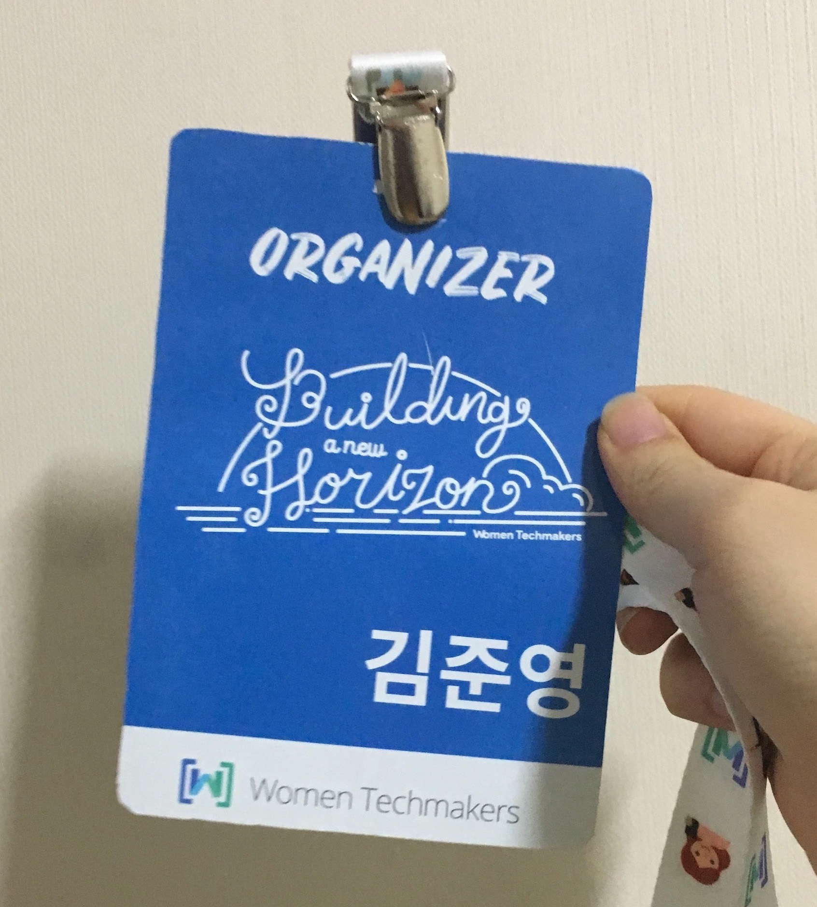

바로 어제, 2018년 4월 7일 숙명여대 명신관 5층에서 Women techmakers Korea 2018 행사가 열렸습니다.

행사 준비하면서 수도 없이 읽은 Women techmakers 행사지만, 한마디로 정의 내리기는 쉽지 않네요.

> techmaker 로서 살고 있고 살게 될 많은 여성분들의 개개의 삶과 고충을 나누고, 공감하고 공감 받는 행사.

개인적으로는 이 행사 하나로 지난 1년을 버텼습니다.

그래서 운영진으로 참여할 수 있었던 기회가 더욱 감사했습니다.

이번 WTM는 메인 투 세션, 거기에 라이트닝토크와 OST까지.. 12시 반부터 6시 반까지 풀타임을 안 뛸 수가 없는 세션 구성이었습니다.

GO WILD, THINK HARD, SPEAK LOUD 로 이루어진 세 세션 중에 저는 THINK HARD를 맡아 진행했습니다.

행복한 기억이 날아가기 전, 패널 토크를 제외한 세션들을 가장 가까이에서 들은 후기를 간략하게 적어보려고 합니다.

(WTM 세션들이 곧 영상으로 제작되어 올라올 예정으로, 꼭 직접 들어보시라는 의미에서 완전 간단하게 ㅎ,ㅎ)

## Women in STEM, 맴돌기/들어가기/살아남기 : 이진주 걸스로봇 대표

THINK HARD의 처음을 연 발표입니다.

STEM 여성으로서 왜 STEM을 떠날 수 밖에 없었고, 그래서 왜 계속 맴돌았는지의 경험을 깊게 공유해주셨습니다.

STEM 여성은, 사회 전반적으로 짙게 깔려있는 성역할에 대한 편견과 함께 공부를 시작하게 되고

학문을 하는 내내 그 편견에 맞닥뜨리게 됩니다. 결코 쉽지는 않은 일이죠.

그 차별과 편견을 커뮤니티 차원에서 개선하기 위해 걸스로봇이 한 일, 하고 있는 일,

그리고 앞으로 할 일을 공유해주셨습니다. 너무 많아서 여기에 적기도 어렵네요.

THINK HARD의 처음으로서 적절한 발표였습니다.

더불어 이진주 대표님은 계속해서 세션에 남아 모든 연사자분들의 발표를 공감하며 듣는 모습을 보여주셨습니다 =)

## 대학 내의 Women In Tech : 고희경님

문과에서 컴퓨터학과 복수전공을 하면서, 가고자 하는 길에서 존재를 증명하려 고군분투한 이야기를 담아 주셨습니다.

컴퓨터학과를 비롯한 공대의 참담한 교원 성비 (거의 0:1)에서 롤 모델을 찾을 수 없었고, 그래서 직접 실리콘밸리로 롤모델을 찾아 떠나고.

혼자만 롤모델을 갖고 성장하는 게 아니라 네트워크를 통해 연대하고 `다같이 성장할` 방법을 찾아오신 고희경님의 발표를 들으며

너무 감사했습니다. 여기에 발표 한 꼭지를 공유합니다.

> 외부적 요인으로 자신감이 떨어지고, 내 자신의 능력을 의심하게 되고, 다 포기하고싶을때마다
> 나보다 훨씬 똑똑하고 잘난 여성 선배들조차도 얼마나 힘들었고,
> 엄청나게 훌륭한 성과를 내고도 포기했는지를 상기했다.
> 내 탓이 아닌 구조적인 문제임을 인식하고 그럼에도 버텨서 살아남아 업계에 여성의 숫자를 늘리고 더 나은 문화를 만들고싶다.

## 당신의 롤 모델은 누구입니까? : 고보형님

롤모델 없이 살던 개발자 0~2년차, 개발자로 입사했지만 개발을 가르쳐주는 사람은 없었다.

개발할 수 있는 회사로 이직하고 했지만 현실은 답없는 야근.

그때 발견한 롤모델로부터 프로처럼 감정을 배제하고 일하며, 상황을 이용하는 태도를 배웠다고 하셨습니다.

또 다시 찾아온 벽에 다시 나타난 롤모델, 그래서 결정한 아키텍쳐라는 방향성을 가지고 걸어온 개발자로서의 길을 말해주셨습니다.

재치있는 짤방과 함께, 벽을 만난 개발자들이 상황을 변화시킬 수 있는 힌트가 있었던 발표였습니다.

`롤 모델을 정하면, 이 길을 걸어갈 확신과 용기가 생깁니다.`

## 커리어에 데이터 사이언스 더하기 : 박조은님

작년에 발표해주셨던 조은님께서 또 다시 소중한 경험을 공유해주셨습니다.

초등학생 아이와 함께하는 삶, 경력단절 속에서도 틈틈히 데이터 사이언스를 유튜브를 통해 공부하고,

다시 그 배움을 유튜브에 공유하면서 본인도 성장하고 커리어적으로도 성장하는 과정을 보여주셨습니다.

환경속에서 어떻게 배움을 놓지 않았는지 정말 성실하고 꼼꼼하게, 흐름있게 보여주셔서

좀더 열정을 불타게 만들었던 발표였습니다. 발표 전반에 들어간 데이터 사이언스 영업(?) 도 너무 좋았습니다.

곧 여성들을 위한 데이터 사이언스 교육을 시작하신다고 하네요!

`벽보고 얘기한다는 느낌으로 시작했지만, 지금까지 했던 공부방법 중에 가장 동기부여가 되는 방법이었어요.`

## 그것이 알고 싶다 어쩌다 10년: 손연미님, 백서영님

지그재그의 개발자 분들이 10년차 개발자로서 걸어온 길, 그리고 그에 대한 질문을 답하는 형식으로 발표해주셨습니다.

`스타트업 어때요?`

`여성 개발자로 힘든 점은 없었나요?`

`기술을 어떻게 배워나가셨는지`

`설계리뷰, 코드리뷰, 페어프로그래밍 해보셨나요?`

등의 질문에 답하면서 차분하고 담담하게 경험을 공유해주셨습니다.

주니어 개발자들에게는 앞으로의 여정을 보여주는 발표였고,

현실적인 조언과 함께 도전하라! 라는 말을 남겨주셨습니다.

## [라이트닝토크] 여성단체 왜 하냐고요? : 이미희님

제가 너무 사랑하는 Django girls Seoul의 라이트닝 토크가 있었습니다.

미희님께서 왜 장고걸스서울 커뮤니티를 시작해왔고, 장고걸스가 어떻게 나아가고 있는지. 어떤 일들을 하려고 하는 지. 라는 이야기를 전달해주셨습니다.

그리고 이 모든 것을 돌아보니 `연대의 힘`이 있었고, 또다른 우리가 생겼으면 한다는 말로 발표를 마쳐주셨습니다.

개인적으로 너무 애정합니다. 장고걸스서울 포렙..🙊

## 가까이에서 행사를 마치며

운영진으로서 첫 행사였습니다.

행사 준비 과정에서 힘든 점도 있었고, 걱정도 많았습니다만

행사 어땠냐, 내년에도 또 하면 좋겠냐고 묻는 질문에 크게 그렇다고 대답해주시는 참가자분들을 보며,

또 세션 진행을 했을 뿐인 저에게도 감사를 전해주시는 참가자들을 보며 많이 뭉클했습니다.

내년에는 어떤 모습으로 행사에 오게 될지 모르지만, 너무 행복했습니다.

(올라올 영상도 많이 봐주세요,,)

{: style="width:80%; display: block; margin:60px auto 0;"}*[Women techmaker 2018!]*{: style="display:block;margin-top:10px;color:#828282;font-style:normal;text-align:center"}
