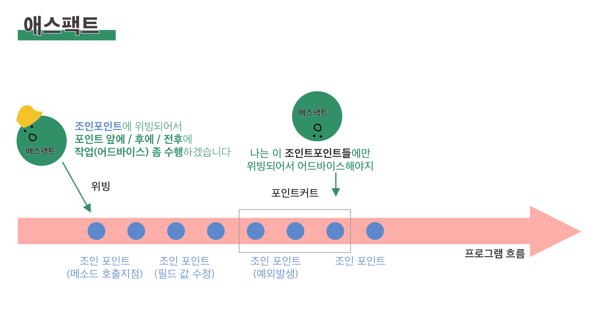

## 애스팩트 지향 스프링
소프트웨어 시스템의 기능이 애플리케이션의 여러 곳에 적용되어야하는 경우, 적용 부분마다 이 기능을 호출하는 일은 그다지 바람직하지 않다.

로깅, 보안 트랙잭션 관리 같은 기능은 대부분의 애플리케이션에서 공통적으로 나타나지만 그렇다고 해서 해당 애플리케이션 객체들이 적극적으로 처리해야할 기능은 아니다.

이런 기능을 가리켜 **횡단 관심사(cross-cutting concerns)** 라고 한다.

AOP의 목적은 횡단 관심사와 이에 영향받는 객체의 결합도를 낮추는 데 있다.

### AOP

공통 기능을 재사용하기 위해 일반적으로 사용하는 객체 지향 방법은 상속(inheritance)이나 위임(delegation) 이다.

그러나 상속은 객체의 정적 구조에 의존하므로 복잡하고 깨지기 쉬우며,
위임은 대상 객체의 복잡한 호출로 인해 번거롭다.

애스팩트는 상속보다 위임보다 더 깔끔한 해결책을 제공한다.
AOP도 동일하게 공통 기능을 한 곳에 정의하지만,

1. 어디에 어떻게 적용할지를 선언적으로 정의할 수 있고
2. 대상 클래스를 전혀 수정하지 않아도 된다 , 즉 코드가 깔끔해진다.

는 것이 큰 장점이다.


AOP의 다양한 용어들을 앞서 정의했으나,
다시 한번 깔끔하게 정의해보도록한다.

{: style="width:80%; display: block; margin:60px auto 0;"}*[애스팩트는 일할 곳을 찾는 일꾼들]*{: style="display:block;margin-top:10px;color:#828282;font-style:normal;text-align:center"}


1. 어드바이스 : 애스팩트가 해야하는 기능.

	애스팩트가 언제 무엇을 할지를 동시에 정의한다.

	1) `before` :  대상 메소드 이전에 수행한다.

	2) `after`: 결과에 상관없이 대상메소드 완료 이후 수행한다.

	3) `after-returning`: 결과가 성공했을 경우 대상 메소드 이후에 실행한다.

	4) `after-throwing`: 결과가 예외를 던졌을 경우 대상 메소드 이후에 실행한다.

	5) `around`: 대상 메소드 전후에 몇가지 기능을 제공한다.


2. 조인 포인트

	**어드바이스가 적용되는 지점.**

	메소드 호출 지점이나, 예외 발생, 필드값 수정 등이 있다.

3. 포인트커트

	애스팩트가 어드바이스할 조인 포인트의 영역을 좁힘

	어드바이스가 적용(위빙) 되어야하는 하나 이상의 조인 포인트를 정의

4. 애스펙트

	어드바이스와 포인트 커트를 합친 것

	**언제 어디서 무얼 할지 알고 있는 것**

5. 인트로덕션

	기존 클래스 코드 변경 없이도 새 메소드나 멤버 변수를 추가하는 기능

6. 위빙

	타깃 객체에 애스펙트를 적용해서 새로운 프록시 객체를 생성하는 절차

	컴파일 시간 / 클래스 로드 시간 / 실행 시간 중 에 수행됨.

### 스프링에서의 AOP

스프링은 다음 네가지 방법으로  AOP를 지원한다.

1. classic 스프링 프록시 기반 AOP

	스프링이 더 좋은 방법들을 제공한다

	너무 무겁고 복잡하다

2. Pure-POJO 애스펙트

	AOP 네임스페이스로 POJO에서 애스팩트로 변경할 수 있다

	xml 설정이 필요하지만 객체에서 애스팩트로 변경하기 위한 명확한 방법

3. `@AspectJ` 어노테이션 기반 애스펙트

	xml 설정이 필요없다

4. AspectJ 애스펙트에 빈 주입


AspectJ는 xml 에 정의할 필요가 없고, AOP를 좀더 세밀하게 제어할 수 있게된다는 장점이 있으나 새로운 도구와 문법을 배워야한다.

스프링에서는 빈을 감싸는 프록시를 생성하여 대상 객체인 것 처럼 위장한다.
그런 다음 호출을 가로챈 후 애스팩트 로직을 수행하고 나서야 타깃 메소드를 호출한다.

스프링은 메소드 조인 포인트만 지원한다.

### 포인트커트로 조인 포인트 선택하기

스프링 AOP에서는 AspectJ의 포인트커트 표현식 언어를 이용하여 정의된다.
일단 애스펙트를 나타내기 위해서 애스팩트 포인트커트의 대상을 아래와 같이 정의하자.

```java
package concert;

public interface Performance {
  public void perform();
}
```

아래는 perfom 메소드가 실행 될때마다 어드바이스를 하기위해 사용될 수있는 포인트 커트 표현식을 나타낸다.

```bash
execution(* concert.Perfomance.perform(...))
```

execution을 이용하여 Performance의 perform() 메소드를 사용한다.
`*`는 메소드가 반환하는 타입이 무엇이든 상관없음을 나타낸다.
메소드 파라미터의 ..는 인자 목록이 무엇이든 간에 perform을 선택한다는 뜻이다.

```bash
execution(* concert.Performance.perform()) and bean('woodstock')
```

이는 perform 메소드에 애스펙트 어드바이스를 적용하되, id가 `woodstock` 인 것으로 제한한다.

### 애스팩트 정의하기

AspectJ 5 이전에는 AspectJ 로 애스펙트를 작성해야했으나, 이후에는 어노테이션과 기존의 Java 코드로도 애스팩트를 작성할 수 있게 되었다.
다음 코드를 보자.

```java
package concert;
import org.aspectj.lang.annotation.AfterReturning;
import org.aspectj.lang.annotation.AfterThrowing;
import org.aspectj.lang.annotation.Aspect;
import org.aspectj.lang.annotation.Before;

@Aspect
public class Audience {

  @Before("execution(** concert.Performance.perform(..))")
  public void silenceCellPhones() {
    System.out.println("Silencing cell phones");
  }

  @Before("execution(** concert.Performance.perform(..))")
  public void takeSeats() {
    System.out.println("Taking seats");
  }

  @AfterReturning("execution(** concert.Performance.perform(..))")
   public void applause() {
    System.out.println("CLAP CLAP CLAP!!!");
  }

  @AfterThrowing("execution(** concert.Performance.perform(..))")
   public void demandRefund() {
    System.out.println("Demanding a refund");
  }

}
```

위 애스팩트는 perform() 전에는 휴대폰끄기와 자리에 앉기를,
성공적으로 끝난 경우 박수를, 예외가 나온 경우는 환불을 요구하는 함수를 나타낸다.

이 클래스에는 우선 `@Aspect` 라는 어노테이션이 붙어있다.
이는 Audience가 더 이상 POJO가 아니라 애스팩트 임을 나타낸다.

`@Before @AfterReturning @After @AfterThrowing @Around` 등의 어노테이션이 붙은 메소드로 어드바이스를 정의한다.

위에서는 네개의 어드바이스에 같은 포인트 커트가 적용되어있다.

`@PointCut` 어노테이션을 사용하면 포인트 커트를 재사용할 수 있다.

```java
@Aspect
public class Audience {

  @Pointcut("execution(** concert.Performance.perform(..))")
  public void performance() {}

  @Before("performance()")
  public void silenceCellPhones() {
    System.out.println("Silencing cell phones");
  }

  // 생략
}
```

위와 같이 `@Aspect / @PointCut / @Before` 어노테이션을 사용한다고 해도,
어노테이션을 해석하고 프록시를 만들어줄 무언가가 없이는 애스팩트로 여겨지지 않는다.

다음과 같이 JavaConfig를 사용해서 오토프로싱을 활성화하자.

```java
package concert;

import org.springframework.context.annotation.Bean;
import org.springframework.context.annotation.ComponentScan;
import org.springframework.context.annotation.Configuration;
import org.springframework.context.annotation.EnableAspectJAutoProxy;

@Configuration
@EnableAspectJAutoProxy
@ComponentScan
public class ConcertConfig {

  @Bean
  public Audience audience() {
    return new Audience();
  }

}
```

#### around 어드바이스 정의하기

```java
package concert;
import org.aspectj.lang.ProceedingJoinPoint;
import org.aspectj.lang.annotation.Around;
import org.aspectj.lang.annotation.Aspect;
import org.aspectj.lang.annotation.Pointcut;

@Aspect
public class Audience {

  @Pointcut("execution(** concert.Performance.perform(..))")
  public void performance() {}

  @Around("performance()")
  public void watchPerformance(ProceedingJoinPoint jp) {
    try {
      System.out.println("Silencing cell phones");
      System.out.println("Taking seats");
      jp.proceed();
      System.out.println("CLAP CLAP CLAP!!!");
    } catch (Throwable e) {
      System.out.println("Demanding a refund");
    }

  }

}
```

여기서 주목할 점은 파라미터로 `ProceedingJoinPoint` 를 받는다는 사실이다.
이 객체는 어드바이스 내에서 대상 메소드를 호출하게 해준다.
어드바이스가 먼저 하고자 하는 작업을 모두하고 나서,
메소드 수행을 원하면 `proceed` 함수를 선언한다.

만약 이를 호출하지 않으면 이 메소드는 수행되지 않는다.
또한 메소드가 여러번 수행될 수도 있는데, 이로 인해 재시도 로직을 구축할 수 있다.


#### 어드바이스에서 파라미터 처리하기

애스펙트가 메소드에 전달된 파라미터를 액세스하고 사용해야하는 경우가 있을 수 있다.
다음 코드를 보자

```java
package soundsystem;
import java.util.HashMap;
import java.util.Map;
import org.aspectj.lang.annotation.Aspect;
import org.aspectj.lang.annotation.Before;
import org.aspectj.lang.annotation.Pointcut;

@Aspect
public class TrackCounter {

  private Map<Integer, Integer> trackCounts =
      new HashMap<Integer, Integer>();

  @Pointcut(
     "execution(* soundsystem.CompactDisc.playTrack(int)) " +
     "&& args(trackNumber)")
  public void trackPlayed(int trackNumber) {}

  @Before("trackPlayed(trackNumber)")
  public void countTrack(int trackNumber) {
    int currentCount = getPlayCount(trackNumber);
    trackCounts.put(trackNumber, currentCount + 1);
  }

  public int getPlayCount(int trackNumber) {
    return trackCounts.containsKey(trackNumber)
        ? trackCounts.get(trackNumber) : 0;
  }
}
```

위의 코드에서 Pointcut은 int 인자를 적용하고, `args` 를 사용해서 식별자를 넣는다.
trackNumber 는 메소드 시그니처의 파라미터와도 매칭된다.

### 인트로덕션 어노테이션

자바에서는 정의를 직접적으로 변경하지 않고는 객체나 클래스에 새로운 메소드 추가가 어렵다.

하지만 이는 애스팩트를 통해서 수행할 수 있는 작업이다.
애스팩트는 프록시를 통해 메소드를 호출한다. 이때 새로 추가된 메소드를 넣는다면 원하는 바를 달성할 수 있을 것이다.
