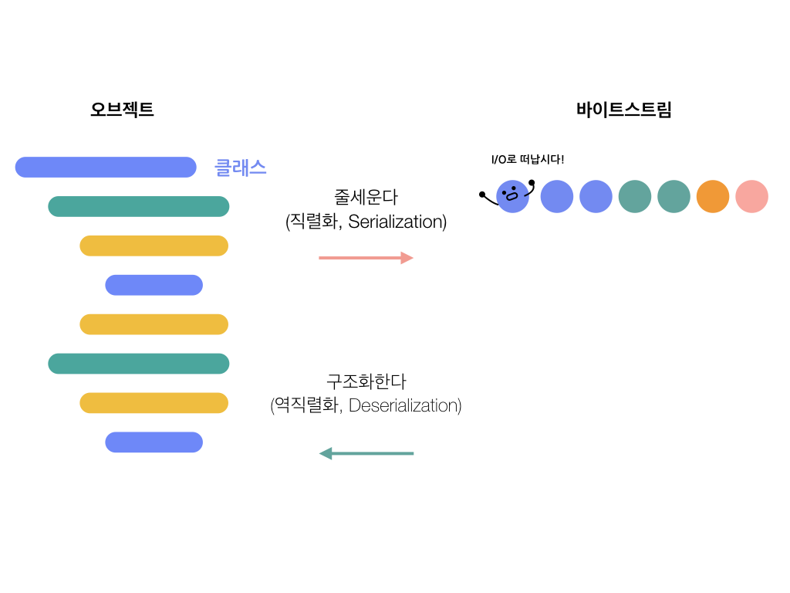

객체를 바이트 스트림으로 인코딩 하는 것을 `직렬화(Serialization)` 이라고 하고,

역으로 바이트 스트림을 객체로 디코딩 하는 것을 `역직렬화 (Deserialization)` 이라고 한다.

{: style="width:80%; display: block; margin:60px auto 0;"}*[직선으로 쭉 열을 세우니까 직렬화다!]*{: style="display:block;margin-top:10px;color:#828282;font-style:normal;text-align:center"}

> 왜 사용?

1. 원격 통신 상에서 이점을 얻기 위해서

2. 자바 직렬화는 자바 시스템에서 개발에 최적화되어 있습니다.

복잡한 데이터 구조의 클래스의 객체라도 직렬화 기본 조건만 지키면 큰 작업 없이 바로 직렬화 가능합니다.

물론 역직렬화도 마찬가지입니다.

당연하게 보이는 장점 중에 하나지만, 데이터 타입이 자동으로 맞춰지기 때문에 관련 부분을 큰 신경을 쓰지 않아도 됩니다.

그렇게 역직렬화가 되면 기존 객체처럼 바로 사용할 수 있게 됩니다.

[출처: 우아한형제들 블로그](http://woowabros.github.io/experience/2017/10/17/java-serialize.html)
