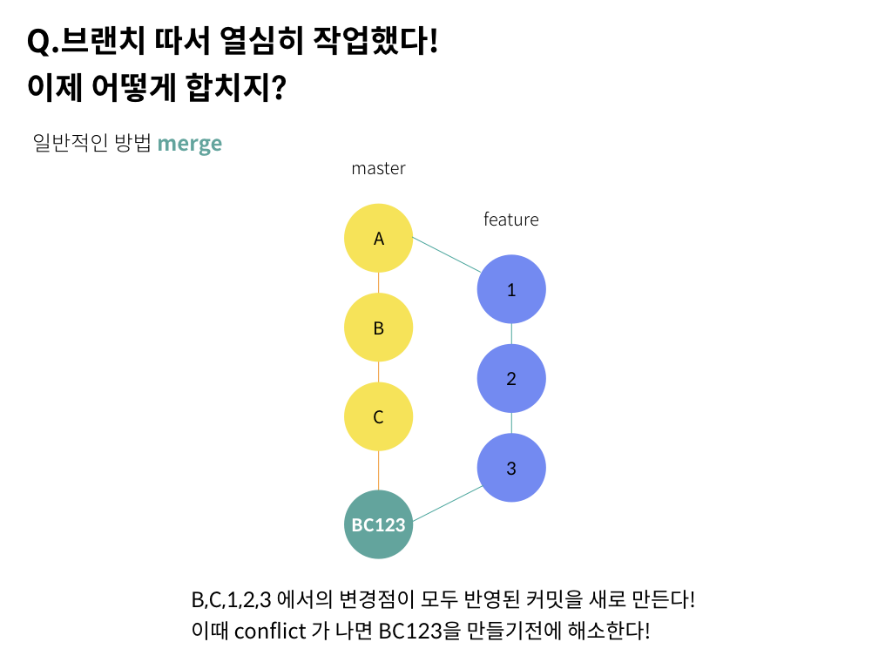
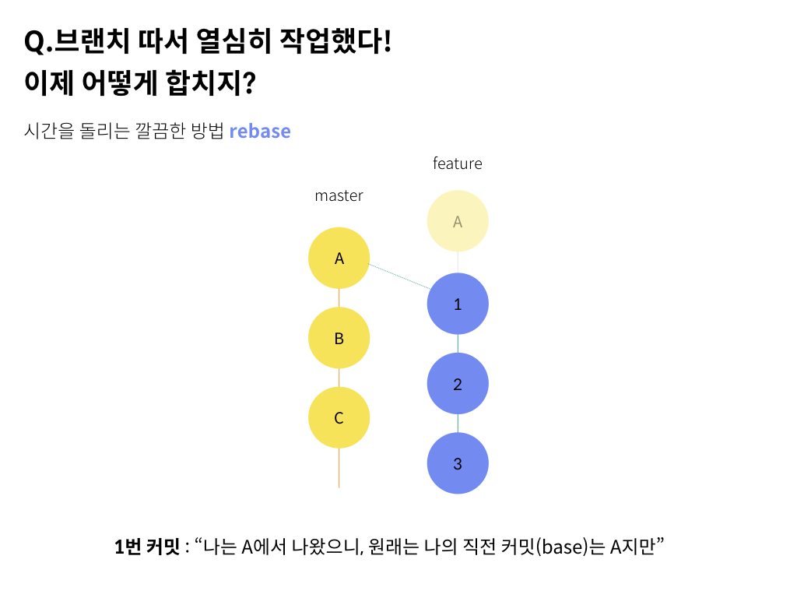
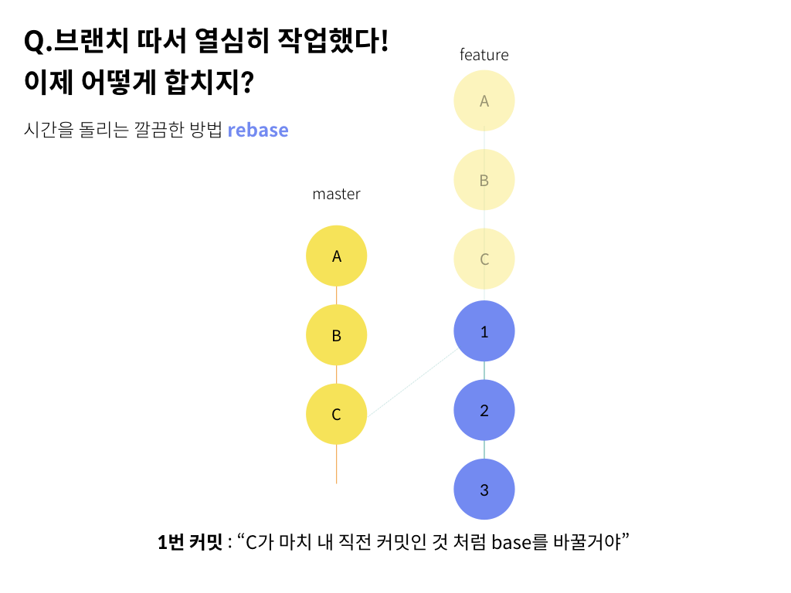
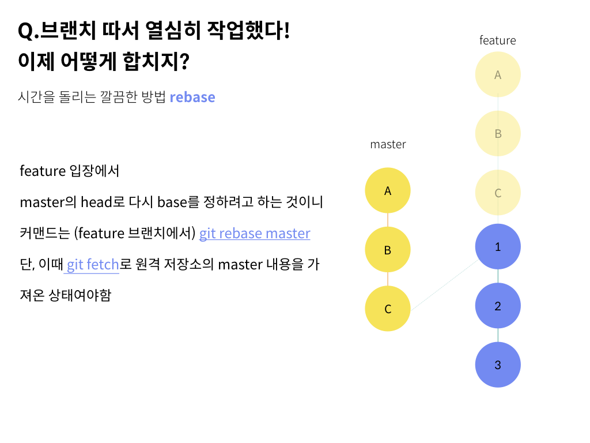

## Merge와 Rebase는 항상 헷갈려!

git에서 헷갈리는 명령어 중 Merge와 Rebase입니다.

여기서는 그 차이를 간단하게 알아봅니다.

## master 브랜치 나라에서

일반적으로 우리는 `master` 브랜치를 갖고 있습니다. 깃으로 프로젝트를 만들면 생성되는 기본 브랜치이기도 합니다.
`master` 브랜치는 아주 중요한 브랜치로서, 완벽하게 빌드가 되고 돌아가는 코드만 마스터 브랜치에서 처리합니다.


그러면 그 동안 기능 개발은 어디서 해야할까요?
바로 이럴때 브랜치 전략을 사용합니다. 브랜치 전략은 팀마다, 회사마다 다양하지만 여기서는 기능별로 브랜치를 만드는 전략을 고려해보겠습니다.

새로운 기능을 추가하기 위해서 `master` 브랜치에서 나온 `feature` 브랜치를 땄습니다.
`git checkout -b feature` 명령으로 `feature` 브랜치를 만듦과 동시에 이 브랜치로 이동(checkout) 했죠.

이 시점에서 `master`에는 커밋아이디가 `A` 인 커밋이 있었습니다.

우리는 `A`에서 이어서 개발을 시작하고 싶습니다.

## feature 브랜치 개발 중

우리는 `feature` 브랜치에 있습니다. 여기서 열심히 개발하여 각각 `1`, `2`, `3` 이라는 커밋아이디를 가진 커밋들을 줄줄히 만들어냈습니다.

그런데 그동안 `master` 브랜치도 가만히 있지는 않았습니다.

다른 사람들이 만든 기능들이 합쳐져 발전을 이뤘습니다. `B`, `C` 라는 커밋이 추가 되었네요.

이제 이걸 어떻게 합칠까요?

## Merge: 새로운 커밋을 만들어서 해결하자

Merge는 `master` 와 `feature` 브랜치의 변경사항만을 모두 반영한 커밋을 만들어 수렴시키는 방식입니다.

아래 그림을 봅시다.

{: style="width:50%; display: block; margin:60px auto 0;"}{: style="display:block;margin-top:10px;color:#828282;font-style:normal;text-align:center"}

A를 기준으로 보았을 때, 변경점인 1 2 3 B C 를 모두 반영한 커밋 `BC123` 을 만듭니다.

`feature` 브랜치로 이동(checkout) 한 상태에서

```bash
git merge master
```

하면 새로운 커밋(`BC123` 에 해당) 이 생성됩니다.

conflict가 생긴다면 해당 파일을 열어서 최종적으로 반영되어야할 모습으로 수정해주고 다시 명령어를 실행합니다.

디폴트 커밋메시지는 `Merge branch 'master' into feature` 일 것입니다.

이 상태에서 github에서 pull request를 보내면 됩니다.

## Rebase : 시간을 돌리자

위와 같이 Merge를 사용하면, 실제로 코드가 더해진 것이 아닌 부가적인 커밋이 생기게 됩니다.

더불어 그래프가 복잡해지고 나중에 커밋 로그를 확인할 때 힘들어지죠.

이때는 Rebase 를 사용할 수 있습니다.

Rebase는 말 그대로 `base`를 변경한다는 뜻입니다.

`base`는 여기서 브랜치가 갈라진 커밋이라고 생각하면 간단합니다.

같은 상황에서, 원래 `feature` 브랜치의 base는 `A` 였습니다.

여기서 `B`, `C`, `1`, `2`, `3` 를 예쁘게 반영하고자 합니다.

{: style="width:50%; display: block; margin:60px auto 0;"}{: style="display:block;margin-top:10px;color:#828282;font-style:normal;text-align:center"}

1번 커밋의 입장에서, 원래 베이스는 A입니다.

{: style="width:50%; display: block; margin:60px auto 0;"}{: style="display:block;margin-top:10px;color:#828282;font-style:normal;text-align:center"}

시간을 돌려서, C가 베이스가 되도록 바꾸려고 합니다.

이러면 깔끔하게 커밋로그가 한줄로 변경됩니다.

리베이스를 하고 나니, 마치 시간 상으로 A - B - C 다음에 1 - 2 - 3 을 커밋한 것 처럼 변경되었습니다.

{: style="width:50%; display: block; margin:60px auto 0;"}{: style="display:block;margin-top:10px;color:#828282;font-style:normal;text-align:center"}

커맨드는

```bash
git checkout feature
git rebase master
```

이 과정을 진행하고 나면 `feature` 브랜치는 깔끔하게 `A-B-C-1-2-3` 의 기록을 갖게 됩니다.

이 상태에서 github에서 pull request를 보내면, 마스터 입장에서는 **현재 헤드 다음에 커밋한 것 처럼** 보이기 때문에

feature 브랜치를 충돌없이 받아줄 수 있습니다.


## 결론

Rebase는 다음과 같은 장점이 있습니다.

1. 추가 커밋이 생기지 않는다
2. 커밋 로그가 깔끔해진다.

하지만,

> 시간 순서를 보장하지 않는다.

는 점에서 단점도 있습니다.

이런 점을 잘 고려해서 전략을 선택하셨으면 좋겠습니다.
