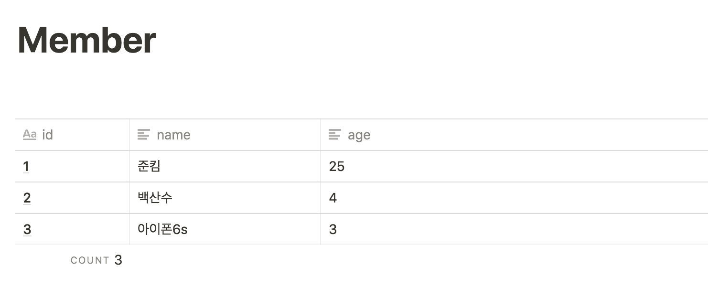

Spring을 공부하던 중에, 멘토님께서 JPA의 중요성을 강조해주셨습니다. 
Django 는 ORM 으로 간단하게 DB를 다루고 쓸 수 있었는데, Spring에서는 어떤 식으로 DB에 접근하고 데이터를 읽어오는 지 궁금해졌습니다.

설마 학교에서 하던 것 처럼 현업에서 직접 DB에 커넥션 맺고 길고 긴 코드로 가져오는 건 아닐테니 말입니다. 🤨

이 포스트에서는 JPA가 무엇인지, 왜 등장했는지와 QueryDSL 에 대한 간략한 소개를 다룹니다. 

## JPA(Java Persistent API)

관계형 데이터를 관리하는 자바 프로그래밍 인터페이스.

## 이게 무슨 말이니?

Database에 접근해서 원하는 정보를 얻어낼 수 있게 해준다는 뜻

RDB를 객체로 매핑해서 사용!


{: style="width:50%; display: block; margin:100px auto 0;"}{: style="display:block;margin-top:10px;color:#828282;font-style:normal;text-align:center"}


위와 같은 RDB를 
```java
import javax.persistence.Column;
import javax.persistence.Entity;
import javax.persistence.GeneratedValue;
import javax.persistence.GenerationType;
import javax.persistence.Id;

@Entity
public class Member {
    
    @Id
    @GeneratedValue(strategy=GenerationType.AUTO)
    private long id;
    
    @Column
    private String name;
    
    @Column
    private int age;
    
    public Member() {}
    
    public Member(String name, int age) {
        this.name = name;
        this.age = age;
    }

    // getter, setter , to String 생략
}
```
    

다음과 같은 오브젝트로 만들어서 
```java
Member m = new Member("준킴", 25");
```
처럼, 자바코드에서 DB에 기록된 정보를 자유롭게 쓸 수 있게 해준다는 뜻! 

## 이전에는 어떻게 했는데?

### JDBC

1. DB connection 을 맺는다.
2. 쿼리를 생성한다.

    String query = "select id, name, password from User where id = " + user.getId();

3. 쿼리를 실행한다.

    ResultSet rs = stmt.executeQuery(selectQuery);

4. 오브젝트에 일일히 데이터 매핑

    user.setId(rs.getInt("id");
    user.setName(rs.getString("name");

5. DB Connection을 종료한다. 

이런 방식은 SQL injection의 위험 등 보안 문제가 있다.
예를 들어 위의 user id 에 id 뿐 아니라 원하는 쿼리문을 넣으면, 해당 사용자가 원하는 정보를 빼낼 수 있다.

더불어 Connection 을 맺고 끊음에 있어서, 예외처리 관련 코드가 계속 반복적으로 많이 나오게 된다. 

### MyBatis (로 대표되는 SQL Mapper)

iBatis, MyBatis 로 대표되는 SQL Mapper 들은  `Query 와 데이터의 패러다임` 이다.

이러한 SQL 들은 별도의 XML 파일로 연결되며 파라미터와 실제 오브젝트를 연결해주는 식으로 진행된다.
```xml
<insert id="insert" parameterType="User">
    insert into User(id,name,age) values (#{id},#{name},#{age})
</insert>
```
JDBC에 비해서 

- Connection을 맺는 작업(#1), Connection Close 작업(#5)를 알아서 해줌
- 파라미터 매핑과 데이터 매핑도 위임

**하지만**

- 여전히 쿼리를 작성해야함.

다만 MyBatis 는 쿼리를 작성할 수 있다는 점때문에 복잡하게 쿼리를 날려서 로깅하는 경우 유용하다.

## 그럼 ORM → JPA는

ORM 은 Table이나 query 가 아닌 객체 중심의 사고를 해보자! 하고 등장한 존재이다.

Connection 맺기 / 끊기 위임
쿼리를 자동 생성 실행! ( Query Method) 파라미터 매핑과 데이터 매핑은 필요도 없음

모든 Domain은 변경사항이 있다.

이때 코드가 짧아 변경사항이 적고 type-safe 할 수 있도록 도와준다는 큰 장점이 있음

## 영속 / 준영속 / 비영속

말이 너무 어렵다! 

코드로 보자
```java
// 비 영속 상태 
    User user = new User("준영", 25);
  
// 영속상태
// 1차로 캐시에 저장된 상태
em.persist(User);

// 준영속상태
// 저장소에 SQL 쿼리가 적용됨.
// 캐시에서 떨어져나감(Detached)
em.getTransaction().commit();
em.close();
```

즉 `비영속상태`는 객체가 만들어지기만 하고 어디에도 저장되지 않은 상태

`영속상태` 는 `persist` 명령어를 통해서 1차로 캐시에 저장된 상태

`준영속상태` 는 `close` 시점에서 저장소에 SQL 쿼리가 반영되어, 더 이상 캐시에서 다룰수는 없는 상태 를 의미함. `Detached` 라는 말이 더욱 어울릴 듯함.

## JPA 소개
```java
@Entity
@Table(name= "User")
public class User{
    
        @Id
        @GeneratedValue
        private Long id;
    
        @column(name="name", nullable=false)
        private String name;

        @column(name="email", nullable=false)
        private String email;
}
```

- `@Entity`  : Bean객체임을 의미한다
- `@Table` : 매핑되는 테이블 이름을 지정
- `@Id` : 이 테이블의 Id임을 말함. `@GeneratedValue` 는 자동으로 생성됨
- `@Column` : 특별히 column의 속성을 지정해주고 싶거나 이름을 정하고 싶을 때 사용. 디폴트로는 멤버 변수명과 일치하는 데이터베이스의 칼럼을 매핑합니다.

### Repository Interface

Repository 인터페이스는 다음처럼 사용한다.
```java
 public interface UserRepository extends JpaRepository<User, Long>{
    // JpaRepository<사용할Class명,해당클래스의primaryKey 타입> 을 상속
    }
```

Repository 를 구현하면 다음과 같은 기본 기능들을 

- Save(T)
- Delete(Y)
- FindAll()
- FindByID()

추가 설정이나 코드 없이 바로 사용할 수 있다.

CRUD 외에 다른 코드가 필요하다면 추가하면 된다. 
```java
public interface UserRepository extends DomainEntityRepository<Long, User> {
    
        Optional<User> findById(Long Id);
    		List<User>  findByNameAndEmail(String name, String email);
}
```
    

[참고 - Spring Data JPA Reference Documentation](https://docs.spring.io/spring-data/jpa/docs/current/reference/html/#jpa.query-methods.query-creation)

위 링크를 참조하면 메소드 이름 만으로 쿼리를 만들어 낼 수 있음을 알수있다. 

이를 **QueryMethod** 라고 한다. 정확히는 JPQL 이라는 쿼리를 만들어낸다.

예를 들어, Name과 email로 유저를 Select하는 쿼리를 날리고 싶다면 정해진 룰에 따라 

`findBy + Name + And + Email` 이라는 이름의 메소드를 만들기만 하면 원하는 쿼리가 만들어진다.

물론 따로 쿼리를 작성할 수 도 있다. 
```java
@Query("select t from User t where name:=name")
List<User> findByNameSQL(@Param("name" String name);
```

이렇게 Repository 를 구성하고 사용하면된다.
```java 
@Service 
public class UserService{
        @Autowired
        private final UserRepository userRepository;

        public List<User> emailUsers(String email){
            List<User> users = userRepository.findByEmail(email);
            return users;
        }
}
``` 

아래와 같이 UserRepository 를 `@Autowired` annotation으로 주입해준다.

## JQPL을 보완하는 QueryDSL

JPA에서 사용하는 JQPL 질의언어는 String을 사용하기때문에 initial time에 오류를 알 수 있다. 

runtime에 비하면 나쁘지 않지만, compile 타임에 에러를 잡고싶었다.

이를 보완하기 위해 나온 것이 QueryDSL이다.

QueryDSL은 별도의 Q 객체를 사용하며, 컴파일 타임에 쿼리 에러를 잡을 수 있다는 장점이 있어서

현업에서 JPA와 함께 쓰는 추세이다. 