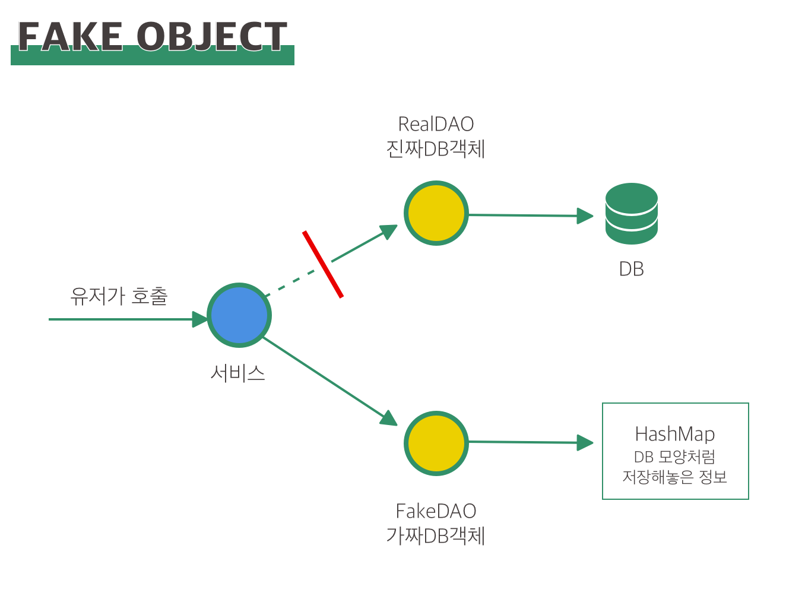

## 단위테스트는 뭔가요?

외부에 의존성이 없는 소프트웨어 단위의 테스트.

단위테스트는 빨라야한다. 

*Working Efficiently with Legacy Code* 의 저자는 테스트 실행시간이 0.1초가 넘어가면 단위테스트가 아니라고 말했다.

### BDD

Behavior Driven Development

- Given : 조건. ~가 주어졌을 때
- When: ~를 한다면 (행위)
- Then: 이래야한다.

### AAA

Arrange / Act / Assert 

먼저 세팅하고 / 행위를 진행하며 / 검증한다. 
```java
@Test
    public void create_미션없으면_ranking_저장안함() {
        // given / Arrange
        Review review = ReviewFixture.aNoMissionReview(1L);
        when(reviewRepository.save(review)).thenReturn(review);
        when(missionProductRepository.findOpenByProductId(review.getProductId())).thenReturn(Optional.empty());

        // when / Act
        sut.create(review);

        // then / Assert
        verify(reviewRepository, times(1)).save(review);
        verify(missionRankService, never()).saveIfNotClosed(any(), any());
    }
```


## 통합테스트

둘 이상의 시스템 요소를 통합한 테스트.

엄밀히 말해서는 DB 연동한 테스트 등도 통합테스트라고 할 수 있다. 

# JUnit

Spring에서 제공하는 Java 테스트 도구.

2018/10/05 기준 Junit5([https://junit.org/junit5/](https://junit.org/junit5/))가 나와있으며, 이 버전은 Java 8 이상을 지원한다. 

Junit은 단위테스트와 통합테스트를 모두 지원한다. 

# AssertJ

Junit의 기본 assert와 Hamcrest의 is 조합 대안으로 떠오르는 테스트 도구. 

다양한 조건의 검증 기능을 제공하고, static import 도 한번만 하면 된다.

[AssertJ / Fluent assertions for java](http://joel-costigliola.github.io/assertj/index.html)

# Test Double

진짜 객체는 시간이 오래 걸리며, 자원을 사용하고 전역 상태에도 영향을 준다.

그래서 실제 객체를 대신할 수 있는 객체가 필요해진다. 이를 **테스트 더블** 이라 한다.

Mock이라고 말하는 경우도 있는데, Mock 은 좁은 의미에서는 테스트 더블 하위의 개념을 의미하고, 넓게 말할 때는 테스트 더블 그 자체를 의미한다.

테스트 더블에는 다른 용도의 객체들이 있다. 

- Stub
- Mock
- Fake Object
- Spy

## Stub

상태 검증에 쓰는 객체.

로직 없이, 원하는 값(상태)을 반환한다. 메소드의 행동을 미리 정해두어,

이 객체는 무조건 이 값을 반환한다고 가정한다. 

Mockito에서의 예제를 보자.
```java 
// stubbing
when(mockedList.get(0)).thenReturn("first");
when(mockedList.get(1)).thenThrow(new RuntimeException());
```

위의 코드를 보자. 위의 객체는 0을 get하면 "first"를, 1을 get할 경우 RuntimeException을 반환하도록 `stubbing` 되어있다. 

stub은 작성하긴 쉽지만 불필요한 코드를 줄이기 위해서 mocking Framework를 이용하는 것이 편하다. 

또한 상태를 가정해서 하드코딩 된 형태이기 때문에 값의 변경은 테스트 할 수 없다.

## Mock

행위 검증에 쓰는 객체

실제 객체의 행동을 따라하는 가짜 객체. 

대개 **다른 객체의 행위를 테스트** 하기 위해서 mock object를 만들게 된다. 

이를 행위 검증이라고 한다. 행위의 수행 여부를  판단한다고 보면 된다. 

Mockito 를 이용해서 Mock 을 사용하는 예제를 보자. 

```java 
import static org.mockito.Mockito.*;

// mock 객체 생성
List mockedList = mock(List.class); // List.class가 위치한 부분에 mock을 만들고 싶은 클래스를 두면 된다. 

// mock 객체를 사용합니다.
mockedList.add("one");

// 검증하기 
// 너 이 메소드 사용했어?
verify(mockedList).add("one"); 
```


mockito에서는 mock이 모든 상호작용(메소드 호출 등)을 다 기억하고 있어서, 어떤 메소드가 실행되었는지 선택적으로 검증해 볼 수 있다. 

내가 짠 코드가 아니라 어떤 서비스 객체 A를 제공받았고, 그 객체가 아무것도 반환하지 않았을 때 

**메소드가 실행되었는지 체크하는 데 유용**하다.

## Fake Object

여러 상태를 대표할 수 있도록 구현된 객체, 실제 로직이 구현된 것처럼 보이게 한다.

실제로 DB에 접속해서 비교할 때와 동일한 모양이 보이도록 객체 내부에 구현할 수 있다.

예를 들면, DB 대신에 미리 저장된 Hashmap 등을 참조하는 DAO 등을 사용하여 실제 보이는 정보처럼 넣을 수 있다. 

{: style="width:50%; display: block; margin:100px auto 0;"}{: style="display:block;margin-top:10px;color:#828282;font-style:normal;text-align:center"}


FAKE OBJECT는 진짜처럼 보이는 가짜 DB객체를 쓴다
```java
@Profile("transient")
public class FakeAccountRepository implements AccountRepository {
       
       Map<User, Account> accounts = new HashMap<>();
       
       public FakeAccountRepository() {
              this.accounts.put(new User("john@bmail.com"), new UserAccount());
              this.accounts.put(new User("boby@bmail.com"), new AdminAccount());
       }
       
       String getPasswordHash(User user) {
              return accounts.get(user).getPasswordHash();
       }
}
```


## SPY

테스트에 사용되는 객체, 메소드의 사용 여부 및 정상 호출 여부를 기록하고 요청 시에 알려준다.

테스트 내에서 메소드 호출 횟수가 궁금한 경우, 카운터를 해당 메소드에 추가한 후 이를 호출한다.

# Mockito

JUnit 위에서 Mocking 과 Verification을 도와주는 프레임워크이다.

위에서 Stub과 Mocking 예제는 보았다. 
```java 
// 클래스 뿐만이 아니라 인터페이스도 mock 할 수 있다.
LinkedList mockedList = mock(LinkedList.class);

// stubbing
when(mockedList.get(0)).thenReturn("first");
when(mockedList.get(1)).thenThrow(new RuntimeException());

System.out.println(mockedList.get(0)); // first
System.out.println(mockedList.get(1)); // Runtime exception 발생
System.out.println(mockedList.get(10)); // null

verify(mockedList).get(0);
```
    

verify 를 할 때 `anyInt()` , `anyFloat(), `anyString()`, eq()`등 으로 넘기는 값을 지정해줄 수 있다. 

`verify` 는 기본적으로 메소드 호출이 한번 된 것을 검증할 수 있다. 추가로 `times(), atLeast(), atMost(), never()` 등을 사용하면 특정 호출 횟수 및 최소/최대 횟수를 지정해서 검증할 수 있다.
```java 
verify(mockedList, atLeast(2)) // 최소 두번
verify(mockedList, never()) // 호출된 적 없음 
verify(mockedList, atMost(5)) // 최대 5번 
verify(mockedList, atLeastOnce()) // 최소 1번 
```

## @Mock

@Mock 애너테이션을 사용하면 좀더 간단하게 mock을 만들 수 있다. 
```java 
public class ListTest{
        @Mock private List mockedList; 
}
```
    

## 순차적으로 값을 바꿔주는 Stub

Iterator-style stub 이라고한다.
```java 
 // 체이닝
when(mock.someMethod(anyString())) // 어떤 스트링을 넣어도
        .thenReturn("coca")
        .thenReturn("cola")
        .thenThrow(new ColaException());

System.out.println(mock.someMethod("어떤 스트링")); // coca
System.out.println(mock.someMethod("어떤 스트링")); // cola
System.out.println(mock.someMethod("어떤 스트링")); // Cola Exception

// 여러 argument 넘기기 

when(mock.someMethod(anyString()))
        .thenReturn("coca","cola");

System.out.println(mock.someMethod("어떤 스트링")); // coca
System.out.println(mock.someMethod("어떤 스트링")); // cola
System.out.println(mock.someMethod("어떤 스트링")); // cola - 마지막 값으로 고정
```
   

## 시간과 관련된 검증 (timeout)

timeout()을 사용해서 검증할 수 있다. times 혹은 atLeast와 함께 사용할 수 있다.
```java 
verify(mock.timeout(100)).size();
```
   

## SPY

mockito에서의 `spy()` 는 진짜 인스턴스를 mock하는 것이다. 

spy된 인스턴스를 stub할 수도 있다.
```java 
List list = new LinkedList();
List spy = spy(list);

when(spy.size()).thenReturn(100); // stubbing

spy.add("one");
spy.add("two");

System.out.println(spy.get(0)); // one
System.out.println(spy.size()); // 100

verify(spy).add("one");
verify(spy).add("two");

// Wrong use case
when(spy.get(10)).thenReturn("foo"); // IndexOutOfBoundsException
// 진짜 인스턴스의 메소드를 호출하기때문에 Exception 발생

// use doReturn() instead
doReturn("foo").when(spy).get(0);
```

stub되지 않은 메소드의 경우에는  진짜 인스턴스의 메소드를 호출하기때문에 주의할 부분이 생긴다.

[mockito/mockito](https://github.com/mockito/mockito/wiki/Mockito-features-in-Korean)

위에는 1.8버전까지만 나와있다. 

Last Friday 기준 Mockito는 2.22.0 문서가 나와있다. 

[Mockito (Mockito 2.22.0 API)](http://static.javadoc.io/org.mockito/mockito-core/2.22.0/org/mockito/Mockito.html#23)

# Mockneat

[https://github.com/nomemory/mockneat](https://github.com/nomemory/mockneat)

임의의 데이터를 만들어주는 Java 8+ 라이브러리. 

# Fixture

호출 시에 자동으로  임의의 정보를 넣어 반환하게 만들어놓은 클래스를 의미한다. 

예를 들어 UserFixture는 User에 임의의 정보를 넣어 반환해준다.

매번 개발자가 새로운 유저를 만들 수는 없기 때문이다.