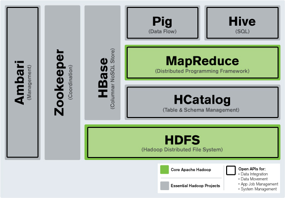
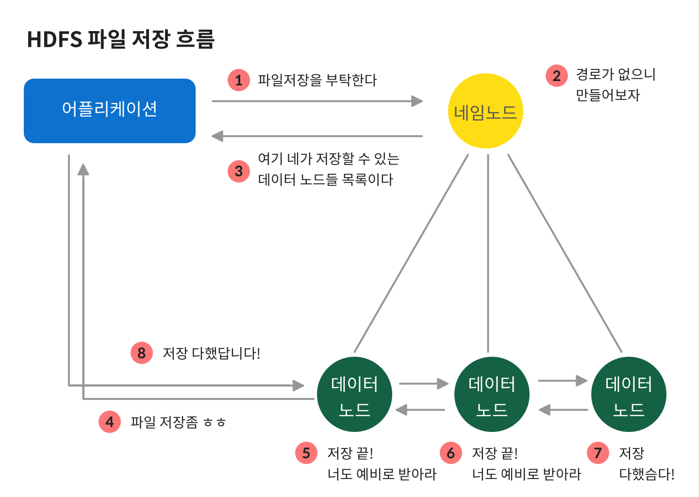
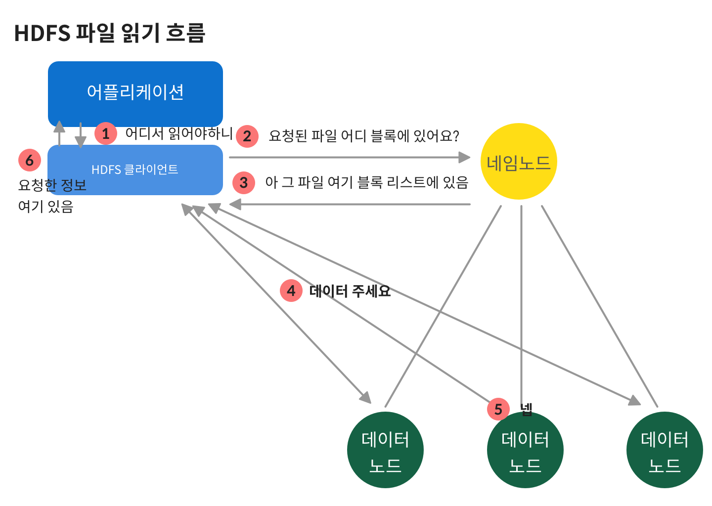
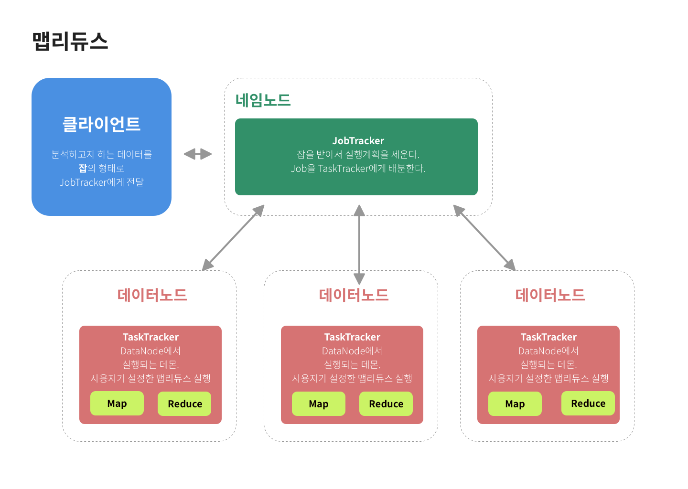

팀 내에서 하둡 시스템 케이스 스터디를 보고, 또 커버로스와 하둡이야기가 계속 오가기에 늦기전에 정리해야겠다고 생각했다. 🙂 학교에서는, 코끼리 마크를 가진 분산형 파일시스템 정도로만 가르쳐주었기에 실제로는 어떻게 쓰는지 궁금해졌다. 

참고 [http://www.itworld.co.kr/print/73626](http://www.itworld.co.kr/print/73626)

## 왜?

하드 디스크의 용량은 엄청나게 증가했지만 이를 읽는 속도는 상대적으로 느리게 증가했다. 옛날에는 5분이면 디스크를 전부 읽을 수 있었지만, 이제는 2시간 반이 걸려야 다 읽을 수 있는 수준에 이르렀다. 

그렇다면 이 정보들을 나눠서 병렬적으로 처리하고 공유할 수 있다면 어떨까? 이러면 매우 빠른 분석이 가능하다. 

이런 방식으로 동작하는 것이 하둡이다.

## 하둡은

분산환경에서 데이터를 저장하고 처리할 수 있는 오픈 소스 프레임 워크.  

하둡은 비관계형 DBMS에 속하지만, SQL 쿼리 언어도 사용가능하다. 

하둡은 몇가지 구성요소들로 이뤄져있다.

{: style="width:50%; display: block; margin:100px auto 0;"}{: style="display:block;margin-top:10px;color:#828282;font-style:normal;text-align:center"}

하둡 프레임워크. 출처 [http://www.itworld.co.kr/print/73626](http://www.itworld.co.kr/print/73626)

이 중 가장 중요한 두가지는 **HDFS와 맵리듀스(Map-Reduce)**이다. 

1. **하둡 분산형 파일 시스템(Hadoop Distributed FileSystem, HDFS)** 

    HDFS는 하둡 네트워크에 연결된 어떤 기기에나 데이터를 밀어 넣는 분산형 파일 시스템이다. 하둡 시스템은 보드에 좋은 하드드라이브가 거의 없는 상용화 서버들이라도 활용이 가능하다. 하둡은 RDBMS 가 갖는 관리 비용을 들이지 않고, HDFS를 이용한다. 그래서 데이터를 **다수의 기기들과 드라이브들에 저장**하며, 다수의 노드로 이뤄진 하둡 시스템에 **데이터가 자동적으로 중복**되게 만든다.

    HDFS가 하둡 네트워크에서 주로 사용되는 파일시스템이긴 하지만, 유일한 파일 시스템은 아니다. 스터디에서 말씀해주신 것 처럼, ec2에서는 하둡에 S3를 붙였다.

    HDFS는 

    - 저장하는 파일을 블록으로 나눠
    - (기본) 3개로 복제 되어 다른 HDFS 노드에 분산 저장됨
    - 네임노드 1 대(마스터) - 데이터노드 여러대 (슬레이브) 구조로,
    - 네임노드에 저장된 메타데이터를 이용하여 클라이언트가 저장된 파일에 접근한다.

    하둡 어플리케이션은 파일을 저장하거나 읽기 위해서 HDFS 클라이언트를 사용한다.

    이때 클라이언트는 API 형태로 사용자에게 제공된다. 

    슬레이브 역할을 하는 데이터노드들은 블록의 정보를 네임노드에 정기적으로 전송하여, 네임노드로 하여금 데이터 노드가 정상 동작하는지 확인하게 한다. 

    {: style="width:50%; display: block; margin:100px auto 0;"}{: style="display:block;margin-top:10px;color:#828282;font-style:normal;text-align:center"}

    파일을 저장하고자 하는 어플리케이션은 제일 먼저 네임 노드에 저장사실을 알린다. 네임노드는 경로를 찾거나 만들어 저장 가능한 데이터 노드 목록을 넘겨준다. 어플리케이션이 그 중 첫 노드에 파일 저장 요청을 하면, 데이터 노드들은 자신의 저장이 끝내고 다음 노드에 넘겨준다. 마지막 노드까지 저장을 완료하면 파일 저장 완료 리스폰스를 보낸다.

    {: style="width:50%; display: block; margin:100px auto 0;"}{: style="display:block;margin-top:10px;color:#828282;font-style:normal;text-align:center"}

    읽고자 할때는 어플리케이션이 클라이언트에게 과정을 위임한다. 클라이언트는 네임노드에서 저장된 블록을 찾아 해당 블록에서 데이터를 가져온다. 이후 이 데이터를 다시 어플리케이션에 전달한다. 

2. **맵리듀스(MapReduce)** 

    대용량 데이터 처리를 위한 분산 프로그래밍 모델. 대량의 데이터를 병렬로 분석이 가능하다. 프로그래머가 작성하는 Map 그리고 Reduce라는 두 개의 메소드로 구성되어있다. Map은 key - value의 형태로, 흩어져있는 정보를 연관성 있는 데이터 분류로 묶는 작업이다. Reduce는 Map화 한 작업 중 중복 데이터를 제거하고 원하는 데이터를 추출하는 작업이다. 

    {: style="width:50%; display: block; margin:100px auto 0;"}{: style="display:block;margin-top:10px;color:#828282;font-style:normal;text-align:center"}

    맵리듀스가 아무데서나 실행되는 건 아니다. 맵 리듀스 시스템은 클라이언트 - 잡트래커 - 태스크 트래커의 구조를 갖는다. 클라이언트는 분석하고자 하는 정보는 잡의 형태로 잡트래커에게 넘겨준다. 잡트래커는 네임노드에 위치하면서, 하둡 클러스터의 전체 잡을 스케쥴링하고 모니터링한다. 태스크트래커는 잡을 받아 요청 받은 맵과 리듀스 개수만큼 맵 태스크와 리듀스 태스크를 생성한다. 

