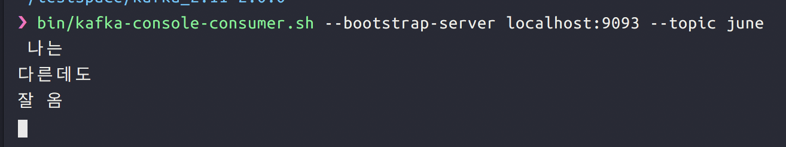

서버가 엄청나게 성능이 좋아서 모든 일을 동기식으로 처리할 수 있으면 얼마나 좋을까! 어떤 요청이든, 큰 트래픽이 쏠려도 순식간에 일을 하고 그 결과를 바로 넘겨주는 기적의 서버. 

아쉽게도 그런 이데아는 찾아보기 어렵다. 결국에는 우리는 비동기적으로 일해야하고, 서버가 일을 처리하는 동안 들어온 요청은 잘 쌓아뒀다가 여유가 생길 때 차례대로 대응해야한다. 

그런데 요청도 일하는 서버가 계속 받는다면, 일하는 속도도 느려진다. 그래서 우리는 큐를 사용한다. 그냥 큐가 아니라 메시지를 쌓아두는 큐. 그래서 이를 Message Queue라고 부른다. 

## ActiveMQ

ActiveMQ는 전통의 메시지 큐 강자이다. Java로 만든 오픈 소스 메시지 브로커이며, 자바, C, C++, C#, 루비, 파이썬, PHP, 펄 등의 다양한 클라이언트를 지원한다. 

JMS(Java Message Service) API를 사용해서 통신한다. 

## RabbitMQ

가볍고 큐로서의 기능이 두드러지는 메시지 큐. 다양한 메시징 프로토콜을 지원한다. 다양한 기능, 클라이언트 라이브러리, 개발 툴, 그리고 퀄리티 높은 문서가 특징이다. ActiveMQ에서 사용하는 JMS는 자바 외 어플리케이션들이 메시징할 때 불편했지만, RabbitMQ에서 사용하는 AMQP 는 언어에 관계없는 오픈 소스 메시지를 가능케한다. 

일반적인 메시지 브로커로서 디자인되었으며, 다양한 P2P 양상을 지원하고, request/reply  모델과 pub-sub 패턴을 모두 사용할 수 있다. 

Smart Broker - Dumb Consumer 모델을 사용한다. 브로커가 컨슈머의 상태를 지속적으로 기록하여, 비슷한 속도로 메시지를 소비하는 컨슈머들에게 지속적으로 메시지를 전달한다.  

## Kafka

아예 새로운 메시징의 개념을 들고 온 것이 카프카다.

카프카는 원래 Scala로 개발되었고, LinkedIn이 사내 시스템을 연결하기 위한 목적으로 만들었다. 현재 카프카는 Apache 소프트웨어 재단 생태계에 자리잡았다. 

볼륨이 큰 publish-subscribe 메시지와 스트림을 내구성있게, 빠르게, 확장가능하게 다룰 수 있도록 디자인되었다. 카프카는 로그처럼 내구성있는 메시지 저장을 지원하며, 서버 클러스터 내에서 돌고, `topic` 별로 레코드를 저장한다. 

RabbitMQ와는 정반대로, dumb broker - smart consumer 구조를 사용하여 consumer가 직접 버퍼를 읽는 형식을 사용한다. 카프카 브로커는 어떤 컨슈머가 뭘 읽었는지 기록하려고 하지 않고, 일정시간 동안 모든 메시지를 들고 있는다. 어디까지 읽었는지는 컨슈머가 직접 기록해야 한다. 

## 그래서 요약해서 뭐하는 애야

- 💪 메시지큐나 메시징 시스템처럼, 레코드 스트림을 publish(발행) 혹은 subscribe(구독) 할 수 있게 해준다
- 레코드 스트림을 내구성 있고, fault가 생겨도 되돌릴 수 있는 방식으로 저장한다
- 레코드 스트림을 발생하는 즉시 처리한다

## 어디에 쓰나요

- 시스템이나 어플리케이션 간에 안정성 있게 데이터를 가져오는 실시간 스트리밍 데이터 파이프라인 구축할 때
- 데이터 스트림에 따라 변하거나 대응하는 리얼타임 스트리밍 어플리케이션을 만들 때

## 특징

- 여러 데이터 센터에 걸쳐있는 하나 이상의 서버 위에서 클러스터로 동작한다
- `topic` 이라는 이름의 카테고리별로 레코드 스트림을 저장한다.
- 각 레코드는 `key` `value` `timestamp` 를 갖고 있다.

## 코어 API

- `Producer API` : 어플리케이션이 하나 이상의 카프카 토픽을 발행할 수 있게 해줌
- `Consumer API` : 하나 이상의 토픽을 구독하고, 발생된 레코드를 처리할 수 있게 해줌
- `Streams API` : 어플리케이션이 stream processor 로 동작하여, 하나 이상의 토픽에서 오는 스트림을 소비하고 하나 이상의 아웃풋 스트림을 만들 수 있도록한다. 즉 인풋스트림을 아웃풋 스트림으로 효과적으로 변환한다.
- `Connector API` : 재사용되는 프로듀서와 컨슈머를 만들어, 카프카 토픽을 어플리케이션 / 데이터 시스템에 연결한다. 예를 들어, RDB에 연결된 connector는 테이블의 모든 변화를 감지할 수 있다.

## 토픽, 그리고 로그

토픽은 레코드가 발행되는 카테고리 혹은 피드의 이름이다. 카프카에서의 토픽은 언제나 multi-subscriber 인데, 이는 하나의 토픽이 0,1, 혹은 그보다 많은 컨슈머를 가질 수 있다는 걸 말한다. 

각 토픽에 대해서, kafka 클러스터는 다음과 같이 파티션으로 나눠진 로그를 운영한다. 즉 각 토픽이 발행된 내용은 분산 저장된다. 


offset은 각 파티션 내에서 메시지를 식별하는 ID로 사용된다. topic 내에서 메시지를 식별할 때는 파티션 번호와 offset값을 동시에 쓴다.

## Producer

원하는 대로 topic을 publish 하는 존재. 어떤 토픽의 어떤 파티션에 레코드를 넣을 것인지 정하는 의무가 있다. 

round-robin 혹은 key값에 따라 달라질 수 있다. 

## Consumer

컨슈머는 독립적인 프로세스일 수도 있고, 독립적인 머신일 수도 있다. topic을 구독-소비하는 주체를 의미한다.

컨슈머는 스스로 consumer group name을 레이블링 할 수 있다. 만약 한 토픽을 구독하는 두 컨슈머가 있는데, 알고보니 같은 시스템에 존재한다고 해보자. 낭비를 줄이기 위해 이 두 컨슈머는 구독하던 내용을 머지하고, 한꺼번에 구독하기로 했다. 이때 consumer group을 사용한다. 

하나의 파티션에는 컨슈머 그룹 당 하나의 컨슈머만 접근할 수 있다. 이 컨슈머를 `partition owner` 라고 부른다.

그러므로,(group 내의) consumer 수 < partition 수 이면 하나의 컨슈머가 각각 여러 파티션을 소유하게 되고, (group 내의) consumer 수 > partition 수 이면 놀게 되는 consumer가 생기므로 수를 적절히 조절해야한다. 

## 왜 빠른가요

Kafka 는 기존 메시징 시스템과는 달리 메시지를 메모리 대신 `파일 시스템`에 쌓아두고 관리한다. 

아니, 당연히 메모리보다는 파일 시스템이 훨씬 느리지 않은가요? 성능이 당연히 저하되지않나요?

기존 메시징 시스템에서는 그랬다. 파일 시스템은 단지 영속성을 위해서 성능 저하를 감수하면서 사용하는 애물단지에 불과했다.

Kafka에서는 파일 시스템을 메시지의 주 저장소로 사용하면서도 기존의 메시징 시스템보다 뛰어난 성능을 보여준다. 이게 어떻게 가능한 것일까? 

일반적으로 하드 디스크는 메모리보다 수천 수백배 느리다. 하지만 특정 조건에서는 메모리보다 10배 이내로 느리거나 심지어는 더 빠르다. 하드디스크의 순차적 읽기 성능은 메모리의 랜덤 읽기 성능보다 뛰어나며, 메모리의 순차 읽기보다는 7배 느리다. 

> Kafka의 메시지는 하드디스크로부터 순차적으로 읽혀지기때문에 빠르다.

또한 Kafka에서는 파일 시스템에 저장된 메시지를 네트워크를 통해 consumer에 전송할 때 

> zero-copy 기법을 사용하여 데이터 전송 성능을 향상시켰다.

zero-copy는 데이터 전송 시 커널 모드에서만 처리한다. 

일반적인 파일 시스템 데이터 전송시, Read Buffer(커널모드) → Application Buffer(유저모드) → Socker Buffer(커널모드) → NIC(랜카드) Buffer(커널모드) 의 과정을 거친다. 이 중 유저모드에 불필요한 복사를 제거하여 좀더 빠르게 전송할 수 있는 것이다.

## 이제 QuickStart 해볼까... 근데 주키퍼는 뭐야

주키퍼는 분산환경에서 필요한 설정, 네이밍, 분산 싱크맞추기, 그룹 서비스들을 제공하는 존재입니다. 

quickstart를 진행하기 위해서는 zookeeper를 먼저 실행시켜야합니다.

[https://www.apache.org/dyn/closer.cgi?path=/kafka/2.0.0/kafka_2.11-2.0.0.tgz](https://www.apache.org/dyn/closer.cgi?path=/kafka/2.0.0/kafka_2.11-2.0.0.tgz)

에서 kafka 2.11-2.0.0 버전을 받고 압축을 풀어줍니다.
```bash 
cd kafka_2.11-2.0.0 # 디렉토리로 이동
bin/zookeeper-server-start.sh config/zookeeper.properties
# zookeeper 설정으로 zookeeper를 실행시킵니다.
```

## Quickstart : 서버 띄우고 메시지를 주고 받아보자

zookeeper를 띄웠으면 터미널을 새로 띄웁니다. 디렉토리로 이동합니다.

```
bin/zookeeper-server-start.sh config/server.properties 
# 서버를 띄운다
```

이제 서버까지 띄웠으면 토픽을 정해줄 차례입니다. 

파티션은 몇개 해줄 건지, 주키퍼는 어떤 녀석을 사용할 건 지 정해줍니다.
```bash
bin/kafka-topics.sh --create --zookeeper localhost:2181 --replication-factor 3 --partitions 1 --topic test
# test라는 이름의 topic을 생성한다. 
# zookeeper는 localhost:2181 을 사용
# 파티션은 하나만 사용한다. 

bin/kafka-topics.sh --describe --zookeeper localhost:2181 --topic test 
# test 토픽에 대한 정보를 확인한다. 
# 파티션 갯수와 leader 노드 등에 대한 정보가 있다. 
```

test라는 이름의 토픽을 생성했습니다. 

원하는 zookeeper, replication 갯수, 파티션 갯수와 이름을 설정할 수 있습니다. 

우리가 생성한 설정에서는 주키퍼가 2181 포트에 띄워져있습니다.

이제 메시지를 보낼 producer와 consumer를 띄워볼 차례입니다. 

같은 터미널에서 producer를 띄워줍니다. 

```bash
bin/kafka-console-producer.sh --broker-list localhost:9092 --topic test 
# test 토픽에 대한 프로듀서를 띄운다.
```

위에서 생성한 test 에 대한 프로듀서를 만들었습니다. 브로커가 여럿이라면 (위에서 만든 서버) 고를 수 있는데, 우리는 지금 하나만 만들었습니다. 그리고 9092 포트를 기본으로 설정했습니다. 

새로 터미널을 띄우고 디렉토리로 이동합니다. 이제 consumer를 띄워줍니다. 

```bash
bin/kafka-console-consumer.sh --bootstrap-server localhost:9092 --topic test
# test 토픽을 구독할 컨슈머를 띄운다
```

부트스트랩 서버는 여기서 브로커 리스트랑 차이가 없습니다. 

이제 프로듀서를 띄운 터미널로 가서 메시지를 마구 입력합니다.

그러면 컨슈머쪽에서 해당 메시지가 순서대로 오는 것을 알 수 있습니다.


## 그러면 partition이 여러 개면?

위에서 토픽을 생성할 때 **partition을 한 개로** 생성했습니다. 

여러개 생성해보면 어떨까요?

```bash
bin/kafka-topic.sh --create --zookeeper localhost:2181 --replication-factor 1 --partitions 3 --topic test3 
# 파티션을 세개 생성
```
  
이제 producer를 다시 띄우고 숫자를 순서대로 입력해봅니다. 


그런데 컨슈머에서는 순서가 뒤죽박죽으로 나옵니다.


이는 파티션을 생성했기 때문입니다. 프로듀서가 생성한 메시지는 파티션에 나뉘어서 들어가고, 컨슈머는 이 메시지를 파티션에 상관없이 읽어옵니다. 프로듀서의 생성 순서는 오로지 **파티션 안에서만 보존됩니다.**

## 그러면 브로커가 여러개면?

이번에는 간단합니다. server config를 복사하여 조금 손봐줍니다. 

```bash 
cp config/server.properties config/server1.properties
# 서버 1 설정 복사 

cp config/server.properties config/server2.properties
# 서버 2 설정 복사 
```
    

vi로 복사한 설정을 연 뒤, 다음과 같은 정보들을 변경해줍니다. 
```bash 
broker.id=1 # 1번서버는 1, 2번서버는 2
log.dir=/tmp/kafka-logs-1 # 1번서버는 kafka-logs-1, 2번서버는 kafka-logs-2
listeners=PLIANTEXT://:9093 # 1번서버는 9093, 2번 서버는 9094
```

그리고 해당 config로 서버를 띄웁니다. 
```bash
bin/kafka-server-start.sh config/server1.properties
bin/kafka-server-start.sh config/server2.properties
```

그러면 브로커가 현재 총 3개 띄워진 상태입니다. 

이제 june이라는 토픽을 만듭니다. 
```bash
 bin/kafka-topics.sh --create --zookeeper localhost:2181 --replication-factor 3 --partitions 1 --topic june
```
이제 브로커가 여러 개일때 어떻게 메시지를 받는지 실험할 준비가 모두 끝났습니다. 

프로듀서를 만듭니다. 이때 broker를 9092 (0번째 브로커) 로 선택합니다. 
```bash
bin/kafka-console-producer.sh --broker-list localhost:9092 --topic june 
```
   
컨슈머를 만들어줍니다. 이때는 위에서의 브로커와 다른 브로커를 선택합니다. 

여기서는 [localhost:9093](http://localhost:9093) 즉 1번을 선택해주겠습니다.
```bash 
bin/kafka-console-consumer.sh --bootstrap-server localhost:9093 --topic june
```





완성! 
### 추가. bootstrap 서버는 뭘까

Kafka cluster에 대해서 최초 커넥션을 만들기 위해서 필요한 host/port 페어를 말한다. 

전체 cluster set의 일부이며, Kafka cluster의 연결 상태와 노드들을 모두 discover하기 위한 친구들이다. 

1개 이상이면 좋다.(서버가 하나 죽었을 경우를 대비하여)
