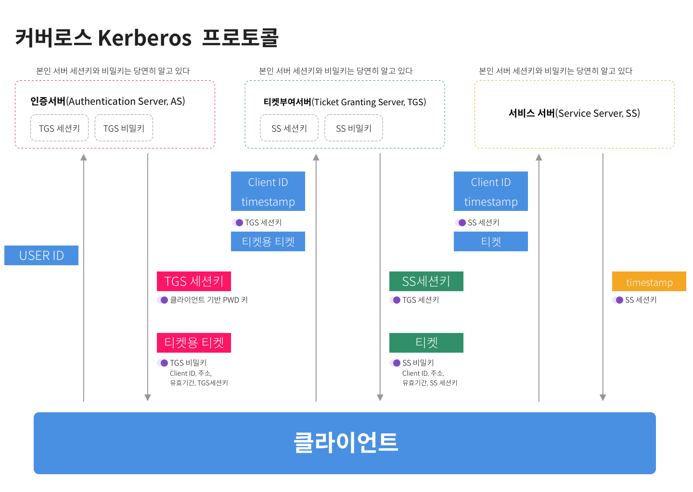

'... 하둡에 커버로스를 붙였나요? ' '커버라이즈드 하둡이...~~~' 하는 얘기를 들으면서, 커버로스 = 인증인데 굉장히 붙이기 까다로워서 선배님들이 싫어하시는 것이군! 하는 개념이 잡혔다. 모른채로 넘어갈 수는 없어서 한번 알아본다. 왜 케르베로스가 아니라 커버로스인지는 모르겠음.  → 케르베로스는 라틴식 발음이라고 한다. 일각에서는 케르베로스라고 부르기도 하는 모양이다. 

참고: [https://www.letmecompile.com/kerberos-protocol/](https://www.letmecompile.com/kerberos-protocol/)

서버가 적고, 이 서버를 사용하는 개발자가 몇명 안되면 수동으로 접근 가능한 유저를 추가하면 된다. A 서버에는 1,2 님, B 서버에는 2,3 님만 접근 가능하다는 식으로 말이다. 하지만 점점 서버의 숫자가 많아지고, 유저가 늘어나는 경우에는 관리에 드는 비용이 점점 커진다. 

- 각 서버별로 접근 가능한 사용자들의 권한을 관리해야하는 경우
- 서버 추가 혹은 유저가 추가/삭제 할 때마다 매번 접근 가능 유저리스트를 수정해야하는 경우

이런 경우, 클라이언트와 서버 외의 제 3의 인증서버(Authentication Server, AS) 를 도입한다. AS와 연동된 티켓 서비스에서 유저들에게 티켓을 발급하여, 유효한 티켓이 있는 유저만 서비스 서버(기존의 일반 서버) 에 접근할 수 있도록 제어하는 `커버로스` 프로토콜을 도입하여 편하게 관리가 가능하다. 

`커버로스 프로토콜` 의 동작 구조는 다음과 같다. 

1. 클라이언트가 ID/PWD 나 공개키로 클라이언트에 로그인한다. 

2. 클라이언트가 유저 아이디를 인증서버로 전송한다.

3. 인증서버는 유저 아이디가 디비에 있는지 확인하고 다음을 클라이언트에게 던져준다. 
    - 클라이언트 기반 PWD 키로 암호화한 **TGS 세션키**
    - 클라이언트 ID, 주소, 유효기간, TGS 세션키를 TGS 비밀키로 암호화한 **티켓용 티켓 (Ticket Granting Ticket, TGT)**
    
4. 클라이언트는 다음 두 가지를 티켓 부여 서버(TGS)에게 보내준다.
    - **클라이언트 ID, Timestamp** 를 TGS  세션키로 암호화한 뭉치
    - **티켓용 티켓(TGT)** 클라이언트는 TGS 비밀키는 모르므로 복호화해서 보낼 수 없음
    
5. 그러면 티켓 부여 서버(TGS)는 이를 확인한 후, 티켓과 SS 세션키를 보내준다. 
    - TGS 세션키로 암호화한 **SS 세션키**
    - 클라이언트 ID, 주소, 유효기간, SS 세션키를 SS 비밀키로 암호화한 **티켓 (Ticket)**
    
6. 클라이언트는 이제 진짜 서비스를 요청할 서비스 서버(SS)에게 다음 두가지를 알려준다. 
    - **클라이언트 ID, Timestamp**를 SS 세션키로 암호화한 뭉치
    - **티켓**
    
7. 서비스 서버는 티켓을 확인하여 timestamp를 SS 세션키로 암호화하여 내려준다.

8. 이제 클라이언트가 서비스 사용 가능 함.

이렇게 하면 대충 커버로스는 이해 가능하다. 

상기의 모든 내용은 참고 링크에서 따왔다. 

