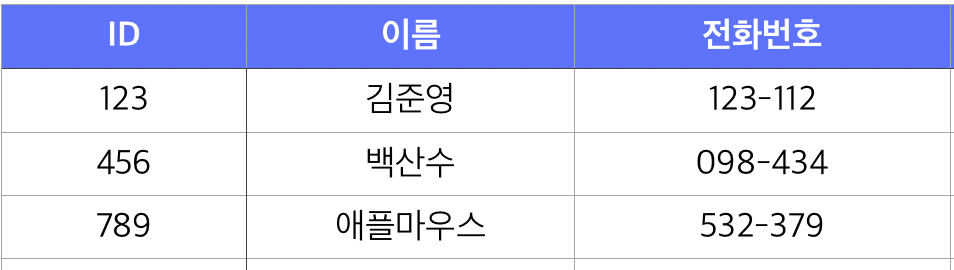
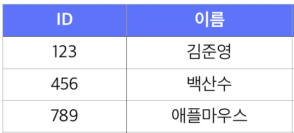
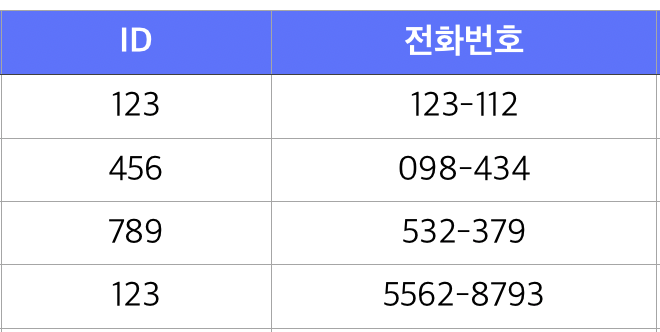
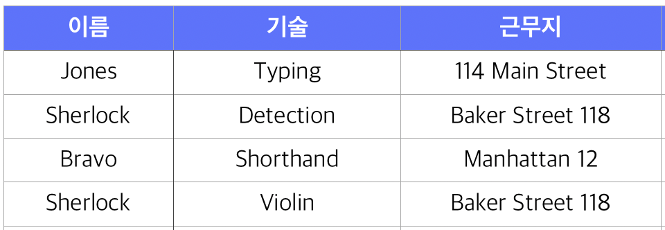
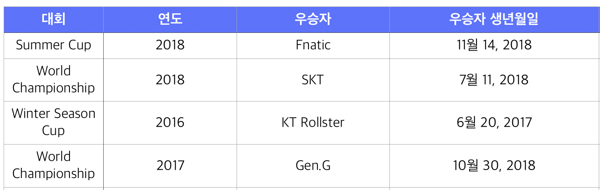
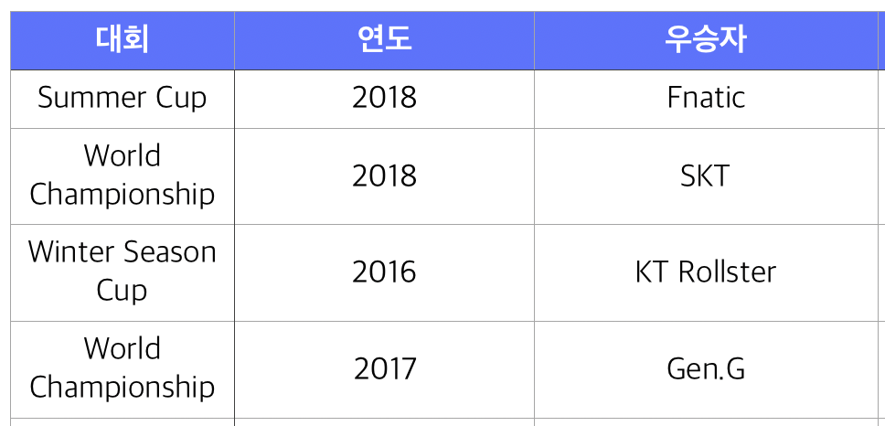
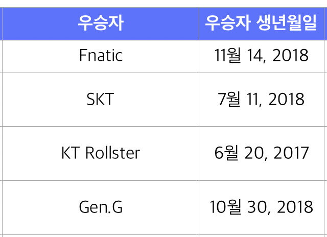
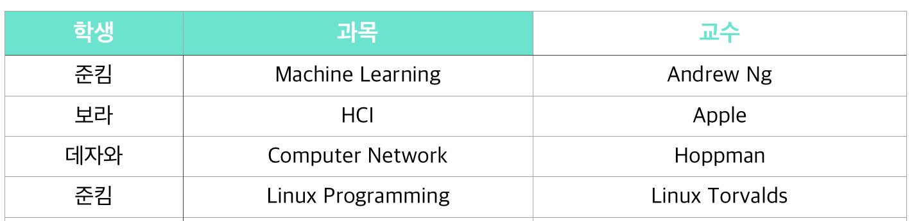
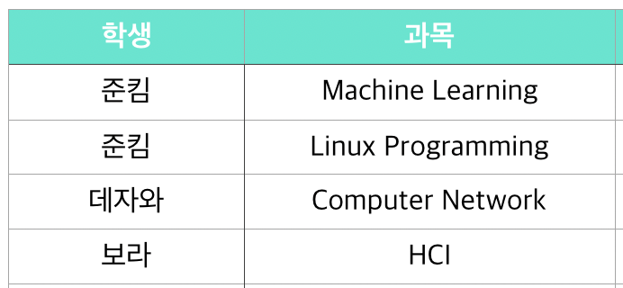
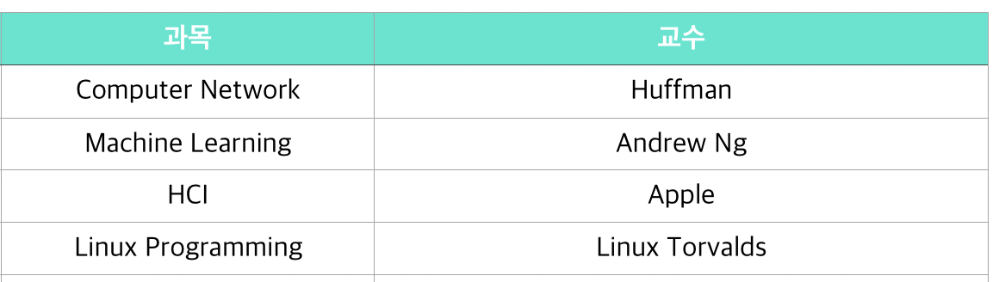

DB 시간에 어려워서 대충 들은 부분이라 상당히 후회된다. 스키마 작성하는 중에 계속 정규화 얘기와 무결성 얘기가 오가게 되어 정리를 다시 꼭 한번 짚고 넘어가려고 한다. 

## 이상 현상(Anomaly)을 막아주세요!

스키마를 작성하다보면 특정 정보를 중복해서 저장하는 경우가 생긴다. 한쪽에도 유저 June의 전화번호가 010-1234-1234 라고 적고, 다른 쪽에도 동일하게 적어둔다고 해보자. 그런데 June의 전화번호가 010-5678-5678로 변경되었다. 이 때 정보를 한쪽만 갱신하는 경우, 동일한 정보가 분기되면서 어떤 정보가 정확한 정보인지 알 수 없게 된다. 이는 **갱신 이상**이라고 한다. 이처럼 중복된 데이터로 인해 생기는 문제들을 모두 **Anomaly** 라고 한다. 한국말로는 **이상 현상**이다.

이상 현상에는 크게 세 가지가 있다. 

- 삭제 이상 (Delete Anomaly)

    하나의 자료만 삭제하고 싶지만, 그 자료가 포함된 튜플 전체가 삭제되어 필요한 정보 역시 손실되는 현상

- 삽입 이상 (Insert Anomaly)

    원하지 않는 자료가 삽입되는 현상 혹은 삽입하는 데 (자료가 부족하여) 지정하지 않은 속성값이 NULL을 갖는 현상.

- 갱신 이상 (Update Anomaly)

    위에서 말한 것과 같이, 데이터가 중복 저장된 상황에서 하나만 갱신할 경우 생기는 현상.

결국 이런 이상현상의 원인은 데이터를 중복 저장하게 만드는 구조이다. 이를 분해하고 독립적으로 만들어 데이터 질의와 연산을 효과적으로 하기 위해서 **데이터 정규화**가 등장한다. 

## 안녕 나는 정규화 릴레이션을 뽀개러왔다

정규화는 하나의 릴레이션에 하나의 의미만 존재하도록 릴레이션을 분해하는 과정이다. 

이를 통해 

- 이상현상을 방지
- 저장공간을 최소화
- 자료 불일치 최소화 ( 무결성 보장 )
- 구조의 안정화

를 (이루고자 하고) 이룰 수 있다.

정규화 과정을 보면 제 1 정규형, 제 2 정규형, 제 3 정규형 .. 등 변신로봇 혹은 디지몬 변신을 상회하는 단계를 거친다. 높은 차수의 정규형은 낮은 차수의 정규형을 기본적으로 만족하고 있어야 한다. 

- **제 1정규형(1NF = 1 Normal Form)**

    중복되는 항목이 없어야한다 (도메인이 원자값으로 되어있어야한다.)

    

    이런 경우, 손님은 사실 여러 개의 전화번호를 가질 수 있다. 즉 '김준영' 손님의 전화번호 속성에 123-112, 5562-8793 와 같은 값이 생성 될 수 있다. 이런 경우를 **원자값을 만족하지 못했다.** 라고 한다. 

    이를 해결하는 방법으로 전화번호1, 전화번호2 등의 칼럼을 추가하는 방법이 있다. (일단 하나의 칼럼에 한 값만 들어가면 되니까!)

    하지만 이 방법은 

    - 고객 전화번호 수를 예측할 수 없다
    - 테이블 질의가 어렵다 (어디에 어떤 번호가 들어있는지)
    - 고객-전화번호 간의 유일성 확보가 어려움 (123-112가 여러번 입력될 수도 있음)

    라는 문제가 발생한다. 

    그래서 이를 해결하기 위해서는 테이블을 본격적으로 뽀개서 

    

    

와 같이 구성하여 해결한다. 

- **제2정규형(2NF)**

    부분 함수적 종속 관계를 제거해야 함

    

위 테이블에서 candidate key는 종업원 + 기술이다.  그런데 근무지는 종업원이 근무하는 곳이므로 항상 종업원에 종속적인 관계를 갖는다. 키의 일부에만 종속적인 관계를 가지는 것을 **부분 함수적 종속 관계**라고 하며, 부분 함수적 종속 관계는 갱신이상 (Update Anomaly)을 유발할 수 있다. 

따라서 종업원-근무지, 종업원-기술 테이블로 나누어 정규화 작업을 해야한다.

- **제3정규형(3NF)**

    이행 함수적 종속 제거 ( x→ y→ z), transitive하지 않게 하기!

    

    위 테이블에서는 대회 + 연도를 키로 우승자가 결정된다. 또 우승자에 따라서 우승자 생년월일이 결정된다. 즉 x → y , y → z 인 관계를 이행 함수적 종속 이라고 한다. 이런 경우 우승자를 변경하면 불필요하게 우승자 생년 월일을 동시에 변경해야 하므로 갱신 이상 (Update Anomaly)을 유발할 수 있다. 

    

    

    위처럼 테이블을 분리하면, 우승자를 변경해도 생년월일을 일일히 변경하지 않아도 된다. 

- **BC(Boyce-codd) 정규형 (BCNF)**

    결정자이면서 후보키가 아닌 것을 제거하는 정규형

    **후보키 Candidate Key**는 각 row가 유니크하도록 만드는 column 속성의 조합이다.  예를 들어 이름과 직군으로 데이터베이스의 행을 하나하나 구분할 수 있다면 (이름,직군) 이 후보키가 된다. 후보키가 하나이고 이 키가 기본키가 되며, 3NF를 만족하면 BCNF를 만족한다.  

    하지만 후보키가 많은 경우라면 3NF 를 만족한다고 해도 BCNF를 만족하지 않는 경우가 존재한다. 이를 해결하기 위한 정규형이 BCNF이다. 

    

    각 강사는 하나의 과목만 가르친다고 하자. 위의 예제에서 기본키는 (학생,과목)이다. 하지만 **교수**에 의해서 기본키에 포함된 **과목**이 결정된다(결정자로서 역할). 하지만 교수는 행을 유니크하게 구분하는 후보키가 될 수는 없다. 

    이런 경우 

    - Programming Language 과목이 Alan Turing 에 의해 열렸지만, 학생이 없는 경우 삽입할  수 없다.

        (삽입이상)

    - Apple이 담당하는 과목이 바뀌면 수강생의 수만큼 갱신해줘야하고 이 과정에서 데이터 불일치가 생길 여지가 있다.(갱신이상)
    - 데자와가 수업을 드랍해서 Computer Network의 수강생이 없어지면 Hoppman이라는 교수의 정보도 아예 사라진다. (삭제이상)

    와 같은 이상 현상이 생긴다. 3NF를 만족한 상태인데도 말이다!

    **분해하기** 

    여기서 문제가 되는 건 결정자이면서 후보키가 아닌 **교수**이다. 이와 관련된 항목들을 먼저 뜯어내보자. 교수 → 과목이므로 이를 뜯어내고 나머지를 뜯어내보자. 

    

    

즉 BCNF는 모든 결정자가 후보키가 되도록하는 구조를 만족시켜야 완성된다. 

    ## 무결성

    데이터의 무결성은 데이터의 정확성, 일관성, 유효성이 유지되는 것을 의미한다. 

    1. 개체 무결성 (Entity Integrity)

        모든 테이블이 기본 키로 선택된 필드를 가져야 한다. 기본키로 선택된 필드는 고유한 값을 가져야 하며, NULL은 허용하지 않는다. 

    2. 참조 무결성(Referential Integrity)

        참조 관계에 있는 두 테이블의 데이터가 항상 일관된 값을 갖도록 유지 되는 것을 의미한다.  A가  B를 참조하고 있을 때, 참조하고 있는 B의 데이터가 삭제되었을 때 A에서는 더 이상 존재하지 않는 데이터를 참조하게 되며 이때 참조 무결성이 깨지게 된다.

    3. 도메인 무결성(Domain Integrity)

        필드의 무결성을 보장하기 위한 것으로 필드의 타입이나 NULLABLE 등의 설정을 하는 것을 말한다. 예를 들어, 주민등록번호 필드에 알파벳이 입력되는 경우는 도메인 무결성이 깨지는 경우이다. 

    4. 무결성 규칙 (Integrity Rule)

    데이터베이스에서 무결성 규칙은 데이터의 무결성을 지키기 위한 모든 제약 사항을 말한다. 

    참고 

    [http://it-ing.tistory.com/50](http://it-ing.tistory.com/50)

    [http://asfirstalways.tistory.com/341](http://asfirstalways.tistory.com/341)

    [http://gomcine.tistory.com/entry/Database-9-데이터베이스-정규화-개념-및-방법](http://gomcine.tistory.com/entry/Database-9-%EB%8D%B0%EC%9D%B4%ED%84%B0%EB%B2%A0%EC%9D%B4%EC%8A%A4-%EC%A0%95%EA%B7%9C%ED%99%94-%EA%B0%9C%EB%85%90-%EB%B0%8F-%EB%B0%A9%EB%B2%95)

    [https://yaboong.github.io/database/2018/03/10/database-normalization-2/](https://yaboong.github.io/database/2018/03/10/database-normalization-2/)

    [http://untitledtblog.tistory.com/123](http://untitledtblog.tistory.com/123)
