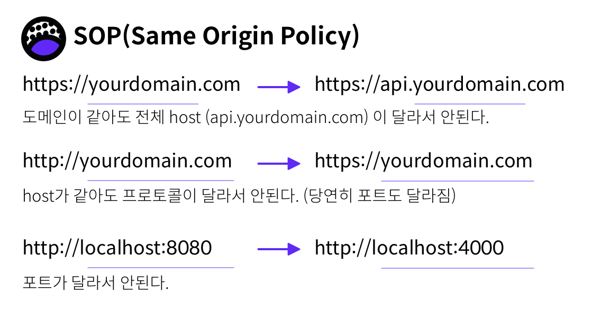
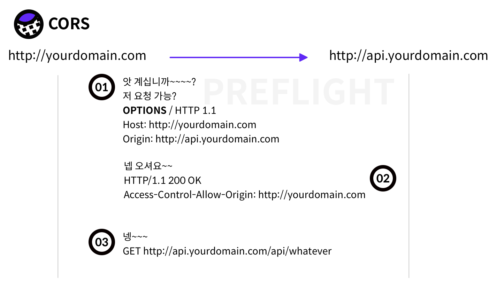

맨날맨날 봐도 맨날 맨날 헷갈리니까 정리. 

## 왜 웹에서 API 서버에 요청 안가는 거에요? 😭

웹 개발 시에 자바스크립트로 야심차게 외부 서버 경로로 ajax 요청을 날리면 요청이 실패한다. 

    No 'Access-Control-Allow-Origin' Header is present on requested resource.
    ... 

요청한 리소스, 즉 서버에서 내려준 응답에 `Access-Control-Allow-Origin` 이라는 헤더가 없단다. 

아니 이게 뭔데.. 왜..안되는 거야..? 나는 행복하고 싶었는데.. 🤢

## 너는 같은 도메인에만 요청을 보낼 수 있다 어리석은 웹이여.. SOP 정책

이는 웹 어플리케이션 보안 모델에서 중요한 개념인 SOP (Same-Origin Policy) 때문이다. 

이 정책은 자바스크립트(XMLHttpRequest) 즉 `<script></script>` 로 표기된 스크립트에서 생성되는 **사이트 간 HTTP 요청**은 불가능 하다는 것을 의미한다. 

즉 Same-Origin만 가능하다는 것인데, 이때 Same-Origin은 `프로토콜` (e.g. http) , `호스트명`, `포트` 가 같다는 것을 의미한다. 프로토콜이 http일때는 80 포트를, https 를 쓰면 443 포트를 쓰니 포트까지 같아야한다.  



웹 보안을 위한 좋은 정책처럼 보이지만, 여러 도메인에 걸쳐서 구성되는 대규모 웹 프로젝트가 늘어나고, REST API를 통한 외부 호출이 늘어나는 상황에서는 귀찮은 정책이 될 수 밖에 없다. 

그래서 추가로 정책을 만든 것이 CORS다. 

## CORS는 씨오알에스라고 읽나요

CORS(Cross-Origin Resource Sharing)은 말 그대로 다른 서버의 리소스를 사용할 수 있는 것을 의미한다. 

만약 서버에서 내 웹을 허용만 해준다면, 접근이 가능하다.  

## 그럼 서버에서 설정 가능한 것인가요

CORS는 서버에서 설정을 해주어야한다.

하지만 CORS를 사용하지 않고 클라이언트에서도 SOP를 우회하는 방법이 있다.

1. 웹 브라우저 실행 시 외부 요청 허용 옵션
    - SOP는 클라이언트인 웹 브라우저가 결정하는 것이므로, 이 과정을 살짝 넘어가면 된다.
    - 크롬의 경우 커맨드라인 옵션으로 SOP 검사 동작을 무시할 수 있다.`—disable-web-security` 옵션을 추가하면 된다.
    - 다만 고객이 내 페이지에 들어올 때마다 이 옵션을 사용해서 들어올 순 없으므로, 개발 시 CORS 설정이 되기 전 잠깐 사용하도록 하자.

2. 외부 요청을 가능하게 해주는 플러그인 설치. 
    - CORS는  ``Access-Control-Allow-Origin`` 헤더를 추가해주는 식으로 동작하므로, 서버의 응답을 가로채서 이 헤더를 추가해주는 플러그인이 있다.
    - 크롬 웹스토어에서 CORS로 검색하자.
    - 이 방법도 마찬가지로 일반 사용자는 사용할 수 없다.

## 뭐야 결국 CORS 해줘야 해 ?

Proxy 하는 방법도 있다. 내 웹을 설정한 서버에서 nginx proxy를 통해서 내 도메인에 요청을 하면,

해당 요청을 서버에 밀어 넣어주는 방법이다. 즉 나는 `[http://mydomain.com/api/users](http://mydomain.com/api/users)` 로 요청을 했지만, nginx가 proxy하여서 실제로 요청은 `[http://api.otherdomain.com/api/users](http://api.otherdomain.com/api/users)` 로 가도록 하는 것이다. 브라우저 상에서는 내 도메인에 요청을 하는 것이므로, SOP의 영향을 받지 않는다. 

## CORS 설정을 해보자

요청하려는 URL이 외부 도메인 (Same origin X) 일 경우 브라우저는 먼저 preflight 요청을 날리게 된다. 

preflight 요청은 실제로 요청하는 경로와 같은 URL에 대해서 **OPTIONS** 메소드로 요청을 미리 날려보고 요청을 할 수 있는 권한이 있는 지 확인한다. 



결국 CORS를 위해서는 사전에 클라이언트가 찔러보는 작업이 필요하다. 

### 서버에서는

다음과 같은 요청 헤더를 줄 것인지 결정해야한다. 

- Access-Control-Allow-Origin: 요청을 허용하는 출처. 위의 예제에서는 "http://yourdomain.com".  출처를 상관하지않고 허용하는 경우 *
- Access-Control-Allow-Credentials: 클라이언트 요청이 쿠키를 통해서 자격 증명을 해야하는 경우 true. 이 경우 클라이언트가 정해진 규격의 쿠키와 함께 요청을 보내야한다.
- Access-Control-Allow-Methods: 요청을 허용하는 메소드. *일 경우 전부, 기본값은 GET, POST이다. preflight를 허용해야하므로 OPTIONS를 포함시킨다.

나머지 값들은 많이 쓰이지 않으므로 나중에 정리하기로 한다. 

Spring Boot 의 경우 

`WebMvcConfigurer` 를 상속하는 `@Configuration` 클래스를 만들고, 다음 함수를 오버라이드한다. 
```java
@Override
    public void addCorsMappings(CorsRegistry registry) {
            registry.addMapping("/api/**")
                    .allowedOrigins("*")
                    .allowCredentials(true)
                    .allowedMethods("*");  
    }
```

더 이상 울지말자 CORS!

---

참고

[https://brunch.co.kr/@adrenalinee31/1](https://brunch.co.kr/@adrenalinee31/1)

[https://homoefficio.github.io/2015/07/21/Cross-Origin-Resource-Sharing/](https://homoefficio.github.io/2015/07/21/Cross-Origin-Resource-Sharing/)
