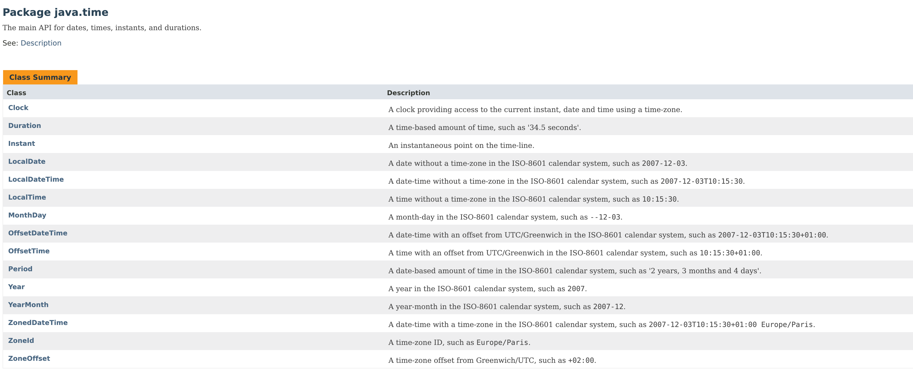

# ??: 준영님 이 Date 무슨 형식으로 보내야해요?

그동안은 date는 무조건 서버에서 만들어서 넣어주는 것이어서 몰랐는데, date를 클라이언트(iOS앱) 에서 받을 일이 생겼다. DTO에는 해당 필드(createdDate라고 하자.) 가 ZonedDateTime인 건 알았는데, json 에서 어떻게 보내야하지? String 으로 말고..! 

이러던 와중에  최근에 LocalDateTime DTO 변환에 관한 좋은 글을 읽었던 게 생각이 났다. 

[https://jojoldu.tistory.com/361](https://jojoldu.tistory.com/361) LocalDateTime 을 json 직렬화하기! 가 궁금하다면 이 링크를 참고하자. 

서버에서 대응해볼 수 있는 방법을 모두 적어두었다.

다행히 swagger를 쓰고 있어서, 앱에서  '2018-12-27T16:44:29.264+09:00' 형태로 보내면 된다는 걸 알아냈다. 그런데 yyyy-MM-dd'T'HH:mm.ss 까지는 알겠는데 그 뒤에 `264+09:00`은 어떻게 표현하지..?  

너무 너무 당황했다 😢 나는 멍청이라네 깔깔

## 멍청이는 Java DateTimeFormat을 살펴보자~~

참고: [https://www.joda.org/joda-time/apidocs/org/joda/time/format/DateTimeFormat.html](https://www.joda.org/joda-time/apidocs/org/joda/time/format/DateTimeFormat.html)

|  심볼  | 뜻  |  예시  |
|---|---|---|
| **y**	|해(년)|1994|
| **D**	|그 해의 몇번째 날인지|	189|
|**m**	|달	|June; Jun; 06|
|**d**|	일	|31|
|**a**|	AM, PM |	PM |
|**h**|	clock hour(12시간 기준) 	|12|
|**H**|	hour of day (24시간 기준)	|23; 24|
|**m**|	분	|30|
|**s**|	초	|55|
|**S**|	1/1000 초 단위	|978|
|**z**|	time zone (text) 	|PST; Pacific Standard Time; UTC|
|**Z**	|time zone 오프셋 (zone) 	|+0900; 09:00; Asia/Seoul |

즉 위에서 본 '2018-12-27T16:44:29.264+09:00' 은

'yyyy-MM-dd'T'HH:mm:ss' → '2018-12-27T16:44:29' 까지 매칭되고

'yyyy-MM-dd'T'HH:mm:ss.SSSZZ' → '2018-12-27T16:44:29.264+09:00' 까지 매칭된다. 

> Zone: 'Z' outputs offset without a colon, 'ZZ' outputs the offset with a colon, 'ZZZ' or more outputs the zone id.

즉 Z인 경우 +0900, ZZ 인 경우 +09:00, ZZZ인 경우 "Asia/Seoul" 과 같이 붙는다는 뜻이다. 

참고로 offset은 GMT(UTC) 기준 더해야하는 시간이다. 서울은 GMT보다 +9시간해야하므로, +0900이다. 

**iOS에서는 표현이 다르다.**

iOS에서는 **yyyy-mm-dd'T'HH:mm:ss.SSSZZZZZ** 로 표현할 경우에 +09:00 로 표현이 되었고 이대로 json으로 보내니까 서버에서 200이 떨어졌다.  ZZZ 나 ZZ 등은 GMT가 붙고, 문제 상황에서 원하는 대로 표현이 안된다.  이와 관해서는 [https://stackoverflow.com/questions/28016578/how-to-create-a-date-time-stamp-and-format-as-iso-8601-rfc-3339-utc-time-zone?rq=1](https://stackoverflow.com/questions/28016578/how-to-create-a-date-time-stamp-and-format-as-iso-8601-rfc-3339-utc-time-zone?rq=1) 를 참조하도록 하자! 

## 일단 그래서 LocalDateTime , ZonedDateTime, OffsetDateTime 뭐가 다르니

이 Time 들은 `java.time` 패키지 안에 오밀조밀 모여있다. 설명을 읽어보면,

### LocalDateTime 

ISO-8601 캘린더 시스템의 타임존 개념이 없는, 날짜-시간 시스템.

예) 1994-06-13T11:15:30 

그냥 LocalDateTime을 사용하면, 해당 컴퓨터의 타임존에 맞춘 시간을 의미한다. 서울에서 new LocalDateTime()을 하면 서울의 현재시각이 나온다. 

ISO-8601는 날짜와 시간과 관련된 국제표준이다. ISO-8601의 핵심은 `- : T W Z` 같은 정해진 문자만 써서 작성한다는 것인데, 이는 즉 Jan 13 09:00 와 같은 표현을 사용하지 않는다는 것이다. 깔끔하니 좋구만! 

### ZonedDateTime 

그럼 Zone-d는? 당연히, ISO-8601 캘린더에 정의된 타임존을 포함한 날짜-시간 시스템이다.

예) 1994-06-13T11:15:30+09:00 Asia/Seoul

아 뭐야, Asia/Seoul 은 GMT+0900 인거 나도 알고 있는데 약간 TMI 스럽다. 0900만 있어도 되는데! 

### OffsetDateTime

그래서 있는 OffsetDateTime. UTC/그리니치 에서부터의 오프셋만을 표현해준다. 

예) 1994-06-13T:11:15:30+09:00

즉 정보의 양은 LocalDateTime < OffsetDateTime < ZonedDateTime이라고 말할 수 있을까. 

오호오호, 그러면 서로 변환도 됐으면 좋겠는데? 

물론 아주 쉽게 된다. 

### LocalDateTime의 변환 

[https://docs.oracle.com/javase/8/docs/api/java/time/LocalDateTime.html](https://docs.oracle.com/javase/8/docs/api/java/time/LocalDateTime.html)

- LocalDateTime객체에 atOffset(ZoneOffset offset) 메소드를 사용하면 OffsetDateTime으로 변환할 수 있다. ZoneOffset은 of(int hours) 메소드를 사용해서 만들수 있고.
- LocalDateTime객체에 atZone(ZoneId zone) 메소드를 사용하면 ZonedDateTime으로 변환할 수 있다. ZoneId는 of(String zoneId) 가 되는데, 지정된 String들이 있다.
    - EST - -05:00
    - HST - -10:00
    - MST - -07:00
    - ACT - Australia/Darwin
    - AET - Australia/Sydney
    - AGT - America/Argentina/Buenos_Aires
    - ART - Africa/Cairo
    - AST - America/Anchorage
    - BET - America/Sao_Paulo
    - BST - Asia/Dhaka
    - CAT - Africa/Harare
    - CNT - America/St_Johns
    - CST - America/Chicago
    - CTT - Asia/Shanghai
    - EAT - Africa/Addis_Ababa
    - ECT - Europe/Paris
    - IET - America/Indiana/Indianapolis
    - IST - Asia/Kolkata
    - JST - Asia/Tokyo
    - MIT - Pacific/Apia
    - NET - Asia/Yerevan
    - NST - Pacific/Auckland
    - PLT - Asia/Karachi
    - PNT - America/Phoenix
    - PRT - America/Puerto_Rico
    - PST - America/Los_Angeles
    - SST - Pacific/Guadalcanal
    - VST - Asia/Ho_Chi_Minh

    즉 `ZoneId.of("Asia/Tokyo")` 하면 자동으로 도쿄로 타임존이 지정된다. 

### ZonedDatetime의 변환 

ZonedDatetime은 많은 정보를 들고 있기 때문에, 빼기만 하면 변환이 된다. 

- toLocalDateTime()으로 LocalDateTime을 얻을 수 있다.
- toOffsetDateTime()으로 OffsetDateTime을 얻을 수 있다.

### OffsetDateTime의 변환 

반면 정보양이 중간인 이 친구는.. LocalDateTime은 쉽지만 ZonedDateTime은 당연히 Zone 정보를 줘야겠다.

- toLocalDateTime()으로 LocalDateTime을 얻을 수 있다.
- atZoneSameInstant(ZoneId zone)으로 zone정보를 붙여 ZonedDateTime을 줄 수 있다.

## 추가참고 : JPA에서 OffsetDateTime등을 사용한다고 바로 timestamp 로 테이블에 저장되는게 아니다?

[https://www.popit.kr/java-8-datetime-와-jpahiberante-그리고-스프링-부트/](https://www.popit.kr/java-8-datetime-%EC%99%80-jpahiberante-%EA%B7%B8%EB%A6%AC%EA%B3%A0-%EC%8A%A4%ED%94%84%EB%A7%81-%EB%B6%80%ED%8A%B8/)

결론적으로 우리 프로젝트는 스프링부트 2.1 + 를 쓰고 있기때문에 자연스럽게 되는 것이다. 이하의 버전은 추가 설정이나 hibernate가 java8를 지원하도록 하는 라이브러리 임포트를 해주어야한다. 

---

참고 자료들 

[https://jojoldu.tistory.com/361](https://jojoldu.tistory.com/361) 

[https://www.joda.org/joda-time/apidocs/org/joda/time/format/DateTimeFormat.html](https://www.joda.org/joda-time/apidocs/org/joda/time/format/DateTimeFormat.html)

[https://stackoverflow.com/questions/28016578/how-to-create-a-date-time-stamp-and-format-as-iso-8601-rfc-3339-utc-time-zone?rq=1](https://stackoverflow.com/questions/28016578/how-to-create-a-date-time-stamp-and-format-as-iso-8601-rfc-3339-utc-time-zone?rq=1) 

[https://docs.oracle.com/javase/8/docs/api/java/time/LocalDateTime.html](https://docs.oracle.com/javase/8/docs/api/java/time/LocalDateTime.html)

[https://www.popit.kr/java-8-datetime-와-jpahiberante-그리고-스프링-부트/](https://www.popit.kr/java-8-datetime-%EC%99%80-jpahiberante-%EA%B7%B8%EB%A6%AC%EA%B3%A0-%EC%8A%A4%ED%94%84%EB%A7%81-%EB%B6%80%ED%8A%B8/)