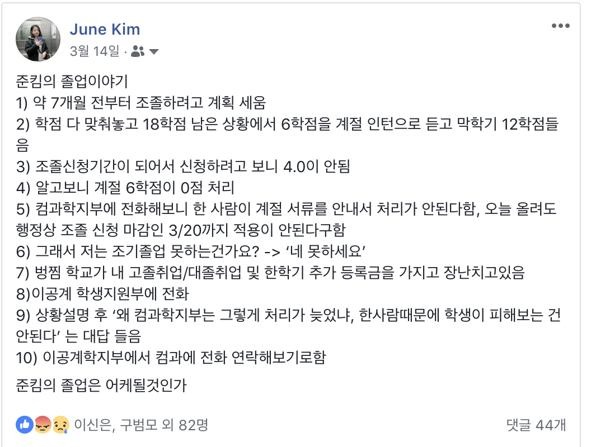
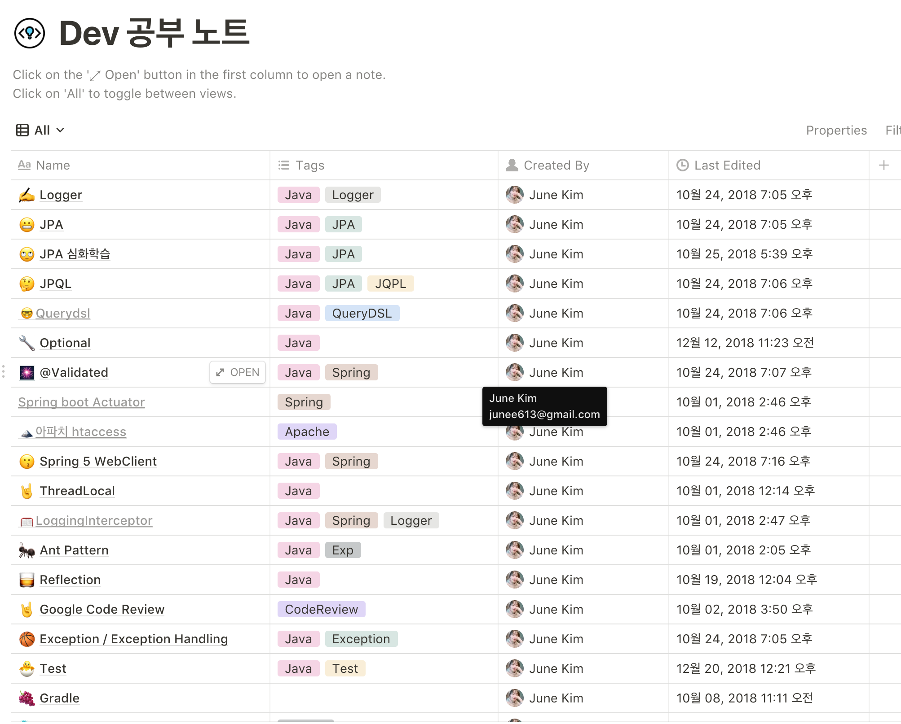

2017 회고를 쓰면서 2018에는..! 하는 마음이 있었던 것도 어제 같은데, 벌써 12월의 마지막 날이다. 

시간 순으로 할까, 주제 순으로 할까, Good, Bad로 할까 고민했는데, 일단 주제순으로 가도록 한다. 

## 졸업, 그리고 ..

### 1월 :: 2월

휴학이 끝나고 겨우 2학기를 마친 후, 숨돌릴 틈도 없이 `코드스쿼드`에서 인턴을 했다. (개인 블로그지만) 이 자리를 빌어 JK 마스터님께 정말 감사를 표한다. 학교의 얼토당토않는 행정처리 일정에 한줄기 빛처럼 내려와 인턴을 하게 되었다. 

이때 코드스쿼드 수료증 시스템과 관리툴을 `python & django` 로 만들었다. Github 로그인 - OAuth2 로그인과 토큰 개념, jwt 개념, vue 끄적이기, google docs 긁어와서 코드스쿼드 맛집 봇 만들기 (?),  AWS 에 DB랑 웹어플리케이션 서버 나눠서 배포하는 것 등을 익혔다. NAT 해보고. nginx 로 배포도 해보고.. 아무것도 모르면서 겁도 없이 물어보고, 고통받으면서 만들었다. 아 나 근데 원래 iOS 개발하려던거 아니야?

하지만 행복했다. 기획부터 개발까지 전부 다 했고, 매 순간이 배움이라 너무 재밌었다. 인턴급여를 받으면서도 이정도 가르침을 받았으면 돌려드려야하는 거 아닐까 싶을 정도. 그리고 김준영은 이때의 경험을 바탕으로 겁없이 서버 개발자 포지션에도 넣게 되는데... 

### 3월 

3월의 메인은 바로 이것이 아닐까. 재수를 하고, 또 1년 휴학을 한 탓에 마음에 조급함이 있었나보다. 아슬아슬하게 한학기 조기졸업 가능하다는 사실을 알고, 계속해서 설계, 설계를 했고 1-2월의 인턴도 그의 연장선상이었다. 

학부에서 제일 무섭다고 생각하던 교수님이 학과장님이었는데, 학과장님께 메일을 울면서 몇통 찔러서 (행정적 문제가) 해결됐다. 

지금이야 이렇게 담담하게 말하지만, 계획이 어그러지는 걸 못참아 못참아~~ 하는 성격이여서 계속 주변사람들 붙들고  나 졸업되냐..하고 물어봤다 (학우들이 어떻게 알겠어..) 죄송합니다..

### 4월 :: 6월 

본격적으로 구직을 준비하기 시작한다. 7월부터 해도 되지않을까? 졸업이 해결되면, 남은 한학기로 가능하지 않을까? 하는 생각이 있었으나, 조급했으므로 그냥 진행했다. 

지금 생각하면 7월부터 천천히 하라고 말해주고싶다.  너 방학 이제 평생없어.. 하고 속삭여줄텐데. 

평생의 숙원이던 게임회사 A, 메신저 회사 B, 금융 스타트업 C, 글로벌 오픈소스 스타트업 D, 그리고 지금 재직 중인 네이버에 지원서를 냈다. 

C, D는 직접 티타임 or 바베큐파티를 갖고 먼저 사람들을 만나 뵈었는데, 둘다 너무 호감가는 (개발자로서도, 인간으로서도) 사람들이 있었다. 하지만 스케쥴을 조정하는 과정에서 나의 구직 체력 부족으로 코딩테스트 전에 조심스럽게 포기의사를 전했다. 

A,B와 네이버는 코딩테스트를 통과하고 면접을 보러갔다. 

A의 면접이 가장 먼저 있었는데, WTM과 장고걸스, 학업까지 겹쳐 하나도 공부를 안하고 갔다. FE 포지션이었고, 아주 기초적인 질문에도 답을 못했다. CS에서도 탈탈 털렸다. 면접을 굉장히 꼼꼼하게 짚는다는 느낌을 받았다. 꽤 시간이 지난 뒤에 정성스러운 불합격 이유를 받을 수 있었다. 첫 면접이 가장 빡셌던 게 이후의 준비에 도움이 됐다. 

네이버는 면접에서는 기초적인 stack, queue, BFS... 등을 물어봤다. 이 정도만 하면 우리가 키워줄게~~~ 라는 느낌을 받았다. 서버개발자 포지션으로 지원했다. 

B는 공채 형식으로 진행된 시험이었다. iOS 신입 포지션으로, 전반적인 CS와 디자인패턴에 관해서 물어봤다. 면접관들이 가장 젊어서 팀이 젊구나! 싶었다. 디자인패턴은 답을 못하고, 네트워크는 싹 답해서 왜인지 서버 개발자분의 마음에 든 것 같았다. 1차를 붙어서 매우 고민했지만, 네이버를 붙은 이후로 마음이 놓여서 2차 면접은 안감.

이 와중에도 나의 12학점과 매주 나오는 퀴즈와 과제들은 내 발목을 잡고 있었다. 이 기간에 몸무게가 4키로 정도 늘었고 지금도 안빠진다(ㅋㅋㅋㅋㅋ) 받은 스트레스를 모두 먹는 것으로 풀어서, 위장장애도 심했다.

네이버가 가장 먼저 결과가 나왔고, 나의 체력을 최대한 아끼기 위해 그리고 다른 여러 상황을 고려해서 네이버로 결정했다. 스스로 '스타트업향' 인간이라고 생각했던 나에게는 나름 큰 결정이었다.

### 7월 :: 8월 

... 입사를 했다. 그리고 버려졌다.😨 적응할 새도 없이, 회사의 사정으로 인해 팀이 분해되었다. 매일 하는 게 팀에서 정해준 멘토님과 '어떤 개발을 하고 싶고' '그래서 준영님은 어느 팀으로 혹은 누구를 따라갈 것인가' 에 대한 고민을 나누는 일이었다. 

나는 분명 플랫폼 팀에 지원을 해서 왔지만, 서비스가 더 좋았다. 그래서 서비스를 하는 팀으로 가기로 했다. 이 과정에서 iOS 로 갈 수 있나요?!!! 했지만 서버로 와! 해서 그대로 서버 개발자가 되었다. 

분명히 코딩테스트도 파이썬으로 풀었는데, 어느 팀을 가든 자바랑 스프링은 쓸거라면서 먼저 스프링을 공부해두면 좋을 것이라고 추천을 받았다. 내가 포비님을 알고 있어서 다행이야. 자바지기님의 유튜브와 책을 보면서 기본적인 CRUD 게시판을 만들고, 공부를 했다.

### 9월 :: 12월 

하지만 이게 전화위복이 될 줄이야. 좋은 팀을 만났다. 그리고 좋은 멘토님을 만났다! 😭 

짧은 첫 팀 생활 중에도, 인간적으로 멋지신 분이다! 하고 생각하던 분이 같이 전배를 오시고, 사수가 되어 계속 공부를 봐주셨다.

정말 맘껏 공부할 수 있었고, 솔직히 어려운게 바로 풀리니까 속도가 장난아니었다. 

게다가 나는 조금이라도 질책을 받으면 정말 스트레스를 많이 받는 편인데, 질책이나 짜증 한번 없이 지도해주셨다. 개발자이전에 한 사람으로서 닮고 싶습니다.

더불어 중간에 Notion을 알게 된 이후로는 Dev 공부노트를 쭉쭉 쌓아갔다. 모르는 건 바로 적어두고, 나중에 시간이 나면 계속해서 공부해서 노트를 한 페이지씩 적어가는 방식. (지금 49개) 

하던 프로젝트를 접고 새로운 프로젝트를 시작하면서, 신입인 내 코드를 프로덕션에 내볼 기회가 생겼다. 😭 대박...근데 리더님 저 스프링 공부한지 2달밖에 안됐는데요... 

좋은 팀을 만나, 나의 역량보다 살짝 높은 목표를 받고, 꼼꼼한 코드리뷰를 받으면서 '어떤 개발자가 될 것인가' 에 대한 윤곽을 만들어나가는 중이다. 또 나름대로 '이 부분 관련해서는 준영님이 담당했어' 하는 파트가 생겨서 또 나름의 뿌듯함이 있다. 

연차만 보면 나보다 많이 높지 않은데, 엄청난 실력 차가 느껴지는 분도 있다. 이 분을 보고 또 마음을 새롭게 다지게 된다. `내가 몇년 뒤에 저분만큼 할 수 있을까?` 싶어서. 계속해서 자극받고, 매일 배운다. 좋은 동료가 이렇게나 중요하구나. 그래서 하반기에는 커뮤니티를 많이 나가지 않아도 충분했다.

## 커뮤니티

작년보다 참여는 적게, 운영은 더 많이 했다. 

- 4월 7일  Women Techmakers Korea 운영진 : 너무 좋아서 [후기](https://junebuug.github.io/2018-04-07/fastest-wtm-review)도 빨리 적었다.
- 4월 30일 장고걸스 서울 세미나 Real Python `운영`
- 6월 오픈핵 해커톤 디자이너로 `참가`
- 7월 장고걸스 서울 워크샵 `운영`
- 8월 파이콘 `참가` : 파이썬 짱이야 멋있어 짜릿해 회사들도 위트넘쳐
- 12월 장고걸스 서울 밋업 Hello Developers `운영`

새해에는 새로운 커뮤니티를 꾸려나가보려고 하는데, 많은 여성분들께 개발에 입문하는 데 있어 발판이 되길 열심히 소망하는 중이다. 

## 건강

상반기에 지속적인 급체와 두통이나,
두번의 위장장애로 인한 쇼크 기절 - 10월에 한번, 12월에 한번 - 이런 점은 내가 스트레스에 얼마나 취약하고 관리를 못하고 있었는지를 잘 보여준다. 

그나마 하반기에는 운동을 병행해서 컨디션이 많이 올라갔다. (그런데 갑자기 분위기 기절 ㅜ) 

## 여행

- 오사카 with 보우
- 속초 가족 여행
- 후쿠오카 당일치기 ( 아이폰XS와 돌아옴)
- 오빠 서프라이즈 미국 탐방 : 3개월 동안 거짓말 하느라 힘들었다. 다시는 안할 것임

## 올해의 BEST

### 게임 

- 단연 `Detroit: become human`이다.  이런 스토리 게임은 처음 해보았다. 연수의 추천으로 5시간동안 스토리 1/3을 보고, PS4를 사게 만들었다(...)
- 제 5인격 : 하세요 하세요, 저같은 쫄보도 합니다. 데바데의 귀여운 버전.
- 저스트댄스 2019 with 플스 카메라 : 최고야...... 공간이 있는 곳에 저와 제 플스를 불러주세요
- 듀랑고 : 1-2월을 바쳤는데 너무 심한 노가다로 포기했다.

### 지름 

- 아이폰 XS.
- PS4 와 플스 카메라
- 에어팟

### 만화 

음식만화를 진짜 많이 봤는데, 생각나는게 별로 없다. 

- 하이큐 (아껴보는 중) ,식극의 소마 ( 리액션 빼고 좋음 ㅜ,ㅜ)
- 녹풍당의 사계절 , 배달주문의 왕자님

## 신앙

2018 하반기 들어서 특히나 교회를 자주 빠지기 시작했다. 최소한의 양심이던 식기도ㅋㅋㅋ도 빼먹는 날이 생겼고, 이때 쯤 부터 가족이나 남자친구에게 화를 자주 냈다. 정말 사람이 간사한게, 좀 살만하니까 간절했던 과거의 자신을 잊는다. 부족한 저를 용서해주세요. 

# TODO

- 좀더 개발 공부를 열심히 하고 싶다. 내가 평생 개발자로 살지는 모르겠지만, 지금에 최선을 다하고 파. 스터디 1개 계획 중 ( Effective Java 3E : 연락주세요)
- 매일 QT
- 건강 챙기기 : 운동, 그리고 식단. 쓰러지지 않는 것이 1차 목표다.
- 일본어 배우기 : 서비스가 일본향이라, 만든 걸 확인 못해서 답답해죽겠다. 간단한 일본어라도 터득하고싶다.

## .

이렇게 일단은 2018을 마무리. 

일도 많고, 탈도 많고, 성장도 많았던 한 해였다. 

내년에도 잘 부탁드립니다.