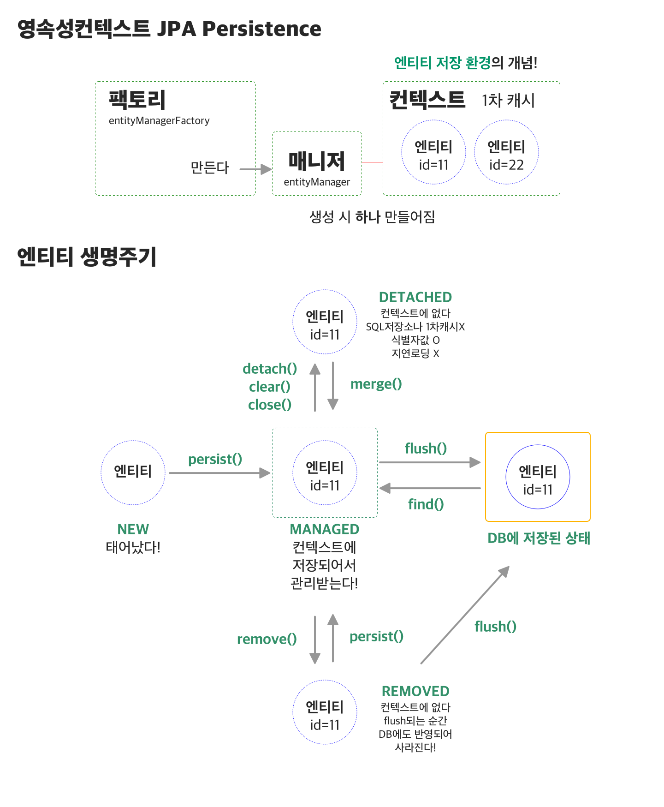

## 영속성 컨텍스트

JPA를 사용하고 테스트를 짜다보면 영속성 컨텍스트를 몰라서 오류를 겪게되는 일이 생긴다. 

그래서 한번은 짚고 넘어가야겠다는 생각에 참고글을 나름대로 정리해보았다.

## 정의

영속성 컨텍스트는 엔티티를 저장하는 환경이다. 엔티티 하나하나를 식별자 값(`@Id`)로 구한다. 

이 컨텍스트는 `EntityManager` 객체 당 하나가 만들어진다. (Manager는 팩토리에서 만들어진다.)

위 그림에서의 메소드는 `EntityManager.persist(entity)` 형태로 호출한다. 

영속성 컨텍스트가 관리하는 엔티티는 `영속상태(managed)`라고 말한다. 

## 특징

- JPA는 트랜잭션을 커밋하는 순간, 영속성 컨텍스트에 새롭게 저장된 엔티티를 데이터베이스에 반영한다.

    (컨텍스트에 저장되는 순간 DB에 바로 반영되는 게 아님 =) ) 

- **1차 캐시 사용**

    영속성 컨텍스트는 Map 형태로 엔티티를 저장하는데, 이를 **1차 캐시**라고 부른다.  `entityManager.find()`를 호출하면 1차 캐시를 뒤져서 먼저 찾고, 만약 없으면 DB에서 조회해서 1차 캐시로 가져온다. 그 다음 영속상태인 해당 객체를 반환한다. 

- **객체 동일성 보장**

    위에서 말했듯이 1차 캐시에 있는 Entity인스턴스를 반환하기때문에 같은 객체임을 보장한다! (key가 id인 map을 캐시로 사용하기 때문!)

- **쓰기 지연 지원**

    트랜잭션 커밋하기 전까지 entity를 DB에 저장하지 않고, 영속성 컨텍스트 내부에 SQL 저장소에 생성 쿼리를 저장해둔다.  트랜잭션을 커밋하면 저장소에 일괄 SQL를 보내서 저장한다. 

- **변경 감지**

    스냅샷이 존재해서,  flush 시점에 스냅샷과 엔티티를 비교해서 변경된 entity를 찾는다. 있으면 수정 쿼리를 날린다.

- **지연 로딩**

    프록시 객체를 로딩해두고 실제 사용할 때만 영속성 컨텍스트를 통해 데이터를 불러오는 방법.

    User 내부에  Badge 객체가 있으면, User를 로딩할 땐 Badge 프록시만 가져온다. 실제 badge에 접근할 때 영속성 컨텍스트에 있는 Badge 인스턴스를 가져온다.

    따라서 detached 상태이면 - 프록시 객체만 있는데 원본과의 연결이 없으므로 지연로딩이 불가능하다.

- **cascade 는 영속성을 따라 관리합니다**

    JPA 에서 엔티티 선언 시 cascade를 설정하면, 부모가 자식의 영속시점을 조절할 수 있다. 부모가 1차 캐시 들어갈 때 함께 같이 들어가고, 나올때 같이 나오는 등! 

---

참고: [https://hyeooona825.tistory.com/87](https://hyeooona825.tistory.com/87)