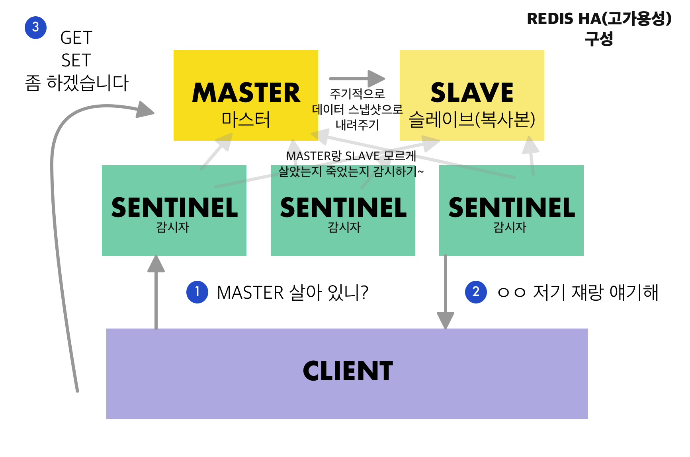

프로젝트에서 like 를 Redis로 관리하고 있다.

관련해서 한번 짚고 넘어가려고한다.

## Redis?

기본적으로 Storage, 즉 저장소이다. 가장 큰 특징은 메모리 기반의 Key-value 저장소라는 점이다. 

빠르고, 다양한 데이터 구조체(String, Set, Sorted Set ..)를 지원한다.

그래서 **큐로도, Cache로도, Dictionary, 세션용도**로도 다양하게 사용할 수 있다!

안정성은 보장할 수 없어서 주로 cache로 사용하는 모양이다. 

풀네임은 REmote DIctionary Sever. 공식홈페이지는 [https://redis.io](https://redis.io/) 다. 

### KEY - VALUE : 특정한 키 값에 값을 저장한다

json 처럼, 하나의 key에 하나의 value를 매핑하는 형태로 되어있다. (value의 모양은 다양하다).

key에 대해서 PUT, GET 하는 기능을 지원한다. 

### 다양한 데이터 구조체

- String
    - 일반적인 문자열을 지원한다. Text 문자열 뿐 아니라 숫자나 이미지 같은 바이너리 파일도 저장이된다.
- Set
    - 순서가 없는 집합이다. SET 간의 연산 (합집합, 교집합, 차집합)을 지원한다.
- Sorted Set
    - 순서가 생긴 집합! 오름차순으로 내부 정렬된다.
- Hash
    - hash 자체는 field - string 쌍으로 이루어진 구조체이다. 결국 이를 redis에 저장하면 key- field - string 쌍이 된다.
- List
    - String의 집합이지만 link list같은 형태이다. 앞뒤로 push와 pop이 가능하며, 순서가 있어 특정 위치를 지정할 수 있다.

### 메모리면 너무 위험한데.. 디스크에 데이터 저장하는 건 없어?

메모리에 데이터를 저장하면 서버가 꺼진 이후에는 데이터가 유실된다. 이런 것을 막기 위해서 디스크에 저장할 수 있다. 두 가지 방식이 있는 데 둘다 안일함..

- 스냅샷 방식(RDB) 방식
    - 순간적으로 메모리에 있는 내용을 전체를 사진을 찍어 옮겨 담는 방식
        - SAVE : 순간적으로 redis 동작을 정지시킨다음 사진을 찍는 방식
        - BGSAVE:  별도 프로세스를 띄워서 명령어 수행 당시의 사진을 찍음
    - 장점: 스냅샷 크기가 일정하고, 서버 리스타트시 스냅샷만 로드하면 되므로 리스타트 시간이 빠르다
    - 단점: 스냅샷 시점 이후의 데이터를 유실된다. 스냅샷을 찍는데 오래걸린다.

- AOF 방식 (Append On File)
    - 사용된 명령어들을 모두 로깅하는 방식. 서버가 재시작되면 순차적으로 명령어를 실행해서 데이터를 복구한다.
        - 장점: 로그파일에 append하기때문에 log write 속도가 빠르고, 서버가 다운되더라도 해당 시점까지 복구가 가능함
        - 단점: 무한히 늘어나는 로그파일... 데이터양이 갈수록 커진다. 따라서 리스타트 후 데이터가 복구되는 시간도 길다.
    - 요거를 좀 보완하기 위해서 **rewrite** 를 하기도 한다. write - delete 명령이 있다면 이를 삭제해서 좀 줄이는 식이다.

둘다 장단이 있고 안일해서(...) 섞어 써야한다고 한다.

### 싱글스레드 입니다

싱글스레드이기때문에 keys() 같은 명령어를 때리면 무한히 뒤에 명령어들이 기다리게 된다.

유의합시다~,~

### Master - Slave, 그리고 Sentinel

Redis 한대로는 유실의 위험이 계속 있고, Redis 자체가 죽을 경우가 있다. 

이때를 대비해서 Slave를 만든다. 그리고 주기적으로 master 정보를 slave에 내려준다. 

마스터와 슬레이브만으로는 서버가 내려갔을 때 보장을 하기가 어렵기 때문에 sentinel이라는 보초를 단다. 

그래서 마스터와 슬레이브가 살아있는지 계속해서 감시한다. 

안일한(...) redis에 비해 redis client는 상당히 스마트해야한다.

맨 처음에 바로 master에게 가는 게 아니라 

**sentinel에 먼저 master가 떠있는지 물어보고, 마스터에 접근해서 액션을 수행**한다. 

우리의 redis master는 sentinel이 자기를 감시하고 있는지도 모른다. 맹충이 

sentinel은 master에 문제가 생길 경우에 바로 slave에 바꿔치기하는 failover 를 수행한다. 

---
## Redis Cluster

**목적**

1000대의 노드까지 확장할 수 있도록 설계되었다 (서버의 갯수를 늘리는, scale out)

노드를 추가하거나 삭제할 때 클러스터 전체를 중지할 필요가 없게

키 이동시에만 해당 키에 대해서 잠시 멈출 수 있다

**그러면 키 할당은 어떻게 나눠?**

입력된 키가 있다고 하자. 그리고 레디스 서버가 10대 있다고 하자.

이때 입력된 키를 1-100 사이의 숫자로 바꿔주는 해시 함수(Hash function) 을 적용해서 변환한다.

그리고 1-10 의 키는 1번 서버에, 11-20은 2번 서버에, ... 91-100번은 10번 서버에 할당한다. 

이때 1-100의 숫자를 슬롯이라고  말한다.

레디스 클러스터는 16384개의 슬롯을 사용한다. (2의 13승이네) 

레디스 노드(서버)가 3개 일 경우, 1번 노드는 0-5460, 2번 노드는 5461 - 10922, 3번 노드는 10923-16383 슬롯을 갖게 된다. 

**얘네도 센티널 필요함?**

레디스 클러스터에는 별도의 센티널이 필요없다. 

센티널이 해주는 장애조치(failover)를 서로 서로 해주기 때문인데, 한 마스터가 다운될 경우 다른 마스터들이 장애조치를 진행한다. 마스터가 다운되어도 걱정 말라구~ 🙈

**못하는 건 뭐야?**

일반적으로 transaction이라고 부르는, 멀티 키 명령어는 못씀. (특히 data merge!) 

transaction이라고 하면 보통 명령어의 묶음이 atomic하게 (all or nothing)으로 실행되는 걸 의미하는데,

redis에서는 `MULTI`라는 명령어로 transaction 을 시작한다. 

하지만 redis cluster에서는 이런 명령을 수행할 수 없다! 일단 키들이 나눠져있는데, data merge를 실행한다고 하면 노드간 데이터를 전송해야한다. 성능이 우선인 redis에는 그런게 병목현상이 될 수 있고, 치명적인 현상이 되기 때문임!

---

참고

[http://redisgate.jp/redis/cluster/cluster_introduction.php](http://redisgate.jp/redis/cluster/cluster_introduction.php)

[https://bcho.tistory.com/654](https://bcho.tistory.com/654)