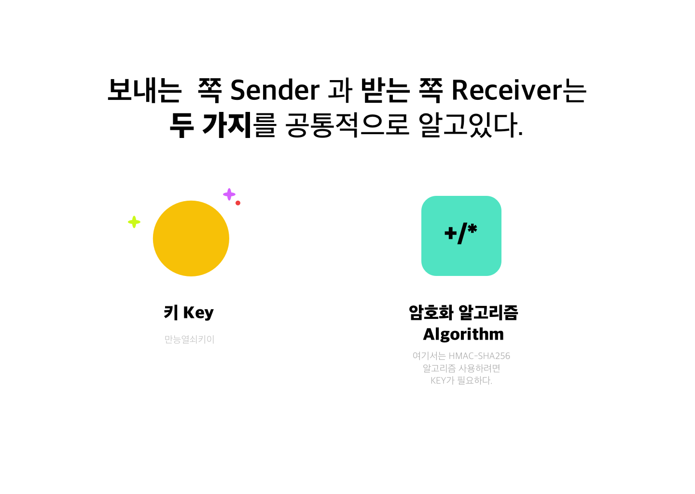
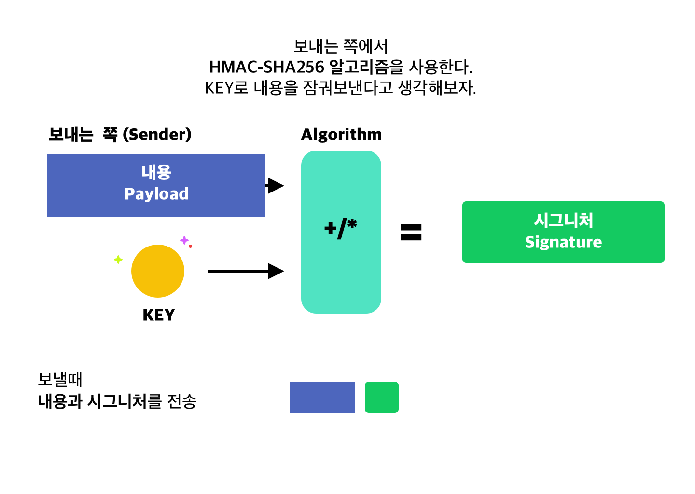
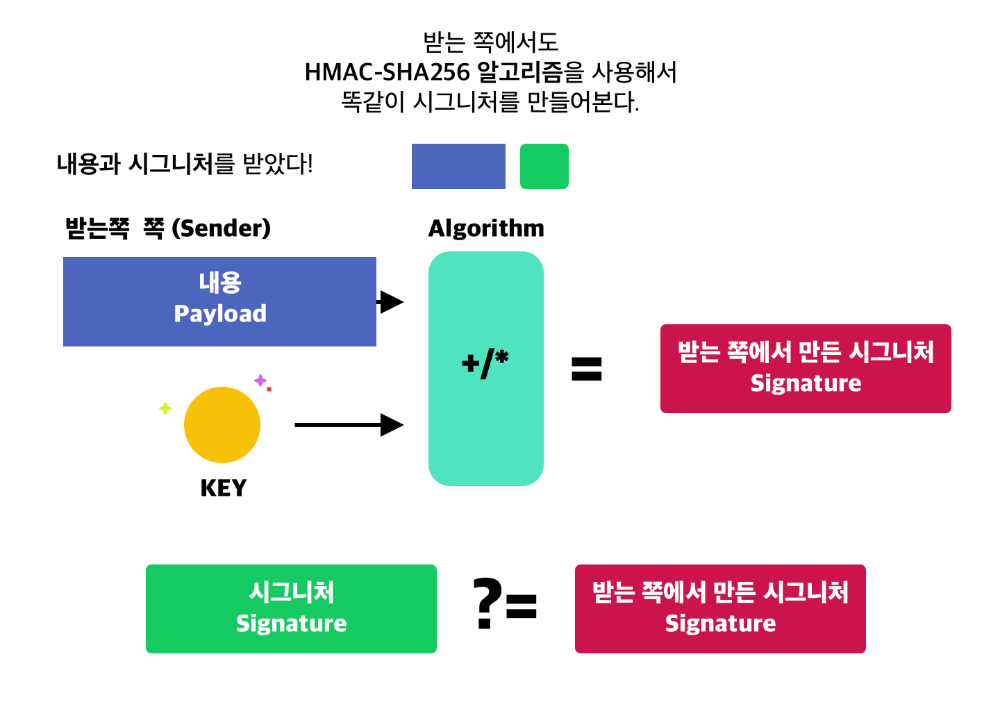

이번에 외부 시스템과 연동을 진행하면서, 인증을 *HMAC Signature*로 하게 되었는데요.

HMAC이 가물가물해서 =) HMAC에 대한 간략한 소개와,
Spring에서 어떻게 requestBody를 받아와서 HMAC Signature로 만드는지 샘플코드를 적어봅니다.


## HMAC? SHA-256? 이게 다 뭐야 😭

HMAC은 해싱기법을 이용해서 메시지의 위변조가 있었는지 체크하는 기법입니다.
(Hash-based Message Authentication)

해싱 자체는 원문 메시지를 일정한 길이의 다른 메시지로 변환하되, 일정 길이로 떨어지게 하는 기법인데요.
원문을 해싱하여 나온 메시지를 **다이제스트** 라고 합니다.

해싱의 결과는 유일하고(즉, A를 언제든 같은 해싱 기법으로 변환하면 항상 A' 가 된다), 
해싱을 풀어 원문을 찾아낼 수 없다는 것이 장점입니다.


그러면 HMAC을 사용해서
메시지를 전달할 때, 위변조가 되었는지 어떻게 알 수 있을까요?


### HMAC 으로 메시지 위변조 감지
1. 메시지 보내는 쪽과 받는 쪽을 가정합니다. 
   이 둘은 두 가지를 공통적으로 알고 있어야합니다. 
   **키** 그리고 **어떤 HMAC 알고리즘 사용할지** 입니다. (HMAC의 종류가 다양하므로)
   여기서는 HMAC-SHA256 알고리즘을 사용한다고 해보겠습니다.


<sub><p> hash 는 암호화는 아닙니다. 잘못 적었네요!</p> </sub>


2. 보내는 쪽에서 보내고 싶은 내용이 있고, 그리고 공통의 KEY가 있습니다.
   이를 사용해서 보내는 쪽에서**시그니처 Signature**라는 것을 생성합니다. 
   이 값은 메시지의 hash 값입니다. 
   KEY와 내용을 HASH 알고리즘에 적용하면, 시그니처가 생성됩니다.

   이렇게 해서 만든 시그니처를 내용과 함께 전송하게됩니다. 


3. 받는 쪽에서도 KEY를 알고있죠. 그리고 알고리즘을 알고 있습니다. 
   여기에서도 똑같이 Signature를 만들어봅니다. 
   그리고 이를 받은 Signature와 맞는지 검증합니다.




중간에 메시지가 위조되었다면, 
**보낸 시점의 메시지와 받은 시점의 메시지가 다르니까 signature도 다르게 나올것이다.** 
라는 것이 HMAC의 컨셉입니다.

만약 signature까지 위조하려고 해도, 위조자는 KEY 값을 모르니까 위조할 수 없다는 점이 장점입니다. 


### SHA256은 뭔지 설명은 하고 가라 👽

SHA- 시리즈들은 Secure Hash Algorithm 이라는 이름으로, 해시 알고리즘의 종류들을 말합니다. 
SHA-1, SHA-2 .. 등이 있는데요. 중간에 모든 숫자가 있는 건 아닙니다. 
SHA-2 는 다이제스트의 길이가 다양한데요, 이 중 다이제스트의 길이가 256byte인 것을 **SHA-256**이라고 합니다. 


## 그럼 코드로 어떻게 짜요?

수신측 입장에서 짜보도록 하겠습니다. 

미리 많은 사람들이 구현을 해두었기때문에 코드로 옮기는 것은 간단합니다. 

아래에서 `verifySigature`는 들어온 signature와의 비교, 
`getHmacSignature` 은 직접 signature를 만드는 메소드입니다. 

```java 

import javax.crypto.Mac;
import javax.crypto.spec.SecretKeySpec;

import org.apache.commons.codec.binary.Base64;
import org.apache.commons.lang3.StringUtils;

import lombok.extern.slf4j.Slf4j;

@Slf4j
@Component
public class SignatureVerifier {
    private static final String SIGNATURE_ALGORITHM = "HmacSHA256";

    @Value("${service.secret}")
    private String secret;

    public boolean verifySignature(String signature, String requestBody) {

        if (StringUtils.isBlank(signature) || StringUtils.isBlank(requestBody)) {
            return false;
        }

        String madeSignature = getHmacSignature(requestBody.getBytes());
        log.info("Sender-sent signature: {}, made signature :{}", signature, madeSignature);

        return signature.trim().equals(madeSignature);
    }

    public String getHmacSignature(byte[] requestBody) {
        byte[] key = secret.getBytes();
        final SecretKeySpec secretKey = new SecretKeySpec(key, SIGNATURE_ALGORITHM);

        try {
            Mac mac = Mac.getInstance(SIGNATURE_ALGORITHM);
            mac.init(secretKey);
            return Base64.encodeBase64String(mac.doFinal(requestBody));
        } catch (Exception ignored) {
            log.warn("Error occured processing Mac init - Exception : {}, secretKey: {}", ignored, secretKey);
            return "";
        }

    }
}

```

그리고 컨트롤러에서는 requestBody 전부를 받기위해서 다음과 같이 코드를 작성합니다. 

```java 

 @PostMapping("/endpoint")
    public ResponseEntity receiveEvent(@RequestHeader(value = X_SIGNATURE, required = false) String signature,
                                                   @RequestBody(required = false) String json) throws IOException {

        if (!verifier.verifySignature(signature, json)) {
            log.warn("Failed To verify signature.");
            return ResponseEntity.status(BAD_REQUEST).build();
        }
        //.. 생략
        return ResponseEntity.ok().build();
    }
```


HMAC-SHA256으로 위변조를 검토하고, 
인증에 사용하는 것은 흔한 패턴입니다. 

이 글을 찾으신 분들께 도움이 되셨으면 좋겠습니다. 


## 참고 

[http://blog.jakeymvc.com/sso-hmac/](http://blog.jakeymvc.com/sso-hmac/)