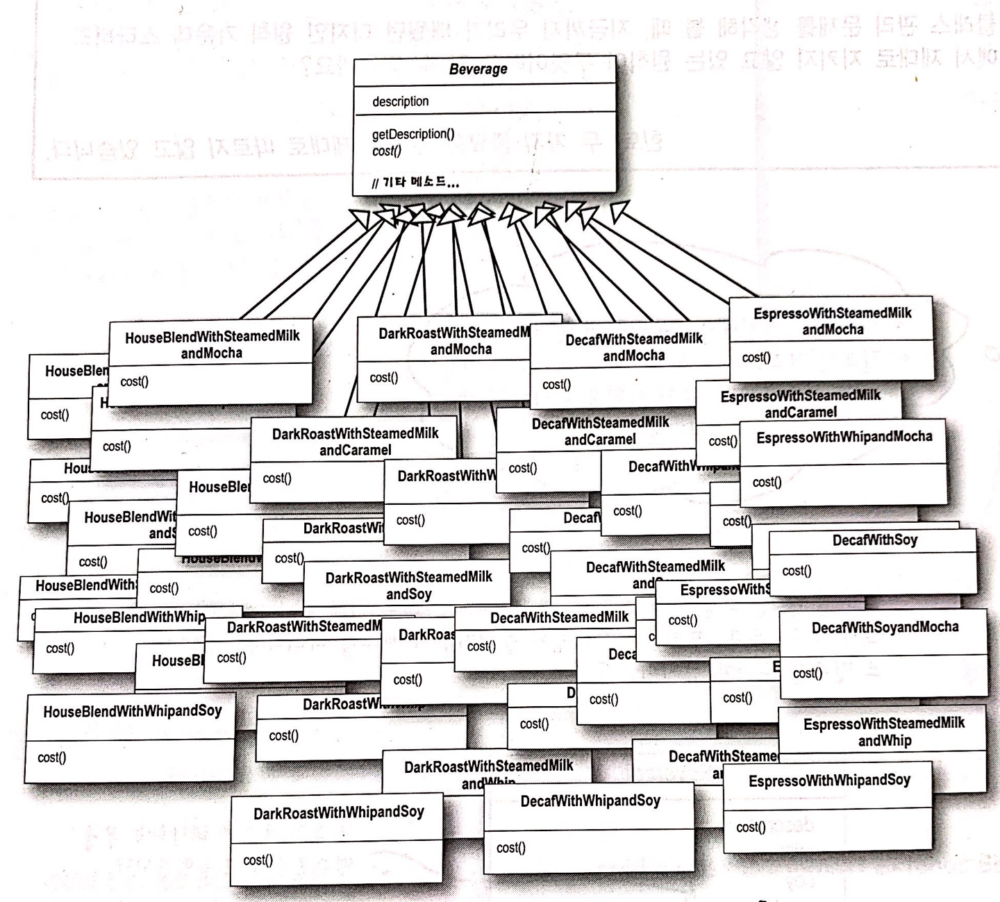
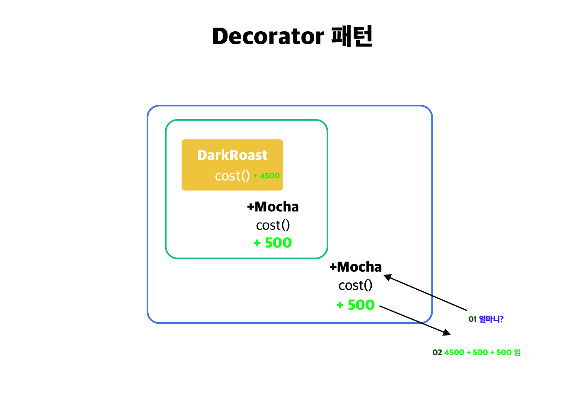
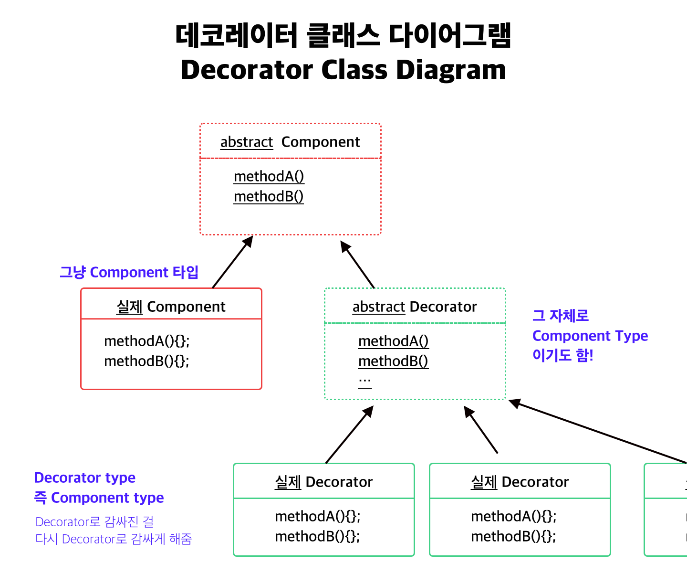

HEAD FIRST DESIGN PATTERN 을 정리합니다.

[01 스트레티지 패턴 보기](https://junebuug.github.io/2019-04-17/design-pattern-strategy)

[02 옵저버 패턴보기](https://junebuug.github.io/2019-06-12/design-pattern-observer)

# 03 데코레이터 패턴

## 스타버즈 예제 

커피전문점의 예제로 시작합니다. 
스타버즈 커피점은 워낙 빠르게 성장해서, 이제야 주문 시스템을 구축하려고 합니다. 

처음에 사용했던 음료클래스들은 `Beverage` 클래스를 `HouseBlend`, `DarkRoast` ... 등이 상속하는 형태였습니다. 처음엔 이런 방식이 편안했습니다.


그런데 커피에는 스팀 우유나 초콜릿을 추가하고, 휘핑크림을 얹기도 합니다. 이때마다 가격도 500원, 300원씩 추가되겠죠. 

그런 경우에는 이렇게 구성했습니다.




**상속** 형태로 시스템을 만들어서 어마어마하게 많은 클래스가 생겨버렸습니다 ! 😭


### 이렇게 해볼까요: 인스턴스 변수하고 슈퍼클래스 상속으로 관리 

'Beverage 안에 인스턴스 변수로 모카와 우유등을 넣으면 되잖아..?' 

그렇게 해볼까요. 아래 코드를 봐주세요.

```java
// pseudo code로 작성하겠습니다. 
public class Beverage {
    description;
    milk; 
    soy;
    mocha; 
    whip; 

    // ...
    float cost() {
        float cost = 0.0;
        if(hasMilk()){
            cost += 0.5;
        }
        .... 

        return cost; 
    }
    hasMilk();
    setMilk();
    hasSoy();
    // ... 중략
}
```

이를 상속한 HouseBlend는...
```java
public class HouseBlend extends Beverage {
    private float cost;

    cost(){
        return this.cost + super.cost();
    }
}
```
HouseBlend에서는 자신의 cost에, super class의 cost()를 호출해서 가격을 반환합니다. 


이 코드로 하면 클래스가 많이 줄어들게 됩니다.

이 코드의 문제점은 무엇일까요?

* 첨가물 가격이 바뀔때마다 코드를 수정해야함
* 첨가물 종류가 많아질 때마다 새로운 메소드 추가됨
* 새로운 음료가 출시되었을 때, 기존 첨가물을 못넣는 것일 수도 있습니다 - e.g) 아이스티에는 휘핑크림을 넣지않습니다. 하지만 여전히 whip을 상속받겠죠?
* 손님이 더블 모카를 주문하면 어떡하죠?


## OCP(Open-Close Principle)

위의 코드는 **확장을 위해서는 반드시 변경해야한다** 는 단점이 있는 것입니다. 

여기서 디자인 원칙을 새로 배워보죠. 


**디자인원칙 `클래스는 확장에 대해서는 열려있어야하지만 코드 변경에 대해서는 닫혀있어야한다.`**

처음에는 모순된 말처럼 보일 수 있습니다. 하지만, 확장과 변경은 다른 이야기입니다.
Observer 패턴에서 Observer를 코드 변경 없이도 추가(확장) 할 수 있었던 걸 떠올려보죠. 
Subject에 추가적인 코드를 변경하지 않고도 새로운 Observer를 등록할 수 있습니다.


왜 이렇게 디자인하는 게 필요할까요?
유연해서 주변 환경에 잘 대응하는 프로그램을 만들면서도,
코드를 변경하지 않아서 기존 코드가 망가지는 일을 막을 수 있기때문입니다.


## 그래서 Decorator 패턴을 사용해보겠습니다. 
위에서 본 것처럼 상속을 사용해서 계산한 방법은 좋은 방법이 아니었습니다. 
이제 Decorator 패턴을 써보겠습니다. 
우리는 이제 **기본 음료에서 시작해서 첨가물로 음료를 장식** 할 겁니다. 

예를 들어 모카모카 다크로스트를 주문한다면, 
1. DarkRoast를 가져온다
2. Mocha로 장식 한다 
3. Mocha로 한번 더 장식한다
4. cost() 메소드를 호출한다. 

직관적이지 않나요? 




> **데코레이터패턴**에서는 객체에 추가적인 요건을 동적으로 첨가한다. 

> 데코레이터는 서브클래스를 만들어서 기능을 유연하게 확장 할 수 있는 방법을 제공한다. 

이해하기 좋도록 클래스 다이어그램을 한번 보겠습니다.




`Component`는 위의 예제에서 HouseBlend에 해당합니다. 각 구성 요소는 직접 쓰일 수 도 있고 ('houseblend 하나요!'), 데코레이터로 감싸져서 사용될 수도 있습니다. ('housblend에 모카 휘핑 올려주시고 두유로 바꿔주세요.' )


`Decorator` 안에는 본인이 감싼 Component에 대한 정보(레퍼런스)가 있습니다. 

이를 구현한 `실제 Decorator (Concrete Decorator)` 는 Component 형이기도 합니다. 그래서 Decorator로 감싸진 객체도 여러번 감쌀 수 있게 됩니다. 


## 이제 예제에 Decorator 패턴을 적용해 봅시다 ⍩

```java 

public abstract class Beverage { // 위 다이어그램에서 component 이죠.
    // 멤버 변수
    @Getter
    public String description; 
    
    public abstract double cost();
}


public abtract class Decorator extends Beverage{
    public abtract String getDescription();

}


public class Espresso extends Beverage {

    public Espresso(){
        this.description = "에스프레소";
    }

    public int cost(){
        return 3000;
    }
}

public class Mocha extends Decorator{
    // 이 자체도 Bevergage 타입이죠. 
    Beverage bev; 
    
    public Mocha(Bevergae bev){
        this.bev = bev; 
    }

    public String getDescription(){
        return bev.getDescription + ", 모카";
    }

    public int cost(){
        return 500 + bev.cost();
    }

}

```

실제로 주문을 한번 해볼까요?

```java 

@Test
void orderMochaBev(){
    Beverage bev = new Espresso();
    bev = new Mocha(bev); // 에스프레소에 모카를 올렸습니다. 
    bev = new Soy(bev); // 에스프레소 + 모카 + 두유입니다.
}
```

`bev.cost()`를 호출하면 Soy -> Mocha -> Espresso 를 타고가서, 4500 + 500 + 500 의 값을 반환합니다.


## 하나만 더 봐요: Java I.O에서의 데코레이터 패턴 

`InputStream` 은 데코레이터의 대표적인 예입니다. 
자바 I/O 라이브러리에서는 `FileInputStream` , `StringBufferInputStream` , `ByteArrayInputStream` 과 같은 기본 구성요소(Component)들을 제공합니다. 

`FileInputStream` 을 볼까요, 

`FileInputStream`은  -> `BufferedInputStream` 으로 감쌀 수 있고 (이 데코레이터는 버퍼에 저장하고 readLine이 가능하게 해줍니다) -> 이는 다시 `LineNumberInputStream` 으로 감쌀수 있습니다. (데이터를 읽을 때 행번호를 붙여줍니다.)


### 단점도 있어요 

위의 예제들을 보다보면 단점을 발견할 수 있습니다. 

> 잡다한 클래스들이 많아집니다. 

하지만 어떻게 작동하는 지 이해하고 나면, 원하는 행동을 구현하기 쉽습니다. 

---

오늘은 3장 Decorator패턴에 대해서 정리했는데요.

도움이 되셨으면 좋겠습니다. 