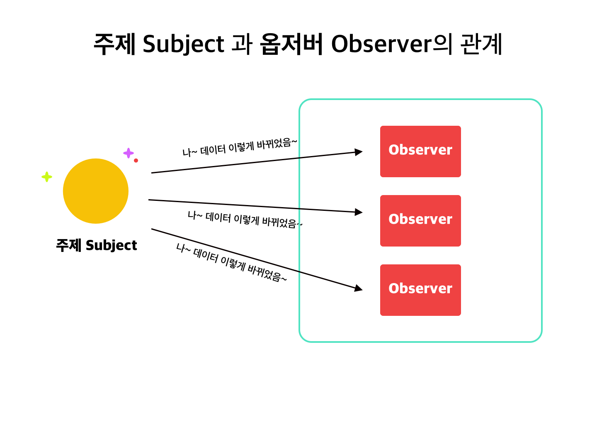
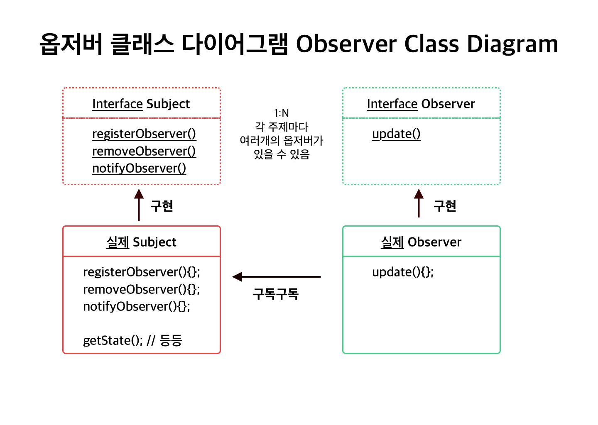

HEAD FIRST DESIGN PATTERN 을 정리합니다.

[01 스트레티지 패턴 보기](https://junebuug.github.io/2019-04-17/design-pattern-strategy)

# 02 옵저버 패턴

## WeatherData 예제 

기상정보를 알려주는 Weather Data 객체를 기반으로 디스플레이 장비를 만들어봅니다. 

WeatherData는 기상스테이션에서 받아오는 온도, 습도, 압력 정보가 있고 - 이를 표시하기만 하면 됩니다. 

```java 

public class WeatherData(){
    getTemperature(); 
    getHumidity(); 
    getPressure();
    measurementsChanged(); // 관측값이 변경될 떄마다 알려주는 메소드
}

```

### 조건
* 데이터가 변할 때마다 `measurementsChanged` 메소드가 불리고, 우리는 이때마다 디스플레이를 업데이트해야합니다. 
* 시스템이 확장 가능해야합니다. 


### 이렇게 만들면 어떨까요..? (나쁜 예)

```java

public class WeatherData{
    // 변수 선언 
    public void measurementsChanged(){
        float temp = getTemperature; 
        // humidity, pressure 도 가져오기 

        currentConditionDisplay.update(temp, humidity, pressure);
        // 다른 display 들도 똑같이 업데이트 .
    }
}
 
```
이 코드는.. 

* 구체적인 구현에 맞춰 코딩해서 프로그램을 고치지 않으면 다른 디스플레이를 넣을 수 없습니다.
* display.update 부분이 바뀔수 있어 캡슐화해야합니다.


## 옵저버 패턴 

옵저버 패턴은 신문 구독과 같은 매커니즘입니다. 
크게 주제 Subject 객체와 옵저버 Observer 객체가 존재하는데요. 
다음과 같은 흐름을 따라갑니다. 

1. 주제 객체에서 일부 데이터를 관리합니다. 
2. 옵저버 객체들은 주제 객체들을 **구독**하고 있으며, 주제의 데이터가 달라지면 갱신 내용을 전달 받습니다. 
3. 주제의 데이터가 **달라지면** 옵저버에게 그 소식이 전해집니다. 
4. 옵저버가 아닌 객체는 주제 객체의 데이터가 바뀌어도 아무런 연락을 못받습니다. 


> 옵저버 패턴에서는 한 객체의 상태가 바뀌면, 그 객체에 의존하는 다른 객체들에게 연락이 가고, 자동으로 내용이 갱신되는 방식으로 일대다 의존성을 정의합니다. 





### 옵저버 클래스 다이어그램 



여기서 데이터의 주인은 주제입니다. 옵저버는 주제의 데이터가 바뀌기를 기다리기때문에 
**주제에 의존성을 가진다** 라고 말할 수 있습니다.

### 옵저버 패턴에서는 주제와 옵저버가 느슨하게 결합 

> 느슨하게 결합한다는 말은 둘이 상호작용을 하긴하지만 서로에 대해서 잘 모른다 

는 것을 의미합니다. 

* 주제가 옵저버에 대해서 아는 것은 특정 인터페이스를 구현한다는 것 뿐입니다.
* 옵저버는 언제든지 새로 추가할 수 있습니다.
* 새로운 옵저버를 추가해도 주제를 변경할 필요가 없습니다.
* 주제와 옵저버는 서로 독립적으로 재사용할 수 있습니다. 
* 주제와 옵저버가 바뀌더라도 서로에게 영향을 미치지는 않습니다. 

느슨한 결합(loose coupling) 을 사용하면 변경 사항이 생겨도 
유연하게 처리할 수 있는 객체지향 시스템을 구현할 수 있습니다. 


## 옵저버로 WeatherData 예제 를 구현해봅시다. 

옵저버 패턴을 위 예제에서 구현해봅시다. 
WeatherData는 바뀌는 정보를 담고 있는 주제객체로, 
Display는 이를 구독하는 옵저버 객체로 매핑할 수 있습니다. 

```java 

public interface Subject {
    public void registerObserver(Observer o);
    public void removeObserver(Observer o);
    public void notifyObservers();
}


public interface Observer {
    public void update(float temp, float humidity, float pressure);
}

public interface Display{
    public void display();
}

// 구체적인 display 들은 Observer와 display 둘다를 구현합니다. 

```

실제 WeatherData를 한번 보겠습니다.

```java 
public class WeatherData implements Subject{

    // 변수, 생성자들 ...
    private List<Observers> observers; 

    public void registerObserver(Observer o){
        observers.add(o);
    }
    
    public void removeObserver(Observer o){
        int i = observers.indexOf(o);
        if (i >= 0){
            observers.remove(i);
        }
    }

    public void notifyObservers(){
        for(Observer o : observers){
            o.update(temp, humidity, pressure);
        }
    }

    public void mearsuremenetChanged(){
        notifyObservers();
    }
    // getter, setter
} 

```

수치가 변화할 때마다 Observer들에게 notify합니다. 


그러면 Observer 역할인 Display를 보겠습니다. 

```java 
@Slf4j
public class ADisplay implements Observer, Display{

    // 변수 
    private Subject weatherData; 

    public ADisplay(Subject weatherData) {
        this.weatherData = weatherData; 
        // weatherData를 주입받음 
        weatherData.registerObserver(this);
    }

    public void update(float temp, float humidity, float pressure){
        this.temp = temp;
        this.humidity = humidity; 
        display();
    }

    public void display(){
        log.info("Current conditions: {}, {}", temp, humidity);
    }
}

```

interface에서 상속받은 update, display 를 각각 구현하고 있습니다. 


## 추가로 - Observer 와 publish-sub 패턴은 뭐가 다를까? 

[참고](https://jistol.github.io/software%20engineering/2018/04/11/observer-pubsub-pattern/)

Publish - Subscribe 구조는 Observer와 비슷하지만 차이점이 있습니다. 

바로 중간에 **메시지 브로커** 가 존재한다는 것인데요. 
이렇게 해서 Pub-Sub구조에서는 아예 서로를 인지하지 못하게 됩니다. 
둘다 중간에 있는 브로커만 바라보게 됩니다. 

* 브로커가 message queue를 많이 쓰기때문에, async방식임 (queue에서 나올 때 sub에게 전달)
* observer보다 더 loose 한 coupling


-

오늘은 2장 Observer패턴에 대해서 정리했는데요.

도움이 되셨으면 좋겠습니다. 