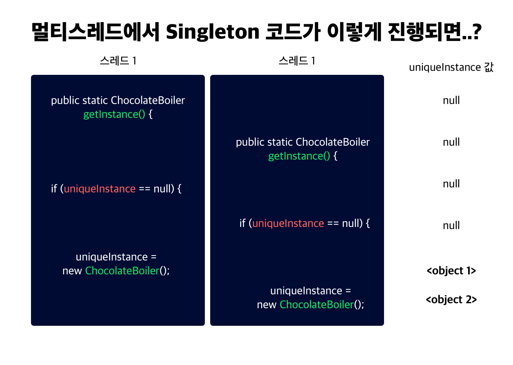

HEAD FIRST DESIGN PATTERN 을 정리합니다.

[01 스트레티지 패턴 보기](https://junebuug.github.io/2019-04-17/design-pattern-strategy)

[02 옵저버 패턴보기](https://junebuug.github.io/2019-06-12/design-pattern-observer)

[03 데코레이터 패턴보기](https://junebuug.github.io/2019-06-12/design-pattern-decorator)


드디어, 면접 때 답하지 못했던 싱글턴 패턴입니다. 
(코드를 쓸수가 없었죠 =))

디자인 패턴을 이걸로 먼저 들어보신 분들도 많을 것 같아요. 같이 간략하게 훑어보았으면 좋겠습니다. 🙂

# 04 싱글턴 패턴

싱글턴 패턴은 인스턴스가 객체를 **하나만** 만들수 있도록 해주는 패턴입니다. 

이런 패턴이 왜 필요할까요?.? 그냥 객체 하나 만들고 다른 객체 만들지마! 하고 가이드 주면 되는 것 아닌가요?

## 용도 

* 스레드 풀, 캐시, 대화상자, 사용자 설정이나 레지스트리 설정을 처리하는 객체, 로그 기록용 객체, 디바이스 드라이버 ... 

위에 열거한 것들은 인스턴스를 두개 이상 만들게 되면 오히려 `프로그램이 이상하게 돌아간다든가`, `자원을 불필요하게 잡아먹는다든가,`,
`결과에 일관성이 없어진다든지` 하는 문제가 생길 수 있습니다. 


## 왜 전역 변수를 쓰지 않나요? 

전역 변수를 사용하면 싱글턴 패턴처럼 어디서든지 액세스할 수 있습니다. 그런데 왜 사용하지 않는걸까요?
전역 변수에 객체를 대입하면 애플리케이션이 시작될때 객체를 (무조건) 생성합니다. 그런데 그 객체가 자원을 많이 차지하고, 
한 번도 안쓴다고 생각해 봅시다. 그러면 자원만 잡아먹는 경우가 되겠죠?

싱글턴 패턴을 사용하면 필요할 때만 객체를 만들어 시작할 수 있습니다. 

## 고전적인 방식의 싱글턴 패턴 

고전방식의 싱글턴 패턴은 private 생성자를 사용합니다. 

> private 생성자를 사용하면 인스턴스를 어떻게 만드나요? 

```java 
public class Singleton {
    private static Singleton uniqueInstance; 

    // 기타 변수 

    private Singleton() {}

    public static Singleton getInstance(){
        if (uniqueInstance == null ){
            uniqueInstance = new Singleton(); // 기존에 사용되던 인스턴스가 없으면 만들어준다. 
        }
        
        return uniqueInstance; 
    }
}
```


위와 같이 `getInstance`라는 static 메소드를 통해서 만들 수 있습니다. 
인스턴스가 없었다면, 호출 시점에 인스턴스가 생성되어 나타나죠.
아주 효율적인 방식입니다!

## 초콜릿 보일러 예제 

초콜릿 공장에서는 초콜릿 보일러를 컴퓨터로 제어합니다.
이를 위해 초콜릿 보일러 클래스를 작성했습니다. 

```java 
public class ChocolateBoiler {
    private boolean empty; 
    private boolean boiled; 

    public ChocolateBoiler() {
        empty = true; 
        boiled = false; 
    }

    public void fill() {
        if(isEmpty()){
            empty = false;
            boiled = false; 
        }
    }

    public void drain(){
        // .. 상태 제어
    }


    public void boil(){
        // .. 상태 제어
    }
    // isEmtpy 함수 (empty 값 반환)

    // isBoiled 함수 (boiled 값 반환)
}

```
꽤 세심한 주의를 기울여서 작성했다는 것을 알 수 있습니다. 하지만.. 만약 상태값이 다른 CholateBoiler가 두개 이상 만들어진다면 어떨까요?
제어가 어렵고 혼란을 유발하게 될겁니다. 

초콜렛 보일러는 **단 하나의 인스턴스** 만 있어야합니다. 

다음 코드로, 초콜렛 보일러를 싱글턴으로 변경해보겠습니다. 

```java
public class ChocolateBoiler {

    private boolean empty; 
    private boolean boiled; 
    private static ChocolateBoiler chocholateBoiler; 

    private ChocolateBoiler() {
        empty = true;
        boiled = false; 
    }

    public static ChocolateBoiler getInstance(){
        if (chocolateBoiler == null ){
            chocolateBoiler = new ChocolateBoiler();
        }
        return chocolateBoiler; 
    }
    // .. 생략
}
```

## 싱글턴 패턴 - 다시 정의 

> 싱글턴 패턴은 해당 클래스의 인스턴스가 하나만 만들어지고, 어디서든지 그 인스턴스에 접근할 수 있도록 하기 위한 패턴입니다. 


## 멀티 스레드 상황에서 싱글턴

위의 초콜릿보일러를 최적화하려고 멀티 스레드를 사용하면서부터 문제가 생겼습니다. 싱글턴 코드가 동작하지 않고 새로운 인스턴스가 생겼습니다. 
멀티 스레드가 문제인걸까요?

다음 그림을 보시죠.




멀티 스레드에서 진행하니까 서로 다른 uniqueInstance가 생성되었습니다! 

### 해결방법

`getInstance`를 동기화 시키면 멀티스레딩 문제가 해결됩니다. 

```java 

    // 생략 
    public static synchronized Singleton getInstance(){
        if (uniqueInstnace == null) {
            uniqueInstance = new Singleton();
        }
        return uniqueInstance;
    }
```

`synchronized` 키워드를 사용하면, 한 스레드가 메소드 사용을 끝내기 전까지 다른 스레드는 기다리게 됩니다. 
즉 동시에 이 메소드를 접근하여 실행하는 일은 생기지 않습니다. 
하지만.. 

* 동기화를 하면 속도 문제가 생깁니다.
* 동기화가 필요한 시점은 이 메소드가 시작되는 부분 `if (uniqueInstance) == null ` 뿐입니다. 

몇가지 방법을 생각해봅시다 =) 

1. getInstance()의 속도가 중요하지 않다면 위의 코드를 씁니다. 
   - 메소드를 동기화하면 성능이 100배 정도 저하됩니다. 하지만 이게 병목으로 작용하지 않으면 괜찮을 수 있습니다.

2. 인스턴스를 필요할 때 생성하지 말고, 처음부터 만들어버립니다. 
   - SingleTon 인스턴스를 반드시 생성합니다. 
   ```java
   public class Singleton {
       private static Singleton uniqueInstnace = new Singleton(); 
       // 생략
   }
   ```
   - 하지만 이러면 앞서 지적했던 전역변수의 단점을 안고 갑니다... 

3. **DCL(Double Checking Locking) 을 사용해서 동기화 되는 부분을 줄입니다.** 

앞서 동기화가 필요한 부분은 제한되어있다는 점을 지적했습니다. 그러면 메소드 일부에서만 synchronized 예약어를 사용하면 어떨까요?
```java
 public class Singleton{
     private volatile static Singleton uniqueInstance;
     
     private Singleton() {}

     public static Singleton getInstance(){
         if (uniqueInstance == null) {
             synchronized (Singleton.class) {
                 if (uniqueInstance == null) {
                     uniqueInstance == new Singleton();
                 }
             }
         }
     }
     // 생략 

 } 
```

volatile 키워드는 변수를 메인 메모리에 저장한다는 의미입니다.
즉 멀티 쓰레드가 생겨도 전역적으로 바라볼 수 있는 곳에 저장한다는 뜻이죠. 멀티쓰레드 환경에서 변수를 thread-safe하게 사용하기 위함입니다. 

인스턴스가 있는지 확인하고 동기화된 블럭으로 들어갑니다.
블록으로 들어온 이후에도 다시 한번 변수가 null인지 확인한 다음 인스턴스를 생성합니다. 

---

오늘은 4장 Singleton패턴에 대해서 정리했는데요.

도움이 되셨으면 좋겠습니다. 
