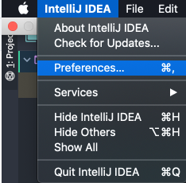
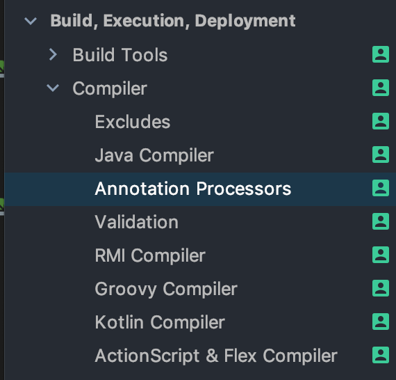
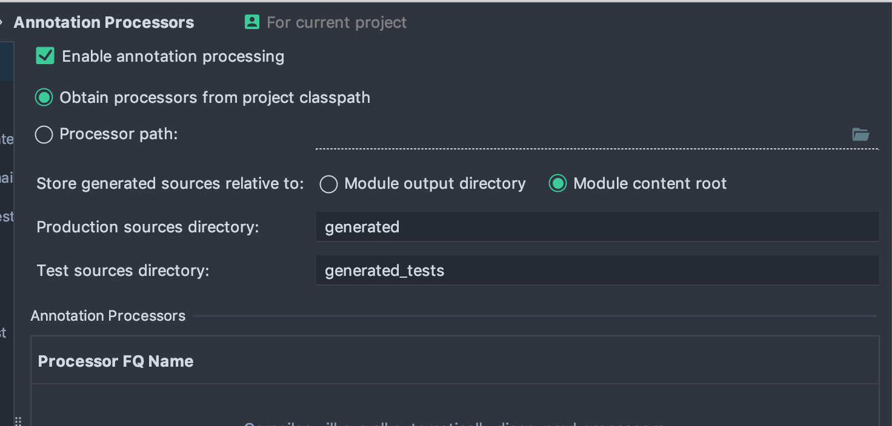

intelliJ 로 querydsl 설정 시, Q 객체를 생성하여 저장할 폴더를 주로 따로 저장해주곤 합니다. 

저희 프로젝트 같은 경우에는 

```groovy
def generated = 'src/main/generated'
```

로 설정하여 **모듈 하위에** generated 폴더가 생성되도록 해두었는데요. 다른 팀원들은 모두 되는데 저만 해당 폴더가 생성되지 않고, 더불어 `out` 하위에 generated 가 생성되었습니다. 이런 경우 빌드는 정상적으로 되지만, queryDsl 의 Q객체를 인식하지 못하고 querydsl 자동완성을 사용할 수 없게 됩니다. 

그래서 필요한 커스텀 쿼리를 짜는데 난항을 겪었왔습니다. 이번에 맘 잡고 해결해보자! 해서 해결법을 알게 되어 공유드립니다. 

## 해결법 

1. 인텔리제이 좌측 상단의 intelliJ IDEA 를 눌러 Preferenece로 들어갑니다.
    


02. Build, Execution, Deployment  > Compiler > Annoatation Processor 로 들어갑니다. 
    


3. Enable Annotation Processor를 체크합니다. 저와 같은 상황이셨다면 `Store generated relative to` 가 `Module output directory`로 설정 되어 있었을 겁니다. 이를 `Module Content root` 로 변경해줍니다.
    


-

자동으로 gradle 빌드가 다시 돌고 확인해보시면 Q객체들이 레퍼런스를 찾아 빨간줄이 뜨지 않습니다. =) 

오늘도 누군가에게 도움이 되었으면 좋겠습니다. 


