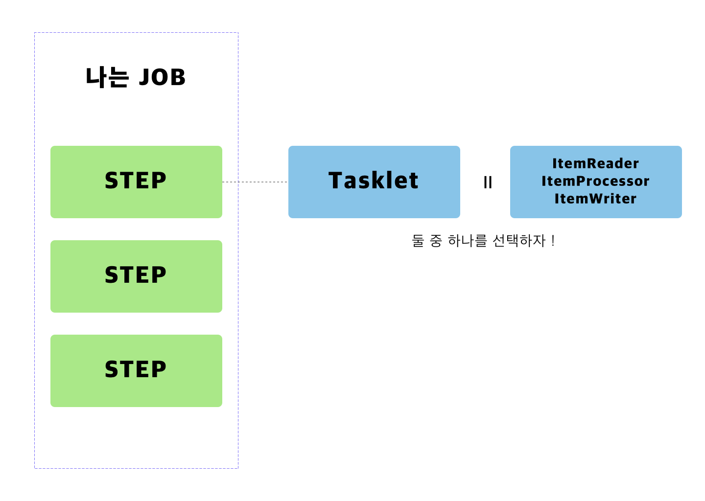

매번 일반 API 만 하다가 처음으로 Spring Batch 를 작성할 일이 생겼습니다. 

이럴 때를 대비해서 저장해둔 
[jojoldu님의 Spring batch 가이드](https://jojoldu.tistory.com/324) 를 참고해서,
기본적인 내용을 학습하고 Tasklet으로 실제 Batch를 작성했던 내용을 정리합니다.


## 배치 어플리케이션이란 

간단하게 배치 어플리케이션이 무엇인지 정리해봅니다. 배치(batch) 는 **일괄처리** 라는 뜻을 갖고 있습니다. 
즉, 요청이 들어오는 대로 응답을 보내주는 일반 웹 어플리케이션과 달리, 배치를 사용하면 
큰 데이터를 한번에 처리하고, 해당 결과를 저장하거나 사용할 수 있습니다. 

> 데이터에 손댈 일이 있으면 API 를 만들어서 계속 호출해서 사용하면 되는 거 아냐? 

5만건, 10만건이 되는 데이터에 대해서 매번 API를 호출해서 처리를 한다면 실 서비스에 영향이 가게 됩니다. 
클라이언트에서 사용자가 사용해야할 I/O 를 차지하게 되고, 서버에 부하를 유발하게 되죠.

이럴 때 배치 어플리케이션을 사용하게 됩니다. 


## 본론 : Tasklet 

간단하게 생각하면, Spring Batch에서는 Job이 있습니다. 
Job은 여러개의 Step으로 구성되고, Step 은 Tasklet(기능) 으로 구성됩니다.
배치 작업 하나가 Job에 해당 됩니다. 즉 다음과 같은 그림입니다. 



일단 아는 한도에서 써봤습니다. tasklet은 그냥 일반적인 Component라고 생각하시면 됩니다. 
개발자가 이 STEP에서 하고 싶은 내용을 자유롭게 만들 수 있습니다. 

그럼 Tasklet을 한번 들여다 볼까요? 

```java

package org.springframework.batch.core.step.tasklet;

import org.springframework.batch.core.StepContribution;
import org.springframework.batch.core.scope.context.ChunkContext;
import org.springframework.batch.repeat.RepeatStatus;
import org.springframework.lang.Nullable;

/**
 * Strategy for processing in a step.
 * 
 * @author Dave Syer
 * @author Mahmoud Ben Hassine
 * 
 */
public interface Tasklet {

	/**
	 * Given the current context in the form of a step contribution, do whatever
	 * is necessary to process this unit inside a transaction. Implementations
	 * return {@link RepeatStatus#FINISHED} if finished. If not they return
	 * {@link RepeatStatus#CONTINUABLE}. On failure throws an exception.
	 * 
	 * @param contribution mutable state to be passed back to update the current
	 * step execution
	 * @param chunkContext attributes shared between invocations but not between
	 * restarts
	 * @return an {@link RepeatStatus} indicating whether processing is
	 * continuable. Returning {@code null} is interpreted as {@link RepeatStatus#FINISHED}
	 *
	 * @throws Exception thrown if error occurs during execution.
	 */
	@Nullable
	RepeatStatus execute(StepContribution contribution, ChunkContext chunkContext) throws Exception;

}
```

우리가 만들어야할 Tasklet은 인터페이스입니다. 이걸 구현하면 step의 tasklet으로 등록이 가능합니다. 
즉 실행할 내용을 `execute` 함수 안에 넣으면 해결됩니다. 

그런데 저는 실행 전후에 하고 싶은 일이 있습니다. 실행 전에는 유저 목록을 불러와놓고 싶기때문입니다. 
이를 위해서 `StepExecutionListener` 를 함께 구현합니다. 이를 구현하면 beforeStep과 afterStep을 사용해서 Step 전후에 원하는 일을 할 수 있습니다. 


위의 사실을 참고해서 실제 Tasklet을 작성해보았습니다. 

```java
public class SampleTasklet implements Tasklet, StepExecutionListener {

    private List<Long> userIds;

    private final NotificaitonService notificationService;
    private final UserRepository userRepository;

    @Autowired
    public SampleTasklet(NotificaitonService notificationService,
                                 UserRepository userRepository) {
        this.notificationService = notificationService;
        this.userRepository = userRepository;
    }


    @Override
    public void beforeStep(StepExecution stepExecution) {
        userIds = userRepository.findAllIds();
    }

    @Override
    public RepeatStatus execute(StepContribution contribution, ChunkContext chunkContext) {
        userIds.forEach(userId -> notificationService.send(userId, new Notification()));
        return RepeatStatus.FINISHED;
    }

    @Override
    public ExitStatus afterStep(StepExecution stepExecution) {
        return ExitStatus.COMPLETED;
    }
```


차례대로 beforeStep, execute, afterStep 순으로 실행됩니다. 

beforeStep에서는 원하는 유저의 id를 가져와서, execute에서는 알림을 보내고 반복 Status를 종료로 설정합니다. 
afterStep에서는 추가로 하고 싶은 것이 없어서 종료 상태만 설정해주겠습니다. 

이렇게 만든 Tasklet을 JobConfiguration에서 Bean으로 설정해줍니다. 

```java

    @Bean
    public Tasklet sampleTasklet(NotificationService service, UserRepository repository) {
        return new SampleTasklet(service, repository);
    }
```


그리고 바로 위에서 Step에 tasklet을 다음과 같이 설정해주시면 완성입니다. 
```java 
  @Bean
    public Step testStep() {
        return stepBuilderFactory.get("testStep")
                                 .tasklet(sampleTasklet(service, repository))
                                 .build();
    }
```

---

배치 어플리케이션은 기본적으로 1. 읽어서 2. 작업하고 3. 그 결과를 다시 저장하는 것이 대부분이기 때문에 
제가 본 코드들은 대부분 item reader - processor - writer의 과정을 거칩니다.

다만 가볍고 몇줄되지 않는 작업이며, writer 가 불필요한 경우 (위의 경우처럼) 이렇게 tasklet으로 처리하는 것도 
좋은 선택인 것 같습니다. 

--- 
참고 

[jojoldu님의 Spring batch 가이드 1편](https://jojoldu.tistory.com/324) 