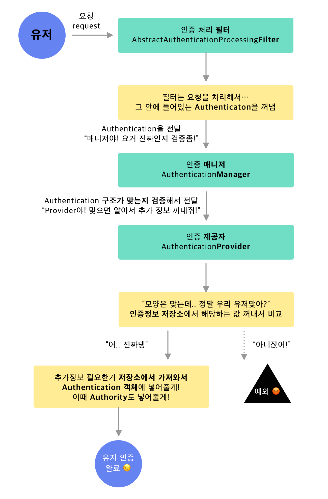
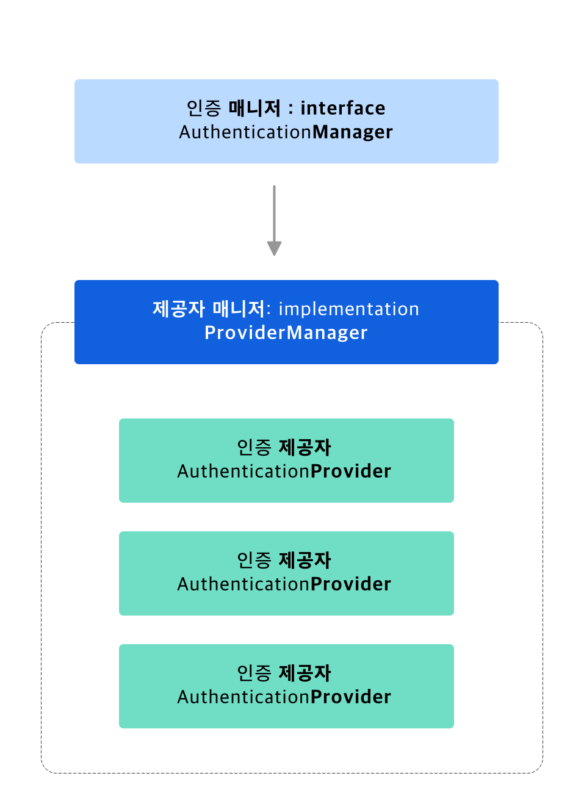

# Spring Security 

업무에서 사용하고 있으면서도, 쉽게 정리하기는 어려운 것 중 하나가 spring security 였는데요. 간단한 예제로 spring security를 적용할 기회가 있어 개념과 예제 코드를 정리해보려고 합니다. 설정은 다루지 않으니 이미 있는 코드를 보고 이해를 하시려는 분들께 추천합니다.

## Spring Security란?

자, 나는 토이프로젝트를 시작했다. 그리고 야심차게 form 으로 하는 로그인을 구현했다. '유저랑 로그인 구현했으니 프로젝트 반은 한거지!'  라고 생각할 무렵, 비로그인 유저에게는 어떤 API 를 사용하지 못하게 하고 싶어졌다. 그래서 Controller의 메소드 안에 **일일히** 현재 세션을 체크하는 코드를 넣었다. 
```java
@RestController
public SampleController {


    @GetMapping("/")
    void getMyInfo(){
        checkSession();
        // 정보를 가져오는데 필요한 코드 
    } 
    
    @PostMapping("/")
    void postMyInfo(){
        checkSession();
        // 정보를 만드는데 필요한 코드
    } 

}
```
중복되는 부분이 있지만, 괜찮다! 나름 따로 메소드로 뺐잖아(`checkSession`) ^^! 나는 멋진 개발자 👽  

🤔 그런데, controller 마다 이걸 매번 해줘야하나..? 

😨 로그인 유저 중에서 어드민 권한이 있는 유저만 사용하고 싶은 api 는 어떡하지?

😰 그럼 checkSession말고 checkAuthorities도 있어야해..?

점점 근심이 깊어진다 😭

이때 사용할 수 있는 Spring security는 스프링 어플리케이션의 보안, 즉 인증(너 누구니?, Authenticate) 와 인가(너 뭐할수있니?, Authorize) 를 담당하는 프레임워크입니다. Spring security를 사용하면 위의 근심걱정을 한번에 날릴 수 있는 접근 방식과 옵션을 제공합니다. 

위의 문제를 요약하면 두가지인데요.

- 매 요청마다 세션을 직접 검사해야함
- 매 요청마다 유저의 권한을 검사해야함

Spring security 는 **필터**(filter) 를 사용하여 이 부분을 깔끔하게 마무리할 수 있도록 도와줍니다.

## 구조



민트색으로 표시한 컴포넌트들을 봐주세요. 이 컴포넌트들이 함께 동작하면서 인증 로직이 완성됩니다. 

- 인증처리필터(AuthenticationProcessingFilter)
- 말 그대로 요청(HttpServletRequest)안에서 Authentication을 꺼내는 역할
- request 의 cookie에 인증 정보가 있을 수도 있고,
- form에 담겨서 올 수도 있다.(아이디, 비밀번호)
- 이걸 정제해서 매니저에게 넘겨줍니다 🧐
- 인증매니저(AuthenticationManager)
- 인증단계에 있어서, Spring security가 주 전략으로 사용하는 컴포넌트
- 딸랑 하나의 메소드(`authenticate`)만 존재합니다.
```java
    public interface AuthenticationManager {
    
        Authentication authenticate(Authentication authentication)
        throws AuthenticationException;
    
    }
```
- input으로 들어온 authentication이 유효한 principal(보호된 대상에 접근하는 유저)를 대표하고 있다고 판단하면 Authentication을 반환합니다.
- 유효하지 않은 principal인 경우, 에러를 던집니다.

> 그런데.. 인터페이스인데요? 🤔

- 주 구현체는 **ProviderManager(실제로 사용할 수 있는 녀석은 이 친구!)**
- ProviderManager는 아래 AuthenticationProvider 를 List로 가집니다.
- 그리고 사실상 일을 아래 AuthenticationProvider에 떠넘깁니다 😅 (delegate, 위임)
- 인증제공자(AuthenticationProvider)
- Manager의 `authenticate` 메소드 +  주어진 authentication type을 지원하는지 검사할 수 있는 메소드가 하나 더 있습니다.
- 실제로 인증이 일어나고, 성공하면 Authentication 객체의 `isAuthenticated` 를 true로 반환합니다.

그러니 실제 AuthenticationManager - AuthenticationProvider 관계는 아래와 같습니다 ✨



위에서 spring security 의 구조를 보면 filter를 통해서 작동하는 구조이죠. 

실제로 security 설정 파일을 보면 이렇습니다. 
```java
@Override
protected void configure(HttpSecurity http) throws Exception {
    // @formatter:off
    http.antMatcher("/api/**")
        .addFilterAt(authenticationProcessingFilter(), AbstractAuthenticationProcessingFilter.class)
        .authorizeRequests()
        .antMatchers(HttpMethod.POST, "/*/user/**").permitAll()
```
`configure` 메소드에서 filter 를 정해줍니다. 

설정된 **filter**안에는 filter의 요청을 처리해줄 **AuthenticationManager**가 정해져있고.. 

그 Manager의 실제 구현체는 **ProviderManager**입니다. 

그 안에는 **AuthenticationProvider**가 리스트로 제공됩니다. 
```java
// Filter를 반환
public Filter authenticationProcessingFilter() {
        CustomAuthenticatedProcessingFilter filter = new CustomAuthenticatedProcessingFilter();
        filter.setAuthenticationManager(new ProviderManager(Collections.singletonList(customAuthenticationProvider())));
        return filter;
    }

private PreAuthenticatedAuthenticationProvider customAuthenticationProvider() {
    PreAuthenticatedAuthenticationProvider provider = new PreAuthenticatedAuthenticationProvider();
    provider.setPreAuthenticatedUserDetailsService(new customUserDetailService());

    return provider;
}
```
### 저기.. UserDetails는 뭐고 UserDetailService는 뭐지?

위 구조에서 **추가정보를 저장소에서 가져와서 Authentication에 넣어줄게!** 라는 부분 기억하실까요. 

여기에서 추가 정보라는 것이 UserDetails 라고 생각하시면 됩니다. 

Authentication에 추가정보를 UserDetails의 형태로, principal 이라는 이름으로 들어가는 것이죠.
```java
public interface Authentication extends Principal, Serializable {
    
    Collection<? extends GrantedAuthority> getAuthorities();


    Object getCredentials();

    Object getDetails();

    /**
        * The identity of the principal being authenticated. In the case of an authentication
        * request with username and password, this would be the username. Callers are
        * expected to populate the principal for an authentication request.
        * <p>
        * The <tt>AuthenticationManager</tt> implementation will often return an
        * <tt>Authentication</tt> containing richer information as the principal for use by
        * the application. Many of the authentication providers will create a
        * {@code UserDetails} object as the principal.
        *
        * @return the <code>Principal</code> being authenticated or the authenticated
        * principal after authentication.
        */
// Object class가 UserDetails를 상속한 형태로 정할 수 있다. 
    Object getPrincipal();
```
다만 위에 나와있는 설명 대로, principal은 단순히 username이 될 수도 있고, 더 풍부한(richer) 정보를 담기 위해서 UserDetails 를 세팅해줄 수도 있습니다. 즉 UserDetails 와 UserDetails를 만들어서 넣어주는 UserDetails Service는 옵션입니다. 

각각의 예시를 한번 보겠습니다. 
```java
@Accessors(chain = true)
@Data
public class CustomUserDetails implements UserDetails {
    private User user;

    private Set<CustomGrantedAuthority> grantedAuthorities;

    @Override
    public Collection<? extends GrantedAuthority> getAuthorities() {
        return grantedAuthorities;
    }

    @Override
    public String getPassword() {
        return null;
    }

    @Override
    public String getUsername() {
        return null;
    }

    @Override
    public boolean isAccountNonExpired() {
        return true;
    }

    @Override
    public boolean isAccountNonLocked() {
        return true;
    }

    @Override
    public boolean isCredentialsNonExpired() {
        return true;
    }

    @Override
    public boolean isEnabled() {
        return true;
    }
}
```
UserDetails를 실제로 구현할 때는 `UserDetails` 를 implement  해주면 됩니다. 
```java
@Slf4j
@Service
public class CustomUserDetailService implements AuthenticationUserDetailsService<Authentication> {

    @Override
    public UserDetails loadUserDetails(Authentication token) {
        User user = (User) token.getPrincipal();

        if (user == null) {
            throw new PreAuthenticatedCredentialsNotFoundException("USER IS NULL");
        }

                // DB에 접근해서 직접 정보를 가져오는게 일반적입니다.
    
        return new CustomUserDetails().setUser(user).setGrantedAuthorities(user.getAuthorities());
    }

}
```
서비스를 구현할 때는 `AuthenticationUserDetailsService` 를 implement합니다. 

## 어떻게 쓰나요?

Spring security의 설정은 xml 혹은 Java Configuration으로도 가능합니다. 여기서는 후자로 진행합니다. 

저는 SecurityConfig라는 이름의 `@Configuration` 을 만들어주었습니다. 이는 WebSecurityConfigurerAdapter를 상속합니다. 이 클래스는 기본적으로 `configure`  메소드를 구현하게 되어있네요. 
```java
@Override
protected void configure(HttpSecurity http) throws Exception {
    // @formatter:off
    http.antMatcher("/api/**")
        .addFilterAt(authenticationProcessingFilter(), AbstractAuthenticationProcessingFilter.class)
        .authorizeRequests()
        .antMatchers(HttpMethod.POST, "/*/user/**").permitAll()
```
이제 이 아래에 antMatchers로 해당하는 uri와, 원하는 액션을 설정해주면 됩니다. 

- hasRole(Role) : 해당 Role 을 갖고있는 유저인 경우 허용
- anonymous : 익명 사용자 (즉 인증이 안된 사용자) 허용
- authenticated : 인증된 사용자 허용
- permitAll : 모든 사용자 허용
- denyAll : 모든 사용자가 사용 불가

## 결론

일단 사용하는 범위내에서 Spring security를 정리해보았는데요. 이정도면 기존에 구현된 코드를 이해하기에는 충분할 것 같습니다. 
잘못된 것이 있으면 열린 마음으로 피드백 부탁드립니다.


---

참고

[https://spring.io/guides/topicals/spring-security-architecture](https://spring.io/guides/topicals/spring-security-architecture)

[https://sjh836.tistory.com/165](https://sjh836.tistory.com/165)