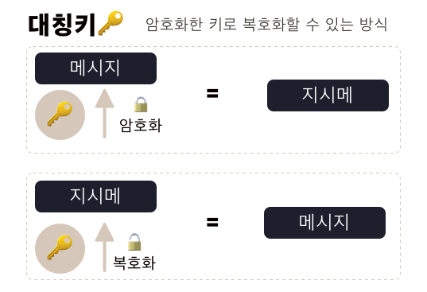
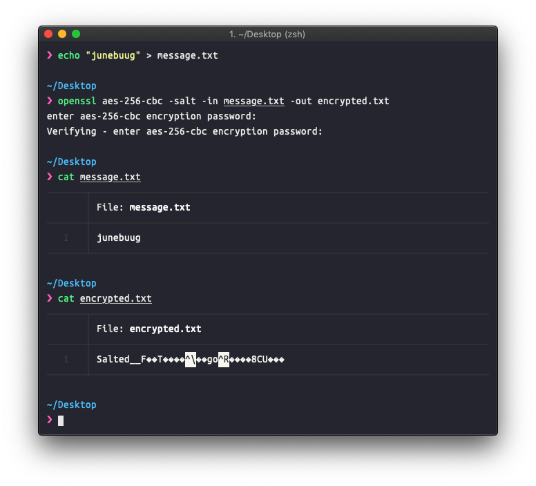
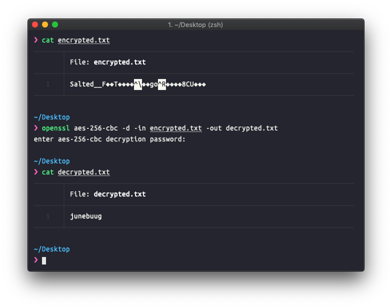
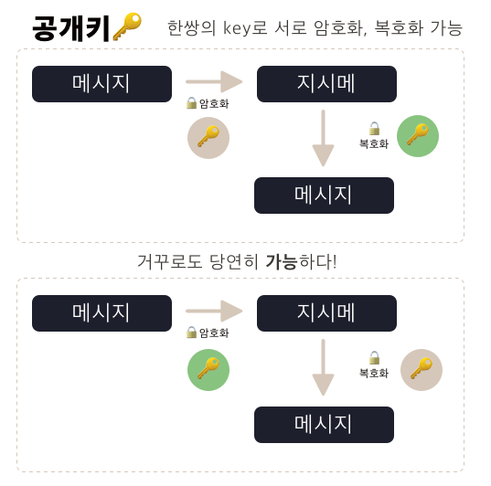
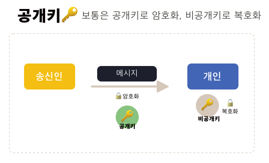
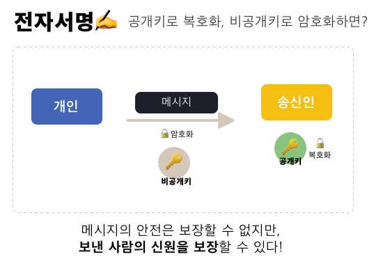

HTTPS의 S는 SSL이고.. SSL 인증서가 필요하고.... TLS는 또 뭐야.. 다른거야..? 블라블라 😔  매번 스리슬쩍 넘어갔던 내용들을 정리합니다. 간단한 정보보안개념  + 네트워크 개념이 포함되어있습니다. 잘못된 내용이 포함되어있는 경우 둥글게 수정 요청 주세요.

## SSL/TLS

### 이름 어려워!

위에서 말했던 의문을 먼저 해결해보면... SSL와 TLS는 **동일한 개념**이라고 생각해도 좋을 것 같네요. 엄밀히 말해서, SSL 이라는 암호 규약이 이전에 있었고, 이가 표준으로 만들어진 **공식 이름**이 TLS(Transport Layer Security 전송 계층 보안)입니다. (그런데 왜 Transport layer에 해당하지 않는 걸까요? 🧐 TLS/SSL는 OSI의 가장 위 Application layer에 해당한다고 적혀있네요.) SSL(Secure Sockets Layer, 보안 소켓레이어) 는 넷스케이프에서 처음 만들었으며, 1.0 → 2.0 → 3.0 으로 버전업하다가 3.0에서 TLS 1.0의 기초가 됩니다. 

그런데 아무튼 사람들은 SSL라는 이름을 더 많이 사용합니다. 딱 들었을 때 두 개가 같은 개념을 말하고 있는 규약이라는 것만 알아둡니다. 이 글에서는 SSL를 사용하겠습니다.

### 그래서 무슨 개념이야

SSL 프로토콜은 클라이언트 - 서버간 통신할 때, 위조와 도청을 방지하자! 라는 목적으로 만들어진 규약입니다. 구체적으로는 **CA**(Certificate Authority) 라는 제 3자가 서버와 클라이언트 간 통신을  보증 해줄 때 사용됩니다. 

클라이언트가 서버에 접근할 때, 서버는 나 인증받았어! 라는 증거로 CA에서 발급 받은 SSL 인증서를 내밉니다. 이 인증서가 진짜이면, 신뢰 가능한 서버라는 것이죠. 

## HTTP 와 HTTPS

HTTP (HyperText Transfer Protocol)는 우리가 숨쉬듯이 사용하는, 인터넷 상에서 정보를 주고 받기 위한 프로토콜입니다. 클라이언트와 서버 사이에 이루어지는 request - response 를 어떻게 쓸 건지, 에 대한 약속이죠. 암호화되지 않은 방법으로 데이터를 전송하기 때문에 악의적인 감청이나 변조의 위험이 있죠.

HTTPS는, HTTP over SSL 입니다. 즉 HTTP인데, SSL를 사용해서 네트워크로 보내지기전에 암호화하여 보안을 강화한 버전이라고 볼 수 있습니다.

## SSL의 암호화 방식

SSL의 핵심이기도 한 암호화는 두가지 방식으로 진행됩니다. 하나가 대칭키 방식, 다른 하나는 공개키 방식 (비대칭 키 방식) 인데요. 이 두개를 간단하게 알아보겠습니다.

### 대칭키 방식

암호화는 암호를 만드는 행위를 의미합니다. 복호화는 암호를 푸는 행위를 의미합니다. 키는 암호화나 복호화에 사용되는 일종의 비밀번호입니다. 이 키에 따라서 암호화된 결과가 달라집니다. **대칭키 방식에서는 암호화한 키를 가지고 다시 메시지를 복호화할 수 있습니다**. 즉, 암호화할 때 abcd라는 키를 입력했다면, 복호화를 할 때도 abcd라는 값을 입력해야 합니다.

대칭키는 **키가 하나!** 라고 기억하면 좋을 것 같습니다.



**암호화하기**


```bash
    echo "junebuug" > message.txt
    # junebuug 이라는 내용을 파일로 만들고
    ❯ openssl aes-256-cbc -salt -in message.txt -out encrypted.txt
    # openssl 로 대칭키 암호화를 합니다. 암호화 방식은 aes-256입니다. -salt 옵션으로 암호화된 내용에 랜덤한 string을 추가해줍니다.
    # 암호화할 파일은 message.txt이고 결과는 encrypted.txt에 저장해주세요.
    enter aes-256-cbc encryption password:
    # 원하는 key 를 입력합니다.
    Verifying - enter aes-256-cbc encryption password:
    # 한번 더 입력해주세요. 
```
**복호화하기** 


```bash
    ❯ openssl aes-256-cbc -d -in encrypted.txt -out decrypted.txt
    # openssl로 대칭키 복호화를 합니다. 방식은 aes-256입니다. -d 옵션으로 복호화임을 지정해줍니다.
    # 복호화할 파일은 encryted.txt이고 그 결과값은 decrypted.txt에 저장해주세요.
    enter aes-256-cbc decryption password:
    # 암호화시 사용했던 키를 입력해주세요.
```
대칭키 방식은 가장 일반적인 암호화방식이지만 단점이 있습니다. 키가 유출되는 경우, 암호가 무조건 복호화 할 수 있기때문에 암호가 무용지물이 됩니다. 그렇기 때문에 암호를 주고 받는 주체들 간 키 전달이 매우 조심스럽습니다. 

이러한 배경에서 나온 것이 공개키 방식입니다.

### 공개키 방식 (비대칭 키방식)

공개키 방식은 대칭키 방식과 대응하여 비대칭 키방식이라고도 불립니다. 공개키 방식은 두개의 키를 갖게 됩니다. 이 키의 페어를 (A,B)라고 해봅니다. 

A와 B는 서로 수학적으로 밀접한 [연관](https://bpsecblog.wordpress.com/2016/12/05/amalmot_6/)을 가지며, A로 암호화한 내용은 B로 복호화할 수 있습니다. 마찬가지로 B로 암호화한 내용은 A로 복호화할 수 있는 특성을 갖습니다. 



 A와 B 중 하나는 **공개키(public key)** 🔑 로 공개하고, 이 키가 주로 암호화할 때 사용하는 키가 됩니다. 나머지 하나는 **비공개키(private key) 🗝** 로, 공개키로 암호화된 문서를 복호화하는데 사용되지요. 비공개키는 키 생성 주체인 본인이 가지고 있고, 공개키를 타인에게 제공합니다. 공개키가 유출된다고 해도, **비공개키를 모르면 정보를 복호화할 수 없기때문**에 안전합니다. 여기서는 안전한 메시지 발송이 보장됩니다. 



#### 디지털 서명



그러면 반대의 케이스를 볼까요. 비공개키로 암호화하고 공개키로 복호화하는 경우를 생각해봅니다. 비공개키로 암호화하고 이 메시지를 타인에게 보냅니다. 이때 **공개키가 유출된다면 내용은 드러나게 되고, 안전하지 않죠.**  다만 이런 경우 다른 목적을 달성할 수 있습니다. `데이터를 제공한 사람의 신원 보장` 이죠. 

이게 무슨 말일까요? 암호화된 데이터를 공개키를 가지고 복호화할 수 있다는 것은, 그 데이터가 공개키와 쌍을 이루는 비공개 키에 의해서 암호화되었다는 것을 의미합니다. 이를 전자서명(디지털 서명) 이라고 합니다.

공개키 방식은 위의 링크를 참조하면 알 수 있듯이 소수를 가지고 계산합니다. 큰 소수를 가지고 계산하는 경우가 많아 **계산이 느린 경향**이 있습니다. 

## SSL 의 동작

이제 이런 기본(...) 지식들을 가지고 SSL의 동작을 알아봅니다. 

위에서 말했듯이 클라이언트가 서버에 요청을 할 때 서버는 인증서를 내밉니다. 이 인증서가 SSL 인증서이구요. 이 인증서는 CA가 발급합니다. 

SSL 인증서에는 다음 정보들이 들어있습니다. 

- 서비스 정보(인증서 발급자, CA의 디지털 서명, 서비스 도메인)
- 서버측 공개키

CA의 디지털 서명이 있으니.. CA의 비공개키를 이용해서 암호화했다는 뜻입니다!

### CA 는 근데 뭐야?

CA(Certificate Authority). 디지털 인증서를 제공하는 공인된 기업입니다. 

대표적인 기업들은 

- Symantec (VeriSign, Thawte, Geotrust)
- Comodo
- GoDaddy
- GlobalSign

등이 있습니다. 

### SSL 인증서는 서비스를 어떻게 보장하나요?

- 웹브라우저가 서버에 접속하면 서버는 제일 먼저 인증서를 제공한다.
- 브라우저는 CA들의 목록을 기록해놓고 있다. 인증서를 받으면, 인증서를 발급한 CA가 본인 리스트에 있는지 확인한다.
- 해당 리스트에 있다면, 해당 CA 의 공개키를 가지고 인증서를 복호화한다.
- 복호화가 가능하다는 것은, 해당 CA의 비공개키에 의해서 암호화한 것을 의미한다. 즉 **데이터 제공자의 신원을 보장**하는 것입니다.

### SSL 은 왜 두가지 알고리즘을 쓰나요?

여기까지만 보면 공개키 알고리즘만 사용하면 될거같은데, 왜 SSL은 두가지를 쓴다고 이야기할까요? 🤔   공개키 암호 방식은 알고리즘 계산 방식이 느린 경향이 있습니다. 그러므로 암호화 데이터 전송시마다 공개키 암호방식을 사용하는게 **비효율적**입니다.

안전한 의사소통 채널을 수립할 때는 공개키 암호를 사용하고, 이 채널을 사용해서 대칭키를 생성, 교환하면 대칭키 알고리즘을 사용할 수 있습니다. 이제 이후의 데이터는 대칭키 알고리즘을 사용하면 효율이 나겠죠. 

### 통신과정

통신할 때 클라-서버간에 인사를 먼저하는데요. 이 과정을 **핸드쉐이크** 라고 부릅니다. SSL 에서도 핸드쉐이크를 합니다. 이후는 핸드쉐이크 → 전송 → 세션 종료의 과정을 따르고요.

#### 핸드쉐이크

1. Client Hello
    - 클라이언트가 서버에 접속한다.
        - 클라이언트에서 생성한 랜덤데이터 를 공유
        - 클라이언트에서 지원하는 암호화 방식 리스트 공유 (여기서 서버가 고르게 된다)
        - 세션 아이디 (기존에 연결된 적이 있었다면)

2. Server Hello
    - 서버가 클라이언트 Hello에 응답한다.
        - 서버측 생성 랜덤 데이터를 공유
        - 서버가 선택한 암호화 방식
        - **인증서**
3. 클라이언트는.. 
    - 클라이언트는 서버의 인증서가 CA 가 발급한 것인지 확인하기 위해 자신 내부의 CA 리스트를 확인한다. CA 리스트에 없는 주체가 발급한 인증서인 경우 사용자에게 경고메시지를 출력한다. `not secured`
    - CA 리스트에 있는 경우, 클라이언트에 내장된 CA의 **공개키를 사용해서 인증서를 복호화한다.** 복호화가 성공한다면 인증서는 CA의 개인키를 사용해 암호화 했음이 증명되고, 암시적으로 인증서를 전송한 서버를 믿을 수 있게 된다.
    - 믿을 수 있는 녀석이라고 생각되었으면, 받은 서버의 랜덤 데이터 + 클라이언트의 랜덤데이터를 조합해서 `premaster secret key` 를 생성한다.
    - 이 값을 서버의 공개키로 암호화해서 다시 서버에게 전달. 이로서 안전하게 key 값이 전달된다.
4. 서버는 ..
    - 받은 premaster secret key 값을 본인의 비공개키로 복호화한다.
    - 이렇게해서 서버와 클라이언트가 모두 `premaster secret key` 를 안전하게 아는 상태.
5. 이후에 서로 
    - premaster secret key → master key 로 만들고, 이 값을 가지고 session key 를 생성한다.
    - 이렇게해서 session key를 **대칭키**로 해서 데이터를 암호화할  준비가 되었다.

#### 전송 (세션)

세션은 실제로 서버와 클라이언트가 데이터를 주고받는 단계입니다. 위에서 주고받은 **session key** 를 가지고 대칭키 방식으로 암호화 합니다.

#### 세션 종료

데이터의 전송이 끝나면 SSL 통신이 끝났음을 서로에게 알려줍니다. 이때 대칭키인 session key를 폐기합니다.

## 참고

엄청 잘 정리되어있어요! 

부족한 설명은 아래 링크 참조하셔도 좋을것 같습니다. =) 감사합니다. 

[https://12bme.tistory.com/80](https://12bme.tistory.com/80)

[https://wayhome25.github.io/cs/2018/03/11/ssl-https/](https://wayhome25.github.io/cs/2018/03/11/ssl-https/)

[https://opentutorials.org/course/228/4894](https://opentutorials.org/course/228/4894)

[http://blog.naver.com/PostView.nhn?blogId=sory1008&logNo=220779712692&categoryNo=0&parentCategoryNo=80&viewDate=&currentPage=1&postListTopCurrentPage=1&from=postView](http://blog.naver.com/PostView.nhn?blogId=sory1008&logNo=220779712692&categoryNo=0&parentCategoryNo=80&viewDate=&currentPage=1&postListTopCurrentPage=1&from=postView)