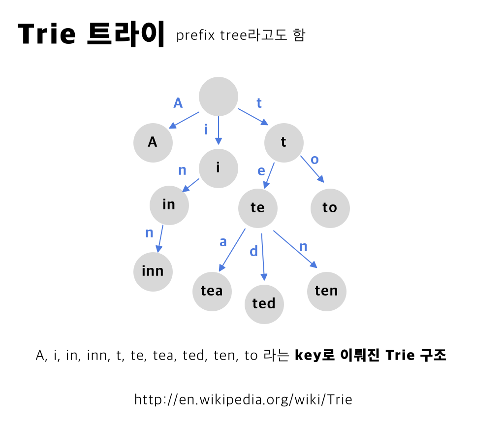
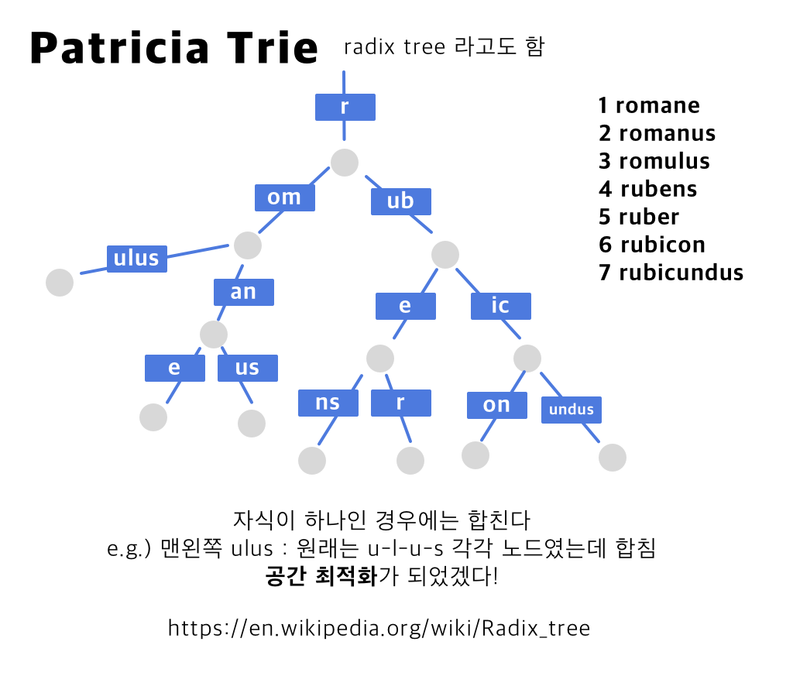

geohash 관련한 PR을 보고 있었는데, 다른 팀원분이 Trie로 접근해볼 것을 제안해주시더군요. Trie 자료구조, 분명히 입사 전에는 알고 있었는데 기억안나서 정리해봅니다. 😉

## Trie 자료구조 🌴

어.. 어떻게 읽어야할까요? Trie의 용어를 만든 Edward Fredkin은 `retrieval` 의 중간 발음이다 - 라는 의미에서 `트리` 라고 읽었다고 합니다. 하지만 그러면 기존에 있던 트리 자료구조와 헷갈리니까, 다른 저자들은 `트라이` 라고 읽기 시작했고요.  이 글에서는 트라이라고 읽습니다. 

검색을 목적으로 하는 트리의 일종입니다. 동적인 set, 혹은 서로 관련이 있는 array를 저장하기 위해 주로 사용되는데, 이때 키는 주로 `string` 입니다. 좀 정리해보면, string 저장하는데 그 string들 끼리의 관계도 표현해줄 수 있는 자료구조가 됩니다. 같은 **노드의 자식들은 같은 prefix를 갖게 됩니다.**

추가) 그 자체로 트리 모양의 DFA(Deterministic finite automaton, 각 입력 심볼에 대해서 **유일한** 상태 변화를 취하는 유한 상태기계) 라고도 할 수 있습니다. 표현이 어려운데요.  이 부분은 계산이론이나 프로그래밍언어 같은 강의를 참고하여 나중에 보충하겠습니다.



위 그림을 볼까요.  string값을 위와 같이 저장합니다.  같은 부모 노드를 가진 자식 노드 `te` 그리고 `to` 는 prefix가 `t`입니다. 아래도 마찬가지입니다. te의 자식 노드들은 모두 te로 시작합니다.

이렇게, Trie는 탐색에 있어서 이점을 갖는 자료구조입니다. Trie에 저장된 것 중 가장 긴 string의 길이를 m이라고 하면, worst-case 탐색 시간이 O(m)이 걸립니다🤔  

Trie를 대개 쓰는 곳은 **자동완성** 입니다. Trie는 빠르게 검색할 수 있고, 요소들을 삽입삭제하는 데도 편리합니다. 그래서 **맞춤법 검사**나 **hypenation**(글자가 하이픈으로 연결되었는지 판단) 프로그램에도 유용하다고 하네요. 
위에서 잠깐 말했지만, geohash 검색에도 유용할 것 같은데요. 간단한 설명을 붙이자면, geohash는 전세계 지역을 hash 값으로 표현한 것입니다. 좌표 -> hash 값으로 변형한 것이죠. 다만, 조금만 인풋이 비슷해도 완전히 다른 결과가 나와야하는 기존의 hash 알고리즘의 특성과는 다르게, geohash는 근접한 지역일 수록 비슷한 hash를 갖습니다. 사실상 큰 단위에서 같은 지역에 포함되어있다면 prefix가 완전히 같습니다. xn21421, xn21489 라는 해시는 큰 분류가 같은 지역이라고 생각하시면 됩니다. 

### 구현은 어떻게? 

어떻게 구현하는 건지 간단하게 알아봐야겠습니다! =) 
[문서](https://github.com/eugenp/tutorials/blob/master/data-structures/src/main/java/com/baeldung/trie/TrieNode.java)를 참고하여 java 구현도 함께 소개합니다. 
```java 
    class Node {
    		private final Map<Character, Node> children = new HashMap<>(); 
    		private String endValue; // leaf 노드일 경우에 값이 있도록 합니다. isNotEmpty로 말단 노드인지도 판단 가능합니다.
    }
    
    
    
    class Trie {
    		private Node root;
    
    		Trie() {
    			root = new Node(); 
        }
    
    		void insert(String word) { // Trie 구조에 단어를 삽입합니다.
    			Node current = root; 
    			
    			for(char c : String word) { 
    					current = current.getChildren().computeIfAbsent(c, key -> new Node());
    			     // c라는 key가 children에 없는 경우 새로운 Node를 만듭니다.
    				}
    
    			current.setEndValue(word)
        }
    
    		// 중간 생략	 
    		boolean delete(String word) {
    			return delete(root, word, 0); 
    		}
    
    
    		private boolean delete(Node current, String word, int index) {
    			
    			if(index == word.length()) {
    					if (current.getEndValue().isEmpty()) {
    						return false; // 이 노드가 leaf가 아니면 이 노드는 삭제 안함
            } 
             current.setEndValue(null); 
             return current.getChildren().isEmpty(); // 이 노드의 자식이 있으면 이 노드는 삭제 안함
          }
    
    
    			char ch = word.charAt(index);
    		  Node node = current.getChildren().get(ch); // 첫번째부터 쭉 돕니다
    
    			if(node == null) {
    	      return false; // 해당하는 노드가 없음
    			}
    			
    			boolean shouldDeleteCurrentNode = delete(node, word, index + 1) && node.getEndValue().isEmpty();
    			// 현재 노드를 지워야하는 지는 recursive하게 돌아야지 알 수 있음 
    
    			if (shouldDeleteCurrentNode) {
    				 current.getChildren().remove(ch); 
             return current.getChildren().isEmpty(); // 
    			}
          return false;
        }
    }
```


## Patricia Trie 혹은 Radix Trie



Trie의 개선버전입니다. 공간 사용을 최소한으로 하는 Trie를 말합니다. 어떻게 하는 거죠? 만약 각 노드가 유일한 자식이라면, **그 부모와 합쳐 버립니다.**  외동인 (!!!) 자식들이 없도록 합쳐버렸으니, 각 내부 노드가 자식이 있다면 모두 두 명 이상이 됩니다. (루트노드를 제외하구요) 원래는 각자 하나의 노드를 가졌어야할 외동 노드들이 모두 합쳐져 버렸으니까 `space-effient`, `space-optimized` 되었다고 얘기하고요.

일반적인 트리와는 다르게, 가지가 요소 한개 혹은 여러개가 있는 레이블을 가질 수 있습니다. 이러한 특징 덕분에, 
- 긴 String이고
- 작은 set이고
- 긴 prefix를 공유하는 string들

일 수록 유리합니다.

---


Trie는 알고리즘 수업이나 자료구조에서는 많이 다루지 않지만 다양한 곳에서 사용되는 자료구조라고 합니다. 한번 나중에 더 깊게 파봐야겠네요! 

대부분의 내용은 위키피디아를 참고하였습니다! 틀린 점이 있으면 둥글게 코멘트 주세요. 무례한 댓글은 삭제합니다. 👽

## 참고

[https://en.wikipedia.org/wiki/Trie](https://en.wikipedia.org/wiki/Trie)

[https://en.wikipedia.org/wiki/Radix_tree](https://en.wikipedia.org/wiki/Radix_tree)

[https://www.baeldung.com/trie-java](https://www.baeldung.com/trie-java)

[https://github.com/eugenp/tutorials/blob/master/data-structures/src/main/java/com/baeldung/trie/TrieNode.java](https://github.com/eugenp/tutorials/blob/master/data-structures/src/main/java/com/baeldung/trie/TrieNode.java)