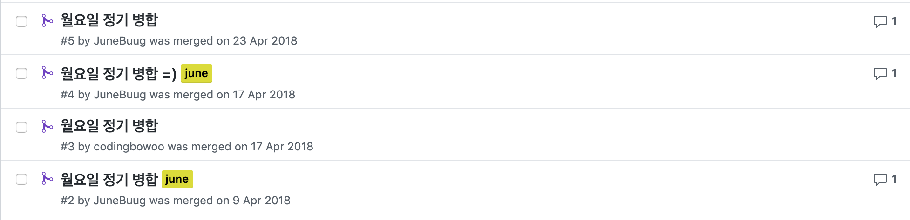
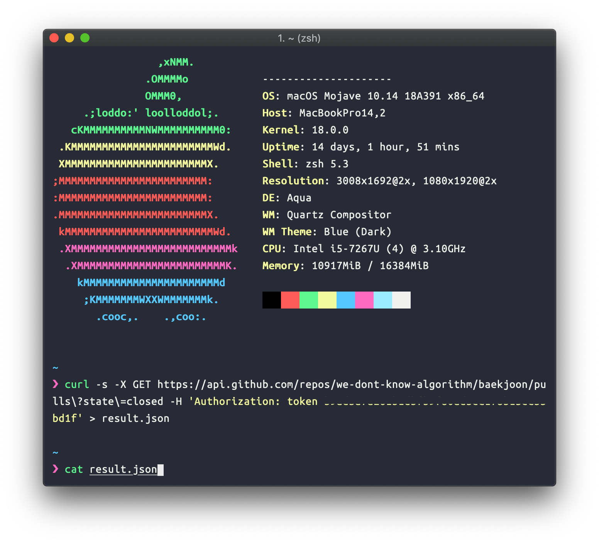
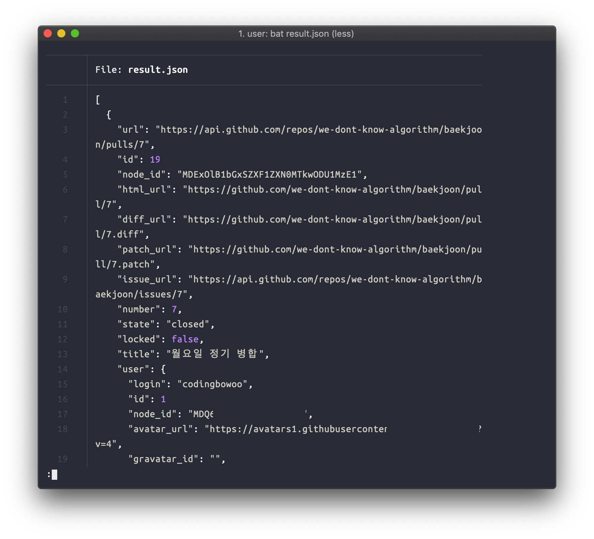
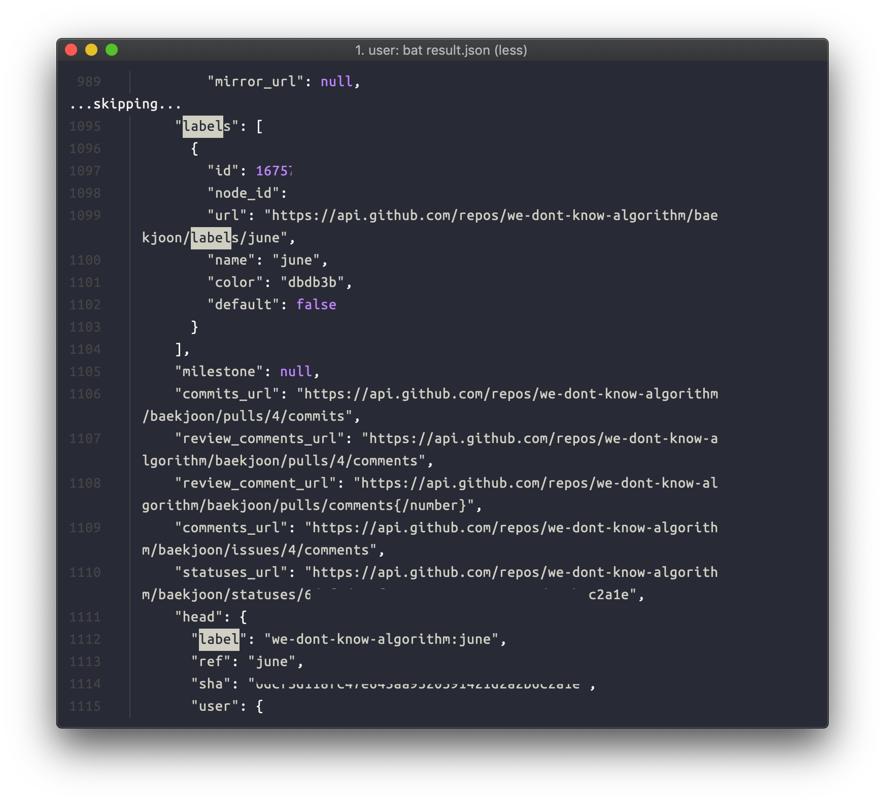
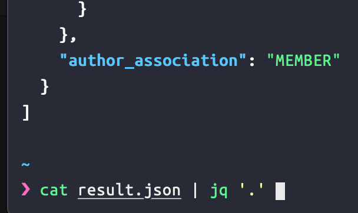
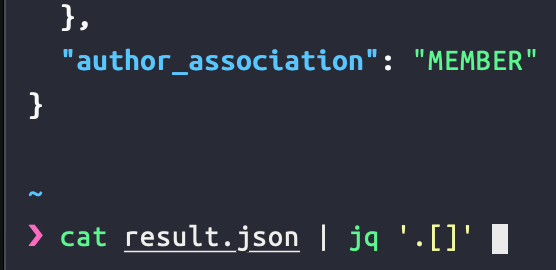
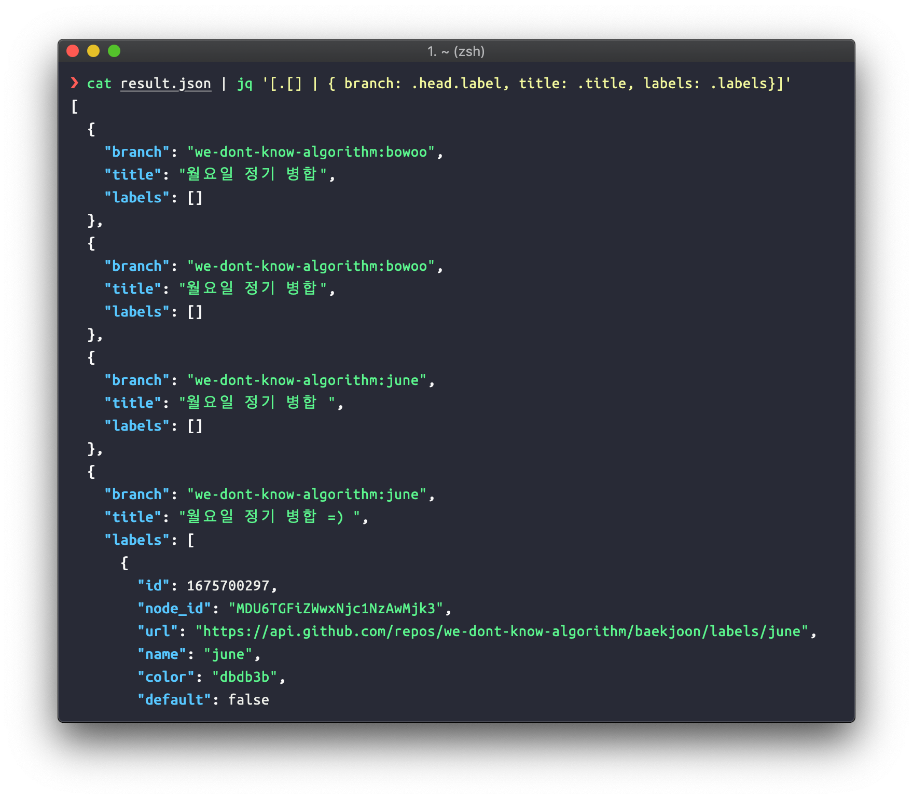
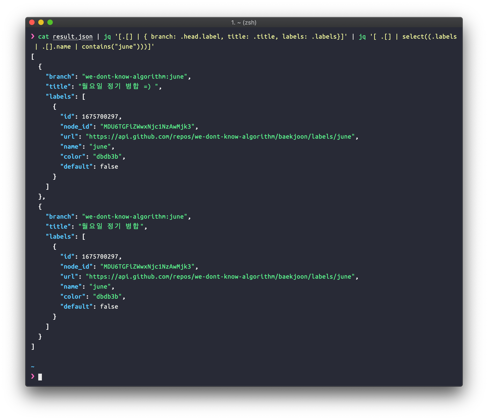
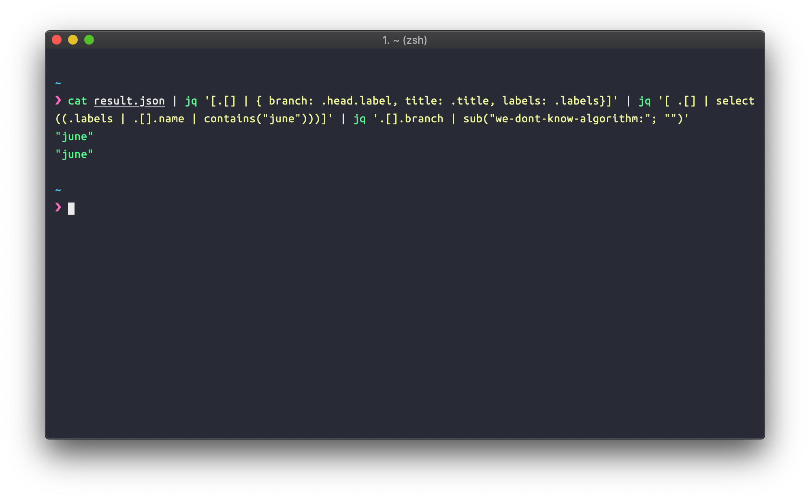

안녕하세요, junebuug입니다. 

어느날 저는 jenkins job을 구성하다가 PR 이 닫히면 jenkins job이 동작하는 걸 만들어야했습니다.
그런데 jenkins에서 자주 쓴다는 github pull request builder는 이런 기능을 지원하지 않더군요. 😢
jenkins url 에 hook을 걸어서 event를 받는 기능이 있지만, 모종의 이유로 제대로 동작하지 않았습니다. 

그래서 그냥 github api 를 사용하기로 했습니다. 
PR이 닫히면 job 실행  이 아니라 
cron 으로 매일 job 실행 ➡️ 닫힌 PR 중 특정 label이 달린 것만 가져오기! 로 방향을 바꾸었습니다.
그리고 해당 PR의 branch 이름을 깔끔하게 만들어서 다음 작업을 준비합니다.  

위 과정에서 github api 결과 값을 정제하기 위해서 jq를 사용했는데요.
쓸모가 많은 툴이라 여겨져서 소개합니다.

## jq는? 

커맨드라인에서 json을 정제할 수 있는 툴로, 공식 홈페이지는 [여기](https://stedolan.github.io/jq/). 

c로 만들어져, json을 자르고 필터링하고 map 하는 데 최적화되어있습니다. 


### jq를 다운로드하자 

[다운로드 설명 링크](https://stedolan.github.io/jq/download/) 를 참조하면 상세히 나와있습니다. 

여기서는 OS X와 Cent OS (Linux) 만 간단하게 소개하겠습니다. 


```bash 
# OS X
# 맥에 homebrew가 없다면 설치하세요 =) https://brew.sh/ 
brew install jq
```

```bash 
# Cent OS 
# yum install 로 설치할 수 있지만, sudo 권한이 필요해서 패스. 
wget https://github.com/stedolan/jq/releases/download/jq-1.5/jq-linux64 -O jq
chmod +x jq
mv jq /usr/local/bin
```

## github api 의 응답형태 구경하기 

샘플 프로젝트를 함께 보시죠. 
알고리즘 공부 레포인 `we-dont-know-algorithm` 을 활용합니다. 
갖고 오고 싶은 PR은 다음과 같이 `june` label이 달린 PR입니다. 




그럼 [github token을 발급](https://github.com/settings/tokens) 받아서 github api를 사용해봅니다. 

목적을 다시 정리해봅니다.

> PR인데, closed 이고, 특정한 label이 있으면 좋겠어. 그런데 branch 이름이 필요하고, 만약 필요없는 스트링이 붙어있는 정보라면 제거하고 싶다. 


### Closed PR 가지고 오기





```bash 
 curl -s -X GET https://api.github.com/repos/we-dont-know-algorithm/baekjoon/pulls\?state\=closed -H 'Authorization: token <발급받은토큰>' > result.json
```

github api 엔드포인트 뒤에, `repos/<team혹은user명>/<repo명>/pulls...` 를 붙여주면 쉽게 목적을 달성할 수 있습니다. 여기에 `state=closed`를 명시하여 닫힌 PR만 가져올 수 있게 되었습니다. 이 결과값이 너무 길어서, 이를 result.json이라는 이름의 파일로 저장하고 열어봅니다.


### 필요한 정보만 보기 - branch, label, PR 제목


cat으로 json을 열어보니 막막합니다. 우리가 필요한 정보는 어디 있는 걸까요? 



빠르게 찾기 위해 `:/<검색어>` 커맨드를 사용해서 label 을 찾았습니다. label 하위 name 이라는 key에 우리가 찾는 `june` label이름이 있군요.
branch 명은 `".head.label"` 라는 key 아래 있는 걸 확인했고, `"title"` 하위에는 PR 제목이 있습니다. 
이제 이것만 뽑아보겠습니다.


json 뒤에 `| jq <명령어>` 를 실행하면 json을 정제할 수 있습니다. 


`cat result.json | jq .` 를 하면 깔끔하게 json을 보여줍니다. 


보시면 전체 array 가 표현되는 것을 볼 수 있습니다.


`cat result.json | jq .[]` 을 실행해봅니다. 



아까와 다르게 array 안쪽의 dict 형태가 보입니다. 이렇게
`jq .[0]` 을 실행하면 array의 0번째 원소에 접근할 수 있고, `jq .[]`만 실행하면 전체 배열에 필터를 적용합니다.


이제 필요한 정보만 뽑아서 새로운 키로 할당합니다. 
전체 배열 중 
* .head.label ➡️ branch
* .title ➡️ title
* labels ➡️ labels 
로 매핑합니다. 
이 결과에 `[]`로 감싸 전체를 array로 묶습니다.

`jq '[.[] | { branch: .head.label, title: .title, labels: .labels}]' ` 




훌륭하게 골라내졌습니다! 

### label 로 뽑기 && branch 이름 변환하기 

이제 `june` 레이블만 있는 값들을 골라냅니다. 

`select(boolean_expression)` 를 사용하면 조건에 맞는 것들을 골라낼 수 있습니다.
array를 필터링하는데 유용합니다. 

다음 명령어를 사용합니다.

`jq '[ .[] | select((.labels | .[].name | contains("june")))]'`

위에서 정제한 json을 기억해주세요. 
`(.labels | .[].name | contains("june"))`
labels 하위 값들 중 name이 `june` 이라는 스트링을 포함하고 있는지? 라는 boolean expression입니다. 

이 조건을 만족하는 결과만 필터링합니다.


거의 다되었습니다! =)

그런데.. branch 이름 앞에 무언가 있습니다. 공통적으로 붙은 단체 명이네요. 이걸 제거해보도록 하겠습니다. 
`sub` 를 사용해서 값을 대체해줍니다. 그리고 해당 branch 이름을 프린트합니다.

`jq '.[].branch | sub("we-dont-know-algorithm:"; "")`

이것까지 적용하면 완성입니다. 



## 마치며 

jq 는 사용에 따라서 간단한 필터링, 매핑은 모두 처리해줄 수 있습니다.
여러 사례들을 보면서 익혀두면 유용할 것 같습니다. 

고맙습니다.