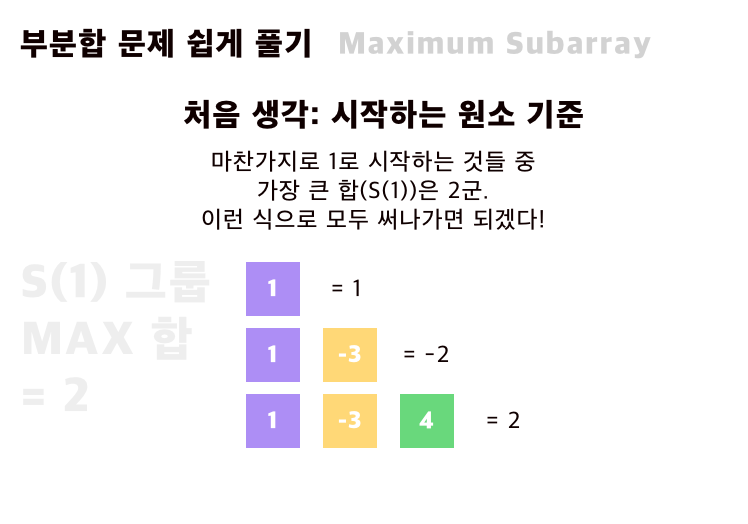
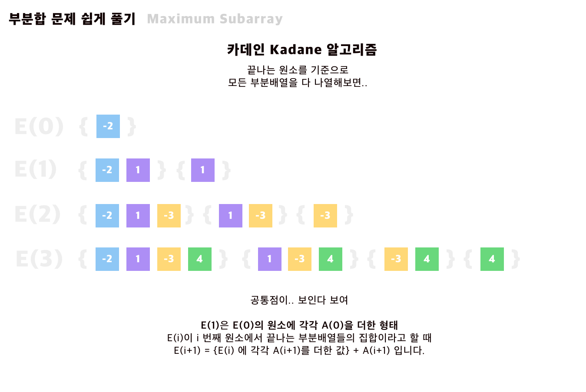

LeetCode를 시간이 날때마다 풀고 있습니다.
워낙 알고리즘에는 잼병이기도 하고, 생각의 폭을 넓히기 위해서 푸는데요. 
easy에 있는 `Maximum subarray` 를 풀게 되었습니다.

처음에는 효율이 굉장히 낮게 for 문 여러개를 돌려서 풀었는데요 (거의 3중 포문 😭)
시간이 오버되어서 울며 겨자먹기로 방법을 검색해보았습니다. 

알고보니 굉장히 유명한 문제이고, 가장 효율적인 방법이 소개되어있어 
이해한 것을 공유합니다. 
## Maximum Subarray - 최대 부분합 문제?

최대 부분합 문제는 유명한 알고리즘 문제 중 하나입니다. 배열이 있을 때, 연속하는 부분집합을 구할 수 있는데요.
그 부분집합의 합 중 가장 큰 값을 구하는 문제입니다.


## 최초의 접근법 

예를 들어 [-2, -3 ,4] 는 비연속하는 상태이므로 포함되지 않겠지요? 
이런식으로 가능한 경우를 모두 써보면 생각보다 부분집합이 많지는 않습니다. (특히 이 경우는요.)
그래서 저는 모든 부분집합을 구하고 그 합을 매번 비교하는 방식을 처음에 생각했습니다.





위의 이미지처럼, 시작하는 원소를 기준으로 잡고 모두 적어보면 4 + 3 + 2 + 1 = 10개가 됩니다. 

꽤 쉽고 간단하게 문제가 해결되는 것처럼 보이지만, 이를 구현하려면 다음과 같이 구현해야합니다.

```java

int max = Integer.MIN_VALUE;

for (int i=0; i < arr.length; i ++) {
    for (int j= 1; j< arr.length - i + 1; j ++) {

        // i번째부터 j개의 합을 구한다. 
        // 그 합이 max 보다 크면 max를 업데이트해준다.
        // 근데.. 합을 구하려면 여기서 for 문이 한번 더? 
    }
}

```

머리로 생각해봤을 때는 직관적이지만, 계산하기에는 수가 너무 많습니다. 
이때 카데인 알고리즘이 등장합니다. 


## 카데인 알고리즘 

카데인 알고리즘은 이 [최대부분합 문제 wikipedia](https://en.wikipedia.org/wiki/Maximum_subarray_problem#Kadane's%20algorithm%20(Algorithm%203:%20Dynamic%20Programming))에 솔루션으로 등장합니다. 

처음 생각해봐야할 것은 위처럼 `시작하는 원소`를 중심으로 하지 않고, `끝나는 원소`를 기준으로 한다는 것.
그리고 max 값의 집합에서 한번 더 max 를 찾는다는 점인 것 같습니다.

위 [-2, 1, -3, 4] 예제를 봅니다. 


위와 같이 `끝나는 원소`를 기준으로 10개의 부분 배열을 모두 써보겠습니다. 

0번째로 끝나는 부분배열들은 `E(0)` 라고 표기합니다.

그러면 E(0) 은 [ {-2}],

E(1) 은 [ {-2, 1}, {1}] .. 와 같은 식으로 정리할 수 있습니다. 



이렇게 적으면 공통점이 보이시나요? 

- E(1)은  `E(0) 의 모든 원소에 1을 포함시킨 것 + 1 만 있는 원소` 과 같습니다.
- E(2)는 `E(1)의 모든 원소에 -3을 포함시킨 것 + -3 만 있는 원소` 와 같고요.
- E(3)은 `E(2)의 모든 원소에 4를 포함시킨 것 + 4만 있는 원소` 입니다. 


합도 동일한 방식으로 흘러갑니다. 

위와 비슷하게, i번째로 끝나는 부분배열의 합들 중 최대인 값을 M(i) 라고 하겠습니다. 

즉, 
- M(0) = -2, 
- M(1) = max(-2+1, 1) = 1 입니다. 


이를 관찰해보면 다음과 같은 결론이 나옵니다. 

> M(i+1) 는 둘 중 하나이다.  M(i) 값 + i+1 번째 원소  이거나 i +1 번째 원소 그 자체.

이유는 단순합니다. maximum 값이 나온다고 하면, 이전에 컸던 것에 더하는게 더 크기 때문입니다. 

`a < b -> a + c < b + c` 인 거죠.


이런 규칙에 따라서 `i번째 원소로 끝나는 부분배열의 합` 들을 모두 나열해보고, 

여기에서 다시 최대 값을 구하면 됩니다. 

즉 여기서는 4입니다. 


## 코드로 옮겨보자! 
코드에서도 이 과정이 드러납니다. 

두번 max를 구하여 값을 구합니다. 

```java
class Solution {
    public int maxSubArray(int[] nums) {
        int best_sum = Integer.MIN_VALUE;
        int end_sum = 0;
        
        for (int num : nums) {
            end_sum = Math.max(end_sum + num, num);
            best_sum  = Math.max(end_sum, best_sum);
        }
        
        return best_sum;
        
    
    }
    
    
}
```


### 마치며 

단순해보이지만 이해하는 것도, 정리하는 것도 쉽지는 않네요. 
의견이 있다면 둥글게 댓글 부탁드립니다.


## 참고 

[2nd life of cfranck](https://topdori.com/?p=234)

