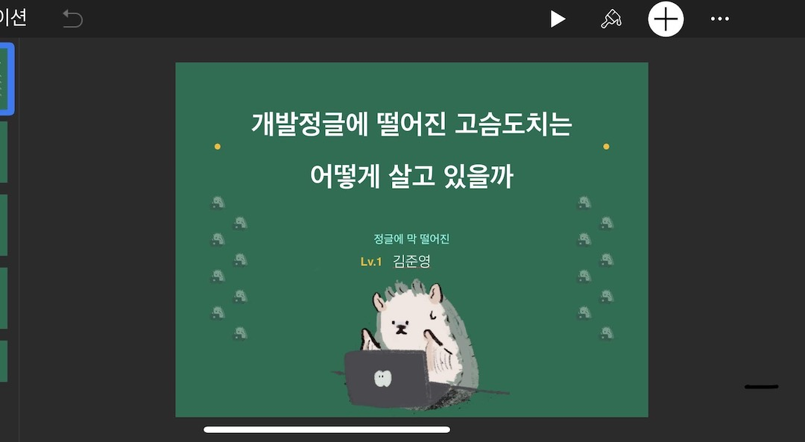

회고를 작성하는 것이 벌써 세번째다. 블로그 글들이 존댓말로 시작하는 것과 달리, 회고는 보통 반말로 작성한다. 주 독자는 미래의 나이니 편하게 작성하려는 의도에서.

연말이 되면 기대되는 건 개발자들의 회고다. 개발 커뮤니티에서 두드러지는 이 회고라는 문화는 중독성이 있어서, 같은 시간을 살면서도 더 나아가는 사람들을 구경하는 재미가 쏠쏠하다. 어떤 역경을 겪어서 그 결과가 어떻게 되었는지 보는 과정이 청년만화같거덩. 😎 

그래서 이번해는 조금 이르게 회고를 작성해보기로 했다. 적을 때 참고하는 건 세가지인데, 하나는 캘린더, 하나는 커밋로그, 하나는 SNS다. 조금 난장판인 회고여도 미래의 내가 이해바란다.

## 1월 🌨

겨우 신정으로 쉰 다음날, NAVER CODE DAY를 갔다.  네이버 GIO님과의 대담  + 데이터 센터 투어 + 커뮤니티 형성 + ... 을 위해서 가는 1박 2일의 코스. 이번에는 직군과 법인을 막론하고 모였던 자리여서 전체적인 구조가 그려지긴 했다. 그리고 춘천 시설 짱좋음 🙊 밥도 맛있다. 데이터 센터 안쪽까지 들어가볼 수 있어서 좋았다. IDC 관리를 위해서 상주하는 직원분들 너무 리스펙. 

LINE STEP 프로젝트의 본격적인 시동을 걸기 위해 개발 팀 전체가 일본 출장을 갔다. LINE 사옥도 좋고ㅜ.... cashless 오피스를 표방해서 라인페이로 결제하는 점이 특이했다. 협업할 일본 멤버분들도 만났다.

kibana를 사용해서 쌓인 로그 시각화하는 작업을 도왔다. 사실 키바나가 편리하고 GUI가 간편하게 되어있어서, 오히려 통계적 지식이 있었으면.. 하는 생각이 들었다. 데이터는 아직 어렵다. 

CBT 준비를 위해서 보안검수를 받던 터라, 마이너한 일들을 받아서 수정했다. 치명적인 실수가 있었는데, api 에서 유저 정보 수정 api 내부에서 유저 세션을 검사안해서(!) 아무나 수정이 가능한 부분이었다. 요런것도 어떻게 잡아내시는 건지! 보안검수에서 잡혀서 무사히 수정.

## 2월 - 3월 

졸업식에 참가했다.
3월에는 세계 여성의 날 기념으로 마소에서 점심먹었다. 이런 곳에서 이야기 나누니 다시 여성 개발 커뮤니티 하고 싶다는 마음이 새록새록ㅠㅠㅠ

CBT를 준비하다보니 매일매일 개발 협의와 기획서 리뷰의 향연이었다. 3시 회의가 4시, 5시 회의까지 연장되는 기적. 일주일에 평균 4번 이상의 회의를 했다. 전체적으로 유저관련 작업을 많이 해서, 이후에도 계속 유저 도메인은 내가 가져가게 된다. 기획서를 보고 쳐낼 기능은 쳐내고, erd 설계를 하고, 공수를 나누는 작업은 상당히 지루하다 =) 또 아무래도 프로덕션 코드를 서버 개발로 내본 적이 없기때문에, 시니어분들의 아키텍처를 보고 배우는 과정이 대부분이다. 이때는 이런 주제들을 공부했다. 

- [데이터베이스 인덱스]
- [JPQL JOIN  대정리]
- [RestTemplate 말고  WebClient]
- [Netflix Zuul : 요청을 다른데로 보내고 싶다면]
- [LDAP]
- [Apache Spark]
- [내받코리 : 1월-2월]
- [영속성 컨텍스트 따로 정리]
- [Redis]

블로그 글로까지 나온 것들도 있고, 아닌 것도 있고. 글은 쓸때마다 어렵다.

아! Dev C Seoul의 3월 행사  'We’re Ordinary IT People' 에서 `개발정글에 떨어진 고슴도치는 어떻게 살고 있을까` 라는 제목으로 발표했다. 자료는 [여기](https://www.slideshare.net/junekim5030927/ss-138682097). 장담컨데 IT는 어떤 업계보다도 빠른 성장이 요구되는 곳이다. 나도 그 성장 열풍에 탑승해있고, 성장이라는 단어도 좋아하지만... IT에 들어오기위해 준비한 학부, 그리고 취준 기간, 그리고 나서 신입으로 9개월 달려오고 나니 굉장한 피로감을 느꼈다. 

사실 저 발표는 내가 어떻게 회복하는지에 대해서 알려주는 발표이자,
너무 우리 성장에 목매지 말아요, 함께 회복해요, 라는 의도로 세상에 보인 것이었다. 비슷한 생각하시는 분들이 많았는지 처음으로 1000뷰를 넘긴 장표가 생김. (지금은 2600이네) 

상처받기 쉬운 나 자신을 고슴도치로 승화해 발표했다. 금방 읽으니 심심할때 딱 😎 이 장표를 보신 분, 혹시 좋은 자신만의 힐링 프로토콜이 있으면 공유해주세요. 시간이 되면 영상으로 찍어볼까 생각중이다.

## 4월 - 5월 

본격적으로 Design Pattern 스터디 시작. 사실 3월부터 제대로 시작한 것 같은데, `Head First Design Pattern` 로 매주 일요일 저녁마다 온라인으로 만나서 스터디 했다. 일정 시간동안 함께 책을 읽고, 궁금한 점을 Google docs에 함께 적어서, 생각을 공유하는 시간. 매주마다 다른 사람이 담당을 정해서 다음 주중에 요약을 공유해주었다. 최대한 힘을 안들이려고 온라인으로 했는데, 좀 신경쓰이긴 했지만 제대로 끝낸 첫 스터디여서 뿌듯 =) 3월에서 7월까지 했다. 블로그에도 따로 정리해야하는데 일정은 미정이다. 👩‍🔧

행사는 NDC와 우형 TDD 세미나, ㅋㅋ페스티벌을 참가했다. (우형 열성팬인듯) 

NDC를 가서 감격한게 작년이었는데, 일년만에 다른 신분으로 참가하니 기분이 남달랐다. 게임업계 종사자가 아니어서 떨어질까봐 조마조마. 이번해에는 [FIFA온라인4 서버포스트모템](https://juneyr.dev/2019-04-25/ndc-2019) 을 매우 재밌게 들었다. 축구게임은 별로 안좋아하지만 그 뒤의 아키텍처 이야기를 듣는건 또다른 이야기. 그리고 여성연사자가 별로 없었기때문에 더욱 듣고싶었다. 간결하고 명확한 설명, 재밌는 이야기가 인상적이었다. 회고를 쓰고 있는 지금 다시 읽어보니 쿠버네티스이야기네. 좀더 잘 이해할 수 있겠다. 키워드마다 공부를 하면 언젠가는 이어져서 하나의 지식이 되는 순간이 경이롭다. 

TDD 세미나는 테크캠프에서 배웠던 내용, 그리고 자바지기님 글 발표에서 여러번 들었던 내용이라서 패스. 

개인적으로는 처음 베트남 나트랑에 다녀왔다. 올인클루시브 리조트가 이정도라니..? 함께 간 친구가 도전적이고 꼼꼼한 성격이어서 덕을 많이 봤다. 혼자였으면 몰랐을 것들을 손쉽게 받아들일 수 있는 여행! ㅠㅠ 이 자리를 빌려서 고맙습니다. 시간 내서 나를 위한 시간을 보냈던 것이 참 좋았다. 베트남 커피는 가족들에게 좋은 선물이 되었다.

서비스를 런칭하기 직전이어서, 이때의 PR이 가장 많다. 유저가 한 Like와 관련된 목록, 보상기록, 라인 Official Account 연동. 가장 일이 많았고 그래서 제일 재밌었다. 공부할 시간은 상대적으로 줄었지만 그만큼 리뷰를 많이 받으니까.

## 6월 - 7월

일본으로 릴리즈 출장을 갔다. 무려 2주간 ! 😭 현장에서 일본 멤버들과 테스트를 거치면서 iOS 릴리즈를 하는 자리인데, 가벼운 맘으로 갔다가 된통당했다. 쏟아지는 QA 를 계속 수정하고 밀도 높게 버그를 치웠다. 그래서인지 매우 아팠다(..) 머리가 깨질거같이 아팠고, 다래끼가 생겼다. 일본이랑 물이 안맞나봐.. 그래도 별개로 즐거운 경험이었다. 그리고 한달도 안되어서 다시 도쿄로 여행을 다녀왔다. 아사쿠사에서 조용히 지냈다. 일본을 처음 가는 친구랑 가서 더 즐거웠다.

이 시기에는 대학교 동기 여학우들 만났다. 과에 열명 남짓밖에 없다보니 뭘하든 애정이 생기고 가는 길을 응원해주게된다. 서로 서로 잘살자 우리 🙂 날이 좋다보니 못보던 오랜 친구, 언제나 함께하는 춤메이트, 정선으로 펜션 여행 등 멀리서 서로 응원하는 사람들 만나기에 열을 올렸다.

외부 시스템과 연동하면서 블로그글을 쓰고, 디자인 패턴 스터디가 끝나가 또 블로그를 썼다. 

- [Spring에서 HMAC-SHA256 인증해보기](https://juneyr.dev/2019-06-10/spring-hmac)
- 옵저버 패턴
- 데코레이터 패턴
- 싱글턴 패턴
- QueryDsl IntelliJ 루트 설정 안될때 해결법 
- 처음해보는 Spring Batch Tasklet 작성하기 

## 8월 - 9월

8월 15일에 잠깐 코드스쿼드에 다녀왔다. 코드스쿼드는 인턴 2개월동안밖에 없었지만 마음의 고향 😎 광복절 해커톤이 진행되고 있었는데, 다들 어떻게 그렇게 뚝딱뚝딱 잘 만드는지... 개발자로 해커톤 참여해본적이 없어서, 다 멋있어보인다. 가서 사랑하는 미쉘도 보고, 오랜만에 마스터님도 뵙고. 

9월에는 디즈니 싱어롱을 진행했다. 이게 바로 내향적 일벌리기 마스터 👽 디즈니 노래를 영화장면과 함께 따라부르는 행사. 성수동 다락스페이스에서 진행했는데 공간이 참 좋다. 20명 남짓의 덕후들이 행복하게 노래하고, 퀴즈하고... 날씨도 좋고, 뿌듯하고, 고맙고. 친구 두명이 적극적으로 도와줬는데, 바쁘고 힘든 와중에도 구글 폼만들고, 진행하고, 영상 만들어준 나의 디어 후렌드 제나와 정윤에게 감사를 보낸다. 사랑합니다. 참석해주신 분들도 고맙습니다.

별개로 사람을 모으기가 이렇게 힘든 줄 처음 알았다. 장고걸스할 때는 순식간에 지원서가 찼는데 ㅎㅎ 17명 까지는 수월하게 모였는데, 30명을 목표로 하고 있다보니 성에 차지 않았다. 그런데 모임플랫폼에 올리기에는 지인위주의 모임이었고, 더 늘리기가 쉽지않았다. 

준비 과정은 길고 힘들었지만 끝나고 나니 매우 뿌듯했다. 메이킹 필름을 영상으로 만들고 유튜브에 업로드했는데, 영상은 [https://www.youtube.com/watch?v=29VwSaIrX2c](https://www.youtube.com/watch?v=29VwSaIrX2c) 여기. 또 하자는 분들이 많아서 내년에 또 진행할 것 같아요. 꼭 와주기야 😭

회사 20주년 복지로 받은 에버랜드 티켓으로 친구들과 에버랜드를 다녀왔다. 저스트댄스를 4시간 했다. (저스트댄스 하고 싶은 분은 언제나 연락주세요). 

짧은 호캉스를 했다. 날씨가 좋을때 다 누렸구나.

개발적으로 계속 스펙이 늘어나고, 그 와중에 환전시스템 구축을 맡았다. 어드민까지! 환전 자체는 실제 돈을 다루는 것이 아니기때문에, 운영자가 쉽게 환전해야할 사람들과 돈을 맞춰서 보는 것이 중요했다. 시간이 지나면서 3+번 이나 개선 아닌 개선을 했다. 돈관련 문제여서 어드민에도 권한 관리가 필요했다. 블로그를 보니 그래서 기본을 더 잡은 듯. 어드민에 spring security를 적용하고 권한 관리를 맡게 되면서 알게 된 것도 정리했다. 

- Spring Security 개념잡기 
- 웹서버, 웹 어플리케이션 서버 + tomcat이란 

## 10월 - 11월 

10월에는 싱어롱의 여파로 약속이 거의 없이 회복하는 시간이었다. 큰 이벤트는 면허필기를 딴 것 정도. 이 시기에는 vlog에 재미가 들려서 계속 영상을 찍고 편집했다. [채널](https://www.youtube.com/channel/UCXkByV3GagC1t5gCtr7Z1HA) 에 가끔 놀러와주세요. 지금은 영상 촬영할 엄두가 안나서 놓고 있지만요. 영상은 시간을 즐겁기 보내기에 너무 좋은 취미다. 일상에 집중했다. 

이후에 약한 우울에 빠졌다. 우울감이란 매일매일 울며 하루를 보내는 것이 아니라.. 그냥 무기력해지는 감정이다. 이대로 죽어도 괜찮을 것 같고, 더이상 목적이나 행복이 없는 것. 지난 인간관계들이 나를 힘들게 했고, 뒤에서 헛소리를 하는 사람이 있고, 그 사람을 또 마주한적이 있어서 열받았다.

이 시기에는 기도도 나오지 않았다. 계속 하나님, 왜 그러셨어요? 라는 말만. 모든 자극이 칼을 밟는 듯이 아팠다. 우울증이 있는 지인들에게 대하는 것은 쉽지 않다. 감정적으로 밑빠진 독에 물붓기라서. 지금 내가 그 상태구나 싶었다. 잠깐 프로젝트 업데이트가 더뎌지면서 일이 없었던 것이 한몫했다. 운동은 접은지 오래되었고, 회사에서 돌아오면 무기력하게 누워있거나 미친듯이 SNS 를 돌아다녔다.  

언제 잠식되었는지 모르는 것처럼, 그 감정에서 나오는 것도 언제인지 모른다. 개인의 노력이라고 한다면.. 스트레칭 달력을 만들어서 나에게 칭찬 스티커를 매일 붙여주었다. 게임을 열심히 했고, 기대되는 일들을 적었다. 힘들다고 SNS에 적었을 때 손 내밀고 안부를 물어준 친구들이 있었다. 가족이 있었다. 내가 개발 갈피를 못잡고 있으니까 과제를 던져준 시니어분이 있었다. 다음날을 기대감으로 억지로 만들고, 어딘가에 자랑할 생각을 하니 조금씩 정신이 차려졌다. 가벼운 우울을, 기특하게 넘겼다. 

11월말에는 분당IT여성네트워크 모임을 다녀왔다! 좋은 친구를 알게되어서 함께 다녀왔는데, 기획자가 많은 모임이라 엄청난 인싸력... 엄청난 스몰토크와 다정한 눈빛들.... 최고된다 증말. 더 많은 사람들을 알아야해! 

이번에만 도쿄 4번째 다녀왔다. 디즈니 씨를 한번 더 가기위해서... 1박2일 거의 밤도깨비 여행. 하지만 디즈니씨가 주는 경험은 정말 경이롭고 최고다. 

11/21 5년동안 기다린 겨울왕국2 가 개봉했다. 첫 느낌은 3편은 없겠다 싶을 정도로 실망스러웠으나.. 언제 스토리 보고 좋아했던가ㅜ 계속 보니까 스토리도 이해되고, 노래가 너무 좋고, 5년간 발전한 그래픽은 어쩔거야... 지금은 3회차 후, 12월 중 나올 싱어롱을 기다리는 중.

장고걸스 OB 모임을 했다. 재밌어!!! 보드게임 동아리 들고싶다.

블로그는 이렇게. 생각보다 많이 썼다. 

- [번역] 자바에서의 예외처리 
- SSL이 모요
- Trie 구조 츄라이
- 커맨드라인에서 json을 정제해봅시다. 
- Maximum Subarray 최대 부분합을 푸는 방법
- Mysql에서 unique 제약 삭제하기

## {thing} 오브 더 이어 

### 책
`여자 둘이 살고 있습니다`

통통 튀는 에피소드들과 새로운 형태의 삶이 너무 좋았다. 이 책에 대해서 말하려면 한나절 걸릴 것이야...
그외에 

- 일의 기쁨과 슬픔
- 나는 내 파이를 구할 뿐 인류를 구하러 온 게 아니라고

### 노래 

- Show yourself
- Lost in the woods
- Bad (by Christopher)

### 게임 

- 1위 링피트 어드벤처
- 2위 baba is you

저스트댄스는 매년 좋았으니 생략

### 만화 

아르슬란 전기 & 강철의 연금술사 (정독)

### 드라마 + 영화 

- 1위 frozen 2 
- 2위 굿플레이스
- 3위 82년생 김지영 (너무 울어서 감점됨 흑흑)
- 4위 빨간머리앤 (아직 보고 있어서 감점됨)

### 플랫폼 

`리디북스`
- 십오야 이벤트때문에 반해버림. 앱에서 바로 도서 구매가 안되는 점을 제외하고는 전부 좋은 ebook 플랫폼이다. OS X 플랫폼까지 지원하는 것도 좋음. 

## TO-BE 

회사에 와서 AS-IS / TO-BE 라는 말을 많이 쓴다. 원래 그랬고 - 어떻게 할 건지. 라는 이야기인데 위에 AS-IS는 잔뜩 적었으니까 TO-BE도 있어야겠지. 하지만 이번해의 TO-BE는 짧다. 성장속에서 힐링하는 내가 되자 - 라고 말했으니 발표자로서 면은 세워야지 🤔

- 건강하자.
- 감사하자.

이번해도 수고많으셨습니다. 어떻게든 더 나아진 저와 함께 봐요. (feat. 야망햄햄이) 