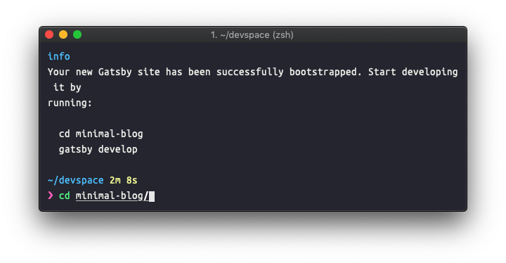
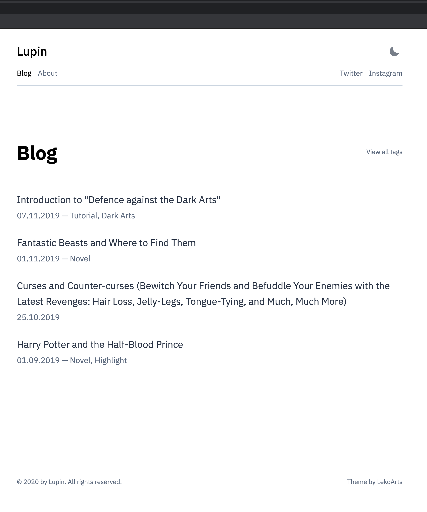
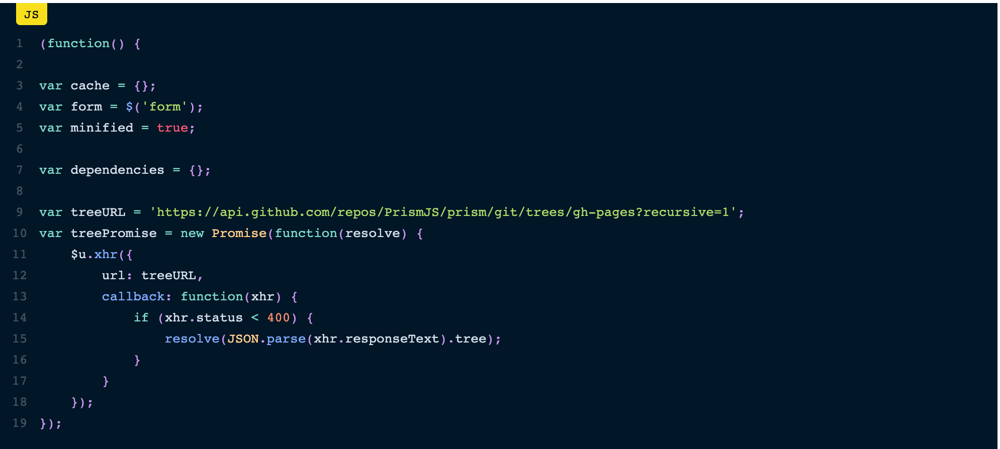
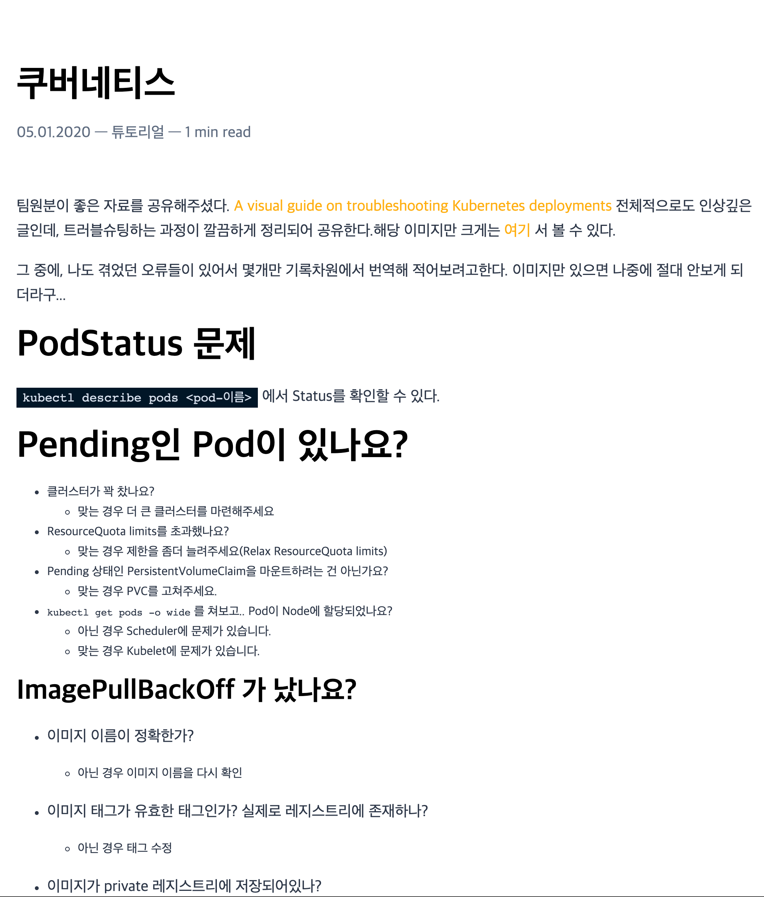
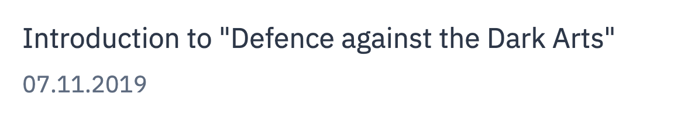
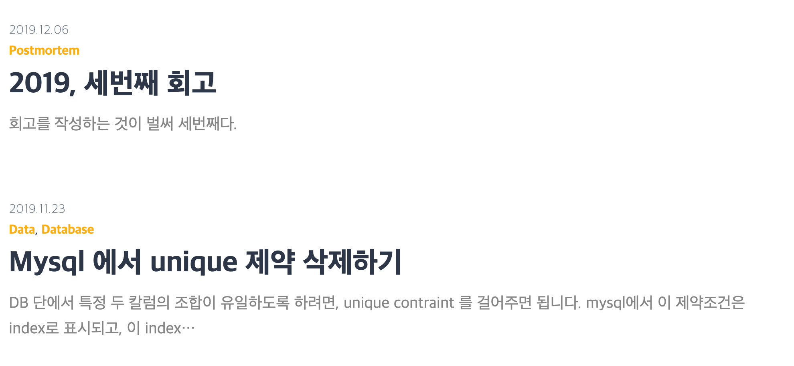
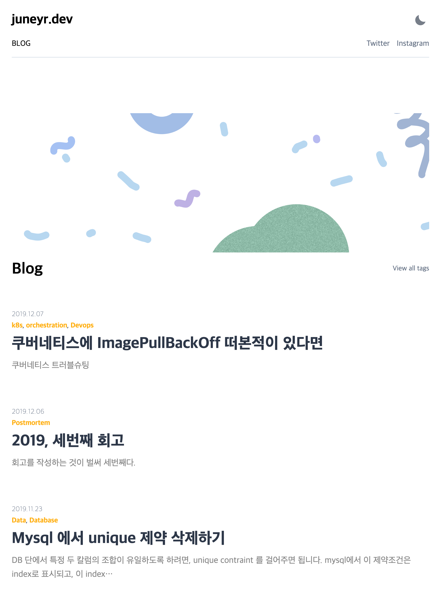

이전의 tech 블로그는 github pages 를 이용하여, jekyll 기반의 정적 사이트를 배포하는 방식으로 되어 있었다. 이런 방식은 간단하고 쉽긴 하지만, jekyll 문법과 ruby 에 익숙하지 않은 이상 커스터마이징하는 데 한계가 있다. 여러모로 갈증을 느끼던 중, [outsider님 회고](https://blog.outsider.ne.kr/1426)에서 정적 사이트 생성기 gatsby라는 글을 만나게 되었다. 최근에 이미 netlify의 멋짐에 매료되었기에 이 조합을 사용하고 싶어졌다. 

## Gatsby?

React component 구성으로 뷰를 만들고, (기본적으로) GraphQL 을 통해 정적 컨텐츠를 가져오는 방식의 정적 사이트 생성기이다. 데이터소스는 일반적인 마크다운 파일일 수도, 워드프레스 같은 CMS 가 될 수 있다. 플러그인이 많아서 다양한 데이터 소스를 사용할 수 있다는 것이 장점.

GraphQL 은 일반적으로 데이터를 보고 가져올 때 사용하는 SQL과는 다른 방식으로 질의를 던진다. 마치 그냥 json 형태처럼. 데이터가 있고, 그 안의 어떤 요소를 가져올지 명시하는 방식이다. 🙂

```graphql
    query {
        posts: allPost(sort: { fields: date, order: DESC }) {
          nodes {
            slug
            title
            date(formatString: "YYYY.MM.DD")
            excerpt
            description
            tags {
              name
              slug
            }
          }
        }
      }
```
gatsby는 빌드 시에 GraphQL 을 사용해서 데이터를 가져오고, 사용된 쿼리는 지워준다. 이 데이터를 사용해서 React component를 그리는 방식을 사용한다. SPA 의 방식을 차용한 정적 사이트 생성기라니!

## 그런데 뭐가 더 필요해요?

기존의 블로그도 많이 부족하지는 않았지만, 다음 이슈가 있었다. 

- 카테고리별로 글을 보기가 어렵다.
- 홈이 바로 글 목록이어서 조금 단조롭다.

이 부분을 해결하면서도 기존 블로그의 간결함은 그대로 가져가는 스타터를 찾아나섰다. 스타터 목록은[공식 홈페이지](https://www.gatsbyjs.org/starters/?v=2) 에 잘 정리 되어있다. =)

그 결과, [미니멀 블로그](https://github.com/LekoArts/gatsby-themes/tree/master/themes/gatsby-theme-minimal-blog) 를 사용하면 좋겠다는 생각을 했다. 데모는 [https://minimal-blog.lekoarts.de/](https://minimal-blog.lekoarts.de/) 에서. gatsby 스타터는 많이들 다크모드를 지원하던데, 이 테마 역시 마찬가지다. 딱 필요한 레이아웃으로 구성되어있는 것이 마음에 들었다. 업데이트가 최근까지 계속된다는 점도 한몫했다.

## Gatsby CLI 설치 && 템플릿으로 바로 블로그 만들기

OS X 를 사용하고 있으므로 더욱 손쉽게 블로그를 띄울 수 있다. 

Quick Start를 보고 바로 CLI 를 설치한다. [https://www.gatsbyjs.org/docs/quick-start/](https://www.gatsbyjs.org/docs/quick-start/) 
```bash
    npm install -g gatsby-cli
```
스타터로 바로 블로그를 시작하는 건 더 쉽다. 
```bash
    gatsby new minimal-blog LekoArts/gatsby-starter-minimal-blog
    # gastsby new <프로젝트이름> <스타터url> 
```
이렇게하면 `minimal-blog` 라는 이름의 폴더가 만들어지고, 해당 루트로 이동해서 `gastsby develop` 을 입력하면 바로 로컬 호스트에 dev 환경이 마련된다. 





이러면 바로 깔끔한 블로그를 만들 수 있다! 

# 끝인 줄 알았니? 👽 험난한 커스텀의 길

스타터로 시작하면, 노드 모듈로 스타터가 들어간 상태이기 때문에 컴포넌트를 직접 편집하는 것이 어렵다. 그럼 어떻게 해야하나? gatsby에서는 커스텀 혹은 오버라이딩하는 행위를 `shadowing` 이라고 부르는데, 친절하게도 우리가 사용한 스타터에 어떻게 쉐도잉을 하는지 설명되어있다.  gastby에서의 쉐도잉을 알고 싶다면 [https://www.gatsbyjs.org/docs/themes/shadowing/](https://www.gatsbyjs.org/docs/themes/shadowing/) 를 참고하자. 

여기서는 이렇게 말한다. 

> Generally speaking you will want to place your files into src/@lekoarts/gatsby-theme-minimal-blog/ to shadow/override files.

src 폴더 하위에 `@lekoarts/gatsby-theme-minimal-blog` 폴더를 만들고 쉐도잉하고 싶은 파일을 넣으면 된다. 물론 폴더명은 위에서 말한 스타터url 이므로, 다른 테마를 받았다면 해당하는 이름으로 폴더를 만들어준다. 쉐도잉을 시작하기 위해서, `src/@lekoarts/gatsby-theme-minimal-blog/` 를 만든다.

이렇게 구성한 후, [스타터 레포](https://github.com/LekoArts/gatsby-themes/tree/master/themes/gatsby-theme-minimal-blog/src) 에 들어가보면 구성을 볼 수 있다. 해당 폴더 하위의 파일들을 **그대로 복사하자.**  이제 이 파일들을 변경하면 변경사항이 블로그에 적용된다.

### 코드에디터가 안예뻐요

가장 먼저 `components` 에서 손댄 것은 코드에디터인 `code.tsx` 이다. prism 이라는 라이브러리를 기반으로 하고 있고, 몇가지 테마가 제공되므로 기본적으로 제공되는 테마 `nightOwl`이 마음에 안든다면 선택할 수 있다. 
```typescript:title=code.tsx
import theme from "prism-react-renderer/themes/nightOwl"
```


여러가지를 해본 결과, 다시 nightOwl로 돌아왔다. 



그 다음은 코드 에디터의 폰트를 조정해준다. 찍어보니 현재 코드에디터 폰트는 `monospace` 이고, 너무 작다. 이 부분은 `src/styles` 하위에 `code.ts` 를 쉐도잉해서 해결할 수 있다.  
```typescript:title=code.ts
    export default {
      "[data-name='live-editor']": {
        padding: (t: any) => `${t.space[2]} !important`,
        fontFamily: `'menlo', 'monaco','monospace'`,
        fontSize: 1,
      },
      "[data-name='live-preview']": {
        padding: (t: any) => `calc(${t.space[2]} + 10px) !important`,
        fontFamily: `'menlo', 'monaco','monospace'`,
        backgroundColor: tint(`primary`, 0.7),
    
    .... 
    ".gatsby-highlight": {
        fontSize: 1.2,
```

live-editor와 live-preview 태그에 fontFamily를 지정해준다. menlo와 monaco, 그것도 없으면 monospace가 지정된다. gatsby-highlight 태그에는 폰트사이즈를 조금 늘려주었다.

### 메인 색 변경하기

어 그런데... 메인색은 어디서 바꾸지..? 🤔 `components` 에는 색이 primary 라는 이름으로만 써져, 직접적으로 변경이 불가능하게 되어있다. 

알고 보니, 해당 스타터가 `gatsby-plugin-theme-ui` 즉 theme ui 의 gatsby 버전에 의존성이 있어서 이 부분 역시 쉐도잉을 해주어야한다. 위에서 잘 복사했다면 `src/gatsby-plugin-theme-ui` 폴더도 포함되어있을 것이다. 수정할 부분은 index.js 내부다.
```typescript:title=index.js
    export default {
      ...tailwind,
      initialColorMode: `light`,
      useCustomProperties: true,
      colors: {
        ...tailwind.colors,
        primary: `#ffaf12`,
        secondary: `#5f6c80`,
        toggleIcon: tailwind.colors.gray[8],
        heading: tailwind.colors.black,
        divide: tailwind.colors.gray[4],
        modes: {
          dark: {
            text: tailwind.colors.gray[4],
            primary: `#ffaf12`,
            secondary: `#7f8ea3`,
            toggleIcon: tailwind.colors.gray[4],
            background: `#1A202C`,
            heading: tailwind.colors.white,
            divide: tailwind.colors.gray[8],
          },
        },
      },
```
라이트모드의 색 설정이 기본, 다크모드는 아래에 따로 적혀있다. primary 를 `tailwind` 테마의 purple에서 2020 팬톤 컬러중 하나인 새프론으로 변경했다. `#ffaf12` 장고걸스와 비슷한 컬러! 




## 글 옮기기 && 이미지 옮기기

### mdx 포맷

기존 jekyll 블로그는 마크다운 글을 기반으로 했으므로, 수월하게 옮길 수 있다. 그런데 이 스타터에는 `.md`가 아니라 `.mdx` 포맷이 지정되어있다. mdx는 마크다운파일에서 JSX를 사용할 수 있는 포맷이다. 마크다운임에도 JSX 문법을 사용하고 필요한 컴포넌트를 불러올 수 있다. 자세한 것은 다음 링크를 참조하자. [https://mdxjs.com/](https://mdxjs.com/)

즉 기존의 마크다운 문서는 포맷을 바꿔주는 것으로 거의 완벽하게 동작한다. 다만 이 스타터에서는 폴더 아래 index.mdx 라는 형태로 들어가야하고, frontmatter가 기존것과 다르므로 이를 옮겨주는 스크립트를 만들었다. 

### 전체를 같은 형식으로 옮겨주세요

파일을 `폴더/파일` 형식으로 바꾸기 위해 간단한 스크립트를 짰다.
```bash
    #! /bin/bash
    
    for file in _posts/*
    do
        mkdir ${file%%.*}
    	cp ${file} ${file%%.*}/index.mdx
    done
```
이렇게 옮기고 보니, 문제가 생겼다. 첫번째는 frontmatter에 `layout: post` 가 들어있으면 정상인식을 못하는 현상. 이 부분은 해당 글자를 빈 캐릭터로 대체해주면 해결되는 문제. 두번째는 slug 가 자동으로 글 타이틀로 정해지는 문제였다. 기존의 링크를 꼭 살리고 싶었기에, 이 부분은 수정을 해야했다. 기존에는 `날짜/글제목` 으로 url 이 생겼는데, 새로운 포맷에서는 `글제목` 으로 slug가 정해졌다. 

스타터에서 커스텀이 불가능해서, [이슈](https://github.com/LekoArts/gatsby-themes/issues/217)를 올렸더니 9시간만에 수정해서 버전을 올려줬다. 메인테이너에게 꼭 말을 해보도록하자! 👀 그 결과 frontmatter에 slug를 추가하면 url을 변경할 수 있었다. 

위 문제를 해결하기 위한 스크립트는 아래와 같다.
```python3:title=slug.py
    #!/usr/bin/env python3 
    import fileinput
    import os
    
    path = "./"
    file_list = os.listdir(path)
    md_list = [file for file in file_list if file.endswith(".md")]
    print(md_list)
    
    for filename in md_list:
    	slug = '/' + filename[0:10] + '/' + filename[11:-3]
    	print(slug)
    	with fileinput.FileInput(filename, inplace=True) as file:
    		for line in file:
    			print(line.replace('layout: post', 'slug: ' + '"' + slug + '"'), end='')
    		file.close()
```
파이썬스크립트를 먼저 돌리고 위 스크립트를 돌리면 모든 글이 훌륭하게 마이그레이션된다.

## 날짜 형식이 왜이래요? && excerpt(발췌) 를 보고 싶어요

이제 거의 다 정리되었겠지? 라는 내 눈에 보인 두 가지. 날짜 형식이 왜 **유럽식**이고.. 왜 **글 본문이 조금**이라도 안보이지? 



한국어로 쓰여진 한글 블로그 인지라, 당연히 `YYYY.MM.DD` 가 편한데 여기서는 `DD.MM.YYYY` 로 보여주고 있었다. 그리고 독자(나)의 기억을 살려줄 발췌문을 한번에 볼 수가 없었다. 컴포넌트는 GraphQL 이 가져온대로 뿌리고 있을테니, 쿼리문에서 변경이 필요했다.

아니나 다를까, `templates` 폴더 하위에 있는 `blog-query.tsx` 항목을 살펴보니 쿼리가 다음과 같이 되어있었다.
```typescript
    export const query = graphql`
      query {
        posts: allPost(sort: { fields: date, order: DESC }) {
          nodes {
            slug
            title
            date(formatString: "DD.MM.YYYY")
            tags {
              name
              slug
            }
          }
        }
      }
    `
```
블로그 화면에서는 slug, title, date, tags 정보만 fetch하고, 그 값을 리스팅 컴포넌트 - 블로그 리스팅 컴포넌트에 계속 넘겨주면서 사용하는 것 같았다. 날짜 포맷도 수정할 수 있어, 이미 쉐도잉 되어있는 이 쿼리를 수정하면 될 줄 알았으나..! 

작동하지 않았다.

shadowing GraphQL 을 키워드로 부랴부랴 스타터와 gastby 프로젝트에 검색해보았다. 작년 10월까지만 해도 gastby에서 지원되지 않았고, 작년 11월에 PR머지가 된 기능이었다. [https://github.com/LekoArts/gatsby-themes/issues/100](https://github.com/LekoArts/gatsby-themes/issues/100) 지금은 동작해야하는데.. 

댓글을 달고 이것저것 테스트해보았지만 결국 shadowing으로 작동하지 않았다. 대신 static query hook을 사용해서 컴포넌트에서 직접 가져오는 방법을 사용했다. 문서는 여기에. [https://www.gatsbyjs.org/docs/use-static-query/](https://www.gatsbyjs.org/docs/use-static-query/) 

use-post.tsx 파일을 만들고, 원하는 컴포넌트에서 해당 값을 가져온다.
```typescript:title=use-post.tsx
    import { graphql, useStaticQuery } from "gatsby"
    
    type Props = {
      posts: {
        slug: string
        title: string
        date: string
        excerpt: string
        description: string
        tags?: {
          name: string
          slug: string
        }[]
      }[]
    }
    
    const usePosts = () => {
      const data = useStaticQuery<Props>(graphql`
      query {
        posts: allPost(sort: { fields: date, order: DESC }) {
          nodes {
            slug
            title
            date(formatString: "YYYY.MM.DD")
            excerpt
            description
            tags {
              name
              slug
            }
          }
        }
      }
    `)
    
      return data.posts
    }
    
    export default usePosts

    const p = usePosts()
    
    <Listing posts={p.nodes} sx={{ mt: [4, 5] }} /> 
```
그리고 원래 posts라는 값을 넘겨주던 자리에 p.nodes를 넘겨주도록 했다. 



:tada: !  👩‍🔧

## 댓글 붙이기

[utterances](https://utteranc.es/) 는 github issue를 통해 댓글을 지원해주는 서비스이다. 댓글 조차 옮겨오고 싶었지만, 새로운 레포를 만든 관계로 직접 옮기지 않고는 좀 어렵게 되었다. utterances  는 js 로 댓글 컴포넌트를 제공하지만, 구글링 결과 리액트에서는 잘 동작하지 않는다는 점을 발견했다. [iamchanni 블로그](https://velog.io/@iamchanii/build-a-blog-with-gatsby-and-typescript-part-4) 에서 자세히 설명되어있기에, react 로 만든 utterances component를 차용해 사용했다. 고맙습니다.

## RSS 피드 만들기

블로그 주 유입 경로인 daily devlog에 올리기 위해서는 rss 피드가 필요하다. 플러그인의 강자 gatsby 답게 이런 부분도 쉽게 처리할 수 있다. [피드 플러그인 링크](https://www.gatsbyjs.org/packages/gatsby-plugin-feed/)
```bash
    npm install --save gatsby-plugin-feed
```
위 명령어로 feed plugin을 설치하고, `gatsby-config.js` 에 설정해준다. 위 링크에서와 쿼리가 달라서, 직접 몇가지를 커스텀한 것을 제외하고 큰 문제가 없었다. 

gatsby develop 으로는 만들어지지 않으니, 꼭 `gatsby build && gatsby serve`  명령어로 xml 를 확인해본다.

## 구글 analytics id 옮기기

해당 스타터에는 이미 google analytics plugin이 설치되어있기때문에, tracking ID만 넣어주면된다. 
```js
    plugins: [
        {
          resolve: `@lekoarts/gatsby-theme-minimal-blog`,
          options: {
    
          },
        },
        {
          resolve: `gatsby-plugin-google-analytics`,
          options: {
            trackingId: `UA-<trackingID>`,
          },
```
대신 이걸 배포하기 직전에 기존 [https://juneyr.dev](https://juneyr.dev) 도메인을 사용하던 github pages 배포는 중단했다. 그쪽으로 유입되면 이전 블로그의 수치가 같이 잡히게 될 것이므로. 

## 배포

배포는 gatsby와 조합이 좋다는 netlify를 사용했다. [https://netlify.com/](https://netlify.com/)  의 사용법은 인터넷에 많이 있으니 검색해보면 좋겠다. 개인적으로는 [https://velog.io/@godori/netlify-branch-sub-domain](https://velog.io/@godori/netlify-branch-sub-domain) 글에서 많은 도움을 얻었다. github 로그인과 레포 설정, 빌드 커맨드를 넣는 것만으로 쉽게 정적 사이트를 배포할 수 있다.

## 끝인가? 👩‍🔧

완성된 블로그는 해당 도메인 그대로,  [https://juneyr.dev](https://juneyr.dev) 에서 볼 수 있다. 아주 마음에 들진 않지만, 조금씩 고쳐나갈 예정이다. 



### TO-BE

1. notion을  CMS 로 사용할까? [https://tony.so/how-i-use-notion-as-my-cms-for-my-gatsby-site/](https://tony.so/how-i-use-notion-as-my-cms-for-my-gatsby-site/) 라는 글도 있고 casper 인가에서 notion을 CMS 사례로 쓰는 것을 보았다. 현재도 블로그를 notion에서 써서 옮기고 있는데, 그럴 바에는 notion글을 통으로 옮겨오는게. 

2. toc 적용 - 글의 호흡이 길어질수록 table of contents 가 없이는 읽기 어렵다. 

3. 마이너한 패치 - 필요한 query가 없는 화면들이 있다. 
   - 이 부분에서 좀더 변경이 필요하다. 이 화면들은 slug 등 variable을 요구하는데, `useStaticQuery` 는 static query 인 만큼 이 기능을 지원안한다고하네.  

gatsby 와 netlify 의 조합은 정말 쉬워서, 블로그를 시작하는 사람들에게 강추하고싶다. 다만 커스텀하기까지가 조금 힘들었는데, 이런 경험을 살려서 간단한 워크샵 해보고싶다. 😎 나 역시 장고걸스 워크샵에서 블로그를 처음 만들었으니!

## 참고

[https://www.gatsbyjs.org/starters/?v=2](https://www.gatsbyjs.org/starters/?v=2)

[https://blog.outsider.ne.kr/1426](https://blog.outsider.ne.kr/1426) 

[https://velog.io/@iamchanii/build-a-blog-with-gatsby-and-typescript-part-4](https://velog.io/@iamchanii/build-a-blog-with-gatsby-and-typescript-part-4)

[https://velog.io/@godori/netlify-branch-sub-domain](https://velog.io/@godori/netlify-branch-sub-domain) 

[https://tony.so/how-i-use-notion-as-my-cms-for-my-gatsby-site/](https://tony.so/how-i-use-notion-as-my-cms-for-my-gatsby-site/)
