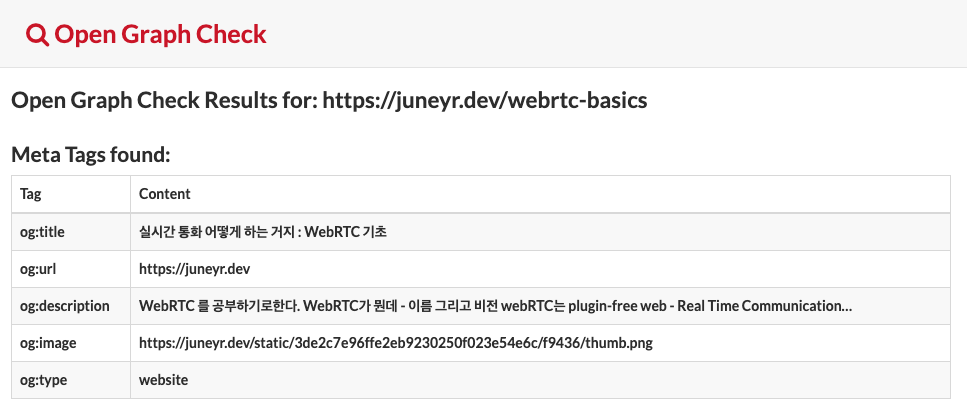
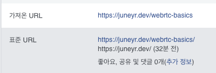
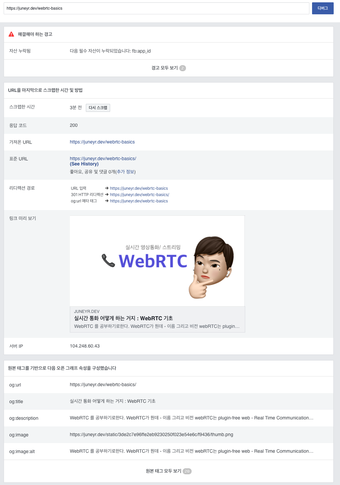

gatsby 블로그와 험난한 싸움중이다. 분명히 SEO 가 자동으로 적용되는 테마를 가져왔는데, 왜 작동이 안하는 것인지? 구체적인 문제상황은 `글에 설정한 배너가 안떠요` 였다.
시간이 좀 남아서 webrtc 글로 테스트를 해봤다. 


분명히 구체적으로 url을 적었는데도 블로그 자체의 이미지가 나간다. 

### 맞다, 글에 이미지 등록을 안했지. 
리액트는 잘 모르지만.. SEO 컴포넌트를 들여다보니, 
이런 html 문을 리턴한다.
```html 
  <meta property="og:title" content={seo.title} />
      <meta property="og:url" content={seo.url} />
      <meta property="og:description" content={seo.description} />
      <meta property="og:image" content={seo.image} />
      <meta property="og:type" content="website" />
```
그럼 저 seo 변수에 무엇이 들어가는지 들여다 봐야한다. 

```js
const seo = {
    title: title || defaultTitle,
    description: description || defaultDescription,
    url: `${siteUrl}${pathname || ``}`,
    image: `${siteUrl}${image || defaultImage}`,
  }
```

역시! 문법은 잘몰라도, `||` 혹은 `? <값> : <값2>` 은 대개 **앞이 값 없으면 뒤의 값이라는 뜻**이니까. 주어진 image 가 없으면 defaultImage를 반환해주는 것이겠지. 사이트에 설정해준 defaultImage가 github 프로필 사진이어서 저렇게 뜨는 것이고.
내가 사용한 gatsby starter 는 image를 직접 할당해주려면 frontmatter에 banner라는 키를 활용하라고 가이드한다.
```
---
title: '실시간 통화 어떻게 하는 거지 : WebRTC 기초'
date: 2020-01-29 11:28:00 +9000
slug: "/webrtc-basics"
tags: 
   - WebRTC
banner: ./thumb.png
---
```
이렇게 말이다. 말하는대로, 해당 값을 설정해주었다. 배포 후에는 내 og tag가 제대로 이 이미지를 참조하는지 보기 위해서 [테스트 페이지](https://opengraphcheck.com/) 를 방문했다.

`og:image` 항목에 이미지는 잘 들어갔다. `og:url`이 내가 입력한 url과 다르지만 뭐, baseUrl 참조하는 건가? 하고 넘어갔다. 
그리고 페이스북에 공유 테스트를 해보았는데... **여전히 기본항목만 뜬다!** 


### 페이스북아ㅜ 뭐가 문제니?

페이스북에서 어떻게 인식하는 건지 알 수가 없어 몇번 검색을 해보다가, 미리 url 공유화면을 테스트할 수 있는 [facebook 공유 디버거](https://developers.facebook.com/tools/debug/) 를 찾게 되었다. 
여기에 url 을 입력하니 `입력한 url와 og:url 값이 달라서` 제대로 나오지 않는다고 경고가 뜬다.



32분전의 값을 주목해야한다. 가져온 url (내가 입력한 url) 과 표준url(페이스북이 인식한 url) 이 다르다. 페이스북은 본인들이 인식한 표준 url을 기반으로 다시 
오픈그래프 속성을 재구성해서 포스트로 보여준다.

그러면 일단 og:url 값을 맞춰줘야한다. 다시 한번 컴포넌트를 보았다. 

```js
 const seo = {
    title: title || defaultTitle,
    description: description || defaultDescription,
    url: `${siteUrl}${pathname || ``}`,
    image: `${siteUrl}${image || defaultImage}`,
  }
```

url은 siteUrl (=여기서는 https://juneyr.dev) 에 path를 붙여서 나가게 되어있는데, pathname이 없으니 그냥 나가는 것이었다.
상단의 SEO 컴포넌트 정의를 보니, 

```js
const SEO = ({ title, description, pathname, image, children }: Props) => {
```
이렇게 **컴포넌트를 사용하는 쪽에서 필요한 값을 넣어주게** 되어있었다. pathname도 그중 하나. 이 SEO 컴포넌트를 사용하는 post 컴포넌트를 보자.

```html
 <SEO
      title={post.title}
      description={post.description ? post.description : post.excerpt}
      image={post.banner ? post.banner.childImageSharp.resize.src : 'banner.jpg'}
    />
```

예상을 빗나가지 않고 pathname을 넘겨주지 않았다. pathname은 내 post 구성에서는 slug와 같은 것이므로, `post.slug`를 넘겨준다. 

```html
 <SEO
      title={post.title}
      pathname={post.slug}
      description={post.description ? post.description : post.excerpt}
      image={post.banner ? post.banner.childImageSharp.resize.src : 'banner.jpg'}
    />
```

### 마지막으로 확인하기, 카톡 OG 

해당 url 을 다시 한번 공유 디버거에 넣어봤다. 



완성이다! 고치기 전에 카톡에서 테스트했던 경우 변경이 안되고 그대로 미리보기가 나오는 경우가 있다. 그런 경우 
[Kakaotalk cache 삭제도구](https://developers.kakao.com/docs/cache)에서 공유한 url을 넣어주면 캐시가 날라간다. 

### wrap-up 

결국 공유하려는 url과 og tag 상의 url을 맞춰주면 되는 문제였다. 나중에 혹시 블로그 개편으로 삽질한다면, 미래의 나 이 포인트를 잊지말길. 😉