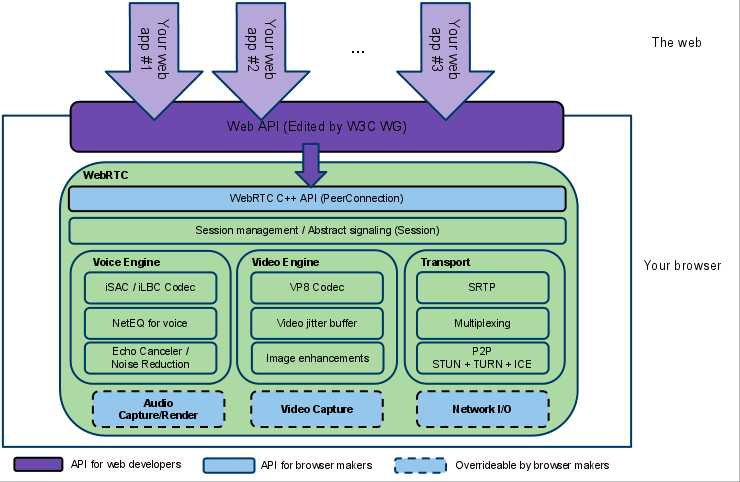

WebRTC 를 공부하기로한다. 

## WebRTC가 뭔데 - 이름 그리고 비전

webRTC는 plugin-free web - Real Time Communication 이다. 그러니까 별도의 플러그인 설치없이 **실시간 소통(비디오, 오디오)** 이 가능하도록 만들어주는 기술. 기존에는 내가 영상통화를 하고 싶으면 디스코드, 스카이프, 구글  행아웃을 설치하는 과정이 필요했는데, webRTC를 사용하면 크롬 / 오페라 / 사파리 브라우저에서 바로 실시간 소통을 사용해볼 수 있다. [appr.tc](http://appr.tc/)  에서 테스트 가능! 

WebRTC는 구글이 VoIP 회사인 GIPS 를 인수한 후, 해당 회사의 음성 / 영상 코덱 및 에코캔슬링 기술을 갖게 되었다. 이 기술을 WebRTC라는 이름으로 공개한 케이스다. 이게 2011년.

기본적으로는 P2P (Peer to Peer), 즉 두 단말이 서로 1:1 통신을 하게 되어있다. 따라서 대규모 방송 서비스를 구축하거나 컨텐츠 가공이 필요할 경우에는 **중앙 서버를 구축할 필요성**이 생긴다. 이런 경우 목적에 따라  두가지 아키텍처를 고려해볼 수 있다. 그것이 바로 SFU와 MCU인데, 이는 아래에서 다루도록 한다. 🙂

## 어떻게 되어있는 거야

생각해보면, 두 기기가 실시간 소통을 하기 위해서는 다음과 같은 사항이 필요하다. 

1. 기기의 스트리밍 오디오 / 비디오 / 데이터를 가져올 수 있을 것 

2. 소통하고자 하는 기기의 IP 주소와 포트 등 **네트워크 데이터가 필요**하다

3. 에러의 보고, 세션의 초기화를 위한 **신호 통신을 관리**해야한다 

4. 서로 소통할 수 있는 해상도인지, 코덱은 맞는지 등 capability 정보를 교환해야한다 

5. 실제로 연결을 맺는다

6. 그 이후에 스트리밍 오디오 / 비디오 / 데이터를 주고 받을 수 있어야한다.

이를 위해서 WebRTC  는 API 를 제공하는데 

- MediaStream : 사용자의 카메라 혹은 마이크 등 input 기기의 데이터 스트림에 접근한다.

- RTCPeerConnection: 암호화/ 대역폭 관리 기능. 오디오 / 비디오 연결을 한다.

- RTCDataChannel: 일반적인 데이터 P2P 통신

이는 위 사항의 일부만 만족시킨다. 나머지 자잘한 일들은 **Signaling** 이라는 과정을 통해 관리한다.  즉, 크게 보면 WebRTC를 사용한 통신은 두 덩이라고 할 수 있다.

1. **Signaling**을 통해 통신할 peer 간 정보를 교환한다. 네트워크 정보, capability 정보, 세션 수립 등.

2. **WebRTC**를 사용해 연결을 맺고, peer 의 기기에서 미디어를 가져와 교환한다. 

이제 다 된 거나 다름없다. 🙂

## WebRTC가 해주지 않는 것 : Signaling

Signaling은 통신을 조율할 메시지를 주고 받는 일련의 과정을 의미한다. Signaling을 위한 구체적인 구현 방법과 프로토콜은 WebRTC에 명세되어 있지 않기 때문에, 개발자들이 편한 방식을 선택해야 한다. 예를 들어 [appr.tc](http://appr.tc) 에서는 XHR과 Channel API를 사용해 Signaling을 구현했고, 구글 코드랩에서는 Node 서버 위에 [socket.io](http://socket.io) 를 사용해서 만들었다. 

그래서 이게 하는 역할이 뭐냐고 물으면, 

- Session control messages: 통신의 초기화, 종료, 그리고 에러 리포트

- Network configuration : 외부에서 보는 내 컴퓨터의 IP 주소와 포트는 뭐지?

- Media capabilites : 내 브라우저와 상대 브라우저가 사용 가능한 코덱, 그리고 해상도는 뭐지?'

이 작업은 스트리밍이 시작되기 전에 완료되어야만 한다. 구체적으로 내용을 좀더 살펴보자. 👽

1. 네트워크 정보 교환 Network configuration

    - ICE 프레임워크를 사용해서 서로의 IP 와 포트를 찾는 과정

    - `candidate` 에 서로를 추가
2. 미디어 정보 교환 Media Capabilities

    - 미디어 정보 교환은 offer 와 answer 로직으로 진행

    - 형식은 SDP(Session Description Protocol, 엄청 간단한 형식이다)

그리고 위에서 말한 Session Control messages는 위 과정에서 필요한 마이너한 과정들을 채워준다. 

Signaling 을 성공적으로 잘 마치고 나면, 실제 데이터(= 미디어, 영상이든 음성이든)는 Peer To Peer (불가능한 경우 중계서버를 거쳐서) 로 통신하게 된다.

## 잠깐만 ! 여기서 서버 역할

WebRTC에서 서버! 라고 하면 단순히 P2P에 왜 서버가 필요해? 그냥 클라이언트(=peer, 기기, 종단) 끼리 연결하면 되잖아? 하는 생각을 할 수 있다. 하지만 P2P로만 WebRTC 연결을 한다고 해도 서버가 필요한 경우가 있다. 이 기술에서 서버는 다음과 같은 역할을 한다.

- 사용자 탐색과 통신 / Signaling

- NAT / 방화벽 탐색

- Peer to Peer 통신 서버 시 중계서버

> NAT(Network Address Translation) 은 기기에 공인 IP를 부여하는 기술이다. 라우터에 설정하는데, 라우터는 공인 IP  를 갖고, 라우터에 연결된 모든 기기는 사설 IP 를 갖는다. 기기가 요청할 것이 생기면, 라우터의 고유한 포트를 사용해서 사설 IP 에서 공인 IP 로 변환한다(translation).  어떤 라우터는 접근할 수 있는 노드를 제한 할 수 있다.

ICE 프레임워크가 등장한다.  ICE 프레임워크는 기기를 발견하고 연결하기 위한 프레임워크이다.

1. ICE는 UDP 를 통해 기기들을 서로 직접 연결시도한다.
    1. 🙂 예이! 연결이 되었습니다. 이제 미디어를 교환합시다. 

    2. 😡 왜 연결이 안되지? NAT 혹은 방화벽 뒤에 있나봅니다. 

2. 기기가 NAT 뒤에 있다.  STUN 서버가 이를 해결해 줄 수 있겠다.
    - STUN (Session Traversal Utilities for NAT) 는  기기의 공인 IP 를 알려준다. 기기의 NAT가 직접 연결을 허용하는지, 아닌지 파악하는 역할도 한다.

    - 클라이언트는 STUN 서버에 요청을 보낸다. STUN 서버는 클라이언트의 공인 주소와, 클라이언트가 NAT 뒤에서 접근이 되는지 알려준다.

    - 그 이후에 직접 다른 기기와 통신한다.

        1. 🙂 예이! 연결이 되었습니다. 이제 미디어를 교환합시다. 

        2. 😡 왜 연결이 안되지? **TURN** 서버가 나설 때 입니다. 

3. 어떤 라우터는 `Symmetric NAT` 를 적용한다. 

    **Symmetric NAT :**  목적지에 따라서 `같은 private IP 의 노드`를 `다른 공인 IP 와 포트`로 매핑해준다. 이런 경우 라우터는 **이전에 연결했던 기기에서의 연결만 허용한다**. 

    - TURN ( Traversal Using Relays around NAT) 는 Symmetric NAT 의 제약조건을 우회하기 위해서 만들어졌다. TURN 서버와 연결을 맺고, 이 서버가 모든 교환 과정을 중개해준다. 모든 기기는 TURN 서버로 패킷을 보내고, 서버가 이를 포워딩한다. 당연히, **오버헤드**가 있고 =) 다른 대안이 없을 때만 사용한다.

 

## 이제 우리 정말 데이터 교환하자  😨 WebRTC 부분

RTCPeerConnection 은 당사자들 간 데이터를 안정적이고 효율적으로 통신하게 해주는 요소다.  아래 그림에서 초록색 부분은, 원래라면 개발자가 처리해야 부분이다.

원래라면, 

- 패킷 로스를 가려주고
- 에코 캔슬링 (echo cancellation, 에코를 제거해서 통화 음질을 향상시키는 방법)
- 대역폭 조절
- dynamic jitter buffering
- automatic gain control (아마 음량 조절이나 그런부분까지)
- 노이즈 제거와 압축
- 이미지 클리닝

직접 해야한다.

## 스트리밍, 그리고 다자 간 통신

위에서 말한 것처럼, 기본적으로는 P2P (Peer to Peer), 즉 두 단말이 서로 1:1 통신을 하게 되어있다. 따라서 대규모 방송 서비스를 구축하거나 컨텐츠 가공이 필요할 경우에는 **중앙 미디어 서버를 구축할 필요성**이 생긴다. 이런 경우 목적에 따라  두가지 아키텍처를 고려해볼 수 있다.  바로 MCU와 SFU. 

## P2P

그럼 원래 우리의 P2P는 어떨까. 중앙 미디어 서버 없이 종단 간 직접 연결하므로, 비용 측면에서 이득이 있다. 다만 peer 수가 증가할수록 개별 기기의 높은 성능을 요구한다. 1:1, 최소한 소규모 미디어 교환에 적합하다. 

### MCU (Multipoint Control Unit)

한쪽 Peer에 서버를 두고, 들어오는 트래픽을 서버에서 믹싱해서 다시 내보내는 방식이다.  클라이언트와 네트워크의 부담이 줄어드는 반면, 중앙서버의 컴퓨팅 파워가 많이 요구된다. 참고한 블로그에서는 낡은 기술이고 + 서버 운용 비용이 높아, WebRTC와 같은 실시간성 보장이 우선인 서비스인 경우 장점이 상쇄된다고 언급되어있다. 

### SFU (Selective Forwarding Unit)

믹싱하지않고 트래픽을 선별적으로 배분해서 보내주는 방식.  각 peer 연결 할당과 encrypt / decrypt 역할을 서버가 담당한다. 1:N 스트리밍 구조에 적합하다고 한다. 

그림 출처 : [https://www.slideshare.net/tnoho/sfu](https://www.slideshare.net/tnoho/sfu) 의 일본어 부분만 치환했습니다. 

## 마치며

실제로  WebRTC를 상용서비스로 변환하려면 고려해야할 점들이 더 있는데, 차차 보완하도록한다. 

## 참고

[https://www.html5rocks.com/ko/tutorials/webrtc/basics/](https://www.html5rocks.com/ko/tutorials/webrtc/basics/) 

[https://codelabs.developers.google.com/codelabs/webrtc-web/#7](https://codelabs.developers.google.com/codelabs/webrtc-web/#7)

[https://blog.xenomity.com/P2P-vs-SFU-vs-MCU/](https://blog.xenomity.com/P2P-vs-SFU-vs-MCU/)

[http://www.authorstream.com/Presentation/kangsik-3609452-webrtc/](http://www.authorstream.com/Presentation/kangsik-3609452-webrtc/)

[https://developer.mozilla.org/en-US/docs/Web/API/WebRTC_API/Protocols](https://developer.mozilla.org/en-US/docs/Web/API/WebRTC_API/Protocols)

[https://brunch.co.kr/@linecard/154](https://brunch.co.kr/@linecard/154)