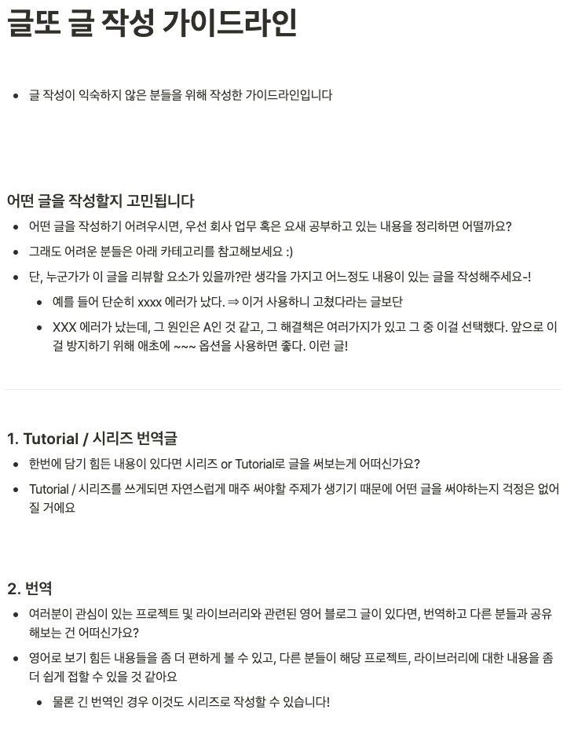

개발 블로그들을 구독하다보면 유난히 눈에 띄게 잘 쓴 글들이 보였습니다. 프로필을 보면 저와 같은 주니어 개발자인 것 같은데 수려하고 잘 정리된 글을 작성하는 모습을 보면 완전한 프로 !  그 아래에는 가끔 '글또 3기' 와 같은 프로필이 붙어있었습니다.  이게 뭐지 🤔

그러던 중에, 글또의 자세한 설명을 볼 일이 생겼습니다. 꾸준히 글을 쓰고 서로 피드백해주는 글또의 구성을 보면서 흥미가 생겼고, 결국 지원까지 이어져 이렇게 글을 쓰게 되었네요 =) 이번 4기에서는 3월부터 시작하여 글또 활동을 이어나가게 됩니다. 

### 여태까지는 어떤 글을 썼나요?

전체적으로 제 블로그는 기초위주의 개념 소개 글로 이루어져있습니다. 

- Java / Spring
- Web
- 하둡 / 커버로스 / 레디스 / 카프카 등 인프라에 대한 기초 지식

이 지식들을 잘 가공하여 미래의 저에게 쓸모 있는 글을 작성하는 것이 대목표입니다. 동시에 여러 사람에게 알려져서 더 도움이 되는 것 역시 목표이기도 합니다. 

그러려면 현재 블로그에서 가장 괜찮은 글들을 골라, 장점을 가져가는 것이 필요한 것 같다는 생각이 들었습니다. 

그래서 찾아본, 가장 꾸준한 유입이 있는 글은 [https://juneyr.dev/2019-02-12/resttemplate-vs-webclient](https://juneyr.dev/2019-02-12/resttemplate-vs-webclient)  입니다. 이 글은  java / spring 에서 가장 쉽게 사용하는 웹 요청 인터페이스에 관한 이야기인데요. 역시 기본적인 개념에 대한 이야기입니다. 인기가 많은 이유를 생각해보자면, 

1. 제가 이 글을 쓸 때까지만 해도 이렇게 비교글 (한글) 이 많이 없었습니다. 구글에서 자동완성될 정도로 궁금한 주제인데도!
2. 그래서 다른 블로그에서 안 것을 갈무리하는 정도가 아닌, 직접 찾아보면서 글을 구성했습니다. 
3. 글의 길이가 길지 않아 읽기가 쉽습니다. 

두번째로 꾸준한 글은 [https://juneyr.dev/2019-07-24/spring-batch-tasklet](https://juneyr.dev/2019-07-24/spring-batch-tasklet) 입니다.  batch의 기본이 되는 tasklet 작성법인데요. 이 글 역시 

1. 글이 짧고 구성이 한눈에 보인다!
2. 이미지를 넣어서 눈에 잘 띈다 

라는 장점이 있습니다. 

이런 점을 종합해서 생각해보면, 이번 글또를 하면서는 

1. 간결하고 2. 눈에 잘보이며 3. 구조적인

개발 개념정리 글들을 쓰는 것이 가장 바람직하다는 생각이 들었습니다. 

### 그럼 그런 글만 쓸건가요?

글또의 글쓰기 가이드라인은 다양한 글 종류를 소개하고 있습니다. 

[https://bit.ly/geultto](https://bit.ly/geultto)

저는 주로 회고와 개념적인 글을 많이 썼지만, 다양한 방향성이 제시된 만큼 추가로 한가지 종류를 더 쓰는 것이 목표입니다. 번역글이라든지, 행사 참여 후기라든지, 책 리뷰도 하고 싶네요 🙂

앞으로 많은 개발자분들과 소통하고 피드백하며 나아질 블로그가 기대됩니다. =)