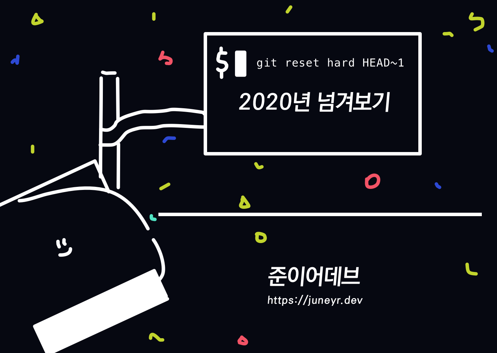
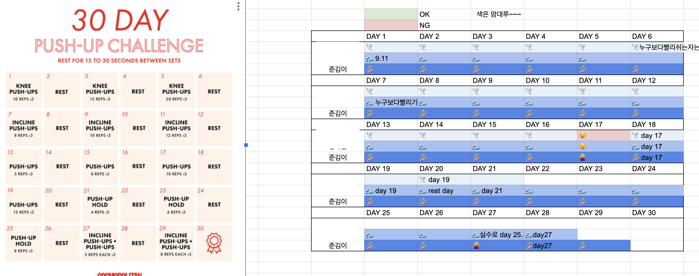
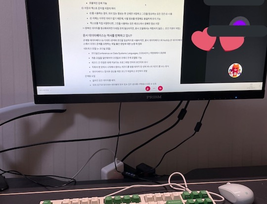
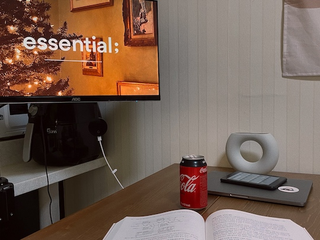
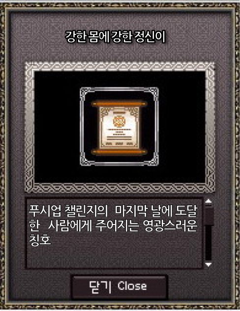

2020년을 어떻게 말할 수 있을까?

무엇을 계획했어도 누구나 무너졌으리라 생각이 든다. 이 글을 쓰는 지금도 나는 며칠 째 쓰레기 버리러 나갈 때를 제외하고 집밖을 나가지 못했다. 감사하게도, IT 업계에 종사하는 덕분에 생계의 걱정없이 한 해를 보낼 수 있었지만, 사람들 간에 거리를 두고 소통이 힘든 상태에서 일하고 만성적인 우울함을 견디고 있다. 

그러나 이번해는 또한 나에게 회복의 해이기도 했다. 용감하게 (나는 이번 해의 나에게 용감이라는 단어를 붙여주고싶다) 독립을 했고, 상담을 받기 시작했다. 내 속에 응어리진 어떤 것, 그리고 가족에 대한 나의 시선을 고쳐바라보았다.  운동을 9개월 째 꾸준히 했다. 스터디를 세개, 운동 챌린지를 두개째 했다. 그리고 또 다시 더 나은 옵션으로 집을 구했다. 중학교 이후로 가장 책을 많이 읽은 해이기도 했다. 

개인으로 바라보면 훌륭한 한해였을지모른다. 그리고 나는 나의 매 순간이 소중하고 사랑스럽다고 생각하기때문에, 어떤 해이든 감사로 끝맺음을 하고싶다. 

> 이 회고는 timeblocks, things3, 개발블로그, 회사 repository, 나의 트위터, 카카오톡, 구글 포토를 참고했다. 기록은 역시 짱이야. 

## 1분기 (1-3월)

### 일과 공부 🤹‍♀️
5개월 간 서비스하던 LINE STEP 을 접었다. 사람들이 돌아다니는 만큼 활성화되는 서비스였으므로, 코로나에 영향이 어차피 있었을 것이다, 라는 생각을 종종하긴 한다. 새로운 프로젝트를 준비하기 위해서 webrtc 공부를 했다. (여담으로 이 글이 제일 유입이 많은 글 중 하나인데 저는 잘모릅니다. 글을 쓰기 위해 다시 보니 TURN이랑 STUN이 뭔지도 모르겠어요.)

글또를 시작했다. 글또는 내가 이번해 내 영업을 한 것 같으므로 자세한 설명은 아래 관련글을 참조해주세요. 2주마다 마감을 치우는 생활을 시작했다. 생업과 연결되어있으면 이렇게 부끄러워서라도 강제로 글을 쓰게 된다니까.... 🙄 

그 준비로, 글또 시작하기 전에 블로그를 jekyll 에서 gatsby로 옮겼다. 그냥 타임라인에 워낙 칭찬들이 많고 츄렌디 해보이길래 갈아탔다. 그 결과는 아주 좋았다고 생각한다. vim-wiki와 결합해서 wiki 글을 vim으로 작성하면 바로 블로그 포스팅으로 올라가도록 구조를 바꿨다.  @lekoarts님 혹시 이 한글 회고를 보고 있다면 왜 섀도잉이 잘 안되는지 알려주십시오. 😭 
gatsby와 netlify 의 조합이 좋다고 들어서 바로 사용해봤다. 혹시 나도 얼리어답터? 

netlify 를 쓰면서 fauna db도 사이드에 써봤다. 링피트 체커라는 달력형, 단순 링피트 결과를 입력하는 폼인데 후딱 만든 것치고는 8주 이상 4명이 사용했으니 괜찮은 사이드였다. 지금은 링피트를 안해서 netlify에서 내렸다. 

We are just ordinary IT people by Dev C 웨비나에 참석했다. 생각해보니 이 웨비나가 이번해에 
처음 참석해봤던 온라인 개발 행사였네. 나는 오아리님의 아마존에서 살아남기가 인상깊었다. 다른 회사의 문화를 아는 건 소중한 경험이다.  

--- 

**관련글** 
- [jekyll to Gatsby 블로그👩‍🔧](https://juneyr.dev/jekyll-to-gatsby-%EB%B8%94%EB%A1%9C%EA%B7%B8-%F0%9F%91%A9%E2%80%8D%F0%9F%94%A7)
- [실시간 통화 어떻게 하는 거지 : WebRTC 기초](https://juneyr.dev/webrtc-basics)
- [링피트 체커를 fauna로 만들어보자](https://juneyr.dev/ringfit-checker)
- [We are just ordinary IT people 웨비나 요약](https://juneyr.dev/devc-seoul-2020)
- [글또 4기 참가합니다 =)](https://juneyr.dev/geultto-4)

### Meanwhile..  
- 코로나가 심해졌다. 회사에서 선제적으로 재택근무를 시작했다. 🙊 이때는 마냥 좋았지만 ... 
- 나는 선견지명이 있는 걸까? 아니다, 그냥 신실하게 감사할 뿐.. 재택 전에 독립했다. 물리적인 독립이 정신적인 독립의 시작이다. 
- 위에 나온 것처럼 PT 전까지는 링피트를 열심히 했다. 링피트 정말 운동 재밌게 맛들리게 할 수 있는 게임... 하지만 점점 엉덩이 흔들기 RPG 를 하는 나 자신을 보고 팔아버렸다. 
- PT를 시작했다. 2월달에 인생 최고 몸무게를 찍고, 몸이 많이 무거워졌었는데 3월에 결국 PT의 도움을 받게 되었다. 최종적으로 처음으로 6kg 건강하게 뺐는데 이 내용은 파이프라이닝 용 블로그에 작성해두었다.
- 동물의 숲을 왕창했다. 무 사려고 일찍 일어나는 과몰입 킴. 재미없다고했는데 플레이타임 100시간 찍혀있고 모 그랬다. 
- n번방 텔레그램 성착취사건이 공론화되면서 내내 분노에 휩싸여있었다. 아직도 이 사건은 현재진행형이다. 조직적으로 성착취해서 판결 받은 사람뿐 아니라 보고, 공유한 모두가 범죄자이니 제대로 된 처분을 받았음 한다.

## 2분기 (4-6월)

### 일과 공부 🤹‍♀️

새로운 프로젝트에 투입되었다. 이번에는 알림/push 도메인에 투입되어서, 사내에서 사용하는 푸시 전송 모듈을 공부하고 프로젝트에 연동되어 있는 부분을 refine하는 작업을 했다. 아, VoIP 통화를 할 때도 push 가 사용되는 거라는 걸 아셨는지? 나는 몰랐다. 🙂 근데 이때 iOS에는 사용하는 토큰이 달라서.. 푸시 토큰 저장을 두번해야하는 문제가 있었고 이 문제는 후에 우리팀을 쬠 괴롭히게 된다. 

유니버셜 링크 연동도 개입하게 됐다. 이 부분은 실제로 내가 할 일은 없었는데 중간까지 개념을 이해하고
실제로 되는지 보기 위해서 앱 개발자분들, 웹 FE분과 소통하는 일이 주 였다. 파트리더님이 회의에 다 들어오긴 했지만 서버쪽 실무자로 날 세워준 게 지금 생각하니 참 감사했다.😉 주니어를 배려하는 방법은 '아 요거 안들어와도 괜찮아요!' 가 아니라 '요거, 저거, 뫄뫄님도 주도권 있으니 참석해보십시다' 라는 표현을 해주는 것인 것 같다.  

글또를 하면서 블로그 글 쓰기에 박차를 가했다 (영혼까지 긁어모았다) nginx 설정을 하면서 다시 nginx 기초글을 썼는데, 살짝 흥했다고 생각한다 ㅋㅋㅋㅋㅋㅋ
 <blockquote class="twitter-tweet">
<a href="https://t.co/IOaxlc3joF">https://t.co/IOaxlc3joF</a>  저번주 글또용으로 쓴 nginx basics. 이번주엔 뭐쓰지
&mdash; 멍준꿀 (@juneyr_) <a href="https://twitter.com/juneyr_/status/1263880964888915968?ref_src=twsrc%5Etfw">May 22, 2020</a></blockquote> 

지난해 디자인 패턴을 함께 공부했던 SLiPP 아니고 SLEEP 스터디 그룹이 있다. 이 분기에 느슨하게 모임을 하다 모던자바 스터디를 진행하기로 했다. 이 사람들 일단 누군가 던지면 따라가고 따라와줘서 좋다. 이런 스터디풀을 조금씩 늘려가야지. 스터디 진행방식은 

- 책 일부만
- 하지만 모두가 읽어서 정리한다
- 스터디 당일 랜덤으로 돌려서 발표함 

이 방식에는 장단이 있는데, 책을 모두가 완독하고 정리도 하지만 매우 피로하다는 점이다. 나는 글또 글 소재도 슬슬 떨어져가던 참이었으므로, 시작했다. 

--- 

**관련글** 

- [transient : 두가지 사용례, 비슷한 의미](https://juneyr.dev/transient)
- [나는 nginx 설정이 정말 싫다구요](https://juneyr.dev/nginx-basics)
- [타입 속 타입 : Parameterized Type](https://juneyr.dev/parameterized-type)
- [Reactive Programming 101 : 리액티브 프로그래밍이 뭔가요](https://juneyr.dev/reactive-programming)
- [모던자바인액션 1장, 2장, 3장 wiki](https://juneyr.dev/modern-java-1)

### Meanwhile.. 

- 부모님과 회사 숙박시설 당첨으로 제주도에 다녀왔다. 
- 보고싶었던 친구들을 만났다. 고등학교, 테크캠프, 재수학원, SLEEP 스터디새럼들, 사랑하는 여성개발자 친구들까지! 생일달이 껴있어 나눠서 여러번 만났다.
- 장마가 길어지고 집에 물이 샜다 (...) 대처능력이 1 상승 😮 
- 코로나가 조금 잦아들어서 다시 출근을 시작했다. 간헐적 출근을 진행하니, 전면재택보다는 능률이 올랐다. 회사의 커피를 먹을 수 있는 것도 한몫했구. 

## 3분기 (7-9월)
### 일과 공부 🤹‍♀️

전부 다 문과였던 고등학교 친구와 재수학원 친구와 함께 알고리즘 스터디를 하다가 모두 촤락초록 회사들에 입사하게될 확률을 구하시오... 우연한 기회로 셋이 만났고, 마침 항상 소원이던 알고리즘 공부를 계속해볼까 싶어 알고리즘 스터디를 하게 되었다. 

- 주중에는 leetcode easy를 세개 푼다. 
- 주말에는 시간을 정해서 medium을 하나 푼다.
- 코드리뷰하고 점검하는 시간을 zoom 으로 논의한다. 
  
하다보니 easy만으로는 쉬워져서 과제에 medium을 하나씩 추가했다. 오랜만에 대학과제하는.. 마감에 쫓겨사는 ... 느낌 나고 좋았다. 3개월하고 일단 마무리했는데... 취준이었던 친구들이 모두 좋은 결과를 얻었다. 와! 나도 회사에 친구생겼다! 별개로 스터디 방식 자체는 그리 효율적이지 않았던 것 같아서 좀더 문제를 많이 치고 오답노트를 할 수 있는 방법이 없을까 고민 중. 이 스터디와 함께 나는 [파이썬 알고리즘 인터뷰](http://www.kyobobook.co.kr/product/detailViewKor.laf?ejkGb=KOR&mallGb=KOR&barcode=9791189909178) 를 보았는데 그림과 함께 설명이 되어있고 많은 부분을 천천히 설명해주기때문에 좋았다. 아직 다 못 읽었는데 내년엔 조금씩이라도 볼수있길! 

글또를 마무리했다. 영혼까지 끌어모아서 예치금 안까이고, 추가 환급금까지 받았다. 요호호

--- 
**관련글**
- [Java 8 스트림](https://juneyr.dev/modern-java-2)
- [하드웨어 스레드와 소프트웨어 스레드](https://juneyr.dev/thread)
- [MySQL 에서 차집합 : Anti-join 의 세가지 방법](https://juneyr.dev/anti-join)
- [유니버셜 링크, 딥링크... 이게 다 뭐야! 유니버셜 링크와 구현](https://juneyr.dev/universal-link)
- [모던 자바 인 액션: 6-7장 wiki](https://juneyr.dev/modern-java-3)
- [모던 자바 인 액션 : CompletableFuture wiki](https://juneyr.dev/modern-java-4)
- [Java 8, 9 Optional 사용하기](https://juneyr.dev/optional)

### Meanwhile.. 

- 페이스북 탈퇴했다. 생각 얘기하기 좋아하면서도 오픈된 공간에 하기는 꺼렸기때문에 SNS 관리가 화두였는데, 잘되었어. 
- 호적메이트의 성혼예배를 드렸다. 축하합니다 🙌
- 팔굽혀펴기 챌린지를 시작했다. 
  - 대단히 상냥한, 이번해를 함께해준 친구들과 함께. 
  - 
- 심리상담을 받기 시작했다. 이에 대한 이야기는 처음에 만들었던 파이프라이닝 블로그에 꼼꼼히 적었었는데, 플랫폼을 옮기면서 날아갔다. 
- 휘딱 회사 숙박시설 당첨으로 강릉에 다녀왔다. 가기 3일 전에 같이 가기로 한 동행이 취소되어서 스트레스 받았었는데, 다행히 다른 친구들이 오 고고! 이렇게 말해줘서 잘다녀왔다. 
- 운전면허 기능 시험을 세번이나 도전했는데 떨어졌다. 화나서 걍 필기 만료되게 뒀다. 이렇게 좌절스러운 일이 있다니.. 가만히 있어도 심박수가 100이상으로 뛸정도로 긴장했다. 내년에 다시 해야지.. 나의 좌절을 엿보려면 [여기](https://juneyr.dev/driver-license) 로. 

## 4분기 (10-12월)
### 일과 공부 🤹‍♀️

'데이터 중심 어플리케이션 설계' 책을 팀원분께 추천받았다. 트위터에서도 좋은 책이라고 크로스체크를 해주시기에 시작했는데 도무지 진도가 안나가서 SLEEP 에 도움! 했고 그때부터 빡센 연말 6주 스터디가 시작됐다... 양이 정말정말 많다. 

- 한주에 두장씩
- 순서를 정해서 한명이 한장씩 정리 
- 모두 읽어오되, 당일날에는 맡은 사람이 발표 

이전 스터디보다는 워크로드면에서 나은 방식이었을 지 모르는데... 책을 잘못골라서, 양적으로는 이전 스터디 준비하는 것처럼 준비해야했다. 내용이 참 어려웠다. 도움은 되는데, 깊이가 막 깊어졌다가 돌아오는 면이 없잖아 있었음. 이론적인 부분을 좋아하는 나에게도 쬠 버거웠음. 하지만 두고두고 볼만한 책이다. 

QA 와 서비스 리얼 배포준비로 분주했다. 지금은 내부 사정으로 서비스가 밀려서 다시 한번 조금 스트레스를 받고 있는 실정이다. =) 

우리조직은 1년에 한번만 리뷰를 작성한다. 작년에도 재작년에도 한 것도 없이 말만 늘어놓는 꼴이 될까봐 리뷰를 열심히 쓰지 않았다. 정확히는 나보다 일많이 하신 분들도 이렇게 까지 안쓰시는데... 싶어서. 그 선을 지켜가면서 썼었다. 
이번에는 그냥 사소한 것까지 다 작성했다. 내가 한 PR들 모두 찾아보고, 도메인 별로 정리해서 구현한 기능들을 정확하게 적고 역할을 과장하지도 축소하지도 않도록했다. ㅋㅋ 지나가는 말로 다른 동료분이 준영님 리뷰 참 잘썼네요. 할 정도로. 내가 한 걸 내가 알려야지 누가 봐주겠어. 

### Meanwhile.. 
- 건강검진을 받았다. 수면내시경은 영원히 안익숙해질것... 그래도 이번엔 몽롱한 상태로 밥까지 먹고 돌아왔다. 집이랑 검진센터 가까워서 다행... 그러나 안타깝게도 만성 표재성 위염이라는 진단을 받았다. 계속된 위경련때문에, 결과로 나타난듯. 새해에는 이게 없었음 좋겠다. 양배추즙 시킴.
- 코로나로 운동못하게됐다. 2.5단계까지 격상되면서 아예 운동을 못가게되었다. 2.5단계 격상 전에 농담 삼아 트레이너쌤이 언제 할 수 있을지 모르니까 열심히 해두라고 했는데, 정말 못가게 됨... 😮 홈트를 마음 잡고 하지 않기때문에 얼른 PT 다시 하고싶다... 
- 복근챌린지를 시작했다. 12월 시작에 힙으뜸 채널에 복근챌린지 2탄이 올라오길래 시작했고 이걸 쓰는 지금은 13일차까지 완료. 아주 힘들고 짧다! 
- 달리기 5km 도전 방에 조인했는데 실패했다. 홈트 챌린지는 전부 성공했는데... 나가는 건 내 생각보다 의지를 더 필요로 했다. 하지만 달리기를 처음 시도해봤으니, 다음번 시도할 땐 더 수월할 거고 그 다음은 또 더 수월하겠지. 
- 전세집을 구했다. 금세라고 불릴정도로 전세 매물이 하나도 없었는데 네이버 부동산 들여보다 올라온 매물 다음날 계약. 유동성 자산이 딱 계약금 낼 정도밖에 없었고 여러 상황으로 봤을때 딱 내 집이라구 생각이 들어서 망설임없이 계약했다. 월세로 나가는 비용이 확 줄게 되어서 기분이 좋으다.. 🤸🏻‍♀️ 내년 1월 이사 예정이라 사고 싶은 것 안사고 당근에 가구를 4개 이상 연쇄나눔해버리고 있다.

## THING OF THE YEAR 
- 모니터암 
  - 모니터암을 두개나 구매했다. 
    
	
  - 하나는 정말 업무용, 하나는 주방쪽에 매달아 놓고 설거지나 밥먹을때 영상보는 용도로 사용하고 있다. 
	모니터 하단을 시원하게 만들어주고 각도 조절로 나의 목 건강을 좀 도와준 점에서 높은 점수 준다. 저렴한 카멜마운트 샀음 (2-4만원대) 
	
- 린트초콜렛 어드밴트 캘린더 
  - 친구에게 선물 받았는데 advent calendar 가 이렇게 매일을 기다리게 하는 물건인줄 몰랐음. 

- iPhone 12 Pro
  - 구매해서 기쁘기도하지만, 구매 과정에 쿠팡이 멎고.. 11번가 문의 쇄도하고.. 이 과정을 보게 놀라웠다.
  - 카메라 정말 좋음 근데 아이폰스러운 카메라 감성 없어짐

## BOOK OF THE YEAR 
책은 [2020년의 책](https://juneyr.dev/2020-books) 에 있다. 
여기서 몇개를 꼽을 수 있을까? 

바로 생각나는걸 꼽자면
- '시선으로부터', 정세랑 
- '시녀이야기', 마거릿 애트우드 
- '돈의 속성', 김승호 

이렇게 세가지가 묵직하고 재밌었다. 개발서적은 공부니까 꼽지않아!

## CHALLENGE OF THE YEAR 
링피트, 푸시업, 복근 챌린지 그리고 모던자바,알고리즘, 데.중.어 스터디... 실패한 운전면허 기능시험.. 
이번해는 전반적으로 '나 혼자 할 수 없으니, 동료와 함께하자' 식 해였다. 매번 배우는 바가 있어서 쉽게 꼽기 어렵지만 손쉽게 성공했고 그 결과도 뿌듯했던 푸시업 챌린지에게 이 상을 드립니다. 

## DRAMA OF THE YEAR 
- 더 폴리티션 시즌2 

더 폴리티션의 강한 여성 정치인 그리고 결점도 있는 여성상 봐달라구요... 넘 재밌다고요... 결말까지 깔끔하다고 평한다. 

## TO-BE 
작년에 보니까 TO-BE를 행복하고 건강하자로 써놨다. 그리고 이번해는 작년보다 행복하고 건강했다. 어떻게 흘러갈지 몰랐지만 매 순간 최선을 다했던 이번 해처럼, 내년도 힘내서 건강하고, 행복할 수 있으면 좋겠다. 

--- 

이 회고를 12월 까지 다 써놨었는데, 한번 날아갔다. 중간에 한번도 커밋하지 않은 내 자신.. 조금 슬프다. 하루 자고 나니까 그 글은 조금 번잡했지? 싶네. 이건 좀더 깨끗한 버전이다. 😗
