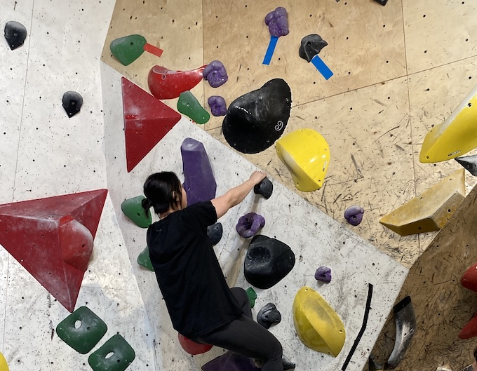
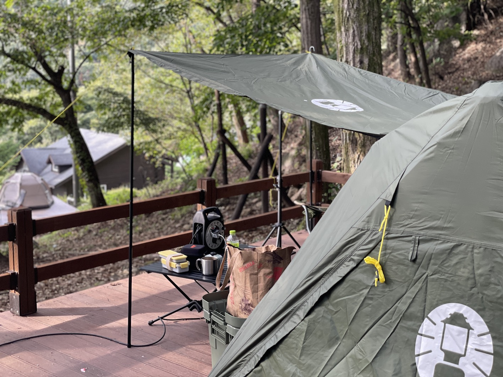
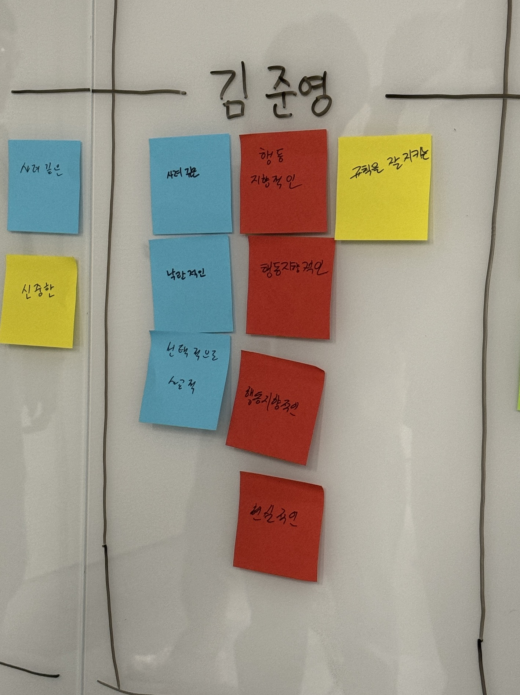
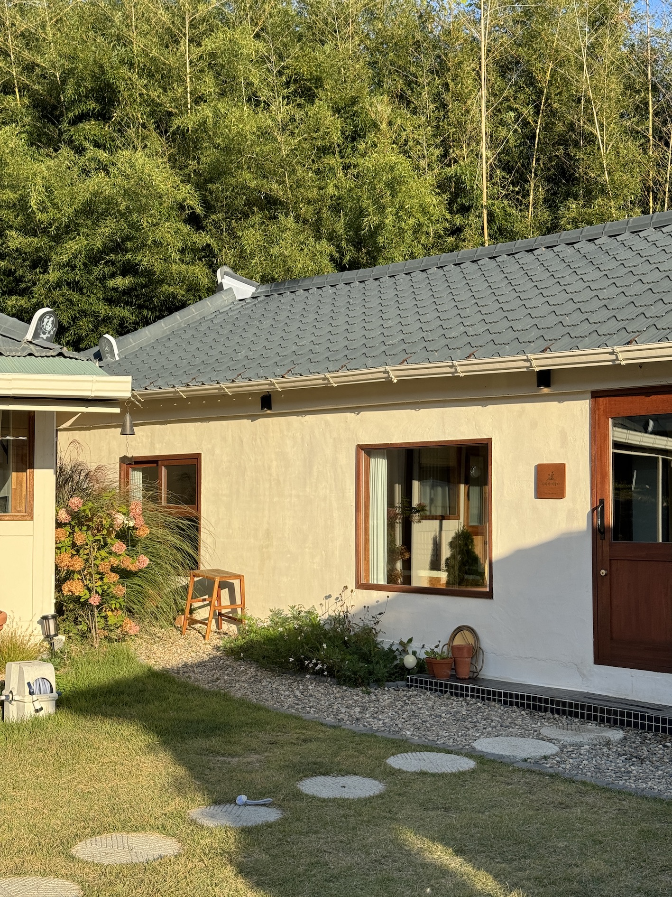

어떤 습관은 내 삶에 뿌리 내리기도, 어떤 것은 있는 줄도 없다는 듯이 사라지기도 한다. 분명한 건 그 모든 것이 흔적을 남기고 다음번에 추적과 연결을 시작할 때 쯤에 도움이 된다는 것이다. 그 생각을 붙들고 2024년을 시작하기 전 2023을 기록한다. 

몇 년 간 기록, 공부, 생산성, 운동, 건강한 삶에 대한 희미한 집착과 함께 살았다. 이번 해는 그런 것들이 많이 흔들렸고 번잡했고 바빴다. 새로운 팀과 업무에 익숙해질 무렵 또 변화가 있었고, 그리고 갑작스럽게 이제는 개인이 아니라 함께를 생각해야해, 하고 요구받은 느낌이 들었다. 

사람을 구경하는 건 참 좋아하고 그 사람의 성향을 묶어서 머릿속에 잘 기억해두는 편인데, 실제로 대응하는 건 또 다른 차원의 이야기다. 여태까지는 '아 난 저 사람이랑 안맞아' 정도로 치워버릴 때만 썼던 정보를,  '저 사람과 함께 해야해' 로 목적을 변경해서 운용하려고 하니 적잖이 힘들다. 

본격적인 엔데믹 시대를 맞아 묵혀뒀던 사회성이 폭발했다. (팀 한정) 팀 플레이 운영진, 팀에 졸라서 바베큐 파티를, 캠핑을 따라가고 시작하기도 했으며 노력파 보드게임 마스터와 급기야 펜션잡아 놀기까지. MBTI I 가 1-30 척도에서 1 나온게 사실이야 . . . '팀 활동'에 미친자됨. 내년에는 누군가 해주기만을 기다려야지. 

> obsidian 주간 업무일지,  google calender, google photo 를 참고했다.

## 1분기 (1-3월)

### 일과 공부 👩‍💻

엄청난 공격을 맞았다. 서비스가. 이때는 몰랐지만 그 많은 인원 중에서 재해 복구 후처리반으로 선택되었다. <재해복구 후처리반> 은 4월부터 12월까지 나를 붙잡고 놔주지 않는 프로젝트가 되어버린다... 🥲 이는 4월부터 후술. 

성능테스트를 진행하는 과제를 했다. 성능개선책 자체는 캐시를 붙이는 것으로 끝났지만, 별도의 agent 를 두고 성능 테스트를 해볼 수 있어서 유용했다. 하면서 외려 공부를 많이 한 흔적이 있네. JVM 의 메모리 구조에 대해서 한번 더 공부했다. heap 덤프도 뜨고. 2인이 함께한 과제였고 자칫 늘어질 수 있는 과제여서 매일 간단한 스크럼을 진행했다. 우리 팀에서는 skippable scrum (거의 방금 지은 이름)을 채택하는데, 스크럼 10분 전에 슬랙에 리마인더를 울리도록 해두고 팀원이 한명이라도 말할 이슈가 있으면 진행하는 방식이다.  이거 참 좋았던 기억. 

또 하나 팀적인 부분에서. . . 매일 스크럼 마스터를 하면서 헬스체크를 진행했는데 (기분이 좋나/ 나쁜가 / 아픈덴 없나) - 회고까지는 이 부분이 불필요하다는 동료 피드백이 있어서 사람을 가려서 해야겠다는 생각을. 다만 나중에 '내가 해보니 준님 넘 고생했겠더라. ' 하는 2차 피드백이 들어와서 재밌었다.

로그성 데이터를 삭제하는 배치를 만들다가 개발 DB 테이블 날렸다. ?? 이런 초보적인 실수를 ?? 하지만 나 너무 땀났음. 3월에 날렸는데 작년 10월의 백업이 있어서 그쪽으로 일단 절한다음,  복구하는 기록을 내부에 남겼다. 방지책으로 7일치의 백업을 하는 cron 도 만들어두고. 이건 생각보다 빨리 빚을 갚게 됐는데 . . . 💵 같은 해에 동료가 다른 테이블을 날렸거든. 복구 백업덕분에 당일의 백업으로 복구할 수 있었고 이번엔 내가 절을 받았다.

팀플레이를 다녀왔다. 3팀이 함께 가는 거였고 각 팀에 한명이 차출되어 운영했는데 그게 나야밥 두밥 두비 두밥, , , 오랜만에 PPT 깎으면서 재밌었다. MBTI 정식 검사를 받았는데 팀원들의 결과를 몇번 쯤 보니 20명 거의 외우고 있음 (미쳐버린 MBTI 과몰입러) 

--- 
#### 관련글 
- [JVM 과 그 메모리](https://juneyr.dev/jvm-basics)
- [나의 첫 jvm heap dump 뜨기](https://juneyr.dev/jvm-heap-dump)
- [GSLB는 LB 가 아니라 사실 DNS v2 래. . .](https://juneyr.dev/gslb-and-dns)
- [GC 알고리즘 + JVM 이 선택한 GC 취사 선택해서 알아보기](https://juneyr.dev/jvm-gc)

### MeanWhile... 🏔
- 듀오링고를 시작했다.  지금 글을 쓰는 24일은 326일 째. 일본어 학습지야 보고 있냐. 하루에 하나씩만 하는 야매 학습자가 된 덕에 진도가 많이 나가지는 못했지만, 생각보다 꽤 유용하다! 
- 전주에 놀러갔다 왔다. 당일치기도 아니었는데 왜이렇게 힘들었는지. 
- 창극 정년이를 보았다. 아니 창극 처음 보는데 ㅠㅠ 재밌어 ㅠㅠ 별안간 친한 학교 후배 마주쳐서 두배 재밌었던.
- 파이널판타지 14를 시작했다. 게임 오브 더 이어라서 기록해둔다. 
- Florida - Low 를 배웠다. (회사 동호회) 너무 어려웠고 기록으론 남아있지만 머리와 몸에는 전혀 남아있지 않아ㅋㅋㅋㅋㅋㅋ

## 2분기 (4-6월)

### 일과 공부 👩‍💻

비사이드에서 진행하는 포텐데이를 했다. 비사이드와 다르게 포텐데이는 단 10일 만에 모여서 사이드를 만들어내는 프로젝트인데, 우리팀은 가벼운 회고를 위한 프로젝트 [모닥모닥](https://bside.best/projects/detail/P230323100417) 을 만들었다. 그 상세한 내용은 [여기](https://juneyr.dev/make-backend-in-10days)에. Java 17 + Gradle + Spring Boot 3.0.5 + Mysql  + JPA + QueryDsl + CentOS 7.8 등 익숙하지만 조금씩 최신인 스택으로 옮겨서 만들었다. 실제로는 0.5MD 정도되었고 어드민도 만들었었는데 아 너무 짜릿하고 즐거워~ 서비스 컨셉도 마음에 들었지만 실제로 워킹하는 프로토를 못만들고 종료하게 되어 너무 아쉽다. 아 그리고 2등도 했구나! 역시 프론트를 하는 실력을 갖추어야해! . . .👀 

<재해복구 후처리반> 의 선행작업을 시작했다. 해당하는 서버군이 여러 국가 기준으로 산재되어 있었는데, 이 구분이 더 이상 유효하지 않았던 터라 여기부터 정리를 시작했다. 정리하면서 코드 상에 더 이상 사용하지 않는 도메인 정리, 인프라팀과 계속되는 소통 ! 이 주 업무였다.  L4 멀티바인딩 (지양사항) 이나 서버 가용량 측정 등을 대략 배워볼 수 있었다. 앞선 GSLB 공부도 큰 도움이 되었고. 이 서버군 기준으로 모니터링도 하고 있었기에 정리를 위한 문서 작업을 길게 했다.

팀에서 <웹 최적화 스터디> 를 진행했다. 좋은 이야기들이 정말 많이 있었는데 결국 남는 건 블로그 한다고 들여다 본 내용 뿐이네. <웹 성능 최적화 기법> 을 스터디 했고 인원이 많아 나는 딱 한 챕터(반 챕터?) 진행했는데, AMP /  웹 최적화의 실상과 과제 에 대한 이야기. 인턴할 때 즈음인가, AMP 가 참 유행을 많이 해서 워크샵도 한번 갔었는데 그 때는 이해가 안되던 부분들이 많이 이해됐다. AMP 를 밀기 위해서 구글에서 강제적으로 미디어 사이트에 적용을 권했고 코로나 시점 이후로 해당 정책이 없어졌다는 부분이 아직도 깊게 머릿속에 남네. 

--- 

#### 관련글 
- [10일안에 협업하는 최소한의 백엔드 만들기](https://juneyr.dev/make-backend-in-10days)
- [HTTP 1-2-3  + HTTPS](https://juneyr.dev/http-series)
	- A,B,C 노래를 부르면서 원 ~ 투 쓰 리~ 지은 제목인데 아무도 모를 것 같아서 여기다 적어본다. 
- [컴퓨터에서의 이미지로 하겠습니다, 이제 웹 최적화를 솔솔 뿌린](https://juneyr.dev/image-basics)
- [Cassandra DB 간단하게 알아보기](https://juneyr.dev/quick-cassandra)
	- Cassandra (nosql + wide column database) 를 사용하는 서비스를 사용해서 궁금해서 찾아봤다. 팀 내 공유로 쏴올려져서 안좋은 기억이 . . .  하지만 재밌긴 함. 
- [유일한 ID 생성기 설계 by 가상면접사례로 보는 시스템 설계 기초](https://juneyr.dev/unique-id)

### MeanWhile... 🏔
- 춘천으로 차를 몰고 워케이션을 떠났다. 그런 먼 거리 운전 (!) 은 참 처음이라 긴장도 많이 하고 아니나 다를까 뜬금없이 하남 휴게소에 들어가 있었지만.. 잘 도착하고 3일 간 즐거운 시간을 보냈다. 맛있는 밥 잘 주고 커다란 멍멍이를 단독으로 산책할 수 있는 경험 최고야. 
- 소녀시대 다만세를 배웠다. (약간 한이었는데) 살랑살랑하지만 나쁘지 않음
- 처음으로 클라이밍을 도전해봤고 나 꽤 못하지 않아!!! 좋은 친구들이 체험할 수 있도록 함께해줘서 좋았다.
- 셀프 세차를 도전했다. (이젠 잘할 수 있어)
- 리프레시 휴가로 오사카 - 도쿄를 다녀왔다. 유니버셜 스튜디오 - 토바 수족관 해달 - 에오르제아 카페 2번이랑 - 디즈니 씨 의 콘텐츠 꽉꽉 여행으로, 콘텐츠에 미친자 다운 ... 이 나라 확실히 IP에는 진심이다. 그 와중에 유니버셜에서는 일본어도 모르면서 <스파이 패밀리> 야외 방탈출 성공해서 영문모르고 일본인들이랑 같이 성공 축하 공연보았음... 
	- 토바 수족관에는 아시아에 마지막으로 남은 해달 두마리가 살고 있다. (오사카에서 편도 2시간) 메이와 키라 장수해야한다,,!! 
	- 디즈니 씨에 생일에 들어간 사람되어 세상 행복했다. 

## 3분기 (7-9월)

### 일과 공부 👩‍💻

서비스의 메인 배너 개편을 했다. 배너가 사실상 서비스 운영의 가장 큰 도구 중 하나이고 얼굴이기때문에 좀 큰 ! ! ! 느낌. 하위호환성을 체크하기 위해서 리더님이 열심히 뛰어다니셨던 게 기억이 난다. 앱 업데이트 비율을 고려하면, v2 를 만들지 않아도 괜찮은 수준이어서 잘 넘어갔던 기억. 배너 생산의 효율성 + 디자인적 일관성을 위해 태그와 부제목을 추가했는데, 이걸 관리툴에서 비슷하게 보이게 하기 위해서 Canvas 를 래핑한 Fabric.js 를 사용해서 미리보기를 만들었다. 그런데 리더님이 간단하게 만든 css 버전과 큰 차이가 없어서 나 조금 슬퍼졌어... 소 잡는 칼을 만들 필요는 없는 거였다. 그치만 오랜만에 코드스쿼드 수료증 만들던 기억이 나서 재밌었다. 

<재해복구 후처리반> 본격 작업이 시작됐다. 작업이 매우 매우 많아 동료와 함께하게 됐는데, 내용 파악이 모두 안된 상태에서 여러가지 설계안이 오가니 따라가기 쉽지 않았다. 결국 여러 설계안을 모두 그려가며 뒤에서 파악하고 나서야 조율이 가능했다. 정해진 바도 일정도 없는 인프라적 변경 과제여서, 꽤나 애를 먹었다. 결국 두 단계로 나눠서 작업하고, 따로 리얼에 테스트 도메인을 마련해서 테스트하며, 타 부서 두개와 한번에 협업하는 등 다양한 경험을 안겨준 과제였다. 말은 이렇게 짧아도 이 과정이 12월까지 이어졌으니.. 유사한 과제도 연속으로 맡게 되어서, 전반적으로 재해방지 하는 사람 << 정도로 이미지가 굳어진 듯 하다. 이 과정에서 배포 시나리오 설정과 유관부서 공유 등이 아주 스무스하게 진행되어서, 과제도 큰 문제 없이 완료됐다. 진짜 이거 하나로 이 해의 업적임. 🏅

마케팅을 위해 로그를 전송하는 벤더를 변경했다. 우리 서비스 전후에 AOP 처럼, 액션 뒤에 로그를 전송하는 부분에해서 해당 벤더로 보내도록 하는 과정이다. 붙이는 건 어렵지 않았는데, 서비스가 GDPR 법령 규정을 지키기 위해서 별도의 동의과정 관리 라이브러리를 사용하고 있어서 해당 케이스를 분리해서 전송 방식을 잡는데 애를 먹었다. (사실 법령 이해가 제일 어려움)

팀이 분리됐다. 기존에 파트로 운영되던 바가 그대로 팀으로 나눠지면서, 우리 팀의 시니어는 리더님 빼고 없어졌고 졸지에 나는 남바3 가 되어버림. 팀 내의 새로운 파트제 를 도입하면서 명예직인 파트리더 자리를 얻게 되었다. 이 때문에 나의 고민과 힘듦이 있었던 차에 이런식으로 직무 변경이 많은 사람들이 있어 <시니어 스터디> 가 시작됐다.  나의 출정사를 보니까 이렇네.  우리는 <개발자를 넘어 기술 리더로 가는 길> 그리고 <개발 7년차, 매니저 1일 차> 로 하고 있다.

> 여기서는 막내라 좋네요. 1년 전 주니어 워크샵 보내 놓고, 2차 리더님한테 말하니 허리 역할 하라고 하고, 갑자기 오른팔되라고 하니 정신이 띵합니다. 
> 일단 앞서 나가는 분들이 어떻게 하는지 관찰하고는 있는데, 답이 잘 안나오고 팀이 뭘 원하는지 몰라 혼란스럽긴합니다. 
> 책을 보니 여러 활동들이 있더라구요. 과제리딩하면서는 이름이 안붙고 잡무에 가까웠던 것들이 있는데요. 이름을 붙여주고 나니 비로소 업무로 보이고 그것들이 내 업무였구나 하는 생각이 듭니다. 구체적인 지침을 얻어가고 싶습니다. 

--- 

#### 관련글 
- [트위터가 볼 수 있는 트윗수를 제한한다고? rate-limit](https://juneyr.dev/rate-limit-algorithm)
- [기술 글쓰기와 복잡한 관계입니다](https://juneyr.dev/technical-writing-with-pleasure)

### MeanWhile... 🏔
- 인생최초로 갈비찜을 해보았다. 
- 전기자전거를 보상판매하고 새로운 전기자전거를 샀다. 이걸로 가을 내 탄천을 타고 잘도 다녔다. 자전거를 탈 때만은 너무 행복하고 즐겁다. 빨리 봄이 왔으면. 
- 샤이니 - Hard 를 배웠다. 
- 태안에 가족들과 끝내주는 숙소를 다녀왔다. 셋이서 누리는 70평... 부자되고 싶다. 
- 워터파크만 두번 다녀왔다.
- 파판 X를 모두 깼다. 최고의 게임. GOAT. 
- 처음으로 캠핑을 꼽사리 껴서 다녀왔다. 맛있는 고기와 밥, 보드게임 도 좋았지만 조용한 가운데서 올려다보는 별이나 아침에 일어나서의 평화로움 때문에 순식간에 매료됐다 ... 라고 하지만 한 1년 반 전부터 궁금했음. 장비를 마련했고 10월부터 조금 다녔다. 전 팀장님이 텐트도 주신 덕에 쉽게 입문했다. 

## 4분기 (10-12월)

### 일과 공부 👩‍💻

이제야 재난 대응이 끝났다 생각할 때, 악성 트래픽은 당신을 들여다 본다 ... (?) 다른 모듈에 또 악성트래픽이 들어오는 일이 생겨서 급하게 대응했다. 모듈이 다르고 구조가 다르니까 새롭게 배포 계획과 검토를 해야했다. 한번 했던 거라 훨씬 더 수월했고, 심지어 코드 한줄 바꾸지 않고 인프라 작업만으로도 끝낼 수 있었다. 다만 이번에는 영향받는 유저와 부서가 더 많아서! 덜덜 떨면서 작업함. 다행히 이번에도 아무일도 생기지 않았다. =) 사실 이전 작업에 비해 관심을 덜 주셔서 이거 신뢰받는건가 싶으면서도 묘했음. 실제로 아무일 안생겨서 더 심했음. 

성인용 배너를 서비스에 도입하게 됐고 필터링하는 작업이 필요해졌다. 정확히는 성인용 작품이 서버에 들어오게 되면서 연쇄적으로 해당 작품을 광고하는 배너는 성인용 배너가 되는 것이지만 !! 미국 법령 (CCPA/COPPA)에 따라서 성인으로 인증된 유저에게만 성인용 배너가 나오도록 작업했다. 연령정보와 법령관련 파트에 많이 문의했는데, 최근 연령정보 파트가 대폭 개선이 되고 내가 실적용 첫번째여서 여기저기 도움을 많이 받았다. 역시 첫번째가 관심을 잘 받아. 

시니어스터디는 순항하고 있다. 엔지니어 테크트리를 타는 <개발자를 넘어 기술 리더로 가는 길> 이 끝나고 <개발 7년 차, 매니저 1일차> 로 넘어갔다. 본디 한국의 개발 문화라는 것이 커리어 사다리에서, 갑자기 시니어 개발자에서 매니저라는 다른 사다리로 넘어가기를 바라는 경우가 많은데 이 부분을 확실히 구분하게 됐다.

뜬금없이 태국어에서 accent 표기가 구분되지 않는 문의가 인입되어서 또 한번 DB를 뜯어봤다. 이번엔 collation 이다... 그 내용은 [여기](https://juneyr.dev/mysql-collation) 에. 결론적으로는 8.0에서 기본 제공되는 utf8mb4_ai_ci 를 사용할 땐 유의하고, ai(accent-insensitive)를 사용하지 않으려면 대안은 `as` 로만 바꾸는 걸 추천한다. 

--- 
#### 관련글 
- [ก 가 ก์ 랑 같다고? mysql 5.7과 8.0의 대표 collation 뜯어보기](https://juneyr.dev/mysql-collation)

### MeanWhile... 🏔
- 혼자서 캠핑을 두번정도 다녀왔고 함께 캠핑은 또 한번. 용인시민 최고. 하지만 한번은 우중캠핑을 하게 되어서 너무 고생했다. 비가 새서 새벽에 급하게 철수했고 비에 젖은 새앙쥐가 되었어.. 
- 비트윈 <시월애> 이벤트의 스태프 했다. 너무 오랜만에 여성 IT 인들 단체로 (60-80명) 있는거 경험했고 선배들의 좋은 말씀 최고였다.. .
- 회사에서 버크만 검사를 해서 성향 검사를 또 했다. 흥미 - 강점 - 약점과 보완책 으로 이어지는 이 검사 또한 흥미로웠다. 나는 흥미가 doer , 강점이 thinker, 약점/보완책이 talker 로 나와서 오~ 그렇군 !! 했다. 성취에 흥미가 있지만 실제로는 생각을 여러번 하는 편이고, 나를 편안하게 해주는 환경(사람) 이 없으면 매우 불안해하니까. 어느 정도 맞는 듯 
- 충북 영동으로 친구들과 여행다녀왔고 최고의 숙소 드립니다. 한적한 마을과 엄청 귀여운 강아지, 예쁜 숙소와 편백 자쿠지 최고야......... 
- 세븐틴 - 손오공과 세븐틴 - 음악의 신 배웠다. 세븐틴에 푹 빠진 한해였다. 
- 회사사람들이랑 대부도에 펜션을 빌려서 다녀왔다. 몰이꾼 준킴 과 나머지 일들을 모두 해주는 리더님들 + 팀원들 최고야. 노래방은 오후 4시부터 새벽 4시까지 하는 .  .  . 나 진짜 가무 좋아하는구나? 
- 크리스마스 대비 파티를 두번 했다. 이번에는 도트를 찍었고 나는 너무 만족해. 우리의 롤 팟은 이번해 자유랭크에 푹 빠졌다.

## 2023년은 

그저 행복했으면 좋겠다고 쓴 2022년의 나에게 정말 부합하는 한 해였다. 엔데믹으로 넘어오면서 소통하고, 놀고, 즐겁게 살기에 바빴다. 팀에서도 인정받고 한 사람의 개발자로서도 잘 해냈다.
새로운 걸 도전했고 - 캠핑, 클라이밍, '판벌려서' 놀기, 해커톤
좋아하는 걸 하는 비중을 늘렸다 - 춤추기, 워터파크 가기, 디즈니 즐기기

최근에는 계속 지쳐있었던 터라 이번 해가 뭐가 있겠어? 하면서 시작한 회고였는데, 일년을 둘러보니 나의 한해는 행복감으로 가득찼었네. 이 사실에 감사드린다. 

어느 순간부터 회고에 다음 해에는 이렇게 해야지! 라고 쓰는 게 살짝 무서워졌다. 
나를 믿어주는 파트너가 했던 말로 갈무리하며, 나도 나 자신을 이렇게 믿어보기로 한다. 

> 무슨 일이 있었더라도 누나는 현명하고 열정적으로 매 상황마다 누나가 할 수 있는 최선을 다했을 테고, 그런 태도와 행동은 저와 함께할 때에도 마찬가지이거나 혹은 오히려 좀 더 강화되어있을 것이라고 믿으니까요. 

