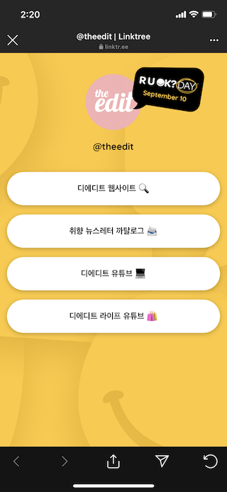
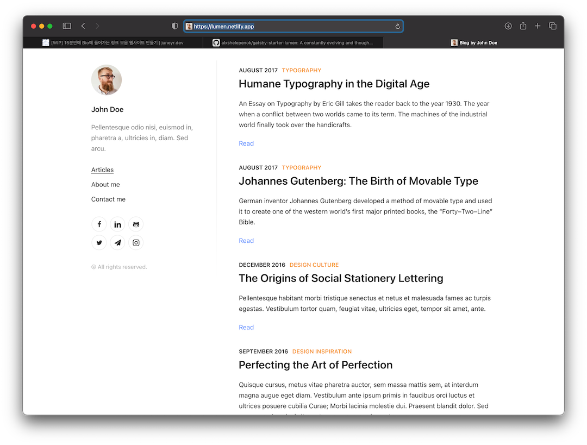

## 서론 
개발블로그와 파이프라이닝용 블로그를 함께 운영하면서, 조금 불편한 점이 하나 있었다. 트위터나 인스타그램의 설명란에는 하나의 링크만을 넣게 되어있는 것. 이미 있는 채널을 이용해서 블로그를 홍보하고 싶은데, 좀 불편했다. 

## 이미 있는 대안 
사실 인스타그램을 서칭하다보면 여러 대안이 있었다. 

- linktree https://linktr.ee/
 
내가 자주 클릭하게 되는 the edit의 link tree.
- instabio https://instabio.cc/ 
또 instabio도 많이 쓰는 것 같다. 


그런데 이미 도메인을 가지고 있는 상황에서 따로 다른 서비스를 이용하기는 싫어서 간단한 야크털깎기를 시도해보기로 했다. 

### 페이지는 어떻게 만들거야? 

먼저 이 블로그를 빌드할 때 도움을 받았던 gatsby 페이지를 둘러보았다.
gatsby 의 상세한 내용을 몰라도 starter를 통해서 쉽게 설치 및 개발환경 구동이 가능하고, 트렌디한 테마를 쉐도잉해서 쓸 수 있다는 장점이 있다. 
프론트를 직접 손대고 싶지는 않았기때문에 큰 고민 없이 gatsby 를 사용하기로 했다.

### 배포와 운영은 어떻게 할거야? 
역시 블로그 배포를 vercel로 하고 있었기때문에 vercel 에 배포하기로 했다. 
godaddy에서 2년전에 구매한 juneyr.dev 도메인이 있고, 이 도메인의 서브 도메인을 만들면 될 것 같았다. 큰 고민 없이 접두어를 link로 정했다.

### 실제로 만들어보자! 
gatsby 테마를 둘러보니, [lumen](https://github.com/alxshelepenok/gatsby-starter-lumen) 이 가장 눈에 띄었다. 모바일로 클릭했을 때 편리해야하기때문에 반응형 웹사이트이기도 하고, 왼쪽의 Profile 단락만 있으면 충분할 것 같았다. 
[lumen 데모](https://lumen.netlify.app) 
 

gatsby CLI 가 설치되어있다면 아래 커맨드로 간단하게 lumen starter를 사용할 수 있다. 
```bash 
gatsby new blog https://github.com/alxshelepenok/gatsby-starter-lumen
```

하지만 없다면 npm 을 설치하고 -> gatsby 를 설치하자. (새로운 맥에서 작성하려니, 전부다 설치해야하는 매직..) 
https://www.gatsbyjs.com/docs/tutorial/part-zero/

```bash 
brew install node # node, npm 을 설치 
npm install -g gatsby-cli # gatsby cli 를 설치
```

#### profile 단락만 떼어내자 
gatsby 를 잘 모르지만, 구조는 대개 단순하다. 
src의 내부를 살펴보면 ts / js 로 작성된 컴포넌트를 볼 수 있다. 

내용을 잘 살펴보면서 눈치로 원하는 부분만 남겨두도록 하자.
친절하게도 프로젝트 구조가 나와있다. 
```
└── content
    ├── pages
    └── posts
└── static
    ├── admin
    └── media
└── src
    ├── assets
    │   └── scss
    │       ├── base
    │       └── mixins
    ├── cms
    │   └── preview-templates
    ├── components
    │   ├── Feed
    │   ├── Icon
    │   ├── Layout
    │   ├── Page
    │   ├── Pagination
    │   ├── Post
    │   │   ├── Author
    │   │   ├── Comments
    │   │   ├── Content
    │   │   ├── Meta
    │   │   └── Tags
    │   └── Sidebar
    │       ├── Author
    │       ├── Contacts
    │       ├── Copyright
    │       └── Menu
    ├── constants
    ├── templates
    └── utils
```
이렇게 보니까 사이드바컴포넌트를 건드려보면 될 것 같다. 

생각보다 필요한 부분만 발라내는 작업은 간단하다


#### 의외의 복병, SVG 
기본적으로 meta 데이터에서 제공하는 svg 에는 github , medium 등 다양한 svg 가 있었다. 

나는 네이버 블로그의 SVG, Vercel의 SVG 가 추가로 필요했는데 오히려 이 부분이 꽤 걸렸다. 
