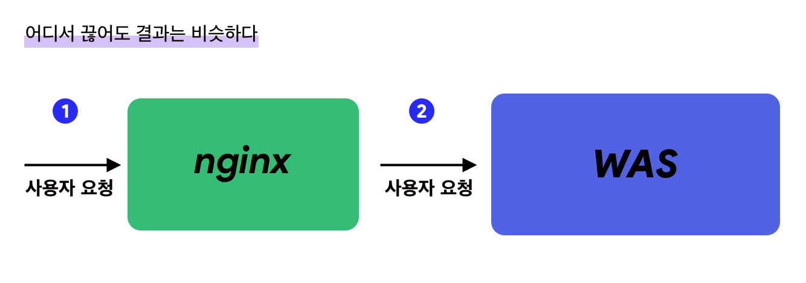
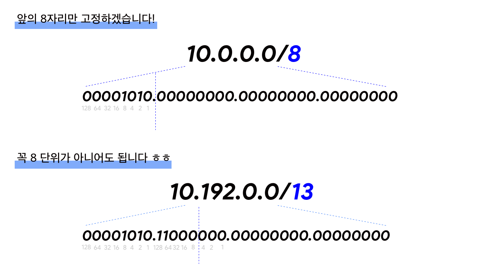

## 서론 

6월에 있었던 릴리즈를 회고하다보니, 아이러니하게도 코드적으로 생각나는 것보다는 처음으로 `점검모드`를 구현했던 것에 대한 감동이 컸다.
수많은 점검 공지를 보기만 했지, 직접 구현하는 입장이 될 줄이야! 🤷‍♀️

> 사용자의 요청을 일정 시간동안 막는다.

이 기능을 구현하기 위해서 어떻게 해야할까? 
다양한 방법이 있겠지만, 최소한 `코드를 매번 수정해서 배포하는 방식` 은 피하고싶다. 

그 이유는, 모듈이 크면 클 수록, 배포하는 시간이 길면 길수록 불리한 방식이기때문이다. 
점검을 2시에 한다고 했는데 배포때문에 2시 30분에 된다면.. 믿을 만한 시스템이 아니잖아!
점검 기능 자체가 모듈의 크기에 영향을 받는다면 독립성이 보장이 안되는 점이 마음에 걸린다.

그럼 어떤 방식을 채택할 수 있을까?




위 시스템을 보자.

nginx 가 WAS 의 리버스 프록시역할을 하고, 앞에서 요청을 1차적으로 받아주고 있는 형태의 흔한 구조다. 
이때 `1번 위치` 에서 요청을 제어하든, `2번 위치`에서 요청을 제어하든 일단 WAS 로만 요청이 안들어오면
서버의 로직이 작동하는 부분이 없으니, 이 관점에서는 큰 차이가 없다. 


`1번 위치` 에서 제어하면 이렇게 하면 될 것 같다.

- 특정 uri 에 대한 요청을 막는 로직을 활용해서, 모든 ip에 대해서 요청을 막는다. 
  -  이 서버가 죽었는지 알아보는 health check 나, status check 등에 대한 uri 는 반드시 프로덕션 환경에서는 누군가 확인할 수 없도록 막아줘야한다. 보통 `location` 블록을 사용해서 이런 부분을 제어하고 !

- 이 `요청을 막는 설정` 과 `기본 설정` 을 코드 한 줄로 바꿀 수 있으면 좋을 것 같다. 
  - 서버에 nginx conf 배포만 간단하게 할 수 없을까?


반면, `2번 위치`에서 제어하면 이렇게 하면 될 것 같다. 

- spring 의 경우, interceptor 에서 요청을 거부하면 될 것 같다. 
  - 단, 현재 점검인지 아닌지 판단하는 값을 외부에 저장해서, 이 부분만 변경하게 하면 될 것 같다. 
  - 그 값의 저장소는 RDB / Redis / 외부에서 연동해서 받아오는 설정파일 이든 상관없을 것 같다. 
    - 중요한 것은 이 값을 바꾸기 위해서 spring 프로그램을 다시 말지만 않으면 됨! 


오늘 얘기해볼 것은 `1번 위치`에서 제어하기, 즉 nginx 에서 제어하는 방법이다.


## nginx 의 IP 필터링
<sub> nginx 기초는 여기로! </sub>

[나는 nginx 설정이 정말 싫다구요](https://juneyr.dev/nginx-basics) 

nginx 의 `deny-all;` 을 한번쯤은 봤을 런지! 들어오는 IP(정확히는, nginx 의 remote address 인듯) 를 모두 거부하는 명령어다. 이 명령어를 입력하는 경우 proxy 혹은 원하는 동작대로 떨어지지 않고, error 케이스로 표현된다.


그런데 모든 IP 를 막는게 아니고 일부 IP를 허용하고 싶을때가 있다.
예를 들어 `점검 상태에서 사내망만 허용하는 경우.` 이럴때는 `allow 10.0.0.0/8` 과 같은 형식으로 일부만 허용해준다. 

```nginx
allow 10.0.0.0/8;
deny all;

```
위와 같은 경우 10.0.0.0/8 범위에 해당하는 IP는 들어오고, 나머지는 들어오지 않게 된다. 
allow 하는 목록이 위로 가야한다는 점에 유의하자!

그런데 저 표기는 뭐지?

### CIDR (Classless Inter-Domain Routing)
  
CIDR 는 IP 사용법이자 표기법으로, 부족한 IPv4 를 잘 쓸 수 있게 해주는 방법이다. 
IPv4 와 자릿수를 고정해서 쓴다. 예를 들어 10.0.0.0/8 이라면 10은 고정이고 이후의 0.0.0 을 변동해서 쓸 수 있는 범위라는 뜻이다. 어 뭐야 두자리수인데 왜 8이라고해요? 라고 하면 IPv4는 32bit (32칸이라고 생각하면 편함) 이고 이를 8bit 씩 나누고 있다. 
그 경계를 `.` 로 표시하고!



즉 10은 십진법으로 나타낸 10이지만, 8bit 자리에 맞게 하면 00001010 이고, /8은 8bit만큼은 고정이라는 이야기니까. 그래서 많은 경우 /8, /16, /24, /32 해주면 정말정말 편하지만 아닌 경우도 왕왕 있다. 
IPv6로 교체될거라고 생각했는데 이 CIDR 때문에 현재는 다들 IP를 꼼꼼하게 나눠서 잘들 쓰고 있다. 이 부분은 복기하고 다시 검색해봐야함. 
  
  
## ▫️ 이 과정을 ansible 로!