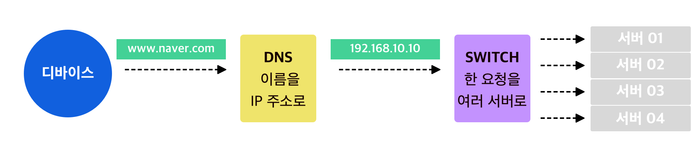

### 인터넷 🤔 
Internetworking protocol 이라는 개념으로 처음 등장했음. Vint Cerf 와 Bob kahn이 제안 ! 
- 연결 지향 링크 
  : 목적지가 어딘지 주소를 만들고
- 전송 제어 프록그램 
  : 안전하게 가자 
레이어가 있는 상태에서 두개의 레이어를 거치기가 힘들어서, TCP/IP 로 분리됨 
TCP (통신 제어 프로토콜)로서 역할, IP(인터넷 프로토콜) 로 나눔 

일반적인 **인터넷 프로토콜 스위트** 라고 이야기 하면, TCP / IP 를 이야기함. 스위트는 그냥 묶음이라는 뜻이니까. 

internetworking protocol을 줄여서 Internet 혹은 INTERNET으로 표기함. 
IP 는 고유한 주소로서 개인이 원하는 대로 적어서는 안되고, 관리하는 곳이 있고 => 그걸 통신사에서 받아서 => 개인에게 할당. 유니크함 보장. IPv4와 IPv6 (왜 아직도 IPv6를 쓰지는 않을까..?) 

IANA -> APNIC _> KRNIC -> 사업자 -> 할당 
기준 -> 아시아-태평양 -> 한국 -> 사업자 -> 할당 

공인 IP (전세계 유니크) / 사설 IP (망에서 맘대로, 외부에서 접속 불가능) 

 
스위치는 네트워크 공유IP 처럼 생겼다..? 
###  포트 (port) 
번호로 구별 / IP 내에 프로세스 구분을 하기 위해서 사용함! 
IP 를 통해서 패킷이 왔을 때 받아야하는 서비스를 식별하기 위함

  
