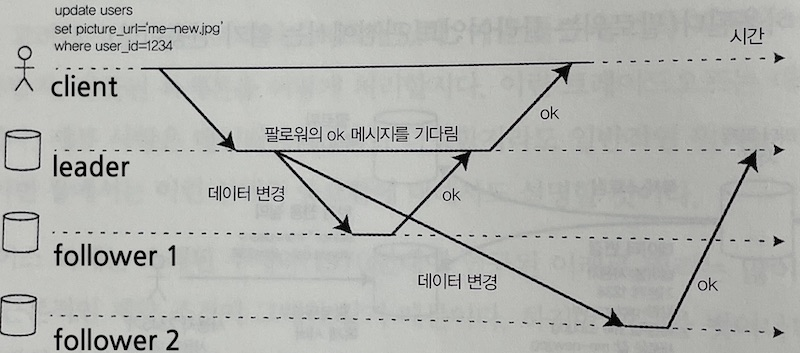
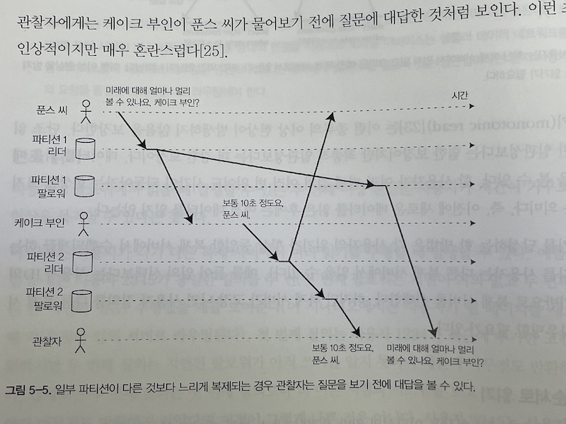
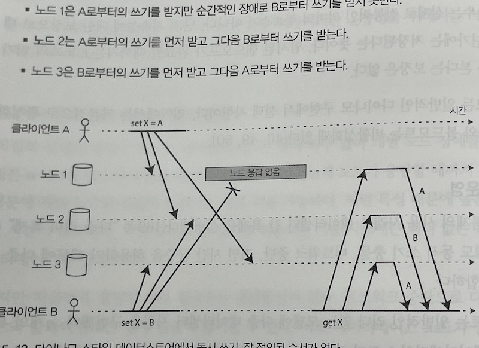

# Part 2. Distributed Data
파트 2에서는 '여러 머신이 저장과 데이터 접근에 관여하게 되면 어떤 일이 일어날까?' 라는 질문에 대답하게 됩니다. 

왜 분산 시스템을 구축하게 될까요? 

- Scalability 
  - 데이터의 크기, 읽기/ 쓰기 부하가 한 머신이 다룰 수 있는 것 이상으로 커지면, 여러 머신에 부하를 나누는게 합리적입니다. 
    
- Fault tolerance / high availablity 
  -  한 머신이 다운되어도 서비스가 돌아가게 하려면, 여러 머신을 사용해서 중복을 제공해야합니다. 하나가 죽어도 다른 하나가 보완할 수 있게요. 
     
- Latency 
  - 만약 서비스 자체가 글로벌 대상이라면, 대상 지역과 가까운 데이터 센터를 사용하길 원할 수 있습니다. 가까울 수록 지연은 짧아집니다. 
    
### 메모리 공유 / 디스크 공유 / 공유 안하는 구조 
- shared memory 
  - 하나의 머신에 CPU / RAM / DISK 를 최대한 많이 고성능으로 넣는 구조 
  - 비용이 많이든다. 두배의 CPU 는 두배 이상의 가격
  - 가용성이 떨어짐. 하이엔드머신이면 컴포넌트를 교환할 수 있지만, 여전히 지리적으로 한 군데만 있다는 점. 

- shared disk 
  - 여러 머신(독립된 CPU / RAM), 공유된 디스크(네트워크로) 
  - 데이터 웨어하우스에서 사용되는 케이스가 있음
  - 경합이나 lock 오버헤드 때문에, 확장성이 떨어짐 
    
- shared-nothing  
  - 가장 선호되는 구조.
  - 각 머신(이나 VM) 은 node라고 불림. 각 노드는 개별의 CPU, RAM, disk가 있고, 노드간 연결은 소프트웨어 레벨에서 연결됨. 
  - 특별한 하드웨어가 필요하지않으므로, 가성비가 좋음. 여러 지리적 위치에 분배해서 지연을 늦출 수 있음
  - 장점이 많긴하지만, 어플리케이션에 복잡성을 유발할 수 있고 데이터모델의 표현성이 제한될 수 있음. 어떤 경우는 싱글스레드 프로그램이 100 CPU 코어가 넘는 클러스터보다 성능이 좋은 경우도 있음.
  - 파트 2에서 주로 다룸

# 5장. Replication

복제(Replication)은 **같은 데이터의 복제본을 네트워크로 연결된 여러 머신에 나눠서 보관하는 일**을 말함. 

복제를 하는 이유! 
- 위에서 말했듯, 유저에게 지리적으로 가까운 위치에 데이터를 두기 위해 (그래서 지연을 줄임)
- 하나의 머신이 죽어도 다른 머신이 보완 (그래서, 가용성을 높임)
- 읽기 쿼리를 수행할 수 있는 머신을 늘려서, 읽기 throughput 을 높이기 위함 

여기서는 하나의 머신이 모든 데이터 복사본을 수용할 수 있을 정도로 데이터가 작다고 가정한다. 
 
데이터가 변하지 않으면 복제는 너무나 쉽겠지만, 현실에서 데이터는 계속 변한다. 여기서는 대표적인 복제 방식인 single-leader, multi-leader, leaderless 세 가지 방식을 알아본다. 

복제를 할 때 결정해야할 것들이 몇가지가 있다. 
- sync ? async?
- replica 가 실패했을 때 다루는 방법
- DB 설정 .. 

이 사항들을 결정했을 때 생기는 결과를 이번 챕터에서 알아보자.  

> eventual consistency (결과적 일관성) : 잠시 데이터가 일관적이지 않아도, 결국에는 맞춰진다. 이 부분에 대해 많은 토론이 있는데, 이 부분에 대해서도 이후에 언급하겠다. 

### Leader / Followers 
### Leader / Followers 
### Leader / Followers 
DB의 복제본을 저장하고 있는 노드를 **replica** 라고 한다. 여러 replica가 있으면, 필연적으로 다음 의문이 생긴다. '어떻게 모든 레플리카가 갖고 있는 데이터가 동일하다고 보장할 수 있는가?'

DB에 매번 쓰기가 일어나면, replica도 동일하게 쓰기가 일어나야한다. 그렇지 않으면, replica에는 동일한 데이터가 없게된다. 이를 해결하는 가장 흔한 방법이 
**leader 중심 복제** 이다.

leader 중심 복제는 다음과 같이 작동한다. 

- 복제 서버들 중 하나를 리더로 지정한다. 
- 클라이언트가 쓰기를 할때는 요청을 리더에게 보낸다. 리더는 가장 먼저 로컬 저장소에 새로운 데이터를 기록한다. 
- 다른 복제서버(follower)는,  리더가 새로운 데이터를 기록할 때마다 복제 로그나 변경 스트림의 일부를 받는다. 팔로워가 로그를 받으면 리더의 처리 방식과 동일하게 모든 쓰기를 적용해 그에 맞는 DB 사본을 갱신한다. 
  
클라이언트가 데이터베이스로부터 읽기를 할때는 리더나 팔로워에게 질의할 수 있다. 하지만 쓰기는 리더에만 허용된다. 

이 모드는 postgreSQL, MySQL 과 같은 관계형 DB 뿐 아니라 몽고DB, 리싱크DB 등 같은 비관계형 DB에서도 사용한다. 그리고 이 복제 방식은 분산 메시지 브로커에도 사용된다. (e.g 카프카, rabbitMQ) 

## sync vs async 복제 
복제 시스템의 중요한 의제가 sync, async이다. 

아래 그림에서 팔로워 1의 복제는 동기식이다. 리더가 팔로워의 메시지 수신을 기다리므로, 그 만큼 응답이 지연된다. 팔로워 2의 복제는 비동기식이다. 리더는 메시지를 전송하지만 응답을 기다리지않는다. 

동기식의 장점은
- 팔로워가 리더와 일관성 있게 최신 데이터 복사본을 가지는 것을 보장한다. 
단점은 
- 동기 팔로워가 응답하지 않는다면 쓰기가 처리되지 않을 수 있다는 것이다. 

따라서 모든 팔로워가 동기인 상황은 현실적으로 어렵다.
- 만약 동기식 설정을 하고 싶다면, 팔로워 하나는 동기식으로하고, 그밖은 비동기식으로 한다.
- 이런 설정은 반동기식이라고 한다. 
- 다만 보통의 리더 기반 복제는 완전히 비동기식으로 구성한다. 지속성은 보장하지않지만, 모든 팔로워가 잘못되더라도 리더가 쓰기를 할 수 있다는 장점이 있다. 특히 많은 팔로워가 있거나 지리적으로 분산되었다면 비동기식 복제를 널리 사용한다. 
  
### 새로운 팔로워 설정하기 
때로는 복제서버의 수를 늘리거나, 장애 노드를 대체하기 위해서 팔로워를 새로 설정해야한다. 어떻게 하면 새로운 팔로워가 리더의 데이터 복제본을 정확히 가지고 있도록 보장할까? 

- 한 노드에서 다른노드로 데이터 복제하는 것만으로 대개 충분하지않음
- 클라이언트는 지속적으로 DB에 기록을 하고 데이터는 유동적이다
- 데이터베이스를 잠그면 어떨까? 일관성은 유지되지만, 고가용성 목표에는 부합하지 않는다.

- 가능한 전체 DB를 잠그지않고 리더의 스냅샷을 일정 시점에 가져온다. 
- 스냅샷을 새로운 팔로워 노드에 복사한다.
- 팔로워는 리더에 연결해 스냅샷 이후 발생한 모든 데이터 변경을 요청한다. 이를 위해서는 스냅샷이 리더의 복제 로그의 위치를 포함하고 있어야한다. postgreSQL 에서는 이를 로그 일련번호, mySQL 에서는 이진로그좌표라고 부른다. 
- 팔로워가 데이터 변경의 미처리분(backlog)를 다 처리했을 때 따라잡았다고 말한다. 
  
### 노드 중단 처리 
시스템의 모든 노드는 장애로 인해 중단될 수도 있고, 유지보수로 중단될 수도 잇다. 개별 노드의 장애에도 전체 시스템은 동작하게끔하고, 영향은 최소화하는 것이 목표다. 

#### 팔로어 장애의 경우 : 따라잡기 복구 
각 팔로워는 리더에서 수신한 데이터 변경 로그를 로컬에 보관한다. 따라서 재시작하거나 네트워크가 일시 중단된다면 매우 쉽게 복구할 수 있다. 

- 먼저 보관된 로그에서 결함이 발생하기전 처리된 마지막 트랜잭션을 알아낸다.
- 이 트랜잭션 이후 연결이 끊어진 동안 발생한 데이터변경을 모두 요청할 수 있다.
- 이 변경이 다 적용되면 다 따라잡게된다. 
  
#### 리더 장애의 경우: 장애 복구 
반면 리더의 장애를 처리하는 일은 까다롭다. 기존 팔로워중 하나를 리더로 변경하고, 클라이언트를 재설정해서 새로운 리더로 쓰기를 전송해야한다. 그리고 이 새로운 리더로 부터 다른 팔로워들이 데이터 변경을 받아야한다. 이 과정을 failover라고한다. 

장애 복구는 수동/자동으로 진행한다. 
- 리더가 장애인지 판단한다. 고장, 정전, 네트워크 문제등 여러 가지 원인이 있을 수 있다. 무엇이 잘못됐는지 발견할 수 있는 방법이 없어서 시스템은 단순히 타임아웃을 사용한다. 노드들은 자주 서로 메시지를 주고 받고, 노드가 일정 시간 응답하지 않으면 죽은 것으로 간주한다. 
  
- 새로운 리더를 선택한다. 이는 선출과정 / 혹은 이전에 선출된 제어노드에 의해 새로운 리더가 임명된다. 가장 적합한 후보는 보통 이전 리더의 최신 데이터 변경사항을 가진 복제 서버이다. 

- 새로운 리더 사용을 위해 시스템을 재설정한다. 클라이언트는 이제 새 write 요청을 새로운 리더에게 보낸다. 이전 리더가 복구되면 자신이 여전히 리더라고 생각할 수 있다. 시스템은 이 리더를 팔로워로 만들고 새 리더를 인식하도록 해야한다. 
  
 유의해야할 점은 다음과 같다. 
 
 - 비동기식 복제를 사용한다면 새로운 리더는 이전 리더의 쓰기를 일부 수신하지 못할 수 있다. 새로운 리더가 선출된다음 이전 리더가 복구되면, conflicting write가 발생할 수도 있다. 가장 일반적인 방법은 이전 리더의 쓰기를 폐기하는 것이다 (단, 클라이언트는 DB의 내구성을 의심하게됨) 

- 쓰기를 폐기하는 방법은 DB 외부의 다른 저장소가 DB 에 의존적인 경우 특히 위험하다. (github에서 새 리더의 기본키 생성 카운터가 기존 리더보다 적어, key가 충돌하는 상태에서 redis에도 저장되어 충돌한 사례가 있다.)

- 특정 결함 시나리오에서는 두 노드가 자신이 리더라고 믿을 수 있다. 이 상황을 split brain이라고 한다. 이 경우 conflict 를 해결하지않으면 데이터가 오염될 수 있다. 
  
- 리더가 분명히 죽었다고 판단할 수 있는 타임아웃 설정이 어렵다. 타임아웃이 너무 짧으면 불필요한 failover가 동작할 수 있다. 너무 길면 알아차리기 어렵고, 복구까지 오래 소요된다. 이미 부하가 높거나 네트워크가 복닥하다면 불필요한 failover가 상황을 악화시킨다. 
  
### 복제 로그의 구현방식 

내부적으로 리더 기반 복제가 어떻게 동작하는지 알아보자. 

#### 구문 기반 복제 
리더는 모든 쓰기요청(statment, 구문) 을 기록하고 쓰기를 실행한다음, 이 statement log를 팔로워에 전송한다.

이 접근은 합리적인것 같지만 복제가 깨질수있는 케이스가 있다. 
- NOW() 나 RAND() 같은 함수는 항상 다른 결과를 낸다(비결정적). 각 복제서버마다 다른 값을 생성할 가능성이 있다. 
- auto-increment 를 사용하는 구문이 있거나, 기존 DB 내용에 의존하는 구문은 정확히 같은 순서로 실행되어야한다. (여러 트랜잭션이 동시 수행하면 안됨) 
- 부수 효과를 가진 구문은 부수 효과가 결정적이지 않으면, 각 replica에서 다른 부수효과를 낼 수 있다. 
  
이 복제 방식은 mySQL 5.1 이전 버전에서 구문 기반 복제가 사용되었다. 

#### 쓰기 전 로그 배송
3장에서 일반적인 저장소 엔진쓰기는 로그를 기록한다는 사실을 확인했다. (로그 구조화 엔진은 로그가 저장소의 주요 부분이고, B트리의 경우 모든 변경은 Write ahead log에 쓴다.) 

이 로그를 사용해 다른 노드에서 복제 서버를 구축할 수 있다. 리더는 디스크에 로그를 기록하는 일 외에도 팔로워에게 네트워크로 로그를 전송하기도한다. 팔로워가 이 로그를 처리하면 리더와 동일한 데이터 구조의 복제본이 만들어진다. 이 방식은 postgreSQL 과 oracle 등에서 사용된다. 

단점은, 로그가 로우레벨 수준의 데이터를 기술한다는 점이다. WAL  은 어느 디스크 블록에서 어떤 바이트를 변경했는지와 같은 상세정보를 포함해서, 저장소 엔진과 복제 과정이 의존성을 갖게 된다. DB가 저장소 형식을 다른 버전으로 변경한다면, 리더와 팔로워의 DB 소프트웨어 버전을 다르게 실행할 수 없다. 

이 문제는 운영상 큰 문제가 될 수 있다. 한가지 방법은 팔로워를 먼저 모두 업그레이드 한 다음, 리더 선정을 다시 하여 장애복구를 수행하는 것이다. 

#### 논리적(row기반) 로그 복제 
위에서 나온 의존성을 없애기 위한 대안 중 하나는, 복제를 위한 로그와 저장소엔진을 위한 로그를 각각 다르게 사용하는 것이다. 복제를 위해 쓰이는 이 로그를 '논리적 로그'라고 부른다. 

관계형 데이터베이스용 논리로그는, row 단위로 DB 테이블에 쓰기를 기술한 레코드 열이다. 

> 삽입된 로우의 로그는 모든 칼럼의 새로운 값을 포함한다. 삭제된 로우의 로그는 로우를 고유하게 식별하는데 필요한 정보를 포함한다. 갱싱된 로그의 로우는 로우를 고유하게 식별하는데 필요한 정보와 모든 칼럼의 새로운 값을 포함한다. 

논리적 로그는 저장소 엔진 내부와 분리했기때문에, 하위호환성을 쉽게 유지할 수 있고, 리더와 팔로워에서 버전뿐아니라 완전히 다른 저장소 엔진을 실행할 수 있다. 외부 애플리케이션이 파싱하기도 더 쉽다. 따라서 오프라인 분석이나 커스텀 색인 등을 위해 외부 웨어하우스에 전송하고자할 때 유용하다. 

#### 트리거 기반 복제 
지금까지 설명한 복제 방식은 애플리케이션 코드의 사용없이 DBMS 에 의해서 구현된다. 조금 더 유연성을 원한다면 - 데이터의 일부만 복제하거나, DB를 다른 DB로 복제하거나 ... - 하면 복제를 애플리케이션 층에서 다뤄야한다. 

트리거는 사용자정의 애플리케이션 코드를 등록할 수 있게한다. 이 코드는 DB에서 데이터가 변경되면 자동으로 실행된다. 트리거는 이 데이터변경을 분리된 테이블에 로깅할 수 있고, 이 테이블을 외부 프로세스가 읽을 수 있다. 외부 프로세스는 필요한 로직을 돌려 다른 시스템으로 데이터 변경을 복제한다. e.g.) 오라클용 데이터버스, postgreSQL 용 부카르도

다만 이 방식은 다른 복제방식보다 더 많은 오버헤드가 있다. 내장 복제보다도 버그나 제한 사항이 많이 발생한다. 그럼에도 유연성을 더할 수 있기때문에 유용하다. 

### 복제 지연 문제
노드 내결함성을 갖추려는 이유는 복제가 필요하기때문이다. 또 다른 이유는 확장성, 지연 시간이다. 리더 기반 복제는 모든 쓰기가 단일 노드를 거쳐야하지만, 
읽기는 어떤 replica에서도 가능하다. 

읽기가 대부분이어서 replica를 많이 늘리게 되는 **읽기 확장(read-scaling)** 구조에서는 팔로워를 더 추가해서 읽기 처리 용량을 늘릴 수 있다. 그러나 비동기식 복제일때만 이 과정이 가능하다. 동기식으로 복제를 시도하면 노드 장애나 네트워크 중단으로 시스템의 쓰기가 불가능해진다. 또한, 비동기 팔로워에서 클라이언트가 데이터를 읽을 때 팔로워가 뒤처져있는 상태라면 지난 정보를 볼 수도 있다. 이 상황에서 데이터베이스 간 명백한 불일치가 발생한다. 하지만 이는 일시적인 상태로, DB에 쓰기를 멈추고 잠시 기다리면 결국 리더와 일치하게 된다. 이를 **최종적 일관성** 이라고 한다. 이 말은 모호한데, 짧은 지연이 될수도 있지만 시스템이 가용량 근처에서 동작하면 지연이 수초에서 수분으로 증가할 수 도 있다. 아래 복제 지연이 있을 때 발생할 수 있는 세 가지 사례를 제시한다. 

#### 자신이 쓴 내용 읽기 
비동기식 복제에서 사용자가 쓰기를 수행한 직후 데이터를 열람할 때, 복제서버에 새로운 데이터가 반영되지않는 경우가 있다. 이것은 사용자에게 '내 데이터가 유실되었나? 🤔' 하는 생각을 하게 하므로 불만족스러운 동작이다. 

이런 상황에서는 **쓰기 후 읽기 일관성** 이 필요하다. 다른 사용자의 갱신은 안보여도 본인건 보여야한다. 어떻게? 

- 사용자가 수정한 내용을 읽을 때는 리더에서 읽는다. 
- 애플리케이션의 대부분 내용을 사용자가 편집이 가능하다면, 리더에서 항상 읽어야하기때문에 효율적이지 않다. 마지막 갱신 시각을 찾아서 마지막 갱신 후 1분 동안은 리더에서 모든 읽기를 수행하는 방법이 있다. 혹은 1분 보다 늦은 모든 팔로워에서의 읽기 질의를 금지하는 방법이 있다. 
- 클라이언트가 최근 쓰기의 타임스탬프를 기억할 수 있다. 그러면 replica가 이떄까지의 갱신을 반영하게 할 수 있다. 타임스탬프는 논리적 타임스탬프거나 실제 시스템 시간일 수 있다. 
- replica가 여러 데이터센터에 분산되었다고하면 복잡도가 증가한다.

동일 사용자가 다른 디바이스로 접근할 때도 문제가 생긴다. 이 경우 
- 클라이언트가 기억하는 쓰기 타임스탬프가 공유안된다. 따라서 이 (메타)데이터는 중앙집중식으로 관리해야한다. 

#### 단조 읽기 
두번째 이상 현상은 사용자가 시간이 거꾸로 흐르는 현상을 목격할 수 있다는 것이다. 

사용자가 각각 다른 복제 서버에서 여러 읽기를 수행할 때를 생각해보자. 동일한 
질의를 1번(지연이 거의없음), 2번 (지연이 많음) replica에 요청할 때를 생각해보자. 첫번째는 최근에 추가한 코멘트를 반환하지만, 두번째에 요청을 하면 첫번째 질의보다 예전의 시스템을 보고 있으므로 아무것도 반환하지 않는다. 

- 한가지 방법은 각 사용자의 읽기를 하나의 복제서버에서 항상 수행되도록하는 것이다. 하지만 복제서버가 고장하면 재 라우팅해야한다. 😎

#### 일관된 순서로 읽기 
세번째 이상 현상은 인과성의 위반 우려다. 아래 예제를 보자. 

위 예제에서, 관찰자에게는 케이크 부인이 푼스씨가 물어보기전에 질문에 대답한 것 처럼 보인다. 이런 현상을 방지하려면 일관된 순서로 읽기(Consistent Prefix Read) 같은 또 다른 유형의 보장이 필요하다. 

이는 파티션(샤딩)된 데이터베이스의 특징적인 문제다. 분산 데이터베이스에서 서로 다른 파티션은 독립적으로 동작하므로 쓰기의 global 순서를 보장할 수 없다. 

- 한가지 해결책은 서로 인과성이 있는 쓰기는 동일 파티션에 기록되게 하는 방법이다. (🦦  하지만 인과성을 어떻게 명시적으로 기록하지? 188p에서 설명한다.)

#### 복제 지연을 위한 해결책 
이런 식으로 복제 지연이 일어나면서 일어나는 문제들이 있다. 복제는 비동기식으로 일어나지만 해결은 동기식으로 일어나는 척하면서 해결을 한다. 트랜잭션은 애플리케이션 개발자가 이런 복제 문제를 걱정하지 않고 올바른 작업 수행을 위해서항상 DB를 신뢰할 수 있도록 해준다. 

단일 노드 트랜잭션은 오랫동안 존재했으나, 분산 DB에서 전환하면서 많은 시스템이 트랜잭션을 포기했다. 트랜잭션이 성능과 가용성 측면에서 너무 비싸므로, 최종적 일관성을 사용해야한다는 주장이 있다. 남은 부분에서 이 주장에 대해 알아보자.

## 다중 리더 복제 
지금까지는 단일 리더를 사용한 복제 아키텍처를 고려했다. 이 방식은 리더가 중단되면 쓰기를 할 수 없다는 단점이 있다. 리더가 여러명인 경우를 다중 리더 설정이라고 부르는데, 각 리더는 동시에 다른 리더의 팔로워 역할도 한다. 

### 다중 리더 복제의 사용례 
다중리더 복제는 단일 데이터센터에는 적합하지않다. 그러나 몇가지 적절한 사용례가 있다. 

#### 다중 데이터 센터 운영
여러 다른 데이터 센터에 replica가 있다고 해보자. 다중 리더 설정에서는 각 데이터센터마다 리더가 있을 수 있다. 센터 내에서는 보통의 리더-팔로워 복제를 하고, 센터 간에는 데이터 센터의 리더가 다른 센터의 리더에게 변경사항을 복제한다. 
- 단일 리더에서는 쓰기가 모두 리더로 몰린다. 다중 리더에서는 모든 쓰기를 로컬 데이터 센터에서 처리하고 비동기 복제한다. 즉 네트워크 지연이 사용자에게 숨겨져서 인지하는 성능이 올라간다. 
- 단일 리더에서는 리더가 있는 데이터센터가 고장나면 다른 센터에서 팔로워를 리더로 승격시킨다. 다중 리더에서는 센터가 모두 독립적으로 동작한다. 
- 데이터 센터간 트래픽은 public 망으로 처리한다. 그래서 안정성이 떨어진다. 다중 리더에서는 일시 네트워크 오류에도 쓰기가 처리되므로 좀더 내구성이 좋다.

큰 단점도 있다. 동일한 데이터를 다른 데이터센터에서 변경할 수 있다. 이때 생기는 [쓰기 충돌](#쓰기-충돌-다루기) 반드시 해결해야한다. 

#### 오프라인 작업을 하는 클라이언트
인터넷 연결이 끊어진 동안 애플리케이션이 계속 동작해야하는 경우 다중 리더 복제가 적절하다. 캘린더를 생각해보자. 캘린더는 리더가 각자 있는 로컬DB에 저장한다. 그리고 지연이 몇시간, 며칠이 되든 네트워크에 연결된 순간에 비동기 복제를 시작한다.  

#### 협업 편집 
google docs는 협업 편집의 한 예시다. 이 또한 위의 사례와 유사하다. 편집을 하는 유저의 로컬에 내용을 먼저 저장하고, 같은 문서를 편집하고 있는 유저와 비동기 복제를 한다. 이때 쓰기 충돌을 방지하기 위해서는 lock이 필요한데, 더 빠른 협업을 위해서 변경 단위를 매우 작게하는 방법을 사용할 수 있다. 

### 쓰기 충돌 다루기
다중 리더복제에서 제일 큰 문제는 **쓰기 충돌**이 발생한다는 것이다.  예를 들어 위키 페이지를 동시에 두 사용자가 편집한다고 해보자. A-> B, A-> C 로의 변경은 로컬에서는 성공적으로 저장된다. 하지만 이를 복제하는 경우 충돌이 발생한다. 이 문제는 단일 리더에서는 일어나지 않는다. 

**동기 대 비동기 충돌 감지** 단일 리더 DB에서는 첫번째 쓰기가 완료할 때까지 두번째 writer를 차단한다. 반면 다중 리더 설정은 두 쓰기가 모두 성공하며, 충돌은 이후에 비동기로만 감지한다.

이론적으로 충돌 감지는 동기식으로 만들 수 있다. 즉 쓰기가 성공한 사실을 사용자에게 말하기전에 모든 복제서버에 전송한다. 그러나 이러면 다중 리더 복제의 주요 장점을 잃는다. 

**충돌 회피** 충돌을 처리하는 전략 중 가장 간단한 것은 충돌을 회피하는 것이다. 특정 레코드의 모든 쓰기가 동일한 리더를 거치도록한다면 충돌은 생기지 않는다. 예를 들어 사용자 애플리케이션에서 특정 사용자의 요청을 동일한 데이터 센터로 항상 라우팅하고 데이터 센터 내 리더를 이용해 읽기와 쓰기를 하게 끔 보장할 수 있다. 하지만 때때로 고장이 발생하거나 데이터센터 변경이 일어나면, 지정된 리더를 변경해야할 수도 있다. 이런 상황에서는 충돌 회피가 실패한다. 

**일관된 상태수렴** 단일 리더는 순차쓰기를 적용한다. 동일 필드가 여러번 갱신되면 마지막 값이 적용된다. 다중 리더에서는 쓰기 순서가 정해지지않아 최종 값이 무엇인지 명확하지 않다. A -> B와 A->C 는 모두 유효하지만 마지막 값이 무엇인지 보장할 수없다. 그렇다고 각 리더에서 B, C로 결정내릴 수도 없다. 모든 복제 계획은 결국 최종적으로는 동일하다는 사실을 보장해야한다. 따라서 DB는 수렴 방식으로 충돌을 해소해야한다. 

- 각 쓰기에 고유 ID를 부여하고 가장 높은 ID를 가진 쓰기를 고른다. 타임스탬프를 사용하는 경우를 최종쓰기승리라고한다. 데이터 유실 위험이 있지만 대중적이다.
- 각 복제 서버에 고유 ID를 부여하고 높은 서버의 값이 들어가도록한다. 역시 유실 가능성이 있다. 
- 어떻게든 값을 병합한다. 예를 들어 사전 순으로 정렬한 후 연결한다. (위 예제에서는 B/C)
- 명시적 데이터 구조에 충돌을 기록해 모든 정보를 보존한다. 충돌을 해소하는 애플리케이션 코드를 작성한다. 

**사용자 정의 충돌 해소 로직** 충돌을 해소하는 가장 적합한 방법은 애플리케이션에 따라 다르다. 대부분의 다중 리더 도구의 충돌 해소 코드는 쓰기나 읽기 수행중에 실행된다. 

- 쓰기 수행중 
  - 복제된 변경사항 로그에서 충돌을 감지하자마자 핸들러를 호출한다. 사용자에게는 내용을 표시하지 않고, 백그라운드에서 빠르게 해소되어야한다. 
- 읽기 수행중
  - 충돌을 감지하면 모든 충돌 쓰기를 저장한다. 다음 번 데이터를 읽을 때 여러 버전의 데이터가 반환된다. 애플리케이션은 사용자에게 이 내용을 보여주거나, 자동으로 충돌을 해소해서 DB에 기록한다. 

**충돌은 무엇인가?**  어떤 종류의 충돌은 명확하지만, 어떤 종류는 감지하기 어렵다. 예를 들어 회의실 예약을 생각해보자. 같은 시간에 같은 회의실을 예약하는 두개의 다른 예약이 생기면 충돌이 발생한다. 두 예약이 각자 다른 리더에서 이뤄지면 충돌이 발생할 수 있다. 이 문제를 이해하는 방법은 다음장에서 알아본다.

### 다중 리더 복제 토폴로지
**복제 토폴로지**는 한 노드에서 다른 노드로 전달하는 통신 경로를 말한다.
일반적인 토폴로지는 전체 연결 (n(n-1)/2) 이다. 이 토폴로지에서는 모든 리더가 각자의 쓰기를 다른 모든 리더에게 전송한다. 반면, 다른 토폴로지도 자주사용되는데, mySQL 은 기본적으로 원형 토폴로지만 지원한다. 이 경우, 각 노드가 하나의 노드의 쓰기를 받고, 자신의 쓰기를 추가해서 다음 노드로 넘긴다. 별 모양 토폴로지도 있다. 별 모양 토폴로지는 지정된 루트 노드가 다른 모드에 쓰기를 전달한다. 

- 전체연결
  - 전체연결 토폴로지의 문제는, 일부 복제 메시지가 다른 메시지를 추월할 수 있다는 점이다. 이는 인과성을 깨뜨릴 수 있다 (예언 예제를 기억하나요?). 이런 이벤트를 정렬하기 위해서 버전 벡터 기법을 사용할 수 있다. 
- 원형
- 별
  - 원형과 별에서는 쓰기가 모두에게 전달되기 전에 여러 서버를 거친다. 무한 루프를 방지하기 위해 노드들은 고유 식별자가 있다. 
  - 원형과 별의 문제점은, 하나의 노드에 장애가 발생하면 전체 메시지 흐름에 영향을 준다는 점이다. 그래서 토폴로지는 장애 노드를 회피할 수 있게 재설정할 수 있다. 대부분 수동이지만. 

## 리더 없는 복제
지금까지의 복제 방식(단일리더, 다중리더)에서 리더는 쓰기를 처리하고 복제서버에 복제하는 형식으로 동작한다. 일부 데이터 저장소 시스템은 리더의 개념을 버리고 모든 replica가 클라이언트로부터 쓰기를 직접 받을 수 있게 허용하는 접근 방식을 사용하기도 한다. 이런 형식의 DB를  **다이나모 스타일** 이라고 한다. e.g) 아마존 dynamo, 리악, 카산드라, 볼드모트

### 노드가 다운됐을 때 데이터베이스에 쓰기
세개의 replica가 있는 DB에서 하나의 DB를 쓰지 못하게 되었다고 하자. 리더가 없는 설정에서는 장애 복구가 필요하지 않다. 세개 중 두개가 쓰기를 받으면 클라이언트에는 ok를 보낸다. 

이제 다시 다운된 DB가 복구되었다고 하자. 이때 이 노드의 자료는 outdated되었을 수 있다. 이를 방지하기 위해 클라이언트는 읽기 요청도 여러 노드로 전송하고, 버전 숫자를 통해 최신 내용을 응답받는다.

**읽기 복구와 안티 엔트로피** 복제는 최종적으로 모든데이터가 replica에 복사된것을 보장해야한다. 누락된 쓰기는 어떻게 따라잡을까? 

- 읽기 복구 
  클라이언트에서 읽기 요청을 병렬로 보낼때, 최신의 값을 알 수 있다. 오래된 값을 갖고 있는 서버에 다시 새로운 값을 기록한다. 이 접근은 read가 빈번할 때 적합하다. 
- 안티엔트로피 처리 
  일부 데이터스토어는 백그라운드 프로세스를 두고, 복제서버간 데이터 차이를 지속적으로 찾아 누락데이터를 복제한다. 이 안티엔트로피 처리는 특성 순서로 쓰기를 복사하기때문에, 데이터가 복사되기까지 상당한 지연이 있을 수 있다.
  
** 읽기와 쓰기를 위한 정족수** 위 예제에서는 2/3 만 해도 쓰기 성공으로 간주했다. 그러나 이 2이라는 숫자는 어떻게 정해진걸까?  이를 일반화해보자. 

n개의 복제서버가 있을때,  모든 쓰기는 w개의 노드에서 성공해야 쓰기가 확정되고 모든 읽기는 최소한 r개의 노드에 질의해야한다. w + r > n 이면 읽을 때 최신 값을 얻을 것으로 기대한다.  이런 r과 w를 따르는 read / write를 정족수 읽기 쓰기라고 부른다. 이 파라미터는 설정 가능하다. 일반적으로는 n을 홀수 (3이나 5)로 하고, w = r = (n+1)/2 로 설정한다. 

- n=3, w=2, r=2 이면 사용 불가 노드가 하나인 상황까지 가능하다.
- n=5, w=3, r=3 이면 사용 불가 노드가 둘인 상황까지 가능하다. 
- 이보다 사용불가 노드가 많다면, 쓰기나 읽기는 에러를 반환한다. 
 
### 정족수 일관성의 한계
위처럼 선택한다면 일반적으로 **모든 읽기는 최신** 일 것을 기대한다. 쓰기를 하는 노드 3개와 읽기를 하는 노드 3개 중 필연적으로 하나는 겹치기 때문이다. 

정족수를 w + r < n 가 되도록하는 경우도 있다. 이 경우 성공 응답의 수가 적어지고, 오래된 값을 읽을 확률이 높다. 

w + r > n 이어도 오래된 값을 반환하는 엣지 케이스가 있다. 
- 느슨한 정족수를 사용하면 w개의 쓰기는 r개의 읽기와 다른 노드에서 수행되므로 r과 w 노드가 겹치는 걸 보장하지 않는다.
- 두개의 쓰기가 동시에 발생하면 어떤 쓰기가 먼저 일어났는지 분명하지 않다.
- 쓰기와 읽기가 동시 발생하면 쓰기는 일부 replica에만 반영될 수 있다. 
- 쓰기가 일부에서는 성공했찌만, 다른 노드에서는 실패해서 성공한 서버가 w개 보다 적어도, 롤백하지 않는다. 

**최신성 모니터링** 운영관점에서 볼때 DB가 최신 결과를 반환하는 지 여부를 모니터링하는 일은 중요하다. 리더 기반 복제에서 DB는 복제 지연에 대한 지표를 노출한다. 이는 쓰기가 리더에서 같은 순서로 적용되기때문에 가능하다. (리더의 위치에서 팔로워의 위치를 빼면 가능)

리더없는 복제에서는 쓰기 순서를 고정할 수 없어서 모니터링이 조금 더 어렵다. 
더욱이 읽기 복구만 사용하고 안티엔트로피는 사용하지 않는다면, 자주 읽히지 않는 값은 얼마나 오래된 값인지 제한이 없다. 이에 대해 복제서버의 오래됨을 측정하는 연구가 있지만 범용적이지는 않다.

### 느슨한 정족수와 암시된 핸드오프 
적절한 정족수가 있는 DB는 장애복구없이 개별 노드 장애를 용인한다. 하지만 정족수는 내결함성이 없다. 네트워크 중단으로 다수의 노드와 클라이언트 연결이 끊어질 수 있다. 이 경우 정족수를 충족할 수 없을 수도 있다. 

노드가 n개 이상 클러스터에서, 클라이언트는 정족수 구성에 들어가지 않는 노드에 연결될 가능성이 있다. 이때 DB 설계자는 트레이드 오프에 직면한다. 
- 정족수를 만족하지 않는데 그냥 오류 반환할까?
- 일단 받아들이고 (n개 노드 이하지만) 일단 연결할 수 있는 노드에 기록할까?

후자를 느슨한 정족수라고 부른다.  쓰기와 읽기는 w,r개의 성공 응답이 필요하지만, 일단 지정된 n개가 아닌 노드에 저장한다. 이후 장애 상황이 해제되면 한 노드가 다른 노드를 위해 일시적으로 저장한 모든 쓰기를 해당 홈 노드로 전송한다. 이 방식을 암시된 핸드오프라고 부른다. 

암시된 핸드오프가 완료될때까지는 w 노드들 어딘가에 저장은 되지만, r노드에서 읽힌다는 보장은 없다.

**다중데이터센터운영**  카산드라와 볼드모트는 리더 없는 모델에서도 다중 데이터센터 지원을 구현했다. n개의 복제 서버 수에는 모든 데이터센터의 노드가 포함되고, 설정을 통해 각 데이터 센터마다 몇개를 보유할지를 지정할 수 있다. 클라이언트의 각 쓰기는 모든 복제서버에 전송되지만(센터에 상관없이) 클라이언트는 로컬 안에서 정족수 응답을 기다리기때문에 네트워크 지연에 영향 받지않는다.

### 동시쓰기 감지
다이나모 스타일 데이터베이스는 여러 클라이언트가 동시에 같은 키에 쓰는 걸 허용하므로, 정족수를 사용하더라도 충돌이 발생한다. 

문제는 네트워크 지연과 부분 장애로 이벤트가 다른 노드에 다른 순서로 도착할 수 있다는 것이다. 

- 노드 1은 A로부터 쓰기를 받고, B로부터는 받지못한다
- 노드 2는 A로부터 쓰기 -> B로부터 쓰기를 받는다.
- 노드 3은 B로부터 쓰기 -> A로부터 쓰기를 받는다. 
  
만약 쓰기 요청을 받을 때마다 노드가 덮어쓰기만 한다면 일관성이 깨진다. 
어떻게 다룰 수 있을까? 

**최종쓰기 승리(동시쓰기버리기)** 각 복제본이 가진 예전 값을 버리고 가장 최신값으로 덮어쓰는 방법이다. 어떤 쓰기가 최신이라고 자신할 수 있을까? 사실 어떤 이벤트든 순서가 정해지지 않기때문에 동시쓰기라고 말하는 것이 맞다. 

다만 임의로 순서를 정할 수 있다. 예를 들어 쓰기에 타임스탬프를 붙여 가장 최신이라는 의미로 제일 큰 타임스탬프를 선택하고, 예전 타임스탬프를 가진 쓰기는 무시한다. e.g.) 카산드라, 리악 

최종승리쓰기는 수렴달성이 목표지만 지속성을 희생한다. 동일 키에 여러번의 동시쓰기가 있다면 클라이언트는 모두 성공으로 보고되지만, 쓰기 중 하나만 남고 다른 쓰기는 무시된다. 손실 데이터를 허용하지 않는다면 이 방법은 충돌 해소에 적합하지 않다. 

**이전발생 관계와 동시성** 
두가지 작업이 동시에 수행됐는지 여부를 어떻게 결정할까? 
- A 의 삽입이 B의 증가 이전에 발생했다고 알수있는 경우가 있다. B가 증가시킨 값은 A가 삽입한 값이기 때문이다. 이런 경우는 인과성이 있다고하며, casually dependent 라고 말한다. 

- 각 클라이언트가 작업을 시작할 때 다른 클라이언트가 해당 키에 일했는지 모르는 경우, 인과성이 없다. 
  
첫번째 예제에서 A 작업은 B작업의 이전발생(happens-before) 이다. 이게 아니라고하면, 동시작업이라고 말한다. 따라서 A,B가 있으면 세가지 가능성이 있다 - A가 B의 이전 발생, B가 A의 이전발생, 혹은 동시작업. 동시성을 정의하기 위해서 정확한 시각이 중요한 것은 아니다. 

**이전발생 관계 파악하기** 
여기서는 하나의 replica에 5번 쓰기 예제를 통해서 이전 발생 관계를 파악하는 방법을 제시한다. 결론은 다음과 같다. 
- 서버가 모든 키에 대한 버전 번호를 유지하고, 키를 기록할 때마다 버전번호를 증가시킨다. 기록한 값은 새로운 버전 번호를 가지고 저장된다. 
- 클라이언트가 키를 읽을 때는 서버는 최신 버전 뿐 아니라 덮어쓰지않은 모든 값을 반환한다. 
- 클라이언트가 키를 기록할 때는 이전 읽기의 버전 번호를 반환하고, 이전 읽기에서 받은 모든 값을 포함한다.
- 서버가 특정 번호 쓰기를 받을 때 해당 버전 이하 모든 값을 덮어 쓸 수 있다. 
  
**동시에 쓴 값 병합** 
이 알고리즘은 어떤 데이터도 자동으로 삭제되지않음을 보장하지만, 클라이언트가 추가적인 작업을 수행해야한다. 리악에서는 이런 값을 형제값(sibling) 이라고 부른다. 

형제 병합을 애플리케이션에서 복잡하고 오류가 발생하기 쉽다. 

**버전벡터** 
위에서 의존성(이전발생) 관계를 파악할때 단일 버전 번호를 사용했다. 그러나 이는 다중 복제에서 동시쓰기를 받아들일때는 어렵다. 키당 버전 번호 뿐아니라 복제본당 버전 번호도 사용해야한다. 모든 복제본의 버전 번호 모음을 버전 벡터라고 부른다. 

