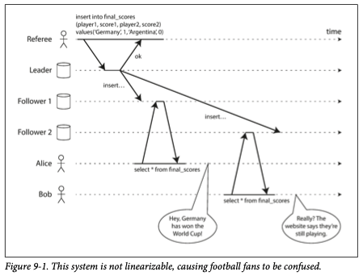
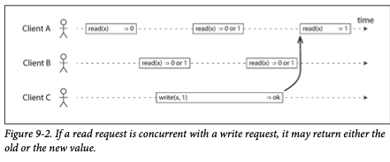
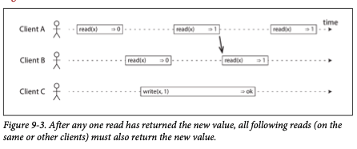
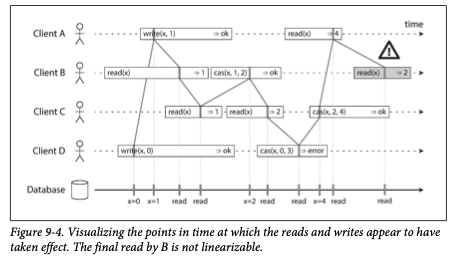

# 09. 일관성과 합의 
  8장에서 보았듯이 분산시스템에서는 망할 일 투성이다. 가장 간단한 해결법은 전체 서비스가 실패하도록 두고 에러 메시지를 보여주는 것이다. 그러고 싶지않다면, 결함을 견뎌낼 방법을 찾아야한다. 이 성질을 갖는 애플리케이션을 **내결함성** 이라고한다. 
  
  내결함성을 지닌 시스템을 구축하는 가장 좋은 방법은 유용한 보장을 해주는 범용 추상화를 찾아서 이 보장에 의존하는것이다. 같은 방식으로 분산 시스템에서도 적용될 추상화를 찾아보자. 가장 중요한 추상화 중 하나는 **합의** 이다.이 구현이 있으면 다양한 목적으로 사용할 수 있다. 일단, 분산시스템에서 제공될 수 있는 보장과 추상화의 범위를 알아보고, 그 다음 합의 알고리즘에 대해서 알아보자.

## 일관성 보장 
  복제 데이터베이스는 보통 최소한 **최종적 일관성**을 제공한다. / 수렴이라고 부르는 게 낫다. 
  그러나 이것은 매우 약한 보장이다. **언제** 복제본이 수렴될 지에 대해서는 아무것도 얘기하지 않는다. 
  - 개발자가 구현하기도 어렵다. 단일 스레드 프로그램 변수처럼 동작하지 않으니까. 
  - 약한 보장만 제공하는 DB를 다룰 때는 너무 많은 걸 기대하지 말아야하고, 한계를 알아야한다. 최종적 일관성의 에지케이스는 시스템에 결함이 있거나 동시성이 높을 때만 나타날 수 있어서, 잡기도 어렵다. 
  
  그러니, Data system이 선택적으로 제공할 수 있는 좀더 높은 수준의 **강한 일관성** 모델을 알아보자.
  물론 이건 공짜가 아니다. 강한 보장을 제공하는 시스템은 성능이 나쁘거나, 약한 보장을 제공하는 시스템보다 내결함성이 약할지모른다.
   
## 선형성
  최종적 일관성(약한 보장)을 한 DB의 서로 다른 복제본에 동시에 같은 질문을 하면 두 가지 다른 응답을 받을 가능성이 있다. 만약, DB의 복제본이 **하나만 있다**(는 환상)을 만들어준다면, 훨씬 단순해지지 않을까? 

  이 가정에 입각해서 나온 강한 보장이 바로 **선형성** (원자적 일관성, 강한 일관성, 즉각 일관성, 외부 일관성 이라고도 부른다.) 이다. 위와 같은 보장이 있으면 현실에는 여러 복제본이 있어도 애플리케이션은 거기에 신경 쓸 필요가 없다. 

  선형성 시스템에서는 클라이언트가 쓰기를 완료하자마자, 그 DB를 읽는 모든 클라이언트가 방금 쓰여진 값을 볼 수 있어야한다. 즉, 선형성은 **최신성 보장**(recency gurantee) 이다. 

  
  위의 비선형 시스템, 축구 웹사이트 예제를 잠시 보자. 밥은 앨리스가 최종 점수 발표 직후에 홈페이지에 접속했지만, 예전의 값만 보게 된다. 그의 질의가 오래된 결과를 반환했다는 사실은 선형성 위반이다. 

 
### 시스템에 선형성을 부여하는 것은 무엇인가?

기본 아이디어는 역시, 시스템에 데이터 복사본이 하나뿐인 것처럼 만드는 것이다. 예시를 보자.

위 그림에서 동시에 같은 키 x를 읽고 쓰는 세 클라이언트를 보여준다. 분산 시스템에서 이 x는 **레지스터**라고 불린다. 현실에서는 key-value의 key, RDB의 로우 하나, 문서DB의 문서 하나가 될 수 있다. 
위 그림처럼 읽기 요청이 쓰기와 동시에 실행되면 과거의 값을 반환할 수도, 새로운 값을 반환할 수도 있다. 
즉 B의 모든 요청, A의 두번째 요청은 쓰기의 영향이 발생했는지 모른다. 이런 경우는 선형적인 시스템이 아니다. 

시스템을 선형적으로 만들려면 위 그림에서 제약 조건을 추가해야한다. 
> 읽기가 새로운 값을 반환한 일이 있었으면, 그 이후의 읽기는 모두 반드시 새로운 값을 반환해야한다. 

선형성 시스템에서 우리는 x가 0 -> 1 인 시점이 있다고 생각한다. 따라서 한 클라이언트의 읽기가 새로운 값 1을 반환하면, 이후의 모든 후속 읽기는 새로운 값이다. **쓰기 연산이 완료되지 않았다고 하더라도 말이다.**

이제 세번째 연산을 추가해보자. compare-and-set이라는 뜻의 cas(x, v1, v2) 는 x==v1 ? v2 : throw 의 뜻이다. 

읽기와 쓰기의 영향이 나타난 것으로 보이는 시점을 시각화 했다. 위 그림에서 몇가지를 알 수 있다. 
- B가 읽기를 시작한 이후, D가 레지스터를 0으로 만들고 이후에 A가 레지스터를 1로 요청한다. 하지만 B가 읽은 값은 1이다. 이 말은 DB가 D->A->B 순으로 요청을 끝냈다는 말이다. **요청을 보낸 순서는 다르지만 세 요청은 동시적이기 때문에 이 순서는 허용된다.** 

- B의 읽기는 A가 성공 응답을 듣기전에 1을 반환했다. 이것도 괜찮다. 
- 이 모델은 어떤 트랜잭션 격리도 가정하지 않는다. 예를 들어 C는 두번의 읽기에서 1, 2를 순서대로 읽었다. 이는 동시점에 B가 값을 변경했기 때문이다. 다만 다른 클라이언트의 값 변경을 확인하기 위해 cas 를 사용한다. 
- B의 마지막 읽기는 선형적이지 않다. A가 이미 4로 읽었기때문이다. 이 연산은 cas 연산과 동시적이기때문에 이런 결과를 받았다. 

여기서 선형성과 직렬성의 차이를 짚고 넘어가자. 

> 직렬성: 모든 트랜잭션들이 여러 객체를 읽고 쓸 수 있는 상황에서의 트랜잭션들의 격리 속성이다. 직렬성은 트랜잭션의 실행 순서와 상관없이 트랜잭션이 어떤 순서에 따라 실행하는 것처럼 동작하게 보장해준다. 

> 선형성: 레지스터 (개별 객체)에 실행되는 읽기와 쓰기에 대한 보장이다. 연산을 트랜잭션으로 묶지 않아서 충돌 구체화 같은 수단을 쓰지 않으면 쓰기 스큐같은 문제를 막지 못한다. (읽은 값 기반으로 쓰지만, 쓰는 시점에는 그 값이 참이 아님)

DB는 이 두가지를 모두 제공할 수도 있고 그 조합은 엄격한 직렬성이나 강한 단일 복사본 직렬성이라고 한다. 2PL 은 선형적이지만, 7장에서 함께 언급한 SSI 은 선형적이지 않다.

### 선형성에 기대기 

어떤 환경에서 선형성이 유용할까? 

- 잠금과 리더 선출 
  - 단일리더 복제를 사용하는 시스템은 리더가 하나만 있도록 보장해야한다. 한 방법은 잠금을 사용하는 것인데, 이 잠금을 구현할 때는 선형적이어야한다. 모든 노드는 어느 노드가 잠금을 소유할지 동의해야한다. 
  - 분산 잠금과 리더 선출에는 아파치 주키퍼나 etcd와 같은 코디네이션 서비스가 종종 사용된다. 이 서비스에서도 선형성 저장소 서비스가 기초가된다. 
- 제약조건과 유일성 보장
  - unique constraint 는 데이터베이스에서 흔하다. 이 상황은 실제로 잠금과 비슷하고, 연산 자체가 compare-and-set과도 비슷하다. 은행 계좌 잔고, 영화좌석과 같은 경우도 제약이 있다. 이 제약들은 **모든 노드가 동의하는 하나의 최신값**을 요구한다. 
  - 이런 경우 선형성이 필요하다. 외래키나 속성 제약같은 건 선형성 없이도 구현할 수 있다. 
- 채널 간 타이밍 의존성 
  - 썸네일 시스템을 생각해보자. 사용자가 이미지를 올리면, 다른 사용자가 쉽게 받을 수 있도록 저해상도로 만드는 시스템이다. 이 썸네일링 명령은 메시지 큐를 통해 웹서버에서 크기 변경 모듈로 보내진다. 
  ![썸네일시스템])(./5.png)
  이 시스템이 선형적이지 않으면, 메시지 큐의 단계가 저장서비스 내부의 복제보다 빠를 수 있다. 그러면 메시지를 받은 모듈이 이미지를 가져오려고할 때 아무것도 못보거나 과거버전만 볼 수 있다. 
  - 이 문제는 웹서버 <->크기 변경 모듈  사이에 두가지 채널, 즉 파일 저장소와 메시지 큐가 있기때문에 발생한다. 선형성의 최신 보장이 없으면 경쟁 조건이 발생할 수 있다. 

### 선형성 시스템 구현하기 
그럼 이제 어떻게 구현할 지 알아봐야한다. 🦦

### 선형성의 비용 

## 순서화 보장 
### 순서화와 인과성
### 일련번호 순서화
### 전체순서 브로드캐스트 

## 분산 트랜잭션과 합의 
### 원자적 커밋과 2단계 커밋 
### 현실의 분산 트랜잭션 
### 내결함성을 지닌 합의 
### 멤버십과 코디네이션 서비스 
