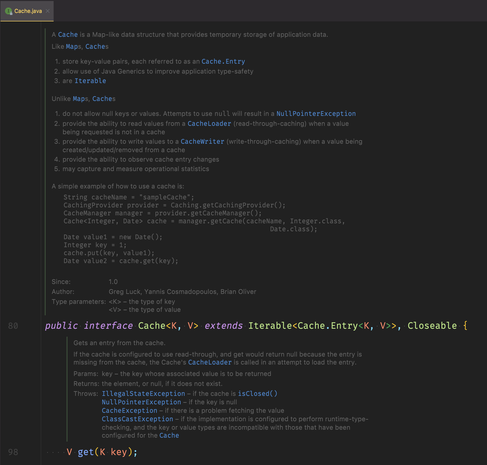

## 서론 

스프링에서 로컬 캐시를 적용할 때 항상 나오는 그 이름.
**ehcache**! 코드로 먼저 접하다보니, 영문도 모르고 `ehcache.xml` 설정만 보고 아 자바 구현체 로컬캐시구나? 정도까지만 이해하곤 했다. 언제까지 그럴순없지. 오늘은 스프링 프로젝트에서 ehcache 를 적용하는 방법을 알아본다. 

## cache? 
ehcache 공홈의 [설명](https://www.ehcache.org/generated/2.10.0/html/ehc-all/#page/Ehcache_Documentation_Set%2Fco-cache_basic_terms.html%23) 을 인용한다. 
> 나중에 금방 필요하게 되어, 빨리 조회할 필요가 있는 것들을 저장하는 곳
>  a store of things that will be required in the future, and can be retrieved rapidly

cache는, 실제로 데이터가 기록되어 있는 곳에 직접 찾아가 데이터를 가져오는 것이 불편하니 자주 쓰는 것들은 금방 꺼내쓰도록 하는 저장소다. 책장이 있지만, 자주 보는 책들은  책상에 쌓아두는 것처럼. 어떤 정보가 필요하면, 어플리케이션은 cache를 먼저 들여다보게 된다. 그리고 cache에 있다면, 그 정보를 반환한다. (= cache hit)  없다면(=cache miss), 원래 정보가 있을 것으로 추정되는 (=System-of-Record)으로 가야한다. 

이렇게 하는 이유는 주로 성능 때문이다. 어플리케이션은 (많은 경우) I/O 에 제한(bound)가 있고, 데이터를 가져오는 속도에 한계가 있는데, 캐시를 사용해서 직접적인 I/O 와 CPU 의 계산량을 줄여주면서 성능 향상을 노려볼 수 있다. 또 확장성에 있어서도 이점이 있다. 비싼 쿼리를 사용하고 있다면 어플리케이션의 갯수를 섣불리 늘릴 수 없겠지만, 캐시로 그 쿼리 결과들을 갖고 있다면 이보다는 쉽게 어플리케이션을 늘릴 수 있다.

당연히 한계점도 있다. cache는 지금 현재 저장된 데이터가 아니다보니, 원하는 스펙이 리얼타임에 가까울 때는... 지양해야한다. 만료 시점에 따라서 같은 유저가 방금 전과 다른 데이터를 볼 수도 있는 문제도 생길 수 있고. 언제나처럼, 스펙을 잘 고려해서 도입해야한다.


## ehcache ? 
ehcache 홈페이지에 들어가면 대문짝만하게 적혀있는 문구가 눈에 띈다. `JAVA-에서-젤-많이-쓰는-캐시` 그렇군요... 그렇지만 저는 거의 초면이니까 설명 좀 읽어보도록하겠습니다.

ehcache는 성능 향상, DB 의 부담 경감, 확장성에 방점을 찍고 나온 오픈소스 cache 구현체다. 가장 최근에 릴리즈된 버전은 `ehcache 3`으로, [여기](https://www.ehcache.org/documentation/3.0/) 에서 그 스펙을 확인할 수 있다. ehcache3는 JSR107 (JCache Spec) 으로 컴파일된다.

### 잠깐! 나 JCache도 몰라 
자주 참고하게 되는 baeldun 블로그에서는 [JCache](https://www.javadoc.io/doc/javax.cache/cache-api/1.0.0/index.html) 는 자바의 표준 캐시 API 라고 요약한다. 주요한 컴포넌트로는 `Cache` 가 있고,  이 하위에는 Cache 를 넣고 빼는 메소드들이 있다. 



gradle에서는 다음과 같이 임포트할 수 있다.
```groovy
implementation 'javax.cache:cache-api:1.1.0'
```

홈페이지의 뉘앙스로 봐서는 이전의 ehcache2 가 JCache와 별도로 진행되는 캐시로서 역할하고 있었고, ehcache3 로 오면서 JCache의 스펙을 구현한 형식으로 변경된 것으로 보인다. 또한 ehcache3은 `off-heap` (heap 밖의 영역에 데이터를 저장해서, 가비지 컬렉션의 대상이 되지 않는 방식) 저장 방식을 지원한다. 이 두 가지가 크게 ehcache2 와 ehcache3 를 가르는 변경점이다. 

여기서는 최신 버전인 ehcache3 을 먼저 알아본다.

## 스프링에 적용하기 
ehcache는 두 가지 방법으로 설정이 가능하다. 하나는 `xml`을 활용하는 방법, 하나는 코드 상으로 설정하는 방법.  여기서는 xml 버전 먼저 알아본다. 둘다 많이 쓰는 듯?

### 공통 ) build.gradle에 추가해주기 
gradle을 사용하는 경우 다음을 추가해준다. 
```groovy
dependencies {  
 // 중략
 implementation 'org.ehcache:ehcache:3.8.1' // 이 라인을 추가한다.
}
```

gradle refresh 로 실제로 import 하는 것을 잊지말자. 


### XML 으로 설정하기 
> …It wouldn’t be Java without _some_ XML - ehcache 홈페이지 설명 중 

다음은 xml 로 **CacheManager** 를 설정하는 방법이다. 
xml 설정 파일의 이름은 `ehcache.xml` 로, 기본적으로 `src/main/resources` 하위로 위치해준다. 
설정 파일의 로케이션을 변경할 경우 `application.properties` 에는 
```bash
spring.cache.ehcache.config=classpath:ehcache.xml  
```

`application.yml` 을 쓰는 경우 다음과 같이
```yml
spring:
	cache:
		ehcache:
			config: classpath:ehcache.xml  
```


```xml 
<cache alias="foo"> 
    <key-type>java.lang.String</key-type> 
    <resources>
      <heap unit="entries">2000</heap> 
      <offheap unit="MB">500</offheap> 
    </resources>
  </cache>

  <cache-template name="myDefaults"> 
    <key-type>java.lang.Long</key-type>
    <value-type>java.lang.String</value-type>
    <heap unit="entries">200</heap>
  </cache-template>

  <cache alias="bar" uses-template="myDefaults"> 
    <key-type>java.lang.Number</key-type>
  </cache>

  <cache alias="simpleCache" uses-template="myDefaults" /> 
```

- Cache의 이름을 foo로 설정한다. 이때 key는 String 타입을 가진다. 별도의 설정이 없는 이상, value의 type 은 `Object`로 정해진다. 
- 이 `foo` 라는 캐시는 heap 에 최대 2000개 까지 저장할 수 있다. 또, evict(캐시가 한도가 다해서 날아가는 것) 전에 500MB 까지는 offheap 공간에 저장해줄 수 있다. 

- `myDefaults` 라는 이름의 캐시 템플릿을 정해줄 수 도 있다. 위의 foo 처럼 커스텀 설정을 넣을 수도 있지만, 이름만 정해주고 공통 템플릿을 사용하는 방식이다.  그 아래 사용된 `bar` 캐시는 이 템플릿을 사용하고 있다. 설정을 덮어씌우고(override) 싶을 때는 추가로 정의해주기만 하면된다. `bar` 는 key 타입을 Number로 변경해주었다. 

- 그런가하면 커스텀 없이 `simpleCache` 는 그냥 템플릿을 그대로 사용했다. 


## 참고 

https://www.ehcache.org/
https://www.ehcache.org/documentation/3.0/getting-started.html#configuring-with-java
https://www.baeldung.com/jcache

