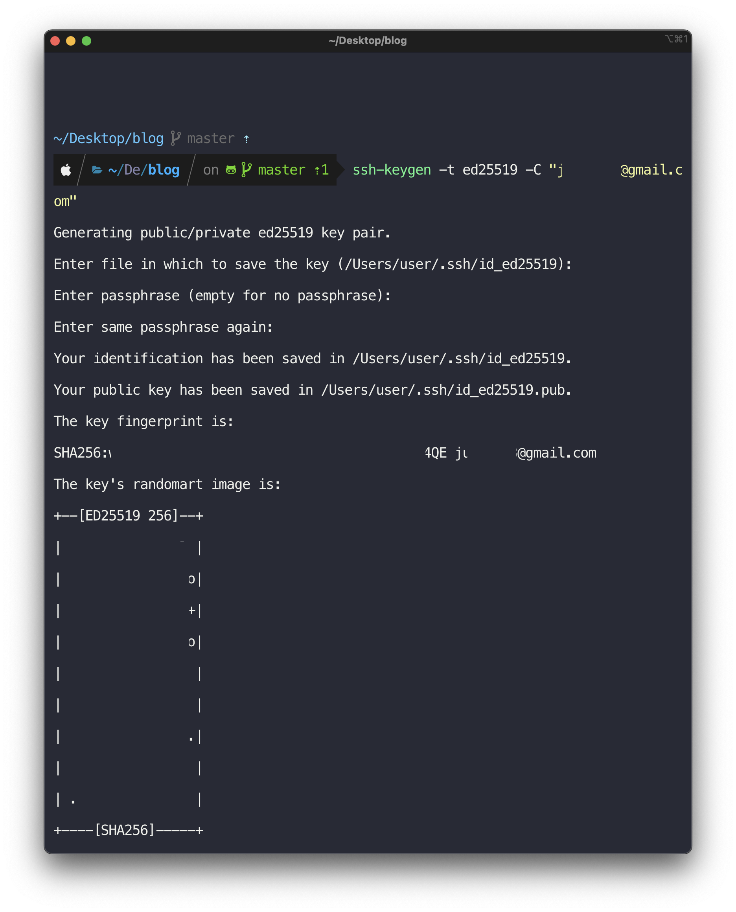

## 서론 

Github 의 인증 시스템이, 기존에 가능하던 id/pw 인증 방식을 제거했습니다. 아이디-패스워드 방식은 해당 키만 알면 로그인할 수 있다는 점에서 보안적으로 약하다고 보았고, 이를 개선하려고 한 것입니다. 

따라서 2021년 8월 13일 이후로, id/pw 인증되던 git repository 에 푸시하는 순간, 에러 메시지가 발생합니다. 


## 액세스 토큰 방법과 ssh 방법 

액세스 토큰 방식은 특정 권한을 가진 토큰을 발급하여, github 과 관련된 액션을 할 때 해당 토큰을 사용하는 방식입니다. 

그리고 ssh 방식은 머신에서 ssh 토큰을 발급하고 github쪽에 등록해서, `해당 머신에서의 인증은 안전하다` 라고 알려주는 방식입니다. 
> Using the SSH protocol, you can connect and authenticate to remote servers and services. With SSH keys, you can connect to GitHub without supplying your username and personal access token at each visit.
SSH 프로토콜을 사용하면 , 유저네임과 액세스토큰을 매번 제공하지 않고도 인증할 수 있습니다. 

## ssh 토큰 발급과 등록하기 개괄 
아래의 공식 문서에 아주 잘 설명되어있는데요.
이문서부터 따라가면 되는데, 그래도 아래의 추가 설명을 먼저 달겠습니다.

https://docs.github.com/en/github/authenticating-to-github/connecting-to-github-with-ssh

### ssh 토큰 존재여부 확인하기

가장 먼저 이미 생성된 ssh 토큰이 있는지 확인합니다. 

1. 터미널을 엽니다. 
2. 터미널에 다음을 입력합니다. 
   ```bash
   ls -al ~/.ssh
   # .ssh 디렉토리에 있는 파일 나열하기 (있으면) 
   ```
3. publch SSH key가 있는지 확인합니다. 기본적으로, public key의 이름은 다음 중 하나여야합니다. 

  ```
  id_rsa.pub
  id_ecdsa.pub
  id_ed25519.pub
  # 디폴트 명이므로, 다르게 생성했다면 다를 수 있음
  ```

https://docs.github.com/en/github/authenticating-to-github/connecting-to-github-with-ssh/checking-for-existing-ssh-keys

### 없다면, 발급하기 

만약 위에서 ssh 키가 없다면 발급해야합니다. 
아래 가이드를 따라주세요! 
https://docs.github.com/en/github/authenticating-to-github/connecting-to-github-with-ssh/generating-a-new-ssh-key-and-adding-it-to-the-ssh-agent


 

Mac 기준으로 설명합니다. 다른 OS는 위의 링크를 따라주세요. 

1. 터미널을 연다. 

2. 아래를 복사한다. (github email 은 본인걸 사용) 
   
   ```bash 
   ssh-keygen -t ed25519 -C "your_email@example.com"
   ```

3. `Enter a file in which to save the key (어디에 키를 저장할지 선택하세요)`
명령어가 뜨면, enter를 누른다. 
   ```bash 
   > Enter a file in which to save the key (/Users/you/.ssh/id_ed25519): [Press enter]
   ```

4. passphrase (암호정도에 해당) 를 입력하라고 뜬다. 원하는 passphrase입력 
   ```bash 
   > Enter passphrase (empty for no passphrase): [Type a passphrase]
> Enter same passphrase again: [Type passphrase again]
   ```

## 만들어진 ssh key를 ssh-agent에 등록하기 

1. ssh agent 를 백그라운드에서 동작시키기 
   
   ```bash 
   $ eval "$(ssh-agent -s)"
   ```
   
2. macOS Sierra 10.12.2 이상이라면, `~/.ssh/config` 만 수정하면 자동으로 ssh-agent 가 키를 불러와서 passphrase 를 키체인에 저장합니다. 
   
   ```bash 
   open ~/.ssh/config
   ```
   
   파일이 없으면 만들어줍니다. 
   
   ```bash 
   touch ~/.ssh/config
   ```


   파일을 열고 아래 내용을 추가합니다. 만약 이름이 다르거나 경로가 다르면 알맞게 수정해주세요.
   ```bash 
   Host *
    AddKeysToAgent yes
    UseKeychain yes # passphrase를 추가안했으면 이 줄은 제거
    IdentityFile ~/.ssh/id_ed25519
   ```

3. SSH private key를 ssh-agent에 추가하고, passphrase를 keychain에 등록합니다. 역시, 다른 이름으로 만들었거나 경로가 다르면 알맞게 수정해주세요. 
   
   ```bash 
   ssh-add -K ~/.ssh/id_ed25519
   ```

4. SSH public key를 github에 추가합니다. 
   
    
   
   pbcopy로 public key를 클립보드에 복사합니다. 
   ```bash 
   pbcopy < ~/.ssh/id_ed2519.pub 
   ```
   
   [Github Settings > Key](https://github.com/settings/keys) 로 이동합니다.

   New SSH Key 추가버튼을 누르고, Title에는 설명을, Key 부분에는 클립보드에 복사된 값을 붙여넣습니다. 
   
   
## 기존 git repository 의 remote 삭제하고, ssh 형태로 다시 등록하기 
ssh 토큰 등록을 완료해서 신나게 푸시하러가보니까 안됩니다. 
기존의 레포지토리의 remote 설정이 https 로 되어있다면, 이 설정을 삭제하고 다시 ssh 방식으로 등록해줍니다. 

```bash 
git remote 
# origin 
# <remote명> 이 위와 같이 표시됨
```

```bash 
git remote rm <remote명> 
# git remote rm origin 
```

github 레포지토리에 가서 ssh url 을 복사합니다. 

```bash 
git remote add origin <ssh url> 
```

### 마무리 

two-factor 로그인을 사용하고 있었던 분들은 당황하지않으셨을텐데, 저는 일반적인 방식을 사용하고 있어서 곤란했습니다 =) 혹시 같은 문제가 있으셨으면 해결되셨길 바랍니다! 
