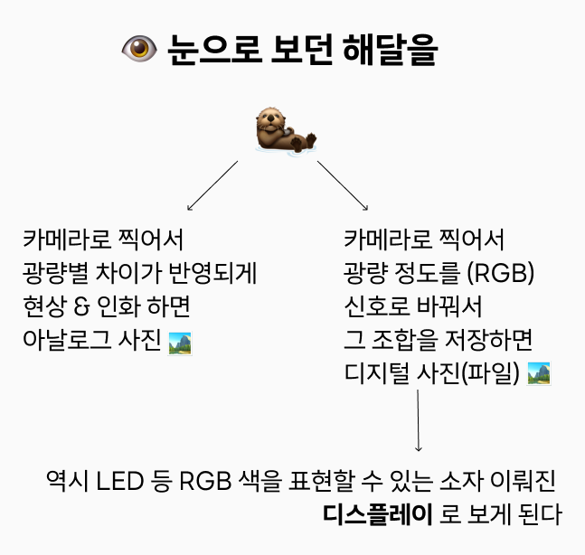
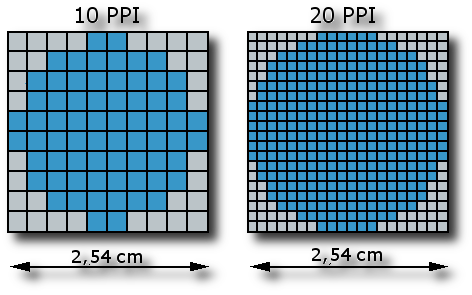
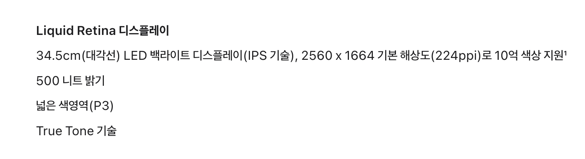
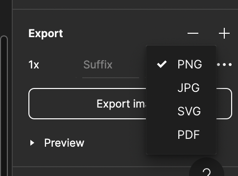
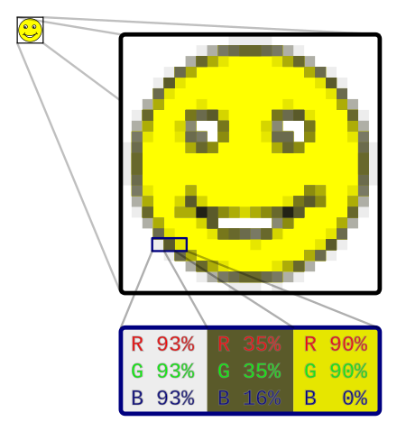
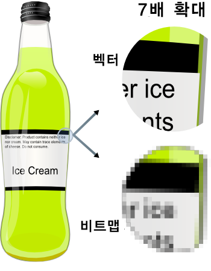
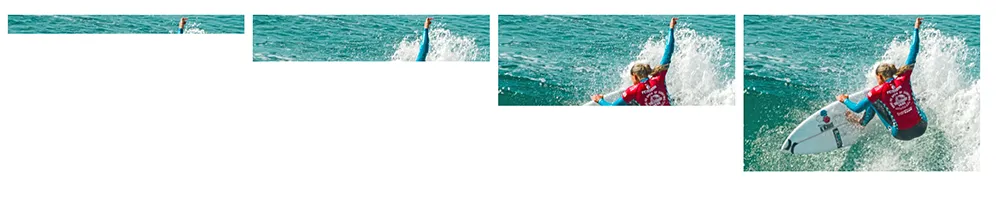
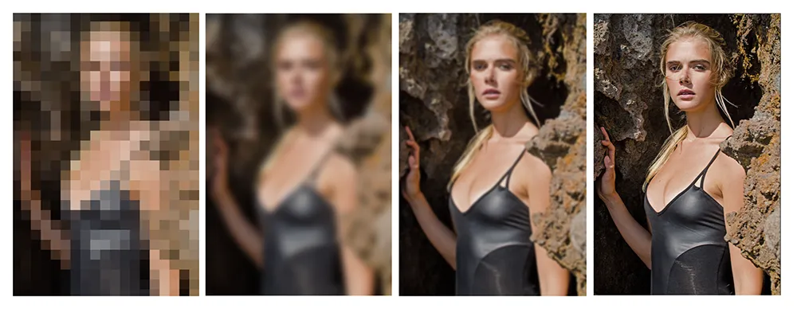
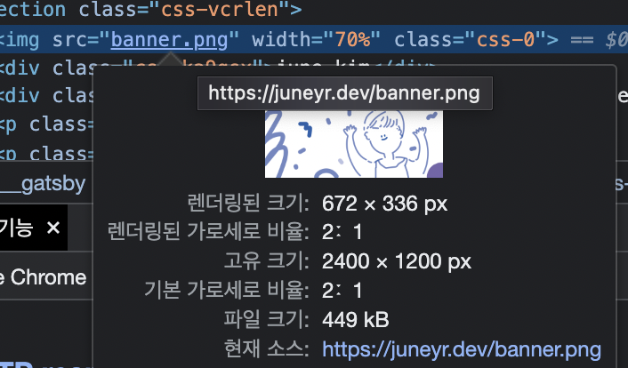

## 서론 

이미지로 내가 아는 것을 풀어놓고 전달하는 것을 매우 좋아하는 입장에서, 이미지는 매우 흥미로운 주제다. 그럼에도 좀처럼 파볼 생각을 하지 못했는데, (역시나) 최적화 스터디에서 많은 정보를 깔아주었기에 정리해보는 이미지 다뤄보기. 


## 이미지는 어떻게 디지털화 될까 

사진, 은 대표적인 아날로그 시각 멀티미디어다. 아날로그 카메라가 사진을 찍는 과정을 생각해보자. 아날로그 카메라는 화학 물질을 입힌 플라스틱 필름에 있는 감광 (빛을 감지) 영역을 피사체에서 오는 빛에 노출하여 필름에 상을 기록한다. 이 상은 실제 인간이 지각하는 상에서 반전된 색상과 같아서, 현상과 인화 과정을 거쳐 우리가 볼 수 있는 사진으로 인화된다. (이 내용을 기록하면서 어떻게 필름에 기록할 수 있는지 찾아봤는데 재밌었다! > [필름 카메라, ㄱ 나니? 참조](http://www.astronomer.rocks/news/articleView.html?idxno=83567) ) 

디지털 카메라는 렌즈가 RGB 필터 뒤에 놓인 미세한 '광' 센서의 배열에 상의 초점을 맞춘다. 각 센서 들어오는 빛의 양에 비례하게 전하를 저장한다.  저장된 전하를 수치로 변환하면 사진의 디지털 표현을 만들 수 있다. 사진의 디지털적 표현은 이렇게 계산되어 빛의 강도를 나타내는 수를 배열한 것이다. 당연히 빛을 촘촘하게 담아내면 (검출 소자가 많거나 / 전하가 더 정밀하게 측정되면) 디지털화된 상은 피사체 원형을 더 정확하게 담아낸다. 

디지털 카메라가 갖고 있는 센서는 RGB 빛의 양을 측정하는 세 개의 센서로 구성된다. 각 요소는 화소 (picture element) 라는 뜻에서 픽셀 (pixel) 이라고 한다. 4000 * 3000 픽셀 구성이면 1200만 화소인데, 각 픽셀은 세 가지 정보(RGB) 에 대해 각각 강도를 담고 있으므로 3600만 가지의 빛의 강도 값을 갖고 있다. 

이렇게 저장된 이미지는 각 픽셀별로 어떻게 표현되어야할 지에 대한 정보를 담고 있고, 이는 이 정보를 표현할 수 있는 소자 (LED) 등 으로 이뤄진 디스플레이를 통해서 표현된다 (말 그대로 display). 표현할 수 있는 소자는 종류가 다양하고 빛을 내는(발광) 방식도 다른 경우가 많다. (OLED의 경우 [이 글](https://news.lgdisplay.com/2023/04/%EB%94%94%EC%8A%A4%ED%94%8C%EB%A0%88%EC%9D%B4-%EC%83%81%EC%8B%9D%EC%82%AC%EC%A0%84-25-oled%EC%9D%98-%EB%B0%9C%EA%B4%91-%EC%9B%90%EB%A6%AC/)을 참조해보자.)

### 화소 밀도 

화소 밀도랑 **물리적인** 스크린 공간에 얼마나 많은 픽셀이 압축되어있느냐는 개념이다. 픽셀은 화소 (picture element) 이므로, 상을 구현하는 요소이기만 하지 물리적으로 크기가 정해진 것은 아니다. 일반적으로 화소 밀도는 높을 수록 선명한 화면을 구현할 수 있고 (화소 밀도가 높으면 글자를 찍은 사진을 볼 때 글자의 경계가 덜 뭉개진다), 표현은 PPI(Pixel Per Inch) 로 한다. 10PPI 면 1 인치 제곱 의 물리적 화면 안에 픽셀이 10개 있다는 뜻이다. 20PPI 이면 두배인 20개가 있다는 뜻이고. 절대적인 크기 (1 inch 제곱)의 크기가 늘어나는 것은 아니므로, 20PPI 일때 픽셀이 더 작다는 점을 아래 이미지에서 확인할 수 있다.

)


https://www.apple.com/kr/macbook-air-m2/specs/ 에서 캡처해온 이미지에 따르면 macbook air m2 의 ppi 는 224 라는 것을 확인할 수 있다.

별첨으로 디자인을 하다보면 dpi 라는 해상도와 비슷한 단위를 확인할 수 있는데, 이는 인쇄시 사용하는 단위로 dots per inch 를 의미한다. 이 역시 같은 공간 안에 점(dots) 가 늘어날 수록 선명한 이미지로 인쇄된다.  디자인 출력물은 300 ppi 로 작업하고 dpi 로 변환하되, 웹에서 사용하는 이미지는 72ppi 로 작업하는 경우가 일반적이라고 한다. 

## 이미지 최적화가 왜 중요한가 

웹의 경향성은 점점 이미지가 많아지는 쪽으로 발전해온 것이 사실이다. 선명한 이미지로 브랜드나 상품을 홍보하려고 하기때문에, 높은 해상도를 가진 이미지를 올리고자 한다. 하지만 고품질 이미지를 사용하면 크기가 큰 이미지로 인해 웹 성능이 떨어질 수 있기 때문에, 두 부분을 모두 만족할 수 있는 선에서 최적화를 하는 것이 무엇보다 중요해졌다.

## 이미지의 종류 

이를 위해서는 이미지 종류에 대해서 먼저 잘 알고 있어야한다. 일반적으로 많이 사용하는 PNG 와 JPG (JPEG) 에 대해서 떠올려보자. 가장 먼저 떠오르는 점은 PNG 는 알파채널 (투명도)를 지원하는 반면 JPG는 지원하지 않는다는 점이다. 그래서 나는  투명도를 지원하는 디자인 작업물을 만들 때 항상 PNG 로 저장한다.



디자인적으로 유리하고 깔끔한 이 PNG 저장 방식은, 이런 기능 때문에 같은 품질의 JPG 이미지보다 용량이 크다는 단점이 있다. 따라서 같은 품질을 제공하고 있다면 JPG를 선택하는 것이 웹 성능 자체에는 유리할 수 있다. 아래에서 이미지의 종류를 나눠보고 정리해보자.

### 래스터 vs 벡터 이미지
래스터 이미지는 우리가 사용하는 대부분의 이미지 유형이다. 작은 사각형 모양의 픽셀에 표현하고자 하는 색상 정보를 입력해 이를 컴퓨터로 표현하는 방식이다. 픽셀들은 모여서 하나의 이미지를 완성하기때문에, 사이즈가 크거나 품질이 더 좋은 이미지를 만들기 위해서는 픽셀을 추가해야지만 컴퓨터가 정상적으로 표현할 수 있다. 그렇기때문에 원래 작은 이미지를 억지로 **해상도 높이기** 기능을 사용해 올리려고해도 깨진 이미지로 표현되기 마련이다.



반면 벡터 이미지는 그리고자 하는 대상의 수학적인 정보를 제공한다. 즉, 그림이 위치할 좌표나 원 또는 사각형의 크기, 형상, 색상등의 정보를 제공해서 컴퓨터가 그림을 그리듯이 화면에 표현한다. 위 이미지에서 svg 로 저장하는 경우 벡터 이미지로 저장하는 것이다. 벡터 이미지는 메타 정보를 담고 있는 것이므로, 화면이 커지거나 작아져도 정보가 달라지지 않고, 항상 선명한 이미지를 표현할 수 있다. 그러나 그림이 복잡해지면 이를 표현하기 위한 정보가 기하급수적으로 늘어나며, 이를 수학적인 정보로 표현하는데도 제약이 있다.


svg 는 html 상에서 다음과 같이 메타 정보를 가진 텍스트로 표현할 수 있다. 
```html
<!-- https://www.w3schools.com/graphics/svg_examples.asp --> 
<svg width="400" height="180">
  <rect x="50" y="20" width="150" height="150" style="fill:blue;stroke:pink;stroke-width:5;fill-opacity:0.1;stroke-opacity:0.9" />
  Sorry, your browser does not support inline SVG.  
</svg>
```

그러므로 gzip이나 brotli 같은 텍스트 압축 기법으로 간단히 최적화도 가능하다.


디자이너라면, 어도비 포토샵의 '래스터화' 기능 그리고 psd 파일로 저장되는 경우를 래스터 이미지와 연관지어서 생각할 수 있다. 그리고 어도비 일러스트레이터의 ai 파일로 저장되는 경우를 벡터와 연관지어서 생각할 수 있겠다. 

### 무손실 이미지 vs 손실 이미지

또 다른 기준은 손실 여부를 기준으로 이미지를 나눌 수 있다. 원본 이미지의 정보 손실을 허용하지 않으면 **무손실 이미지**라고 한다. 그리고 필요에 따라 이동할 수 있게 정보 손실을 허용하면 **손실 이미지**라고 한다.

디지털 카메라로 찍어 RAW 확장자 형식으로 저장하면, 모든 색상 정보와 빛의 정보가 (디지털 카메라가 반응할 수 있는 범위 내에서) 그대로 저장되므로 10MB 에서 30MB 정도의 크기로 저장된다. 이것을 인터넷에서 그대로 관리하고 전송하기 어렵기때문에 압축 기법으로 사이즈를 축소해 저장한다. 

GIF 와 PNG 는 대표적인 무손실 이미지 형식에 해당한다. 반면 JPEG와 WebP 등과 같이 브라우저에 특화된 이미지 유형은 손실 이미지에 해당한다. 

### GIF 
GIF(Graphic Interchange Format) 은 인터넷이 활성화된 이래로 가장 처음으로 등장한 이미지형식이다. 애니메이션 기능을 제공해서 단지 짤방(!) 용이라고 생각했는데 역사가 깊다. 다만 초창기 형식이기때문에 사용할 수 있는 색이 256컬러로(8bit) 제한적이다. true color (24bit, 16,777,216개 색상)으로 표현할 수도 있지만, 이 과정에서 파일 사이즈가 기하 급수적으로 커진다. 


위 이미지는 8bit 인 gif 를 true color로 변환하는 과정이다. 이미지의 각 부분을 분할 하여, 각각을 또다른 gif 가 되어 합쳐서 한 이미지를 표현하는 방식이다. 이때문에 파일 크기가 커지게 되어있다. GIF 의 특허문제와 색의 한계표현때문에 PNG라는 새로운 표준이 만들어졌다. 읽을 때는 지프, 기프, 지-아이-에프 등으로 읽는다.


### PNG
PNG(Portable Network Graphic) 은 GIF 와 마찬가지로 무손실 타입 이미지이다. 그러나 24bit 색상을 사용하므로 GIF 보다 고품질 이미지를 사용할 수 있다. 하위 유형으로 컬러 팔레트 PNG와 트루 컬러 PNG로 나뉘고, 알파 채널이 추가된 트루 컬러 PNG를 대부분의 웹사이트에서 사용한다. 공식으로는 '핑'(!)이라고 읽어야하지만, 모두 다 피-엔-지 로 읽는다. 무손실 압축이기때문에 동일 이미지를 여러번 저장해도 이미지 품질 저하가 없다. GIF 와 달리 애니메이션 기능은 지원하지않는다.

> APNG 라는 형식도 있다. APNG 는 애니메이션 기능을 지원하기 위한 png 방식이다. gif 와 비슷한 기능을 가지면서도 png 를 호환한다고한다. 검색해보니, 카카오 / 라인 이모티콘 제출할 때 이 형식을 사용하는 듯. 


### JPEG 
JPEG 는 사진을 저장하는 거의 사실상의 표준 형식이다. RAW 형식은 너무 크기가 크기때문에 네트워크로 전송하거나 웹에 게시하기 어렵다. 이런 단점을 극복하기 위해 Joint Photographic Experts Group 에서 개발한 이미지 형식을 그룹 이름을 줄인 JPEG 로 명명했다. 확장자는 `jpeg` 혹은 `jpg` 를 사용하는데 이는 DOS 환경에서 확장자를 3자로 정한데에서 유래했다고 한다. 공식 포맷 명은 JPEG 인 셈이다. JPEG는 사람의 눈이 인식할 수 있는 색상만 남기고 나머지를 제거하는 기술로 이미지 표시 정보를 줄인다. 이 때 그 품질 값(0-100 범위)을 사용자가 결정할 수 있는데, 100으로 해도 약간의 손실이 생긴다. 
JPEG 는 이렇게 압축률이 높아 사진 이미지를 전달하는데 적합한 형식으로서 널리 사용되지만, 투명 기능이나 애니메이션 기능을 지원하지 않는다.

JPEG는 웹 전송에 최적화된 만큼 점진적 데이터 전송 기능을 갖추기도 했다.

인터넷을 사용하다보면 네트워크 속도가 느릴 때 JPEG 이미지가 한 행씩 천천히 표현되면서 나타나는 것을 본 적이 있을 것이다.  (이미지 [출처](https://medium.com/hd-pro/jpeg-formats-progressive-vs-baseline-73b3938c2339))

위와 같이 표현되는 것이 JPEG 의 baseline 방식 점진 데이터 전송을 사용한 것이다.

혹은 아래와 같이 표현되는 것을 본 적 있을 수도 있다. 이는 최소한의 품질을 갖춘 이미지를 로드하고, 천천히 모든 정보를 표시하는 **progressive** 방식이다. (이미지 [출처](https://medium.com/hd-pro/jpeg-formats-progressive-vs-baseline-73b3938c2339))

### WebP 
WebP는 구글에서 개발하고 배포한 이미지 형식이다. 최근의 크롬 브라우저에서 대부분 지원하는 것을 [확인](https://caniuse.com/webp) 할 수 있다. WebP 는 JPEG 보다 개선된 공격적 압축 방식을 사용하여 파일 크기를 25~35% 정도 작게 만들 수 있다. 거기에 무손실 압축, 애니메이션 기능, 투명 기능도 모두 지원한다. 
WebP가 압축률이 높지만, 품질을 많이 낮추면 화질에 손실이 꽤 많이 보이는 단점이 있다. 또한 JPEG에서 지원하는 점진적 데이터 전송 기능이 없다는 점은 아쉽다. 


### 그 외에 
JPEG 2000 혹은 JPEG XR 같은 이미지 형식도 존재하지만, 지원 브라우저의 폭이 좁고 잘 사용하지 않는 추세에 있다.

## 이미지를 사용한 '웹' 최적화를 위해 

### 이미지 변환 기법 

이미지의 종류를 배운 것은 이를 위해서 였다! 당연히 이미지의 크기를 줄이면서 품질은 최대한 보존하는 방식으로 이미지를 압축하면 웹 성능에 큰 개선이 있다. 

이미지 압축에는 이미지의 '실제 품질'은 줄이지 않는 무손실 압축과, 이미지의 실제 품질을 저하하면서 크기를 줄이는 손실 압축이 있다. 

**무손실 압축**
- GIF 의 경우 색상 지원이 떨어지므로 아예 일단 다른 이미지 형식으로 변경하는 것을 권장한다. (e.g. ImageMagicK 등을 통해 사용가능)
- PNG의 경우 PNG 임을 알리는 구분자인 첫 8바이트 서명을 제외하고 청크(chuck) 형태로 이미지 정보를 저장한다. 핵심 청크에는 이미지 정보가 저장되지만, 이외에도 포토샵같은 소프트웨어에서 붙이는 정보성 청크등이 있는데, 이런 청크는 웹 렌더링에 필요하지 않으므로 삭제할 수 있다. 
- JPEG  파일안에는 많은 메타 데이터가 포함되어있다. (e.g. 주석, 공백, 편집 애플리케이션 정보, EXIF 등) 이미지 세부 정보는 웹 렌더링에 필요하지않으므로 삭제할 수 있다. 


**손실압축**
손실 압축은 특정 이미지 정보를 누락 / 손실 시켜 파일 크기를 줄이는 방법이다. 이미지 색이 비슷한 부분을 하나의 색으로 통일해서 그만큼의 정보를 손실시키는 방식이 대표적이다. 참고한 <웹 성능 최적화 기법> 에 따르면, 사람이 품질 저하를 거의 눈치채지 못하면서 파일 크기를 가장 크게 줄일 수 있는 JPEG 품질은 100-75% 사이라고 하며, 책에서는 85-80%를 권하고 있다.

### 이미지를 어떻게 보여줄 것인가 

이미지 자체를 줄이고, 압축해서 최적화를 했다고 해도 웹에서 보여주는 방식에서도 개선이 필요하다. 성능적인 이득을 보려면,  보여주는 방식에서 다음과 같은 시도를 해볼 수 있다. 

**반응형 웹에서** | 서버측 반응형 웹을 사용해서, 클라이언트에 따라서 다른 크기의 이미지를 보여준다. 일반적인 반응형 웹은 클라이언트에 따라 뷰포트가 달라질 뿐, 똑같이 큰 이미지를 다운로드해서 보여주는 경우가 있다. 이때 서버측 반응형 웹 접근 방식을 사용하면 클라이언트 정보를 활용해서 맞춤형 웹 페이지를 생성해서 전송할 수 있다. 

**화면에 없는 것은 그리지 않는다 - 지연 로딩(lazy loading)** | 지연로딩을 적용하지 않으면 웹페이지에 접속함과 동시에 필요한 이미지를 모두 로딩하면서 웹 성능이 자연스럽게 떨어진다. 현재 화면에서 필요한 정보만 다운로드 한다면, 웹 성능을 향상 시킬 수 있다. 보통 스크롤에 따라 뷰포트에 보여지는 이미지만 먼저 로딩한다. 이때 당장 보이는 것보다 조금 먼저 로딩해야 경험을 향상 시킬 수 있다. (e.g) 100px 이후에 보일 이미지도 로딩)

**실제 렌더링되는 사이즈로 조절한다** |  크롬 개발자 도구 > elements 에서 이미지 태그에 호버해보면 다음 정보를 확인할 수 있다. 실제 렌더링된 크기는 672 * 336px 에 불과한데, 고유 크기가 훨씬 큰 것을 확인할 수 있다. 이런 경우 이미지의 크기를 조절해서 변경할 수 있을 것이다. <프론트엔드 성능 최적화 가이드> 에서는 딱 맞는 이미지가 아니라 요즘의 레티나 디스플레이 추세등을 고려하여 두배 정도의 이미지를 사용하는 것을 권장하고 있다. 즉 120px * 120px 로 그려지는 이미지라면 240px * 240px 이미지를 사용하는 것이 적절하다.



### 참조 

- http://www.astronomer.rocks/news/articleView.html?idxno=83567
- https://blank2.tistory.com/3
- <1일 1로그 100일 완성 IT 지식>, 브라이언 W.커니핸
- <웹 성능 최적화 기법>, 강상진 윤호성 박정현 
- https://ko.wikipedia.org/wiki/%EB%9E%98%EC%8A%A4%ED%84%B0_%EA%B7%B8%EB%9E%98%ED%94%BD%EC%8A%A4
- https://ko.wikipedia.org/wiki/%EB%B2%A1%ED%84%B0_%EA%B7%B8%EB%9E%98%ED%94%BD%EC%8A%A4
- https://medium.com/hd-pro/jpeg-formats-progressive-vs-baseline-73b3938c2339