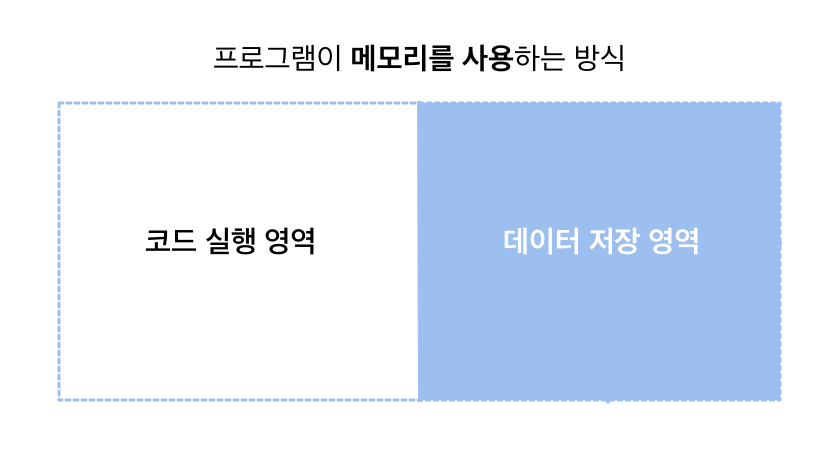
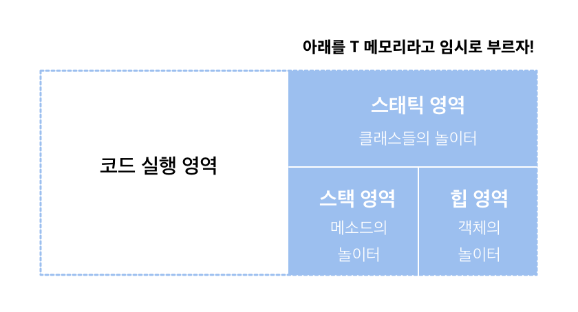
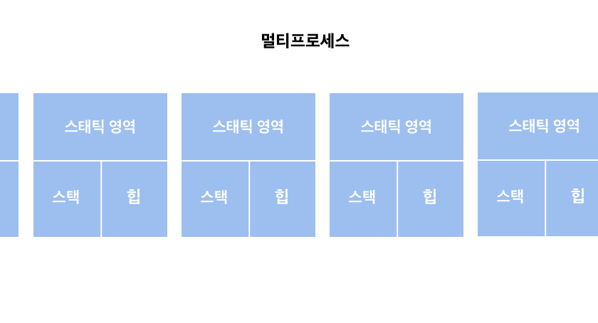

### Java , 그리고 T 메모리 
메모리에서 스태틱 영역은 클래스들, 스택은 메소드들, 힙은 객체들의 놀이터다. 

### 멀티스레드와 멀티프로세스 
멀티 스레드의 T 메모리 모델은 스택 영역을 스레드 개수 (n) 만큼 분할해서 사용하는 것이다. 

멀티 프로세스는 다수의 데이터저장 영역 (T메모리)를 갖는 구조다. 

그러니까 각자의 T 메모리가 있고 고유의 공간이므로 서로 참조할 수 없다.
메모리 안전 구조이므로 침범이 안되지만 그만큼 메모리 사용량은 크다. 

그에 반해서 멀티스레드는 다른 스레드의 스택영역에는 접근이 불가능하지만, 스태틱과 힙은 공유해서 사용한다. 멀티프로세스 대비 메모리를 적게 사용할 수 있다. 

이를 서블릿에 가져와서 생각해보자. 서블릿은 요청당 스레드를 생성한다. 위 얘기를 보니, 요청당 프로세스(CGI) 보다 요청당 스레드가 메모리를 적게 사용하므로 훨씬 유리하다. 

전역변수를 사용하면, 멀티 스레드에서는 스태틱 영역을 공유하게 된다. 스태틱에서 A 가 10 이었는데, 잠시 다른 스레드로 넘어간 사이 업데이트 되어서 전역변수 A가 20이 되었다고 하자. 

원래 스레드는 영문도 모르고 A가 20이 된다. 그래서 전역변수를 사용하면 스레드 간 안정성이 깨진다. 스프링에 적용해본다면.. 컨트롤러에 전역변수를 선언하고 요청이 들어올때마다 업데이트 쳐주는 것을 생각해볼수있을까? (아 그래서 전역은 상수로만 만들어서 사용했군 =) ) 이런 경우를 보완하려면 lock을 걸 수 있는데... 그러는 순간 멀티스레드의 **장점이 사라진다**. 그러니까 하지말란거다. 

### 객체지향은 인간 지향이다 
구조적 프로그래밍에서 가장 중요한 건 **함수** 였다. Divide and Conquer 하자! 는 것이다.

### 참고 
스프링 입문을 위한 자바 객체지향의 원리와 이해, 김종민 지음 
