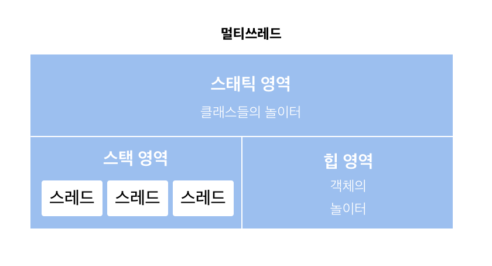

### Java , 그리고 T 메모리 
메모리에서 스태틱 영역은 클래스들, 스택은 메소드들, 힙은 객체들의 놀이터다. 

### 멀티스레드와 멀티프로세스 
멀티 스레드의 T 메모리 모델은 스택 영역을 스레드 개수 (n) 만큼 분할해서 사용하는 것이다. 

멀티 프로세스는 다수의 데이터저장 영역 (T메모리)를 갖는 구조다. 

그러니까 각자의 T 메모리가 있고 고유의 공간이므로 서로 참조할 수 없다.
메모리 안전 구조이므로 침범이 안되지만 그만큼 메모리 사용량은 크다. 

그에 반해서 멀티스레드는 다른 스레드의 스택영역에는 접근이 불가능하지만, 스태틱과 힙은 공유해서 사용한다. 멀티프로세스 대비 메모리를 적게 사용할 수 있다. 

이를 서블릿에 가져와서 생각해보자. 서블릿은 요청당 스레드를 생성한다. 위 얘기를 보니, 요청당 프로세스(CGI) 보다 요청당 스레드가 메모리를 적게 사용하므로 훨씬 유리하다. 

전역변수를 사용하면, 멀티 스레드에서는 스태틱 영역을 공유하게 된다. 스태틱에서 A 가 10 이었는데, 잠시 다른 스레드로 넘어간 사이 업데이트 되어서 전역변수 A가 20이 되었다고 하자. 

원래 스레드는 영문도 모르고 A가 20이 된다. 그래서 전역변수를 사용하면 스레드 간 안정성이 깨진다. 스프링에 적용해본다면.. 컨트롤러에 전역변수를 선언하고 요청이 들어올때마다 업데이트 쳐주는 것을 생각해볼수있을까? (아 그래서 전역은 상수로만 만들어서 사용했군 =) ) 이런 경우를 보완하려면 lock을 걸 수 있는데... 그러는 순간 멀티스레드의 **장점이 사라진다**. 그러니까 하지말란거다. 

### 객체지향은 인간 지향이다 
구조적 프로그래밍에서 가장 중요한 건 **함수** 였다. Divide and Conquer 하자! 는 것이다.

객체지향은 여기서 나아간 더 파격적인 사고로, 모든 사물을 컴퓨터에 담겠다는 의지가 있다. 사물을 유식하게 (ㅋㅋ) 객체(object) 라고 한다. 이제 객체지향의 사고를 해보자. 객체지향의 사고를 한다는 이야기는, 어떤 것을 속성과 행위로 구분해서 보는 것이다. 사람은 이름, 키, 몸무게, 나이, 지향성... 등의 **속성**이 있고, 자고 먹고 공부하고 운동하는 **행위**를 한다. 속성은 property, 그리고 행위는 method라고 부른다. 객체 지향은 인간의 인지방식을 프로그래밍에 접목하는 것이다. 

### 객체지향의 4대 특성 : 캡상추다 (나는 캡틴 상추같다)
- 캡슐화 (encapsulation) : 정보 은닉
- 상속 (inheritance) : 재사용
- 추상화 (Abstraction) : 모델링 
- 다형성 (Polymorphism) : 사용편의 

클래스와 객체의 관계는 나에게도 붕어빵틀과 붕어빵으로 남아있다. 그리고 맛있다. 하지만 이 책의 저자는 그 개념을 버리라 하네. 그냥 클래스: 객체 = 개념 : 실체로 생각하도록한다. 

추상화는 모델링이다. 추상화는 구체적인 것을 분해해서, 필요한 것만 뽑아서 재조합하는것이다. 
User를 모델링할 때 어플리케이션의 특성에 따라서 추상화(= 모델링)을 한다. 링크드인 같은 서비스면 그 사람의 소속, 직업, 직군 등이 User에 들어갈 것이고 병원앱이면 그 사람의 나이, 병력, 기저질환등이 주가 되겠지.
### 참고 
스프링 입문을 위한 자바 객체지향의 원리와 이해, 김종민 지음 
