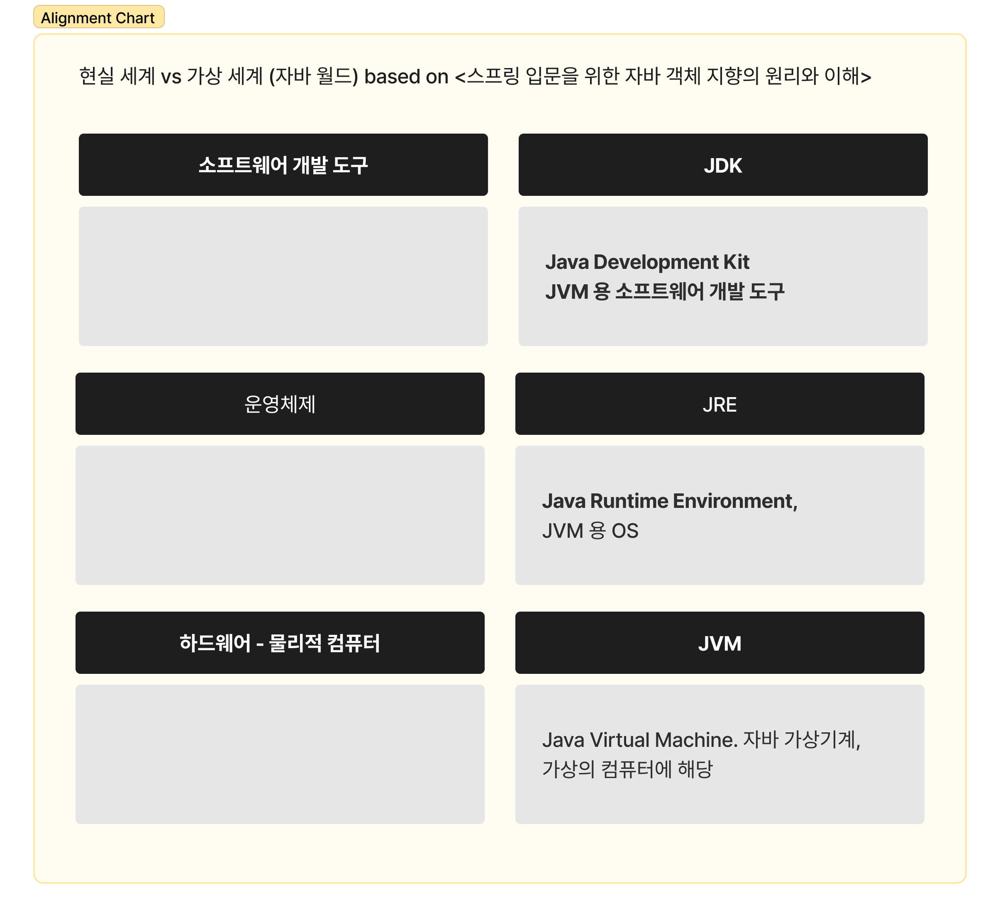
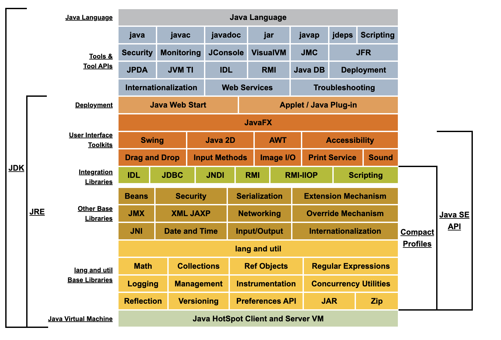
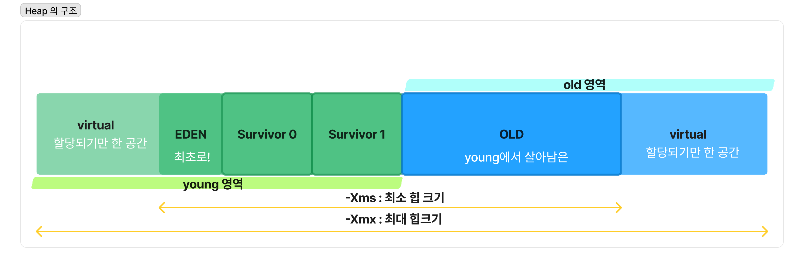
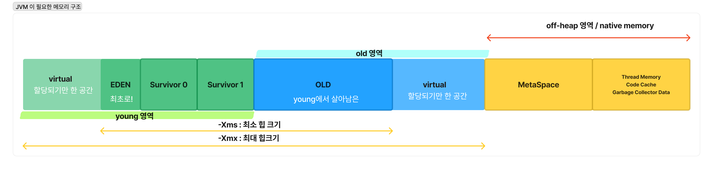

# 서론
최근 성능테스트를 하면서, minor-gc 와 major gc 에 대해서 다시 한번 볼 기회가 있었다. 하다보니 조금씩 모자란 지식을 채워야겠다는 생각이 들어 적어보는 jvm, memory.

> 참고한 기준 문서는 java SE 8 로 한다. 벌써 10년 전이지만 여전히 유효하므로 🥲


# JVM, JRE, JDK 

<스프링 입문을 위한 자바 객체 지향의 원리와 이해>[^1] 에서는 JVM 과 JRE, JDK 를 다음처럼 설명하고 있다. 



> 자바 개발 도구인 JDK 를 이용해 개발된 프로그램은, JRE 에 의해 가상의 컴퓨터인 JVM 상에서 구동된다. 

그리고 설명하기를, 편의상 JDK 안에 JRE를, JRE 안에 JVM 을 넣어 배포하고 있다고 설명한다. 
이 지식에 근거해서 아래 oracle에서 설명하는 JDK / JRE / JVM 을 보면, JDK - JRE 에 해당하는 부분이 JDK 의 **특징적인 부분**이라고 말할 수 있을 것이다. 

즉 
- 순수하게 JDK 라고 얘기한다면 = JAVA 언어 / java,javac 등 컴파일러, jar 명령어, .. 디버거... 
- 순수한 JRE = Java Web Start, Beans, Math library 등 라이브러리, 그리고 자바언어로 쓰인 애플리케이션을 구동하는데 필요한 것들
- JVM 은 그냥 JVM 으로 나와있으나, 후술


__jdk structure ref [^2]__

각 요소에 대한 자세한 설명은 [여기](https://docs.oracle.com/javase/8/docs/technotes/guides/desc_jdk_structure.html) 를 참고하면 알 수 있다. 

## JVM [^3]

JVM 은 추상적인 컴퓨팅 머신이다. 위에서 말한 것 처럼 가상의 컴퓨터를 띄워놓았다고 이해하는 것도 상상하는데 도움이 된다. 실제 컴퓨터처럼, 명령어의 집합을 가지고 있으며, JVM 이 띄워진 실제 물리 컴퓨터의 메모리를 조작하는 기능을 수행한다.

JVM 자체는 전혀 Java 언어에 대해서 알지 못하고 있고, 🙄 오직 `.class` 파일 형식만 알고 있다. `.class` 는 JVM 의 명령어(나 바이트 코드) 그리고 보조정보를 포함하고 있다.

그래서, 우리가 `kotlin`, `groovy`, `scala`  등의 언어를 이야기할 때 JVM 기반의 언어라고 하는데, java 언어가 아닌데도 그 언어들이  `.class` 언어로 컴파일이 가능하기때문에 JVM 이 인식할 수 있다. 이 점을 문서에서도 이야기 하기도 하고. 
> 다른 (프로그래밍) 언어를 구축하는 사람들은 JVM 을 자신이 만든 프로그래밍 언어의 전달매체로서 JVM 을 사용할 수 있다. 


위에서 말했듯이, 결국 JDK 가 JVM 을 포함한 상태로 배포되는데, 이 한 구석에 java 언어로 작성된 파일을 "JVM 의 어셈블리어" 형태로 바꿔주는 컴파일러가 있다. 

고럼 JVM 의 어셈블리어는 어떻게 생겼을까? 잠깐 맛만 보자.  다음과 같은 java 코드를 javac 를 이용해서 컴파일했다. 

```java
public class June {
public static void main(String[] args) {

	int june = 613;
	System.out.println("JVM digging");
}
}
```

`javap`  명령어를 통해 컴파일된 `.class` 파일을 다시 "JVM 어셈블리 "형태로 볼 수 있다.
```bash 
javap -v June.class
```

```bash 
# 중략
 0: sipush        613
 3: istore_1
 4: getstatic     #2                  // Field java/lang/System.out:Ljava/io/PrintStream;
 7: ldc           #3                  // String JVM digging
 9: invokevirtual #4                  // Method java/io/PrintStream.println:(Ljava/lang/String;)V
12: return
```

"JVM 어셈블리어" 를 보니까 JVM 이 실제로 컴퓨팅 머신이라는게 더욱 마음에 와닿는 기분이다. 

계속해서 참고하고 있는 [oracle의 jvm 문서](https://docs.oracle.com/javase/specs/jvms/se8/html/jvms-1.html#jvms-1.1) 에서는 jvm 을 만들기 위한 스펙을 명시해두었다. 이를 구현한 구현체로 HotSpot이나 JRockit 이 있는데, 위 oracle jdk 에서 보듯이 jdk 에서는 HotSpot 이 기본 구현체다. 
둘은 장단점이 있고 합쳐지고 있다고 하는데[^5], 아래에서는 HotSpot JVM 의 메모리 구조를 기반으로 해서 설명하도록한다. 


# JVM 의 메모리 관리 방식[^4] 
> HotSpot 기준. 

JVM 은 실제 물리 머신에서 특정한 메모리 크기를 할당받는다. 그리고 그 내부에서 자신 나름대로의 메모리 관리 전략을 사용하면서 조정을 하게되는 것이다. 

그런데 JVM 이 사용하는 메모리 부분 중에서도 JVM  이 관리감독하면서 **메모리 관리 전략이 적용가능한 부분**이 있고, **아닌 부분**이 있다. 그게 Heap Memory, 그리고 Non-Heap 이라고 불리는 Heap 의 여집합 Memory다. 
Non-Heap은 Off-Heap 혹은 Native memory 라고도 불리는데, native memory 라는 용어가 굉장히 나를 혼란스럽게 한 것 중 하나다. 🙄 기본적으로 native memory는 JVM 이 물리적 머신에서 차지하고 사용하는 메모리이지만, 직접적으로 JVM 이 **관리할 수 없다!** 는 점에서 이름이 붙었다고 생각하기로 한다. (즉 물리 머신의 OS 가 자동으로 크기를 조절한다.)


먼저 가장 유명하고 우리가 young, old, (permanent) 로  알고 있는 **Heap space** 를 살펴보자. 


JVM heap은 근본적으로.. 객체(Objects) 들이 저장된다. (그리고 배열도.) JVM 이 기동하면, 우리가 -Xms (최소 힙 크기) 로 설정한 크기에서 시작되어 -XmX (최대 힙 크기) 까지 커진다. 지금 내 intelliJ의 JVM options를 열어봤더니 이렇게 설정되어있다.
```bash 
-Xmx7200m // 최대 7200MB 까지 heap이 늘어날 수 있군요
```

이 힙 공간에 객체를 쌓아가다가, 어떤 객체가 도달 불가능한 상태가 될 때가 있다. 그런 객체는 말 그대로 쓰레기(...) 로 간주되어 메모리에서 제거할 대상으로 마킹이 된다. JVM 은 다른 프로그래밍 언어의 기반과는 다르게 JVM 이 직접 (프로그래머가 하지 않도록) 이런 쓰레기 메모리를 정리해주는데, 이게 바로 garbage collector 이다.

그냥 힙에 대한 아무런 가정없이 내가 가비지 콜렉팅을 한다고 해보자. 가장 간단한 카비지 컬렉션은 모든 객체에 대해서 매번 아직 도달 가능한 (레퍼런스가 있는) 상태인지 체크를 하는 것일 것이다. 이는 객체 수에 따라서 시간이 계속 늘어나는 O(N) 한 방법이므로 대규모 애플리케이션에는 적합하지 않다. 

그래서 JVM 은 다양한 가비지 콜렉션 방식을 합쳐서 generational collection 이라는, 세대라는 개념을 도입하는 가비지콜렉팅 방식을 사용했다.이는  '대부분의 객체는 짧은 기간만 생존한다' 는 가정에서 출발했다.

새로운 객체가 생성될 때마다, JVM 은 위와 같은 구조의 영역에 객체를 할당한다. 최초로 생성된 객체가 들어가는 곳은 EDEN 이다. (성경의 에덴동산처럼) virtual 은 *예약되기만* 하고 실제로 물리 메모리에는 할당되지 않은 크기를 의미한다. 

young 영역(generation)은 eden 과 두개의 survivor 로 이루어져있다. 하나의 survivor 는 항상 비어있고, 
하나는 채워진다. 그러다가 비어있는 survior를 제외하고 young이 다 차면, JVM 이 멈추고(suspend) stop-the-world 상태로 들어간다. eden과 채워진 survivor 를 검토해 살아있는 녀석만 비어있던 survivor에 옮긴다.
이를 minor GC 라고 한다. 

minor GC 를 할 때 오래 살아남은 young 녀석들은 승진해 old 영역으로 이동하는 작업도 같이 일어난다. 이렇게 minor GC 가 반복되면 old 영역도 가득차게 된다. 그러면 이 old 영역도 정리해주는 작업이 필요하고 - 이를 major GC 라고한다. major GC  는 보통 minor GC 보다 훨씬 오래걸린다. (관련 오브젝트가 많아져서..!)


# JVM 이 관리하지 않지만 JVM 이 사용하는 너 : non-heap(native memory)[^6]

객체만 저장한다고 JVM 이 동작할 수 있는건 아니다. 앞서 말했던 non-heap memory도 반드시 필요하다. 
non-heap memory는 다음과 같이 구성되어있다. 앞선 힙 메모리에다가 nonheap 영역을 붙여보자.


- Metaspace
- Thread Memory(Stack Memory)
- Code Cache
- Garbage Collector Data

## MetaSpace

사실 자바 8 이전 버전까지는, `PermGen` (Permanent Generation, 영구 세대(영역)) 이라는 이름으로 힙 영역에 살포시 자리잡고 있었다. 주요한 목적은 **클래스의 메타데이터**를 저장하는 것이지만, 크게 두개로 나뉜다.

- Class Space
- Non-Class Space

### Class Space
 이름에서 보는 것처럼 클래스 관련 메타데이터를 저장하는 곳. MetaSpace의 목적성이 드러나는 곳이다.  외에도 virtual method 의 메타데이터를 저장하고, 인터페이스의 메소드의 메타데이터, 그리고 GC 에서 사용할 메모리 레퍼런스가 어떻게 되는지 저장하는 곳도 있다. (OopMap)

### Non-Class Space
상수 풀, virtual method(오버라이드 가능한) 메소드가 아닌, 클래스 메타데이터, 메소드 카운터, 어노테이션 메타데이터 등을 포함한다. 

## Thread Memory 
JVM 컨텍스트에서 각 스레드는 각자의 스택을 가진다. 그게 thread 별 메모리로 표현되는 것이고! Stack memory로도 불리는 만큼 LIFO 구조다. 스택에는 스레드가 호출했지만 아직 실행이 안 끝난 메소드와 그 메소드의 로컬 변수 등이 포함되어있다. 

## Code Cache
JVM 기반 어플리케이션은.. 
- JVM 에서 bytecode로 컴파일됨 
- bytecode를 machine 코드로 JVM interpreter가 바꿔줌
- JIT compiler 가 런타임에 최적화 추가로 더 해줌 

해서 최종적으로 코드가 최적화된다. 이런 코드.. 매번 새로 최적화하기 아까우시죠? 그래서 Code Cache 가 있다. JVM 은 Code Cache를 사용해서 컴파일된 바이트 코드를 저장해둔다. 

## Garbage Collector Data
가비지 콜렉터 그 자체도 데이터를 보관할 필요가 있다. Heap 을 정리하는 일인 만큼,... 그 정보자체는 Heap 바깥에 있어야지 정리하면서 GC 스스로를 정리하는 일이 안일어나겠지. GC 는 다양한 알고리즘을 취하고 있는데, 그 알고리즘도 다양한 데이터구조와 병렬처리를 위한 스레드를 사용한다. 그래서 Non-heap, native memory 영역에 이 데이터가 자리하고 있다. 


# 마무리 
사실 GC 알고리즘 까지 정리하려고 시작했는데, 생각보다 jvm memory에 대한 내용이 깊고 혼란스러웠다. native memory 라는 말이 특히나 나에게는 혼돈이었는데, 잘 정리할 수 있었다. 여러 꼭지가 남아 있는데, 
- 그래서 GC 알고리즘 뭐쓰나요? 
- 왜 java 8의 PermGen이 MetaSpace로 갔나요? 

이 부분에 대해서는 다음에 정리하기로! 


## 참고 

https://docs.oracle.com/javase/8/docs/technotes/guides/vm/gctuning/generations.html


[^1]:  <스프링 입문을 위한 자바 객체 지향의 원리와 이해>, p.37 
[^2]: https://docs.oracle.com/javase/8/docs/ 
[^3]: https://docs.oracle.com/javase/specs/jvms/se8/html/jvms-1.html#jvms-1.1
[^4]: https://www.oracle.com/webfolder/technetwork/tutorials/mooc/JVM_Troubleshooting/week1/lesson1.pdf
[^5]: https://openjdk.java.net/jeps/122
[^6]: https://betterprogramming.pub/understanding-the-jvm-memory-model-heap-vs-non-heap-c14aa6fa703e