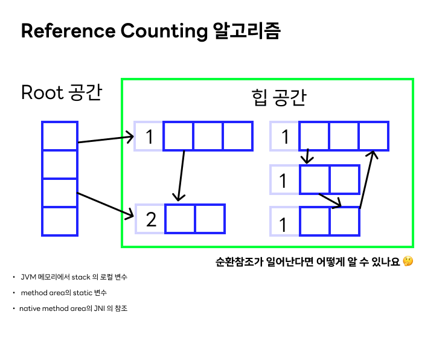
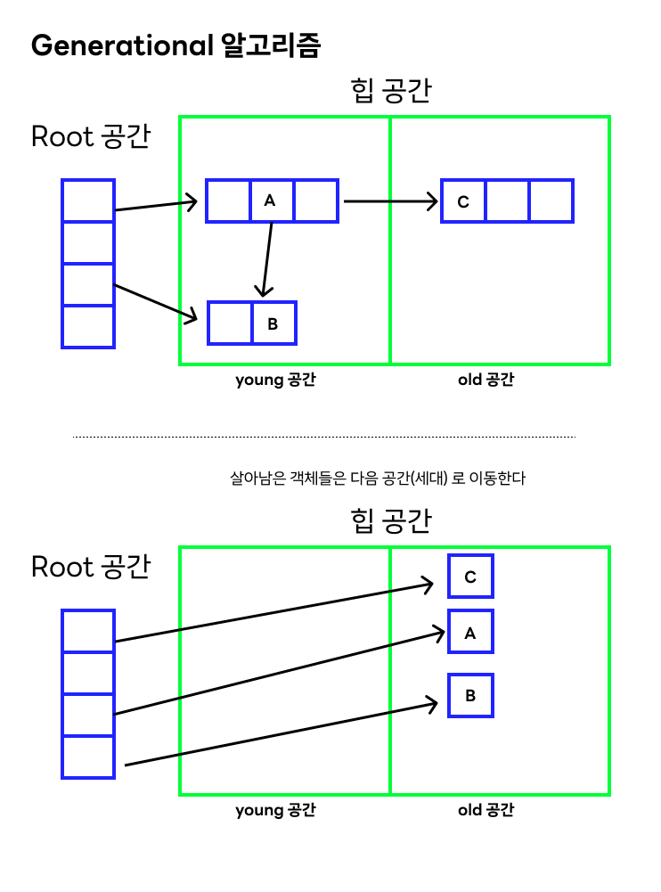
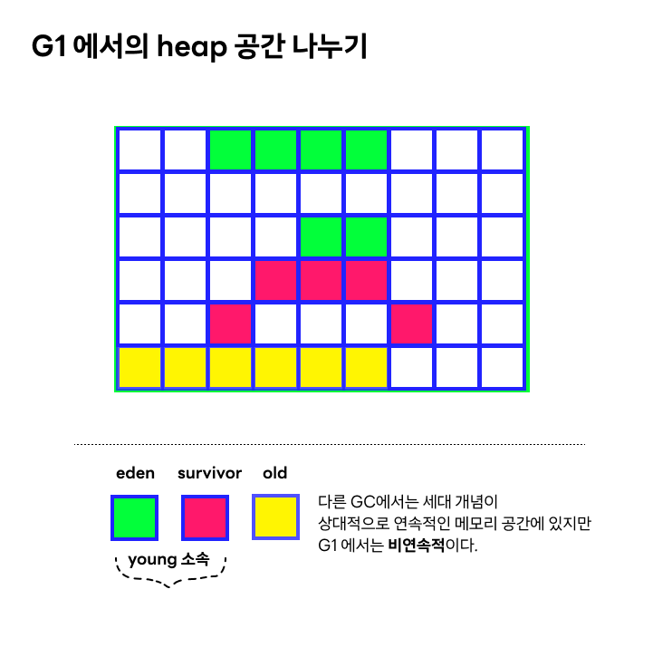
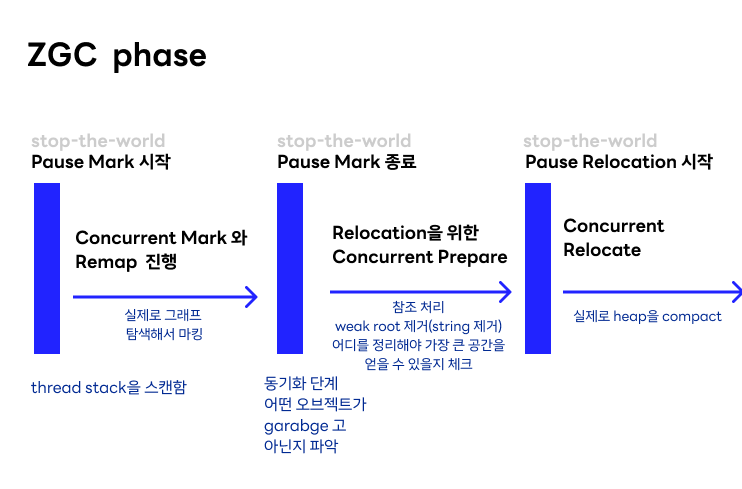

## 서론
[jvm 과 그 메모리](https://junery.dev/jvm-basics) 에 이은 JVM 의 GC 종류 정리다. 사실 이미 스프링 어플리케이션을 띄울 때의 스크립트를 주의해서 보면 GC 의 종류를 명시해준 걸 때때로 발견할 수 있는데, GC 의 종류를 알고 보면 괜히 반갑고 신기하게된다. 오늘은 일반적인 JVM GC 종류를 정리하되,   java 11 에서 등장했다는 비교적 최신 GC ( **ZGC**) 까지 알아본다.

## GC 를 왜 할까요? 
Garbage Collection 은 왜 할까? Garbage Collection은 기본적으로 메모리 상에 더이상 참조하지 않는 객체가 남아서 자리 차지하는 일을 막는 일이다. C 와 같은 언어에서는 명시적으로 (`free`!) 할당했던 자리를 지워주지만, 자바에서는 Garbage Collect**or** 라는 존재를 따로 둬서 자동 청소를 하도록 한 것! 🧹

이런 자동 청소 시스템을 도입할 때는 다양한 시각이 있었다. 자고로 자동 청소는 비효율적이며, 프로그래머가 직접 해제하는게 적확해서 효율적이지! 🥸 라는 시각도 있었고. 이 시각은 일부 맞는 말이기도 하며, 그래서 실시간성이 중요한 애플리케이션에서는 Garbage Collector 를 사용하는 것보다 직접 메모리를 제어하는 방식의 프로그래밍 언어를 선호하기도 한다. 

그럼에도 Garbage Collector 를 써야하는 이유?  자동으로 할당을 해제해주는 GC 는 프로그래머가 메모리 관리에 신경쓰지 않고, 가독성을 높이며, 개발 시간과 비용을 줄어들게 해주기 때문이다. (골치 아픈 메모리 관리는 GC 가 해결했으니 안심하라구!🦝) 더불어 명시적으로 메모리 관리를 하는 건 .. 휴먼 에러를 통해 에러가 발생할 수 있는 확률이 높다. - 메모리 누수 확률 증가 -

이후의 GC 라는 단어는 collector (주체)와 collect(행위) 를 문맥에 따라 지칭할 확률이 높다. 

## GC 알고리즘 

GC 는 다양한 언어에서 사용하고 있고, GC 자체를 개발하기 위한 알고리즘도 다양하게 제안되어왔다. JVM 진영에서는 여기서 효율적이라고 생각한 알고리즘을 채택해서 GC 를 만들었고, 더 나은 방법이 있다면 새로운 GC 를 만들어서 스을쩍 다음 JDK 발표에 넣는 등의 일을 하고 있다. 

GC 를 내가 만든다고 생각해보자. 기본적인 스펙은 '참조가 하나도 없는' 객체를 알아내고 그걸 지우는 것이니까, 가장 먼저 '참조의 갯수를' 세보자는 결론에 다다를 것이다. 
그런 마음에서 등장한게 `Reference Counting` 알고리즘이다.
### Reference Counting 알고리즘

- 쉽고, 구현하기도 좋다 
- GC 가 프로그램 사이에 "끼워넣어"(interleave) 지므로, 결과적으로 프로그램과 동시에 수행된다. 한정된 부분에 대해서만 실행이 되니까 정지시간이 매우 짧다. 그러니 응답시간이 아주 중요한 어플리케이션에서는 유용!
- 매번 객체가 참조되거나 / 참조 해제될때마다 수행된다.

- 위 그림과 같이 순환참조가 일어나면 알아볼 수 없다는 크리티컬한 단점이 있다.
- counter 를 저장하기위한 추가적인 저장공간이 필요하다. 

### Mark-and-Sweep
이와 같이, 참조를 세는 알고리즘은 단점도 있기때문에 Mark-and-Sweep 이라는 알고리즘이 등장했다.
번역하면 `체크하고-그다음-쓸어버림` 정도 되니, 체크하는 과정과 메모리 해제 과정이 분리되어있다는 느낌이 물씬 난다. Reference counting 과 달리, 특정 주기마다 실행된다. 

알고리즘
- 첫 단계 : 루트에서 시작해서, 메모리 그래프를 쭉 순환하면서 따라간다. 도착할 수 있었던 객체는 모두 마킹한다. 
- 두번째 단계: 메모리를 쓸어버려(!) 서 마킹이 없는 공간은 다 지워버린다. 

**장점**
- 모든 메모리 연산에 붙지 않고 주기적으로 실행된다. (위의 Reference Counting과의 비교)

**단점**
- 메모리의 모든 영역을 꼼꼼히 평가해야하므로 시간이 많이 든다. 
- 메모리를 쓸어버린 공간은 비워지므로, 메모리 사이에 갭이 생긴다. (조각조각~)

### Mark-Compact
바로 위에서 말한 Mark-and-Sweep 알고리즘의 단점을 바로 개선한 것. Compact 라는 단계를 둬서 공간 줄이기를 시도한 것이다. 

**알고리즘**
- Mark-Sweep 처럼 마크 단계를 거친다.
- 죽은 객체를 쓸어버리는 대신, 살아있는 객체가 메모리 영역 첫번째로 밀린다. 나머지 메모리는 다 지워버린다. 

**장점**
- Mark-Sweep 에서 경험했던 메모리 파편화가 없어진다. 
- GC 전에 메모리 주소가 높으면 , GC 이후에도 높다. (약간... 안정정렬처럼) - 배열과 같은 자료구조를 다룰때는 이게 아주 중요한 특성임 

**단점**
- 시간.. 시간! Mark-Sweep보다도 오랜 시간이 걸린다. 당연히 성능도 안좋다. 

### Generational GC
GC 의 변화는 Mark-Sweep 사이에도 많았다.  `copying` 이나 `incremental` gc 라는 알고리즘도 있었지만, 일단 핵심적인 부분인 Generational GC  를 설명한다. 

간단한 GC 알고리즘의 한계는 시스템이 힙에 있는 데이터를 측정해야한다는 점이었다. 당연히 실행시간은 늘어나는 것이었고. [jvm 과 그 메모리](https://junery.dev/jvm-basics) 에서도 언급했지만 특정 연구가 대부분의 오브젝트는 매우 짧은 시간동안만 생존한다는 가설을 세웠다. (weak generational hypothesis) 여기서 주목해야할 점은, 우리가 young 오브젝트에 집중하고 old 오브젝트를 잘 안건드린다면, 분석해야하는 양이 상당히 줄어든다는 점이다.

이러한 접근, 즉 old 오브젝트를 분석하지 않게 하는 방법은 `Generational GC` 라고 불린다. 어디서 많이 들어본 것 같다 - JVM heap 자체가 generation 별로 되어있으니까 좀 익숙하다 싶다.

**알고리즘**
- 세대 라고 불리는 두개 이상의 공간으로 힙을 나눈다. 
- 처음 할당되는 오브젝트들은 무조건 제일 어린 세대에 할당된다. 
- gc 알고리즘은 항상 제일 어린 세대를 제일 자주 스캔하고, ... 더 오래된 세대는 적게 스캔한다. 

**어려운 점**

- 이 알고리즘이 작동하기 위해서는, 오래된 세대를 수집하지 않고도 어린 세대를 수집할 수 있어야한다. 
	- 여기서 문제가 발생하는데 🤔 만약에 오래된 세대에서 어린 세대쪽에 포인터가 있다면, 어린 세대쪽은 당연히 살아있는 객체다. 
	- 그러므로 세대 간에 포인터/참조가 있는지 항상 체크해야하는 문제가 발생한다. 
	- 이런 포인터가 발생할 상황은 아래 두 케이스일 텐데..
		- 포인터를 들고 있는 객체만 오래된 세대로 진급해버린다! (promoted to old generation)
		- 포인터가 바로 메모리에 저장되어버린다!
	- 첫번째 상황에서는 세대 간 포인터를 저장하기 쉽지만, 두번째는 어렵다. 

그래도 전반적으로, generational collection이 대부분 프로그램에서 gc의 성능이 향상되는건 분명하다. 

## JVM 이 채택하고 있는 GC 

JVM 9에서는 아래와 같이 소개하고, JVM 11 에서 ZGC 가 소개됐다.
나의 관심사는 G1과 ZGC 이기때문에, 이를 중점적으로 살펴보고 나머지는 간단하게 넘어가겠다.

- Serial 
  - Garbage Collect를 싱글 스레드로 진행하는 GC. 스레드 간 오버헤드가 없기때문에 이점이 있다. 하나의 프로세서만을 사용하는 머신에서 사용하는 것이 좋으며 (멀티 프로세서의 이점을 취할 수 없어서), jvm 옵션으로는 `-XX:+UseSerialGC` 을 사용하면 써볼 수 있다.
- Parallel 
	- Serial 처럼 Generational Collector이지만, 이름에서 알 수 있는 것처럼 멀티 스레드를 사용해서 처리량을 높인다는 점이 다르다. `-XX:+UseParallelGC` 로 사용해볼 수 있다.
- Concurrent-Mark-and-Sweep
	- JDK 9 부터는 더이상 사용되지않는 종류.  `-XX:+UseConcMarkSweepGC` 로 사용해볼 수 있으며, GC 의 정지현상 (stop-the-world) 를 줄이는 대신 서버의 자원을 더 가져가는 종류다.
- G1 (Garbage First) GC
	- 메모리가 크고 멀티프로세서인 서버들을 위한 종류. 정지현상의 시간을 줄이면서도 처리량을 늘린다는, 말도 안되어보이는 목표를 달성했다.. 고 한다. `-XX:+UseG1GC` 로 사용해 볼 수 있다.

- ZGC 
	- Z GC 는 확장가능한 저지연 gc다. ZGC 는 애플리케이션 스레드의 동작을 막지 않으면서도, 비싼 작업을 동시에 처리한다. ZGC 는 10ms 미만의 지연이 필요하고, heap 이 큰 (수 테라바이트) 애플리케이션을 위해 만들어졌다.   `-XX:+UseZGC` 옵션으로 사용할 수 있다.

### G1 GC 
G1은 Garbage First 를 줄여서 G1이다. 그를 설명하는 첫 문장부터 인상적이다. 

>  a generational, incremental, parallel, mostly concurrent, stop-the-world, and evacuating garbage collector which monitors pause-time goals in each of the stop-the-world pauses.

즉  위에서 살펴본 generational 의 개념, (안살펴본) incremental gc 알고리즘을 차용했을 뿐 아니라 동시성을 보장하고 stop-the-world 의 개념이 있는 GC  다. 

- 다른 GC 처럼, 세대별로 힙을 나눠서 사용하고, 메모리의 공간 창출하는 전략이 young 세대에 집중되어있다. 
- 메모리 공간 창출 과정이 나눠져있고 (in steps) 병렬적으로 실행된다. (in parallel)
- jdk 9부터는 기본 GC가 됐다. https://openjdk.org/jeps/248
- 실시간 collector가 아니어서, stop-the-world 과정을 최대한 줄이려고 노력하긴하지만 발생한다.

G1 GC 는 힙을 나누는 개념이 조금 특이하다. 여전히 세대 개념은 사용하지만 균일한 크기의 heap 조각으로 나눠져있다.

**G1 의 두 가지 phase**
G1은 기본적으로 두 phase를 반복한다. 

- young-only 
- space-reclamation (메모리 공간 창출)

young-only 단계에서는 old 세대로 넘어갈만한 놈들을 고르고 진급시키는 일반적인과정으로 시작된다. 만약 old 세대의 공간이 특정 조건을 넘기면, 일반적인 과정이 아니라 `Concurrent Start young collection` 이라는 이름의 과정이 시작된다. 
 - concurrent start: 이 과정은 일반과정과 비슷하긴한데,  아직 살아있는 객체들에 대한 마킹이 시작된다. 마킹은 remark 와 cleanup 이라는 두개의 stop-the-world 정지로 끝난다. 
 - remark: 이 과정은 마킹을 종료하고, 전체 힙에 대해서 참조를 처리하고 클래스 언로딩을 수행하고, 완전히 빈 공간을 창출하고 내부 데이터 구조를 치운다. remark 와 cleanup 사이에 g1은 old 에서 메모리 공간을 좀더 가져올 수 있을지 정보를 계산한다. 
 - cleanup: 이 과정은 메모리 공간 창출 (space-reclamation) 과정을 할지 말지 결정한다. 하기로 결정 됐을 경우, young-only 단계는 종료된다. 

메모리 공간 창출(space-reclamation) 단계 : 이 단계는 young 영역 뿐 아니라 old 영역의 gc도 포함한다. 메모리 공간 창출은 G1이 판단하기에 old 영역에서 gc하는게 노력에 비해 충분한 공간이 안나온다고 생각하면 종료된다. (ㅋㅋ)

### ZGC 
이름이 하도 이상해서 Z가 무슨 뜻인지 찾아봤고 openjdk 의 wiki의 FAQ 에서 답이 쉽게 나왔다. 

> It doesn't stand for anything, ZGC is just a name. It was originally inspired by, or a homage to, ZFS (the filesystem) which in many ways was revolutionary when it first came out.

아무 이름도 아니고, 나올때부터 완전 혁명적이었던 ZFS 에서 영감을 받았다고 한다. 
JDK 11에서 실험적인 피처로 들어왔고, JDK15에서는 상용 가능한 상태로 나왔다. 

G1 GC 처럼, 여기에도 특성이 있는데 
-   Concurrent (동시성이 있고)
	- 자바 스레드가 돌아가는 동안 동시에 GC 를 진행하고
- Tracing
	- 오브젝트 그래프를 추적하는 형태를 띄고

-   Compacting 
	- 메모리 파편화를 막기 위한 메모리 컴팩션 과정이 있다
- Single Generation
	- 현재로서는 Single Generation (!!)이라고 한다.
-   Region-based 
	- G1 처럼 heap을 작게 나누는 region 형태의 heap 구조를 가진다.
-   NUMA-aware
	- 프로세스에게 로컬 메모리 액세스가 로컬이 아닌 메모리 액세스보다 빠르다.
-   Using colored pointers
-   Using load barriers
	- 동시성을 달성하기 위한 두가지 도구임.

ZGC 의 정지시간은 O(1) 로, 상수시간이므로 heap size, thread 의 수 모두 상관없다고 한다. 

ZGC 발표 영상에 따르면, 다음과 같은 phase를 지나면서 GC 가 진행된다고 한다. 

- pause mark 
	- thread stack을 스캔함. 
	- 실제로 그래프를 탐색해서 마킹하기 시작함 
	- marking은 실제로 gc 들 사이에서 매우 비싼 연산이고, CMS 나 G1 정도가 old gen 에 대해서 동시 marking 을 진행하는데,  ZGC 는 전체에 대해서 concurrent mark 를 한다. 
- pause mark 종료 
	- 동기화 단계, 어떤 오브젝트가 garbage고 아닌지 파악 완료
	- 참조들을 처리하고, string과 같은 weak root를 제거한다. 
	- 그리고 어디를 정리해야 가장 큰 메모리 공간을 얻을 수 있는지 체크한다. 
	- 역시 이부분 도 concurrent 하게 진행된다. 
- pause relocation 
	- 실제로 heap 을 정리하고 compact 과정을 거친다. 

이렇게 하면 ZGC 가 대략 동시성을 더 띄고 특별한 기능들을 (colored pointer / load barriers) 적용하여 성능 향상을 이뤄냈다.. 정도로 이해할 수 있다. 

## 마치며 

조금씩 알아뒀지만 한번에 GC  를 이해하느라 조금 벅찼다. 다음에는 ZGC 의 구체적인 내부에 대해서도 뜯어보도록 하자. 

## 참조 
- https://rebelsky.cs.grinnell.edu/Courses/CS302/99S/Presentations/GC/

- https://docs.oracle.com/javase/9/gctuning/available-collectors.htm#JSGCT-GUID-45794DA6-AB96-4856-A96D-FDE5F7DEE498

- https://docs.oracle.com/en/java/javase/11/gctuning/garbage-first-g1-garbage-collector1.html#GUID-CE6F94B6-71AF-45D5-829E-DEADD9BA929D

- https://www.youtube.com/watch?v=OcfvBoyTvA8

- https://www.youtube.com/watch?v=kF_r3GE3zOo