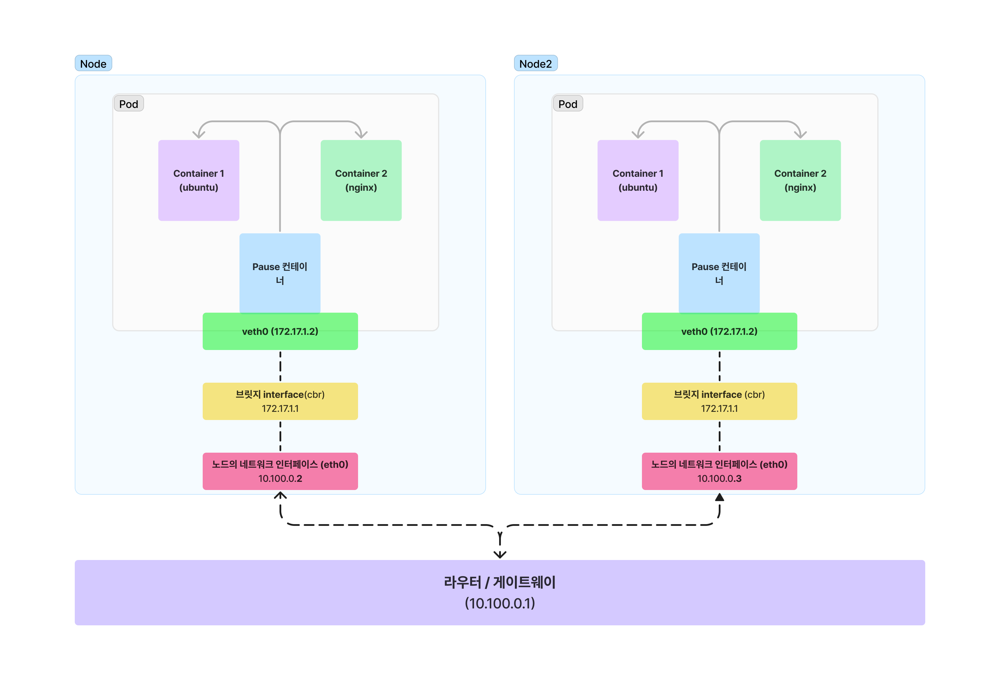

k8s 의 단순 사용자로서, 내가 했던 건 배포 시스템에 정의한 메니페스트를 통해 애플리케이션을 배포하고, 잘 뜬 pod을 확인하고, 서비스의 IP 를 그대로 가져다가 내가 원하는 형태로 사용하는 것 뿐이었다. 그런줄만 알았다. 🥹

최근에 '프로덕션 쿠버네티스'  스터디를 시작하고 내용을 열어보니. . . 갑작스러운 내용에 마주하게 되었다. `pod network` ..?  알고보니 이 책은 백엔드 개발자가 아니라 쿠버네티스 클러스터를 회사에 도입하고 운영하는 본격적인 인프라 운영자 - CKA(Certificated Kubenetest Administrator) 를 돕기 위해서 쓰여진 책이었다. 난 기초도 없는데! 

그러나 뭐 어쩌겠어. 일단 최선을 다해서 내가 알 수 있는 형태로 풀어내보기로 한다. 

## 서론 

우리의 관심이 PM/VM 같은 머신에서 pod 로 옮겨졌지만, 결국 최종적으로 요청이 pod 으로 들어가고 돌아오게 해야하는 과정이 필요하다. 그걸 위해 가장 필요한 건 . . 역시 네트워크다. 특히 addressability (주소를 붙일 수 있는 것) 과 routeability (라우팅할 수 있는 것) 이 핵심일 것이다. 이 과정에는 여러 설명이 필요하지만, 그 중 기본이 되는 pod network를 알아보면서, 아래 세 가지 질문에 답을 해본다. 

- pod 내에서 컨테이너들은 어떻게 소통하나요? 
- 하나의 노드 내부의 pod 은 어떻게 소통하나요? 
- 서로 다른 노드의 pod 끼리는 어떻게 소통하나요? 


### 컨테이너 IN POD 은 어떻게 소통하나요? 

여기서 부터 시작해보자. Pod 안의 컨테이너는 어떻게 소통할까? 이 내용을 알아보기 위해 `multi-container` 라는 이름의 pod 을 만들고, 우분투와 nginx 로 된 컨테이너를 각각 띄워보았다. 

```bash 
kubectl get pods -o wide
```


그리고 우분투 containter에 먼저 들어가서, 인터페이스 설정을 확인한다. 
```bash 
kubectl exec -it mutli-container -c ubuntu -- bash
ifconfig # if 관련 값이 미리 깔려있어야함.
```


여기서 eth0 이 내부적으로 `10.1.0.7` 이 할당 된 것을 알 수 있다. (pod의 IP 와 같다.) 그 이후에 nginx 컨테이너에도 동일하게 접속하면 .. 


역시 `eth0` 이 내부적으로 `10.1.0.7` 으로 할당된 것을 알 수 있다. 

즉, ubuntu 컨테이너 - nginx 컨테이너 - pod 의 ip 로 표기되는 값은 동일하다. 

pod 을 생성할 때는, 컨테이너 간 일부 namespace는 공유되고 일부 namespace 는 격리되는데, network namespace는 공유가 되고 있다. 해서 컨테이너 간 eth0 (실제로는 가상의 eth0로, vetho0로 로 많이 표시한다) 의 주소가 같은 것을 관찰할 수 있는 것이다. 

이는 pod 을 생성할 때 무조건 내부에 `pause` 라고하는 가상의 컨테이너가 미리 만들어져 네트워크 설정을 공통화해주기 때문이다. `pause` 컨테이너는 pod 에 무조건 하나씩 생성되며, k8s 세상에서 가장 많이 생성되는 컨테이너다! 

일반적으로 get pods 할 때의 컨테이너 갯수에는 카운트되지 않으며, 직접 해당 노드에 가서 컨테이너 인터페이스로 어떤 컨테이너가 떠있는지 확인하는 경우 볼 수 있다고 한다. 


pod 이 생성될 때 pause 컨테이너에 네트워크 인터페이스(eth0)를 할당하며, k8s는 해당 인터페이스를 다른 컨테이너들도 모두 사용할 수 있도록 조정해준다. 

해서 결국 컨테이너들끼리는 localhost 로 통신 가능하고 대신 각각 다른 port 를 사용하며, 같은 hostname(UTS namespace를 공유하므로!) 와 같은 네트워크 인터페이스로 통신이 가능하다. 

그럼 Pod 간 통신이 궁금한데, 그 전에 Pod 의 IP 할당을 확인해보자. 

### IP 주소 관리하기 (IP Address Management, IPAM)

pod 간 통신의 기본이 뭘까? 바로 **pod 가 고유한 주소를 가질 수 있게 하는 것**이다. 쿠버네티스에서는 각 pod 가  IP 를 부여받는다. 이 IP 들은 cluster 내부에서만 존재하거나, 외부에서 접근하게 만들 수도 있다. 

다만, pod 은 본질적으로 **일시적**인 성향이 있다. pod 은 클러스터나 시스템의 상황에 따라 자주 재시작되고 조정되니까, pod 에 IP 를 할당하는 일은 빠르게 동작할 필요가 있다. 이런 IP 관리 자체를 IPAM (IP Address Management) 라고 부른다. (k8s에 한정된 단어는 아님 - 방식도 여러 개 있음) 

k8s에서 IPAM 은 CNI (Container Network Interface) 플러그인을 뭘 쓰느냐에 달라진다. k8s 는 많은 부분을 인터페이스 화해서 커스텀할 수 있게 규약을 만들어 두었는데, 네트워크 인터페이스도 있는 것 ! 🌐

아무튼 이런 CNI 는 공통적으로 몇가지 정도 IPAM 방식을 제공한다. 

그 중 하나가 CIDR다. (Classless Inter-Domain Routing) 
- 참고로 CIDR 는 [nginx  로 점검모드 만들기](https://juneyr.dev/nginx-maintenance) 에서 소개한 바 있다. 간략히 말하면 IP 그룹을 표현하는 방식이다. 

CIDR 로 IP 를 관리하게 되면, 특정 IP 대역대를 모두 할당할 수 있다. k8s 클러스터를 만들어주는 툴 중 하나인 kubeadm 을 사용해서 한다면, 아래처럼 사용할 수 있겠다.  

```bash 
kubeadm init --pod-network-cidr 10.30.0.0/16
```

실제로는 kube-controller-manager 에 `--cluster-cidr` 플래그를 켜주는 동작이다. 그러면 kube-controller-manager 는 모든 노드에 이 CIDR 값을 할당한다. 기본적으로는 노드 당 `/24` 개념의 CIDR 를 할당하고, 클러스터 합쳐서 `/16` 이 되도록 할당하는 게 일반적이다. 

IP 주소를 관리하는 방법을 알게 되었다면, 자연스럽게 두번째 질문(`하나의 노드 내부의 pod 은 어떻게 소통하나요?` )은 풀린다. 

즉, 각 pod 이 같은 subnet 상의 ip 를 할당받고 하나의 노드에서는 그 값을 서로 알고 있기때문에 찾아가는 것이 가능해진다. 


### 다른 노드에 있는 pod 은 어떻게 소통하나요? 

이건 다른 문제다.  



다음과 같이 여러 노드에 있는 pod 을 그려보았다. 서로 다른 노드는 각각 `10.100.0.1` 과 `10.100.0.2` 라는 서로 다른 인터페이스 ip 를 갖는다. 노드가 설정될 때 브릿지 interface가 pod 과 노드 사이에 작동한다. 브릿지 interface는 veth0의  게이트웨이처럼 작동하며, **veth0와** 같은 네트워크로 묶여있다.

여기서 문제가 발생한다. pod 네트워크 안에서의 ip 할당은 또 다른 문제(브릿지를 통해서 다른 네트워크 대역대를 할당함) 라서, 현재 구조에서는 **서로 다른 노드의 다른 pod 은 같은 ip 를 가질 수도 있게 된다** 

해서, 내가 목적지가 될 pod 의 ip 만 안다고 해서 한 pod -> 다른 pod으로 통신을 하는 것은 불가능해보인다. 다른 방법이 필요한 것이다. 

k8s는 CNI 를 어떻게 쓰는지에 따라서 다른 노드에 있는 pod 끼리 소통하는 방법은 다양하게 지원한다. 

대표적으로 overlay 네트워크 방식이 있는데, 위의 예시를 가지고 overlay 네트워크가 문제를 어떻게 해결하는지 알아보자. 

가장 먼저 각 노드의 브릿지 ip (그리고 pod ip) 가 겹치지 않게 대역대를 잘게 나누는 것이 필요하다. (그림 상에서 브릿지 interface로 표기)  10.100.0.1 호스트는 172.17.1.0/24 주소대역만을, 10.100.0.2 호스트에서는 172.17.2.0/24 주소대역만을 사용하도록 하는 경우를 생각해볼 수 있다. 그리고 그에 따라 pod ip 도 겹치지 않게 할당된다. 

그 다음에, 게이트웨이에 매핑 테이블, 즉 라우팅 테이블을 설정해야한다. 어떤 노드를 통해야 브릿지 interface 에 접근할 수 있는지를 알려주는 라우팅 테이블을 정리한다. 

이 두가지를 하고 나면 아래 처럼 된다. 


각각 노드의 브릿지 인터페이스의 ip 대역대가 명확하게 나눠지고, 게이트웨이에는 라우팅 테이블이 추가된 것을 알 수 있다. 이렇게 veth0-브릿지-라우팅 테이블의 저조합을 사용하는 것을 **overlay network** 방식이라고 한다. 실제로 라우팅 테이블을 어떻게 세팅할 지는 사용하는 CNI 에 따라 다른 모양이다. 

그러면 비 overlay network 방식도 있느냐, 있다. 
대표적인 CNI 중 하나인 Calico 에서는 **Direct 방식**도 지원한다. (Direct 방식은 임의로 붙여진 이름이고, Calico 의 overlay network 가 패킷을 캡슐화(encapsulation) 하는 것에 반해 캡슐화가 없어서 붙은 별명이다.) 

Direct 방식은 Pod 통신 패킷이 출발지 라우팅 정보를 보고 목적지 노드로 원본 패킷 그대로 전달하여, 성능적으로 가장 우수하다. 다만 Direct 방식은 src/dst ip 를 체크하는 클라우드 벤더나, 서로 다른 subnet 에 있는 노드에 보낼 때 지원이 안되는 이슈가 있어서 기본적으로 사용되기는 어렵다. 

이런 pod 간 통신 방식은 실제로는 pod 을 묶은 service 라는 proxy 역할 오브젝트를 통해서 하게 되므로, 딥하게 알기보다는 pod 간 통신할 수 있는 방식이 있지만, 이 방법만으로는 내구성 있는 시스템을 만들기 어렵다는 점을 기억해두면 좋겠다.


## 참고 

- 프로덕션 쿠버네티스, 조쉬 로소 외 3인, O'REILY / 에이콘
- https://coffeewhale.com/k8s/network/2019/04/19/k8s-network-01/
- https://tech.osci.kr/%EC%BF%A0%EB%B2%84%EB%84%A4%ED%8B%B0%EC%8A%A4-%EB%84%A4%ED%8A%B8%EC%9B%8C%ED%81%AC-calico/
- https://coffeewhale.com/calico-mode
- https://octetz.com/docs/2020/2020-10-01-calico-routing-modes/ (책 원작자 블로그)
- https://eddie.ee/170
