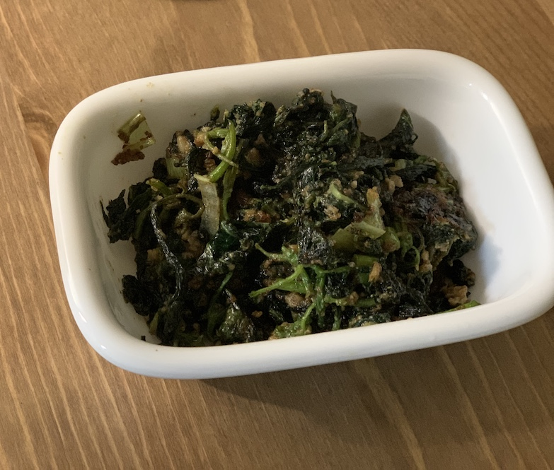
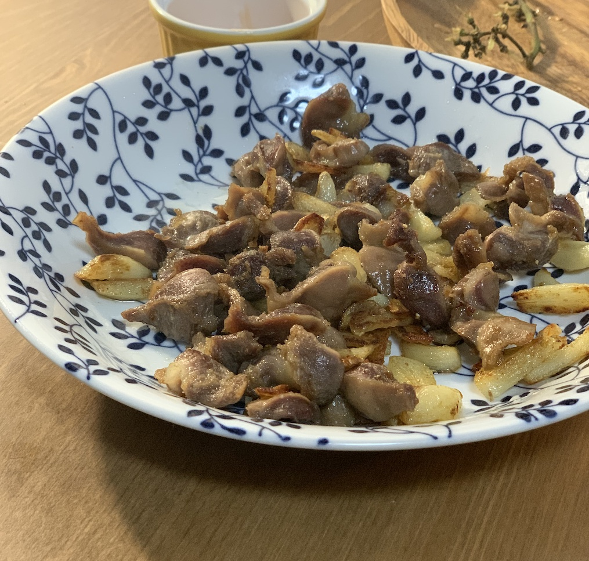
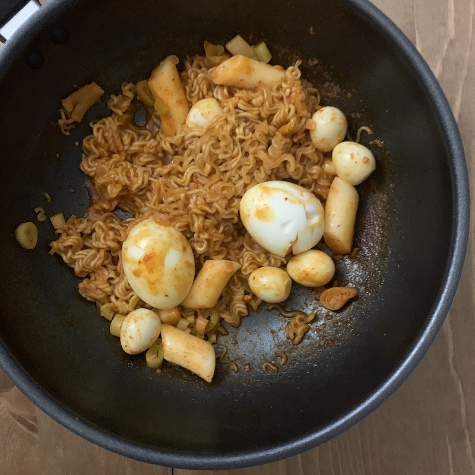
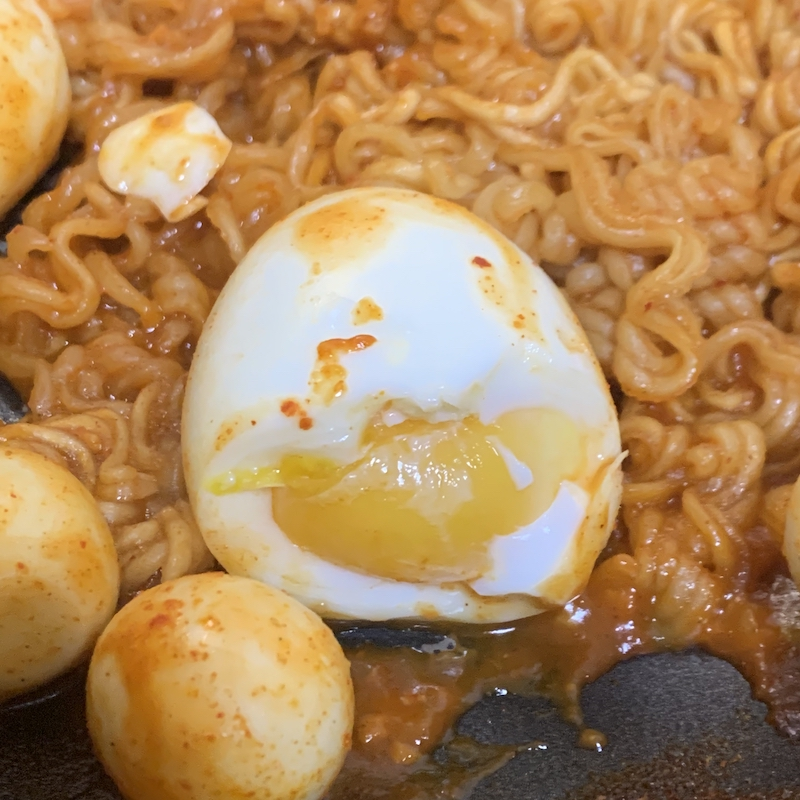

## 들어가며 

스물 후반이 다되도록 요리를 제대로 한 적이 별로 없었다. 먹는 것을 더 좋아했고, 배달의 민족은 언제나 나의 친구였으며, 스트레스 받을 때 떡볶이를 시키는 것 만큼 나를 채워주는 것은 없었다. 

다만 손으로 하는 것, 내가 무언가 만들어낸다는 감각, 그리고 오지에 떨어져도 뭔가 입으로 들어가는 것은 만들어야한다는 생각에 본가에 있을 때 요리를 조금씩 시도해보기는 했다. 썩어가는 식재료들, 쌓여서 꺼내기도 힘든 그릇들, 매번 떨떠름한 표정으로 기미를 하는 부모님를 두고 계속 도전할 정도로 뒷심이 없긴했지만. 

그리고 독립을 했다. 

완전히 나만의 주방이 생겼다. 집들이를 온 친구가 '무슨 집이 식용유가 없는데 올리브유랑 들기름은 있냐' 며 놀라기는 했지만, 나름의 요리를 시작했다. 그 결과 지금은 훌륭한 향신료 콜렉터가 되어가는 중이고, 유튜브에는 요리 영상이 다섯에 하나는 빼꼼 내밀고 있다. 그나마 할 수 있는 요리 레시피들을 적어두도록 한다. 

## 들깨깻잎순나물 

이 글을 쓰게 된 가장 큰 원인이다. 본가의 반찬가게에는 정말 맛있는 들깨깻잎나물을 파는데, 독립을 하고 나서는 그 맛을 찾아볼수가 없었다. 홈플러스 반찬가게는 분발하라. 

> 깻잎순, 다진 마늘, 간장, 소금, 들깨가루, 파 죄끔, 들기름

- 깻잎순을 정리한다. 양이 많더라도 데치고 볶고나면 정말 적다. 딱딱한 줄기 부분을 잘라낸다. 

- 물을 끓인다. 꼭 나는 선 깻잎순 하는 버릇이 있는데, 물이 끓고 나서 깻잎순을 넣고 30초를 기다린다.

- 다진마늘 한 큰술, 간장 한큰술, 맛소금을 좀 넣고 버무린다. 지금 먹어봤자 간을 알 수 없고 마늘 어택만 당할 뿐이다. 

- 10분간 녀석을 잠재운다. 상온에 잠재우면된다. 
  
- 팬에 들기름을 둘둘 두르고 잠자는 깻잎순을 깨워 볶는다. 
  
- 중간 중간 간을 보면서 간장이나 소금으로 간을 더한다. 타지 않을 정도만 볶으면 되는데, 살짝 눌어도 그 맛이 좋다. 
  
- 들깨가루를 듬뿍 한 수저 넣어준다. 이걸 빠뜨리다니. 적절히 깻잎순에서 나온 물과 버무려질때까지 볶는다. 
  
- 완성!

### 닭근위튀김 

닭똥집, 닭모래집, 닭근위로 불리는 그 부위를 내가 직접 손질할 수 있다니 굉장해! 라는 음식이다. 기름 냄새를 받아낼 후드와 배포만 있다면 엄청 간단한 야식.

> 닭근위, 후추, 맛소금 (꼭), 식용유, 마늘(편), 스위트 칠리 (선택)

- 언 닭근위는 해동시켜 준비한다. 따뜻한 물에 한번 빡빡 헹군다.

- 닭근위를 손질한다. 닭근위는 크게 3등분할 수있게 되어있는데, 이것을 그 모양대로 등분하거나 돌려서 길게 잘라도 된다. 이것 역시 많이 양이 줄어들기 때문에 많이 해도된다. 300g 해도 혼자 다 먹을 수 있음. 
  
- 식용유를 팬에 많이 붓고 닭근위를 넣는다. 닭근위가 반쯤, 그 이상 잠기게 넣는다. 
  
 - 기다란 튀김 젓가락을 준비하고 투하한다. 녀석이 흰-붉은 색에서 갈색으로 변해서 '어..집어먹어도되나...?먹을까..?' 하는 시점까지 기다린다.
 
 - 기다리는 동안 마늘을 편으로 썬다. 통마늘 한두개정도도 좋을것같다. 
   
 - 위의 시점에 도달하면 마늘을 투하한다. 마늘이 다 익으면 불을 끈다. 
   
 - 체에 받쳐서 기름을 뺀다. 너무 많이 뺄필요는 없고, 늦게 기름이 내려가면 하수구가 막히니 뜨거운 물로 하수구 조진다. 
   
 - 다시 그 팬에 근위와 마늘을 넣는다. 위에 후추와 맛소금 간을 적당히 한다. 맛소금은 조금만 넣어도 간이 강하더라고. 중불에 뒤적이며 볶아주면서, 간을 본다. 3분 정도만 뒤적여도 충분 
   
 - 잘 담아서 먹는다. 간을 잘했으면 소금후추간으로 충분하지만, 나는 스위트 칠리에 찍어 먹는 것을 선호 
   
### 떡볶이 (단 버전) 

most-favorite-food-in-the-world 인 떡볶이는 외려 굉장히 늦게 만들어본 음식이다. 기성품들이 너무 잘되어있기도 하고 (국민학교 떡볶이, 미미네 등) 사람이 백명있다면 떡볶이 취향은 백가지이기에. 

나는 기본적으로 달달한 떡볶이를 선호한다. 매운걸 잘 못먹고, 도봉동의 참분식이 사먹는 비국물떡볶이 최애다. (정말 맛있고 사장님의 기억력이 놀랍다. 그 가족의 떡볶이 선호도를 다 외우고 다니심.) 그래서 몇년전 부터 시작된 엽떡과 신전떡볶이 플로우가 너무 싫었다. 배 긁는 매운맛과 후추맛은 그만... 

막례님 떡볶이와 유튜브발 응급실떡볶이를 시도해보았으나 1)은 그냥 집볶이 맛, 2)는 그냥 카레맛으로 그쳤다. 나는 나의 소울음식을 직접만들수없다는 좌절에 빠져갈 무렵 친구가 추천해준 초간단 단 덕복 레시피.

> 식혜(필), 고추장(필), 고춧가루(필), 떡볶이 떡 , 라면사리, 계란, 파 등은 선택. 말해뭐해 원하는 토핑 넣어먹자. 

1. 떡을 불린다. 라면사리를 뜯어놓는다. 계란을 꼬꼬찜기에 넣어 7분 전자레인지에 돌려준다. 메추리알을 꺼낸다.

2. 식혜를 웍이나 큰 팬에 붓는다. 
   
3. 불을 켜지않고 고추장 한술을 퍼서 풀어준다. 
   
4. 불을 켜고 식혜추장물이 끓을 때쯤, 고춧가루 1/3술과 불린 떡 / 생 라면 사리등을 투하한다. 
   
5. 야채를 넣지않으면 물이 안나와서 금방 물이 쫄아버린다. 물 한컵과 조금의 고추장, 조금의 설탕을 넣는다.

6. 떡이 익고 라면이 익고 간이 배었을 때 불을 끄고 맛나게 먹는다. 념!
