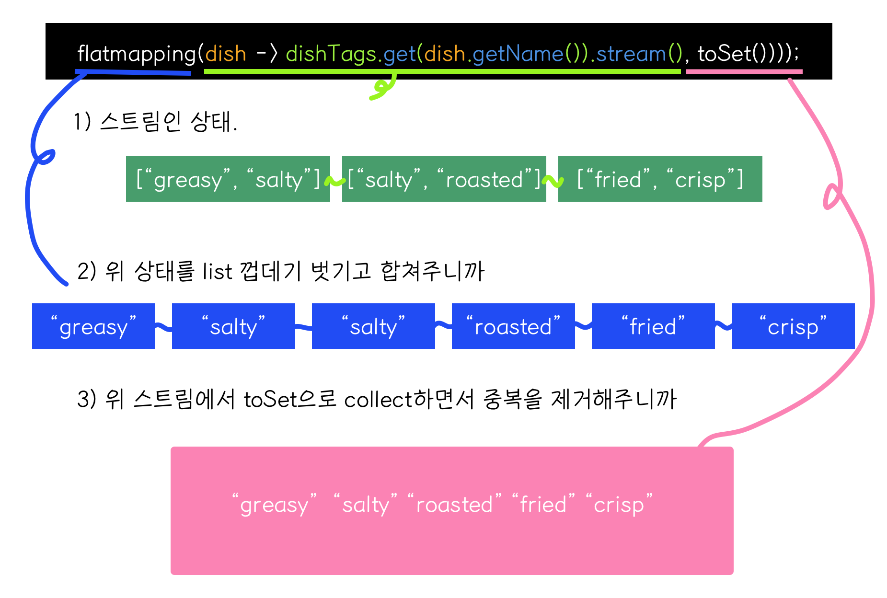
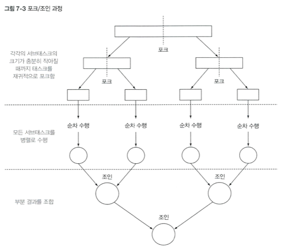
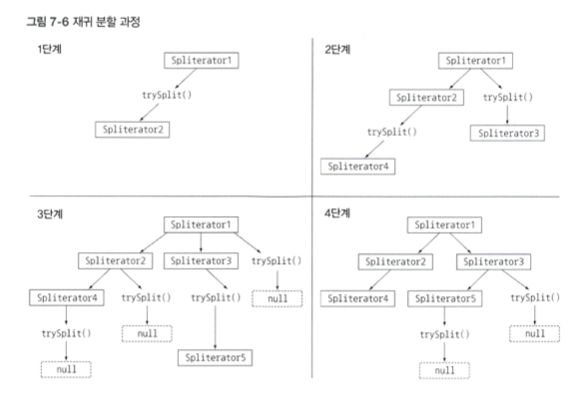

# 6장: 스트림으로 데이터 수집

이전에 배웠던 스트림의 중간 연산은 스트림의 요소를 소비하지 않는다. 반면 스트림의 **최종 연산**은 스트림의 요소를 소비해서 최종 결과를 도출한다. 🙂 이 장에서는 최종 연산 collect 사용에 있어서 다양한 인수를 받아서 처리하는 방식을 배운다. 
- Collection
- Collector 
- collect (함수)

는 다른 것이니 헷갈리지 말도록하자. collect를 사용하면 Map, List가 포함된 Map, Map을 포함한 Map 등 다양한 방식의 컬렉션을 반환할 수가 있다. 역시 자바8의 람다를 사용하면 이런 형식을 반환할 때 굉장히 간결하다는 걸 알 수 있다. 

## 6.1 컬렉터란 무엇인가? 
함수형 프로그래밍에서는 `무엇을 원하는지` 를 명시할 수 있어서 어떻게 얻을지는 고민할 필요가 없다. filter 에 조건만 넣으면 어떻게 순환하면서 리스트에 넣을지는 고민안해도 되는 것이 바로 이 지점이다. 대신 collect 를 사용해서, 스트림의 요소를 어떻게 도출할지 지정한다. 5장에서는 toList(각 요소를 리스트로 만들어주세요~) 를 이용해서 Collector 인터페이스의 구현체로 사용했다. 앞으로는 groupingBy를 사용해서 key-value가 구성되는 map으로 만들어라 라는 동작을 수행한다. 

### 6.1.1 고급 리듀싱의 기능을 수행하는 컬렉터 

컬렉터를 사용하면, 결과를 수집하는 과정을 간단하면서도 유연하게 정의할 수 있다. 보통 함수를 요소로 변환 (대개 toList 처럼 내용은 않고, 자료구조를 변환) 하는 경우 컬렉터를 적용한다. 이때 이 최종 결과를 저장하는 자료구조에 값을 누적한다. 컬렉터는 내부 자체적으로 리듀싱 연산을 사용해서 효율적으로 자료구조 변환을 진행한다. 


### 6.1.2 기존에 제공하는 컬렉터
Collectors에서 제공하는 메소드의 기능은 크게 세 가지로 구분할 수 있다.
- 스트림 요소를 하나의 값으로 리듀스 하고 요약
- 요소 그룹화
- 요소 분할 : Predicate를 함수로 사용한다.

지금은 무슨 말인지 잘 와닿지 않지만, 차근차근 알아보자.

## 6.2 리듀싱과 요약 

컬렉터로 스트림의 항목을 컬렉션으로 재구성할 수 있다. 예제로 살펴보자. 

### counting : 스트림 항목의 갯수를 세자

```java
long howManyDishes =  menu.stream().collect(counting());
```
이는 간단하게 이렇게 쓸 수 있다. 
```java
long howManyDishes = menu.stream().count();
```

### maxBy, minBy : 최댓값과 최솟값을 찾자. 
`Collectors.maxBy` 로 최댓값을, `Collectors.minBy` 로 스트림의 최솟값을 찾을 수 있다. 최대, 최소라는 값은 자의적이고 비교를 위해서는 기준이 필요하다. Comparator 가 그 기준이 되어준다. 

```java
Comparator<Dish> dishCaloriesComparator = Comparator.comparingInt(Dish::getCalories);
// 칼로리의 크기를 비교하는 comparator
Optional<Dish> mostCalorieDish = menu.stream().collect(maxBy(dishCaloriesComparator);
```
애초에 소스인 menu가 비어있다면 최대 칼로리 음식은 존재하지 않으므로, 두가지 상황을 모두 대응하기 위해서 `Optional<Dish>` 로 타입을 받는다. 

### 요약 연산 

Collectors 클래스는 summingInt 라는 특별한 메소드를 제공한다. 이 메소드는 `객체 -> int` 하는 함수를 인수로 받는다. 

```java
int totalCalories = menu.stream().collect(summingInt(Dish::getCalories));
```
이 summingInt는, 각 Dish에서 칼로리를 뽑아서.. 초기값 0에 누적해서 값을 더한다. 결과적으로는 menu에 들어있는 Dish의 칼로리 합, 즉 총 칼로리를 알 수 있다. 

- summingLong
- summingDouble 
역시 동일한 방식으로 동작하며, 최종값이 long, double 형식으로 떨어진다는 점만 다르다. 요런 단순 합계도 있으니 다른 연산도 존재하는데... 🌝 평균값이다. 

- averagingInt
- averagingLong
- averagingDouble 

로 평균을 낼 수 있다. 

이런 값을 종합적으로 한번에 볼 수도 있다. `summarazingInt` 는 스트림의 통계를 한번에 보여준다. ⚡️  

```java
IntSummaryStatistics menuStatistics = menu.stream().collect(summarzingINt(Dish::getCalories));
// 결과 
IntSummaryStatistics(count = 9, sum = 4300, min = 120 , average = 477.77778, max  = 800);
```
마찬가지로 

- summarizingLong : 결과값은 LongSummaryStatistics
- summarizingDouble  : 결과값은 DoubleSummaryStatistics
메소드 역시 존재한다. 

### 6.2.3 joining: 문자열 연결 
joining 을 사용하면 **객체에 toString**을 적용한 값을 모두 이어서 반환한다. 

```java
String shortMenu = menu.stream().map(Dish::getName).collect(joining());
// porkbeefchickenfrench friesrice
```
이러면 구분이 안되게 되므로 seperator를 지정해줄 수 있다. 

```java
String shortMenu = menu.stream().map(Dish::getName).collect(joining(",");
// pork,beef,chicken,french fries,rice
```
### 6.2.4 범용 리듀싱 연산 : reducing으로 위 연산을 요약해봐요

위에서 살펴본 summarzing, summing,averaging, joining 등은 `reducing` 메서드로 요약할 수 있다. 
> 헐 그러면 위에건 왜 써요? 😡 

프로그래밍적 편의성때문이다. reducing  + 함수를 하는 것보다 joining 등으로 명확하게 해주는게 보기도 좋고 알기도 쉽다. 

reducing 함수는 시그니처가 다른 세가지가 있다. 기본형은 인수를 세개 받는다. 

- 첫번째: 리듀싱 연산의 시작값이거나, 스트림에 인수가 없을때는 반환값 
- 두번째 : 변환함수
- 세번째 : 같은 종류의 두 항목을 하나로 만드는 BinaryOperator 
  
```java
public static <T, U>
    Collector<T, ?, U> reducing(U identity,
                                Function<? super T, ? extends U> mapper,
                                BinaryOperator<U> op) 
```

하나의 인수를 갖는 reducing 을 이용해서 고칼로리 요리를 찾는 방법도 존재한다. 
```java
Optional<Dish> mostCalorieDish = menu.stream().collect(reducing( (d1, d2) -> d1.getCalories() > d2.getCalories()? d1 : d2)); 
```

이 경우 `reducing(스트림의 첫번째 요소, Function::Ientity)` 하는 상황이다.

이렇게 함수형 프로그래밍에서는 하나의 연산을 다양한 방법으로 해결할 수 있다. 

## 6.3 그룹화 
데이터 집합을 하나 이상의 특성으로 분류하는 그룹화 연산도 DB에서 많이 수행되는 액션이다. 자바8의 함수형을 사용하면 가독성 있는 한 줄의 코드로 그룹화를 구현할 수 있다. 

메뉴 예제를 보자. 고기를 포함하는 그룹, 생선을 포함하는 그룹, 나머지 그룹으로 메뉴를 나눌 수 있다. 

```java
Map<Dish.Type, List<Dish>> dishesByType = menu.stream().collect(groupingBy(Dish::getType));
// {FISH=[prawns, salmon], OTHER=[fries, rice], MEAT=[pork, beef]}
```
스트림의 각 요리에서 Dish.Type과 일치하는 모든 요리를 추출하는 함수를 groupingBy 메서드로 전달했다. 
더 복잡한 분류 기준이 필요한 상황에서는 메소드 참조 (::로 구성되는) 를 사용할 수가 없다. 칼로리를 400 이하를 diet, 700이상을 fat, 그 사이를 normal로 구분한다고 하자. 이를 구분하는 map을 만들려면 람다 표현식을 사용해야한다. 

```java
public enum CaloricLevel { DIET, NORMAL, FAT } 

Map<CaloricLevel, List<Dish>> dishesByCaloricLevel = menu.stream().collect(
	groupingBy(dish -> { 
	   if (dish.getCalories <= 400) return CaloricLevel.DIET; 
	   else if (dish.getCalories < 700) return CaloricLevel.NORMAL;
	   else return CaloricLevel.FAT;
	}));
```

이렇게 하나의 기준으로 분류하는 방법은 쉽다. 혹시 두 가지 기준으로도 그룹화 할 수 있을까? 👀

### 6.3.1 그룹화된 요소 조작 

고기, 생선, OTHER 요리 그룹에서 500 칼로리가 넘는 요리만 필터하고 싶다. 바로 filter를 적용하는 방법을 떠올릴 수 있다. 

```java
Map<Dish.Type, List<Dish>> res = menu.stream().filter(dish -> dish.getCalories > 500)
				              .collect(groupingBy(Dish::getType));
```
이 경우, fish 에는 500 칼로리가 넘는 음식이 없으므로 이미 그 메뉴는 사라진 뒤에 map으로 그룹핑하게 된다. 결과적으로 `OTHER = [fries], MEAT=[pork]` 와 같이 fish 키가 사라진다. 

#### filtering 
이 경우 `groupingBy` 메소드에 필터조건을 넘겨서 해결할 수 있다. 

```java
menu.stream().collect(
        groupingBy(Dish::getType,
            filtering(dish -> dish.getCalories() > 500, toList())));
```

#### mapping 

매핑함수를 이용해 요소를 변환할 수도 있다. 지금 오브젝트 형인 Dish를 이름만 뽑아서 list에 넣어보자. 다음과 같이 할 수 있다. 
```java
menu.stream().collect(
        groupingBy(Dish::getType,
            mapping(Dish::getName, toList())));
```

#### flatMapping 
filter, map을 했으니 flatMapping도 가능하다.  
다음처럼 요리에 태그를 붙였다고 하자. 

```java
  public static final Map<String, List<String>> dishTags = new HashMap<>();
  static {
    dishTags.put("pork", asList("greasy", "salty"));
    dishTags.put("beef", asList("salty", "roasted"));
    dishTags.put("chicken", asList("fried", "crisp"));
    dishTags.put("french fries", asList("greasy", "fried"));
    dishTags.put("rice", asList("light", "natural"));
    dishTags.put("season fruit", asList("fresh", "natural"));
    dishTags.put("pizza", asList("tasty", "salty"));
    dishTags.put("prawns", asList("tasty", "roasted"));
    dishTags.put("salmon", asList("delicious", "fresh"));
  }
```
flatMapping을 사용하면 '음식 종류마다 어떤 태그가 있는지' 간편하게 계산할 수 있다. 

```java
Map<Dish.Type, Set<String>> res = 
menu.stream().collect(
        groupingBy(Dish::getType,
            flatMapping(dish -> dishTags.get(dish.getName()).stream(), toSet())));
```



### 6.3.2 Map 이 포함된 Map으로 그룹화하기 
Groupingby를 두번 사용해서 level 이 두단계인 map을 만들어낼 수 있다. 
```java
 private static Map<Dish.Type, Map<CaloricLevel, List<Dish>>> groupDishedByTypeAndCaloricLevel() {
    return menu.stream().collect(
        groupingBy(Dish::getType,
            groupingBy((Dish dish) -> {
              if (dish.getCalories() <= 400) {
                return CaloricLevel.DIET;
              }
              else if (dish.getCalories() <= 700) {
                return CaloricLevel.NORMAL;
              }
              else {
                return CaloricLevel.FAT;
              }
            })
        )
    );
  }
```

groupingBy 의 연산을 버킷 개념으로 생각하면 쉽다. 첫번째 groupingBy는 key 라는 버킷을 만든다. 그리고 준비된 각각의 버킷을 서브스트림 컬렉터로 채워가기를 반복해서 n-level의 그룹화를 달성한다. 

## 6.4 분할 

분할은 분할 함수라고 불리는 predicate를 분류함수로 사용하는 특수한 기능이다. 결과적으로 그룹화 맵은 최대 두개의 그룹으로 분류된다. 예를 들어 채식요리를 분리하는 경우를 생각해보자. 

```java
  private static Map<Boolean, List<Dish>> partitionByVegeterian() {
    return menu.stream().collect(partitioningBy(Dish::isVegetarian));
  }
// false = [pork, beef], true =[fries, rice]
```
이제 partitionByVegeterian.get(true) 로 모든 채식요리를 얻을 수 있다. 

## 6.5 Collector 인터페이스 
지금까지 toList나 groupingBy 등 Collector 인터페이스를 구현하는 컬렉터를 살펴보았다. 당연하게도 이미 구현되어있는 컬렉터를 제외하고 직접 인터페이스를 구현해서 효율적으로 문제를 해결하는 컬렉터를 만들 수 도 있다. 

```java
public interface Collector<T, A, R> {
   Supplier<A> supplier();
 
   BiConsumer<A, T> accumulator();

   BinaryOperator<A> combiner();

   Function<A, R> finisher();

   Set<Characteristics> characteristics();
```
Collector 인터페이스는 다음과 같다. 

- T 는 스트림 요소의 타입이다. 

- A는 누적자의 형식이다. 즉 수집과정에서 중간 결과가 어디에 저장되는지 생각해보자.

- R 은 결과 객체의 형식이다. 
  
예를 들어 toList를 간결하게 적어보면 다음과 같다. 
```java
public class ToListCollector<T> implements Collector<T, List<T>, List<T>>
```

-   `Supplier<A> supplier();`
    - Supplier, 즉 인수를 받지않고 결과가 튀어나오는 클래스를 반환해야한다.
    - toList에서는 `return () -> new ArrayList<T>` 로 표현된다. 
    - `ArrayList::new` 로 간단히 할 수도 있다.
    
-   `BiConsumer<A, T> accumulator();`
    - 리듀싱 연산을 하는 함수를 반환한다. 
    - toList에서는 다음과 같다. 
      ```java
       return (list, item) -> list.add(item);
      ```
-   `BinaryOperator<A> combiner();`
    - 스트림을 병렬 처리할 때, 누적자는 어떻게 이 결과를 처리해야하는가
    - toList에서는 다음과 같다. 병렬처리과정 1에서 받은것은 그냥 list에 추가로 add하면 된다.
      ```java
      return (list1, list2) -> list1.addAll(list2); return list1;
      ```

-   `Function<A, R> finisher();`
    -  중간 누적자를 최종 결과로 변환할 때 사용 
    - List에서는 누적된 것을 그대로 반환하므로 다음과 같다. 
      ```java
      return Function.identity();
      ```
-   `Set<Characteristics> characteristics();`
    - Characteristics 는 enum이다. 
    - 이 컬렉터의 연산이 어떤 특성을 가지고 있는지를 정의한다. 
    - UNORDERED : 리듀싱 결과가 스트림 요소의 방문 순서나 누적 순서에 영향을 받지 않는다. 
    - CONCURRENT : 다중 스레드에서 accumulator 함수를 동시에 호출해도 되고, 병렬 리듀싱을 수행할 수 있다. 
    - IDENTITY_FINISH : finisher 메서드가 반환하는 함수가 항등함수(IDENTITY, 즉 Function.identity()) 이다. 
    - toList의 경우 IDENTITY_FINISH이면서.. 또한 리스트의 순서가 상관이 없으므로 UNORDERED, CONCURRENT 이므로 세가지 속성을 다 가지고 있다. 

# 7장: 병렬데이터 처리와 성능 
스트림을 사용하면 순차 스트림을 병렬 스트림으로 자연스럽게 바꿀 수 있다. 어떻게 이런 일이 일어나는지 알아보자. 

자바 7이전의 병렬처리는,

- 데이터를 서브파트로 분할한다
- 서브파트를 각 스레드로 할당한다
- 의도치않은 레이스 컨디션이 발생하지 않도록 적절한 동기화
- 부분 결과를 합친다

라는 과정을 거쳤다. 이 부분을 개발자가 어느 정도는 직접 구현해야만 하는 스펙이다.

이제 스트림과 자바7에서는 병렬처리를 어떻게 하고 있는지 알아보자.

## 7.1 병렬 스트림

여태까지 `parallelStream`을 호출하면 간단하게 병렬 스트림이 생성되며, 이 스트림을 사용하면 각 스레드에서 작은 스트림을 처리할 수 있도록 청크로 분할해서 일하게 된다. 

숫자 n 이 주어졌을 때 1부터 n까지 더하는 메서드를 생각해보자. n 이 커진다면 이 연산을 병렬로 처리하는 게 좋다. 무엇부터 어떻게 건드리고 어떤 스레드를 사용하며, 숫자는 어떻게 생성하고 누가 더해야할까? 병렬 스트림을 사용하면 이 문제를 해결할 수 있다. 

### 7.1.1 순차스트림 -> 병렬 스트림 
```java
public static long parallelSum(long n) {
  return Stream.iterate(1L, i -> i + 1)
               .limit(n)
	       .parallel()
	       .reduce(0L, Long::sum);
}
```

일반적인 stream 코드와 다른점은 스트림이 여러 청크로 분할되어있다는 것이다. 따라서 리듀싱 연산을 여러 청크에 병렬 수행할 수 있다. 마지막으로 리듀싱 연산으로 수행된 부분 결과를 다시 리듀싱으로 합쳐서 전체 스트림의 결과를 도출한다. 

사실 parallel 을 호출해도 스트림 자체에는 아무 변화도 일어나지않는다. 병렬 연산해야함을 의미하는 boolean 플래그가  켜질뿐이며, 반대의 상황인 경우 sequential을 사용해서 순차스트림을 사용할 수 있다. 

```java
stream.parallel()
      .filter(...)
      .map(...)
      .parallel()
      .reduce();
```
두 메서드 중 최종적으로 호출된 메서드가 파이프라인에 영향을 미친다. 위 예제에서는 parallel이 마지막으로 파이프라인은 전체적으로 병렬수행된다.

> 그럼 병렬 스트림에서는 스레드를 어떻게 생성하고 몇개나 만드는 걸까? 병렬 스트림은 내부적으로 ForkJoinPool을 사용한다. 이는 기본적으로 프로세서 수에 맞는 스레드를 갖는다. 스레드 수는 시스템적으로만 설정가능하며, 개개의 병렬 스트림에서 사용하는 값을 지정하는 기능은 아직까지 없다. 

## 7.1.2 스트림 성능 : 반복형 vs 순차스트림 vs 병렬스트림 비교하기 
measurePerf 라는 함수는 메소드 수행시간을 측정하고, `measurSumPerf(Function<Long, Long> adder, long n)` 의 시그니처를 갖는다. 그리고 전달된 함수를 열번 수행하면서 가장 짧았던 시간을 반환한다. 

이제 아래 함수를 차례로 넘기면서 결과를 확인해보자.
```java
 public static long iterativeSum(long n) {
    long result = 0;
    for (long i = 0; i <= n; i++) {
      result += i;
    }
    return result;
  }
  
 public static long sequentialSum(long n) {
    return Stream.iterate(1L, i -> i + 1).limit(n).reduce(Long::sum).get();
  }

  public static long parallelSum(long n) {
    return Stream.iterate(1L, i -> i + 1).limit(n).parallel().reduce(Long::sum).get();
  }  
```
예제에서의 결과는 다음과 같다. 

- Sequential sum done in : 97 ms
- Iterative sum done in : 2s
- Parallel sum done in : 164 ms 
  
오잉? 우리의 기대와 다르다. 고전 for 루프가 가장 느릴 줄 알았는데, 오히려 반대의 결과를 가져온다. 

- 고전적인 for 루프는 저수준으로 동작하며 기본값을 박싱하거나 언박싱할 필요가 없다.

- iterate가 박싱된 객체를 생성하므로, 이를 다시 언박싱하는 과정이 필요하다

- iterate는 병렬로 실행되도록 독립적으로 청크로 분할하기 어렵다.

iterate는 본질적으로 순차적이다. 이 상황에서는 더욱 이전 연산 결과에 따라 다음 함수의 입력이 달라지기때문에 iterate 연산을 청크로 분할하기 어렵다. 리듀싱을 시작하는 시점에 전체 리스트(1부터 1000)까지가 준비된 게 아니므로 스트림을 병렬처리하도록 분할할수가 없다. 이 경우 합계가 다른 스레드에서 수행되었지만, 결국 순차처리 방식과 크게 다른 점이 없으므로 스레드 할당 오버헤드만 증가한다. 

이처럼 병렬 프로그래밍은 까다롭고, 오용하면 전체 성능이 오히려 나빠질 수도 있다. 

그러면 효과적으로 합 연산을 병렬로 실행하려면 어떻게 해야할까? 

LongStream.rangeClosed 를 기억하는지? 요 메소드는 iterate에 비해 이점이 있다. 이 메소드는 기본형 long을 사용하므로 박싱과 언박싱 오버헤드가 없고, 미리 숫자 범위를 생산한다. 예를 들어 1-20을 생산하므로, 청크로 1-5, 6-10 ... 과 같은 식으로 나눌 수 있다. 

```java
public static long rangedSum(long n) {
    return LongStream.rangeClosed(1, n).reduce(Long::sum).getAsLong();
  }

  public static long parallelRangedSum(long n) {
    return LongStream.rangeClosed(1, n).parallel().reduce(Long::sum).getAsLong();
  }
```
rangeClosed를 이용한 순차 스트림과 병렬 스트림을 측정해보자.  예제에 따르면 결과는 다음과 같다. 

- Ranged sum done in : 17ms

- Parallel range sum done in : 1ms 
  
  드디어 순차보다 빠른 병렬 리듀싱을 만들었다. 
  
  > 올바른 자료구조를 선택해야 병렬 실행도 최적의 성능을 발휘할 수 있다. 
  
다만 병렬화가 완전 공짜가 아니다. 스트림을 재귀적으로 분할해야하고, 서브스트림을 서로 다른 스레드의 리듀싱 연산으로 할당하고, 이 결과를 하나로 합쳐야한다. 코어 간의 데이터 이동은 우리 생각보다 비싸다. 따라서 `(코어 간 데이터 전송 시간) < (작업 시간)` 인 작업만 병렬로 다른 코어에서 수행하는 것이 바람직하다. 

### 7.1.3 병렬 스트림의 올바른 사용법 

여러 스레드에서 공유하는 객체의 상태를 변경하는 작업을 병렬로 진행하면 오류가 생긴다. 즉, **공유된 가볍 상태를 피해야한다.**  이후에 13장, 14장에서 상태변화를 피하는 방법을 설명한다. 


### 7.1.4 병렬 스트림을 효과적으로 사용하기

- 확신이 서지 않는다면 직접 측정하라. 
  
- 박싱을 주의하라. 되도록이면 기본형 특화 스트림을 사용하는 것이 좋다.

- 순차보다 병렬에서 성능이 떨어지는 연산이 있다. limit나 findFirst처럼 요소의 순서에 의존하는 연산은 비싸다. 

- 전체 파이프라인 연산 비용을 고려하라. 처리해야할 요소 수가 n, 하나를 처리하는데 드는 비용이 q 일 때 (순차) 스트림 비용은 n * q 이다. q가 높아진다면 병렬 스트림으로 성능 개선할 가능성이 있다. 

- 소량의 데이터에서는 병렬 스트림이 도움되지 않는다. 
  
- 스트림을 구성하는 자료구조가 적절한지 확인해라. ArrayList는 LinkedList보다 분할이 쉽다. LikedList를 분할하려면 모든 요소를 탐색해야하기때문이다. range 메소드로 만든 기본 스트림도 분해가 쉽다. 
  
 - 중간 연산에 따라 병렬 성능이 달라질 수 있다. SIZED, 즉 특정 크기를 가진 스트림은 정확히 반으로 나눌 수 있지만, 중간에 filter 연산이 있다거나 한다면 길이를 예측할 수가 없어 효과적으로 병렬 처리할 수 없을지 모른다. 
   
 - 최종 연산 병합의 비용이 비싸다면.. 병렬 스트림으로 얻은 성능 상 이익이 상쇄될 수 있다. 
   
## 7.2 포크/조인 프레임워크 

포크/조인 프레임워크는 병렬화할 수 있는 작업을 재귀적으로 작은 작업으로 분할한 다음에 subtask 각각의 결과를 합쳐서 전체 결과를 만들도록 설계되었다. 여기서는 subtask를 스레드 풀의 스레드에 분산 할당하는 executorService 인터페이스를 구현한다. 

### 7.2.1. RecursiveTask 활용 
스레드 풀을 이용하려면 `RecursiveTask<R>` 의 서브클래스를 만들어야한다.  java.util.concurrent 패키지에 자리잡은 RecusiveTask를 뜯어보자. 여기서 R은 RecursiveAction 형식이다.
```java
public abstract class RecursiveTask<V> extends ForkJoinTask<V> {
    private static final long serialVersionUID = 5232453952276485270L;

    /**
     * The result of the computation.
     */
    V result;

    /**
     * The main computation performed by this task.
     * @return the result of the computation
     */
    protected abstract V compute();

    public final V getRawResult() {
        return result;
    }

    protected final void setRawResult(V value) {
        result = value;
    }

    /**
     * Implements execution conventions for RecursiveTask.
     */
    protected final boolean exec() {
        result = compute();
        return true;
    }
}
```
오잉? RecursiveTask는 실제로 abstract이므로, 정의하려면 추상 메서드 compute를 정의해야한다.  compute 메서드는 

- task를 subtask로 분할하는 로직 

- 더이상 분할할 수 없을때, 개별 subtask의 결과를 생산하는 로직 

이 두가지를 정의한다. 따라서 대부분 compute 메소드는 
```
if (task 가 충분히 작거나 분할 X) {
    task 계산
} else {
   task를 두개의 subtask로 분할
   subtask 분할을 재귀적으로 호출 
   모든 subtask의 연산이 완료될 때까지 기다림 
   각 subtask의 연산을 합침
}
```
의 흐름으로 진행된다. 이 알고리즘은 divide-and-conquer 알고리즘의 병렬화 버전이다. 

 

포크/조인 프레임워크로 일정한 범위의 숫자를 더하는 예제를 따라가보자. 

```java
public class ForkJoinSumCalculator extends RecursiveTask<Long> { // RecursiveTask 를 상속받아, 포크조인에서 사용할task 를 생성

  public static final long THRESHOLD = 10_000; // 이 값 이하의 서브태스크는 더  분할할 수 없다.

  private final long[] numbers; // 더하는 대상 배열
  private final int start; // 이 서브태스크에서 처리할 배열의 초기위치
  private final int end; // 이 서브태스크에서 배열의 최종 위치

  public ForkJoinSumCalculator(long[] numbers) { // 메인 task 생성자
    this(numbers, 0, numbers.length);
  }

  private ForkJoinSumCalculator(long[] numbers, int start, int end) { // subtask 를 재귀적으로 생성하는 생성자 
    this.numbers = numbers;
    this.start = start;
    this.end = end;
  }

  @Override
  protected Long compute() {
    int length = end - start;
    if (length <= THRESHOLD) {
      return computeSequentially();  // 기준보다 작으면 계산
    }
    ForkJoinSumCalculator leftTask = new ForkJoinSumCalculator(numbers, start, start + length / 2);
    leftTask.fork(); // ForkJoinPool의 다른 스레도 새로 생성한 task를 비동기로 실행
    ForkJoinSumCalculator rightTask = new ForkJoinSumCalculator(numbers, start + length / 2, end);
    Long rightResult = rightTask.compute(); // 두번째 subtask를 동기 실행 
    Long leftResult = leftTask.join(); // 첫번째 subtask의 결과를 읽거나 기다림
    return leftResult + rightResult;  
  }

  private long computeSequentially() { // 단순 계산
    long sum = 0;
    for (int i = start; i < end; i++) {
      sum += numbers[i];
    }
    return sum;
  }

  public static long forkJoinSum(long n) {
    long[] numbers = LongStream.rangeClosed(1, n).toArray();
    ForkJoinTask<Long> task = new ForkJoinSumCalculator(numbers);
    return FORK_JOIN_POOL.invoke(task);
  }

}
```

여기서 FORK_JOIN_POOL은 `public static final ForkJoinPool FORK_JOIN_POOL = new ForkJoinPool();` 와 처럼 정의된 싱글턴이다. 

위 클래스의 합계 메서드 성능을 확인해보자. 
```java
ForkJoin sum don in : 41ms
```
병렬 스트림보다 성능이 나빠졌다. 하지만 이는 태스크에서 사용할 수 있도록 전체 스트림을 `long[]`으로 변환했기 때문이다. 

### 7.2.2 포크-조인을 제대로 사용하는 방법 

- join 메소드를 호출하면 task의 결과가 준비될까지 블록된다. 두 subtask가 모두 시작한 다음 join을 호출해야한다. 
  그렇지 않으면 각 subtask가 다른 task가 끝나길 기다리는 일이 발생한다. 

- RecursiveTask 내에서는 invoke를 사용하지 말아야한다. 대신 compute나 fork 메서드를 직접 호출할 수는 있다. 순차 코드 내에서 병렬 계산을 시작할 때만 invoke를 쓴다. 
  
- subtask에 fork 를 호출해서 ForkJoinPool의 일정을 조절할 수 있다. 위에서 보면 left, right에 모두 fork 하는게 자연스러울 것 같지만 한쪽에는 compute를 하는게 효율적이다. 그러면 하나의 스레드를 재사용할 수 있기때문이다. 
  
- 포크-조인을 이용한 병렬계산은 디버깅하기가 어렵다. stacktrace를 해도, fork 하는 순간 다른 스레드에서 compute를 호출하므로 스택트레이스가 도움되지 않는다. 
  
- 병렬 스트림과 마찬가지로 **무조건 빠르지는 않다.** 여러 독립적인 subtask로 분할이 가능하다는 조건, 그리고 실행시간이 fork 하는 시간보다 길어서 이득을 볼 수 있다는 조건 등을 만족해야한다. 더욱 효율적으로 나누기 위해서 다음과 같은 분할 기준을 따라보자.

### 7.2.3 작업 훔치기 

위 예제에서는 덧셈을 수행할 숫자가 만개(10_000) 이하이면 분할을 멈췄다. 기준값을 직접 실험해보는 수밖에 없다. 예를 들어 천만개를 나누기 시작하면 위 예제는 천개이상의 subtask를 포크할 것이다. 대부분 기기에는 코어가 4개뿐이므로 천개 이상의 subtask는 자원만 낭비하는 것 같아 보일 수 있다. 

하지만 실제로는 코어의 갯수와 관계없이 적절한 크기로 분할된 많은 task를 포킹하는 것이 좋다. 이론적으로는 코어 갯수만큼 부하를 분할하면 모든 CPU 코어에서 task를 실행할 것이라고 생각할 수 있다. 하지만 예제보다 복잡한 현실에서는 각 subtask의 작업완료 시간이 크게 달라질 수 있다. 

포크-조인에서는 **작업 훔치기** 라는 기법으로 이 문제를 해결한다. 이 기법에서는 풀의 모든 스레드를 거의 공정하게 분할한다. 각 스레드는 자신에게 할당된 task를 포함하는 더블링크드리스트를 참조하면서, 작업이 끝날때마다 큐의 헤드에서 다른  task 를 가져와서 처리한다. 할일이 없어진 스레드는 다른 스레드 큐의 꼬리부터 작업을 가져와준다. 이 과정을 모든 스레드의 큐가 빌 때까지 반복한다. 따라서 task의 크기를 작게 나누어야, worker 스레드간 작업 부하를 비슷하게 유지할 수 있다. 

## 7.3 Spliterator  

우리는 병렬 스트림을 이용할 때 분할로직을 개발하지 않고도 (위 예제처럼 직접 적지않아도) 스트림을 자동 분할해준다는 사실을 알고 있다. 자바 8에서는 이 부분을 Spliterator가 해결해준다. 이는  분할할 수 있는 반복자라는 의미다.  자바 8은 디폴트 Spliterator를 제공하며, 이는 컬렉션 프레임워크에 포함된 모든 자료구조에서 사용이 가능하다. 

```java
public interface Spliterator<T> {
    boolean tryAdvance(Consumer<? super T> action);
    Spliterator<T> trySplit(); 
    long estimateSize();
    int characteristics();
```
T 는 Splitierator가 탐색하는 요소의 타입이다. 

- tryAdvance : Spilterator의 요소를 순차적으로 소비하면서, 탐색할 요소가 남았으면 `true` 를 반환한다. 

- trySplit : Spliterator의 일부를 분할해서 두번째 Spliterator를 생성한다. 

- estimateSize: 탐색할 요소의 size를 의미한다. 
  
### 7.3.1 Spliterator의 분할 과정 

 

위 그림처럼 스트림을 분할하는 과정은 재귀적으로 일어난다. 모든 trySplit의 결과가 null일 때까지 재귀 분할이 일어난다. 이 분할은 `characteristics` 값에 따라 달라진다. 

- ORDERED : 요소에 순서가 있으므로 순서에 유의하라 
  를 비롯하여 여러 타입이 있다. 
  
  
### 7.3.2 커스텀 Spliterator 구현하기 

단어수 세기 예제로 Spliterator 구현 과정을 보자. 

#### 반복형 

```java
public static final String SENTENCE =
      " Nel   mezzo del cammin  di nostra  vita "
      + "mi  ritrovai in una  selva oscura"
      + " che la  dritta via era   smarrita ";
      
   public static int countWordsIteratively(String s) {
    int counter = 0;
    boolean lastSpace = true;
    for (char c : s.toCharArray()) {
      if (Character.isWhitespace(c)) {
        lastSpace = true;
      }
      else {
        if (lastSpace) {
          counter++;
        }
        lastSpace = Character.isWhitespace(c);
      }
    }
    return counter;
  }     
```
#### 함수형 

함수형을 사용하면 직접 스레드를 건드리지 않아도 병렬 스트림으로 작업을 병렬화 할 수 있다. 
우선 String 을 스트림으로 변환해야한다. `Stream<Character>` 를 사용한다. 

```java
Stream<Character> stream = IntStream.range(0, SENTENCE.length()).mapToObj(SENTENCE::charAt);
```
